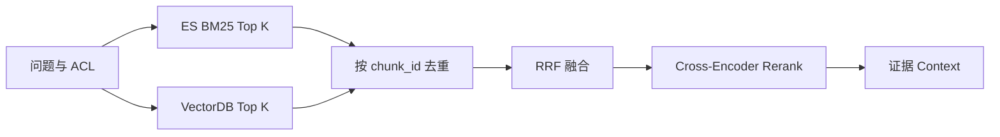

# RAG（04） - 混合检索与 RRF：融合关键词和语义召回

> 读完后，你应能：
> - 能验证“BM25 擅长产品型号、错误码和专有名词，向量检索擅长同义表达和自然语言意图”，并保存输入、输出与失败样本。
> - 能验证“企业知识库通常同时召回两路结果，再用”，并保存输入、输出与失败样本。
> - 能验证“RRF（Reciprocal Rank Fusion） 按名次融合，而不是直接相加两种不可比较的原始分数”，并保存输入、输出与失败样本。


BM25 擅长产品型号、错误码和专有名词，向量检索擅长同义表达和自然语言意图。企业知识库通常同时召回两路结果，再用
**RRF（Reciprocal Rank Fusion）** 按名次融合，而不是直接相加两种不可比较的原始分数。




# 一、RRF 怎么计算

一篇文档在某路排名为 `rank` 时，贡献分数为
`1 / (k + rank)`。同一文档在多路都靠前，融合分数就更高。常量 `k`
用于降低头部名次差距，常见起点是 60，但最终应根据评测集调参。

# 二、可执行示例

下面示例只保留混合检索的核心：一路按精确词元重合排序，一路按教学向量排序，最后用 RRF 融合。保存为
`hybrid_search.py` 后直接执行 `python hybrid_search.py`。

```text
# requirements.txt
# 本教学脚本仅使用 Python 3.10+ 标准库，无第三方依赖。
```

```python
import hashlib
import math
import re

# 教学向量的固定维度。
VECTOR_DIMENSION = 64
# 每一路进入融合的候选数量。
CANDIDATE_LIMIT = 3
# RRF 的排名平滑常量。
RRF_K = 60
# 演示混合检索的文档集合。
DOCUMENTS = {
    "doc-1": "错误码 E401 表示访问令牌已经失效",
    "doc-2": "登录凭证过期后需要重新获取令牌",
    "doc-3": "退款审核通常需要三个工作日",
}
# 教学用同义表达映射，用于模拟语义模型能识别的近义关系。
SEMANTIC_ALIASES = {
    "登录凭证": "令牌",
    "失效": "过期",
    "无法认证": "重新获取令牌",
}


def tokenize(text: str) -> list[str]:
    """提取英文词、编号和中文双字词元。"""
    # 小写化后的英文词和编号。
    latin_tokens = re.findall(r"[a-z]+\d*|\d+", text.lower())
    # 去掉标点后的连续中文字符。
    chinese_text = "".join(re.findall(r"[\u4e00-\u9fff]", text))
    # 用相邻双字保留更多中文词义。
    chinese_tokens = [chinese_text[index:index + 2] for index in range(max(0, len(chinese_text) - 1))]
    return latin_tokens + chinese_tokens


def embed(text: str) -> list[float]:
    """生成可复现的教学向量，生产环境应换成真实 Embedding。"""
    # 使用少量显式同义词模拟真实模型的语义归一化能力。
    normalized_text = text
    for source_text, target_text in SEMANTIC_ALIASES.items():
        normalized_text = normalized_text.replace(source_text, target_text)

    # 文本对应的哈希向量。
    vector = [0.0] * VECTOR_DIMENSION
    for token in tokenize(normalized_text):
        # 词元的稳定哈希值。
        token_hash = int(hashlib.sha256(token.encode("utf-8")).hexdigest(), 16)
        vector[token_hash % VECTOR_DIMENSION] += 1.0

    # 向量归一化所需的 L2 范数。
    norm = math.sqrt(sum(value * value for value in vector)) or 1.0
    return [value / norm for value in vector]


def lexical_score(query: str, document: str) -> float:
    """计算查询词元在文档中的重合数，演示稀疏召回职责。"""
    # 去重后的查询词元。
    query_tokens = set(tokenize(query))
    # 去重后的文档词元。
    document_tokens = set(tokenize(document))
    return float(len(query_tokens & document_tokens))


def vector_score(query: str, document: str) -> float:
    """计算查询与文档教学向量的余弦相似度。"""
    # 当前查询对应的归一化向量。
    query_vector = embed(query)
    # 当前文档对应的归一化向量。
    document_vector = embed(document)
    return sum(left * right for left, right in zip(query_vector, document_vector, strict=True))


def rank_documents(query: str, score_function) -> list[str]:
    """使用指定评分函数返回一条召回链的文档排名。"""
    # 当前召回链按得分降序排列的文档编号。
    ranked_ids = sorted(
        DOCUMENTS,
        key=lambda document_id: score_function(query, DOCUMENTS[document_id]),
        reverse=True,
    )
    return ranked_ids[:CANDIDATE_LIMIT]


def reciprocal_rank_fusion(rankings: list[list[str]]) -> list[tuple[str, float]]:
    """使用 RRF 融合多条只包含名次的召回结果。"""
    # 每篇候选文档累加后的 RRF 分数。
    fused_scores: dict[str, float] = {}
    for ranking in rankings:
        for rank, document_id in enumerate(ranking, start=1):
            fused_scores[document_id] = fused_scores.get(document_id, 0.0) + 1 / (RRF_K + rank)

    return sorted(fused_scores.items(), key=lambda item: item[1], reverse=True)


# 同时包含错误码和自然语言意图的用户查询。
query = "E401 无法认证怎么办"
# 关键词召回结果，生产环境通常由 Elasticsearch BM25 提供。
lexical_ranking = rank_documents(query, lexical_score)
# 向量召回结果，生产环境通常由向量数据库提供。
vector_ranking = rank_documents(query, vector_score)
# 两路排名通过 RRF 得到的最终顺序。
fused_ranking = reciprocal_rank_fusion([lexical_ranking, vector_ranking])

print("关键词召回：", lexical_ranking)
print("向量召回：", vector_ranking)
print("RRF 融合：", fused_ranking)
```

这个脚本中的“关键词重合”和“哈希向量”只为零依赖演示数据流。生产环境应替换成 BM25 和真实 Embedding，但 RRF 输入仍然只是两组文档排名。

# 三、调优顺序

1. 先用标注问题集分别评估关键词和向量召回的 Recall@K。
2. 确认两路有互补结果，再调候选数量和 RRF 常量。
3. 融合后候选仍多时增加 Cross-Encoder Rerank。
4. 最后评估答案忠实度，不能用生成效果掩盖检索缺陷。
5. 分别记录每路贡献率、零结果率和 P95；某一路长期没有增益，应删除该复杂度和成本。
6. 缓存键必须包含租户、权限摘要、查询规范化版本和索引版本，避免跨权限复用候选。

# 四、总结

- **RRF 怎么计算**：用于降低头部名次差距，常见起点是 60，但最终应根据评测集调参。
- **可执行示例**：生产环境应替换成 BM25 和真实 Embedding，但 RRF 输入仍然只是两组文档排名。
- **调优顺序**：先用标注问题集分别评估关键词和向量召回的 Recall@K。 -> 确认两路有互补结果，再调候选数量和 RRF 常量。 -> 融合后候选仍多时增加 Cross-Encoder Rerank。 -> 最后评估答案忠实度，不能用生成效果掩盖检索缺陷。
- **可运行实验：BM25、Vector 与 RRF 混合检索**：调整参数并注入失败，重点对比正常路径、保护条件和失败诊断；

## 参考资料

- [LangChain Retrieval](https://docs.langchain.com/oss/python/langchain/retrieval)
- [Milvus 文档](https://milvus.io/docs)

<!-- knowledge-scenario-inlined:AA-05 -->

## 4.1 可运行实验：BM25、Vector 与 RRF 混合检索


```html runnable file=index.html title="BM25、Vector 与 RRF 混合检索" description="调整参数并对比正常路径与典型失败路径"
<!doctype html>
<html lang="zh-CN">
<head>
  <meta charset="utf-8">
  <meta name="viewport" content="width=device-width,initial-scale=1">
  <title>AA-05 在线实验</title>
  <style>
    :root{color-scheme:dark;font-family:Inter,system-ui,sans-serif}*{box-sizing:border-box}body{margin:0;background:#0f1211;color:#e7ece9;font-size:13px}.shell{padding:16px}.top{display:flex;justify-content:space-between;gap:16px;margin-bottom:14px}h1{margin:3px 0;font-size:18px}.id,.value{color:#68e0b5;font-family:ui-monospace,monospace}.summary{margin:4px 0;color:#a5afa9}.run{border:0;border-radius:6px;background:#68e0b5;color:#07110d;padding:8px 14px;font-weight:700}.grid{display:grid;grid-template-columns:minmax(220px,.8fr) minmax(0,1.8fr);gap:12px}.panel{border:1px solid #29322e;background:#141817;padding:12px}.control{display:grid;gap:5px;margin-bottom:11px}.head{display:flex;justify-content:space-between;gap:8px}select,input{width:100%;accent-color:#68e0b5;background:#0d100f;color:#e7ece9}.toggle{display:flex;justify-content:space-between;border-top:1px solid #29322e;padding-top:9px}.toggle input{width:18px}.metrics{display:grid;grid-template-columns:repeat(4,minmax(0,1fr));gap:7px}.metric{border:1px solid #29322e;padding:8px}.metric b{display:block;color:#68e0b5;font-size:16px}.stages{display:flex;gap:6px;overflow:auto;margin:10px 0}.stage{border:1px solid #8a6230;padding:7px;min-width:90px}.stage.ok{border-color:#367a61}.stage.fail{border-color:#8b4545}table{width:100%;border-collapse:collapse}td{border-top:1px solid #29322e;padding:7px}.diagnosis{margin-top:9px;border-left:3px solid #68e0b5;background:#101412;padding:9px;line-height:1.5}.danger{border-color:#ef7f7f}@media(max-width:680px){.top,.grid{display:grid;grid-template-columns:1fr}.metrics{grid-template-columns:repeat(2,1fr)}}
  </style>
</head>
<body>
  <main class="shell">
    <header class="top"><div><div class="id">AA-05 · DETERMINISTIC LAB</div><h1 id="title"></h1><p class="summary" id="summary"></p></div><button class="run" id="run">运行实验</button></header>
    <section class="grid"><div class="panel"><div id="controls"></div><label class="toggle"><span>注入典型故障</span><input id="failure" type="checkbox"></label></div><div class="panel"><div class="metrics" id="metrics"></div><div class="stages" id="stages"></div><table><tbody id="rows"></tbody></table><div class="diagnosis" id="diagnosis"></div></div></section>
  </main>
  <script>
    const scenario = { title: 'BM25、Vector 与 RRF 混合检索', summary: '分别查看两路召回，再调整 Top K、RRF k、过滤和 Rerank。', controls: [
    { key: 'topK', label: '每路 Top K', type: 'range', min: 3, max: 30, value: 10, suffix: '' },
    { key: 'rrfK', label: 'RRF k', type: 'range', min: 10, max: 100, step: 10, value: 60, suffix: '' },
    { key: 'filter', label: 'Metadata Filter', type: 'select', value: 'before', options: [['none', '不筛选'], ['after', '融合后过滤'], ['before', '召回前过滤']] }
  ] };
    const controls = document.querySelector('#controls');
    const failure = document.querySelector('#failure');
    document.querySelector('#title').textContent = scenario.title;
    document.querySelector('#summary').textContent = scenario.summary;
    function renderControl(control) {
      const label = document.createElement('label'); label.className = 'control';
      const head = document.createElement('span'); head.className = 'head'; head.innerHTML = '<span>' + control.label + '</span><span class="value" data-value="' + control.key + '"></span>'; label.appendChild(head);
      const input = document.createElement(control.type === 'select' ? 'select' : 'input'); input.dataset.key = control.key;
      if (control.type === 'select') control.options.forEach(option => { const item = document.createElement('option'); item.value = option[0]; item.textContent = option[1]; item.selected = option[0] === control.value; input.appendChild(item); });
      else { input.type = 'range'; input.min = control.min; input.max = control.max; input.step = control.step || 1; input.value = control.value; }
      input.addEventListener('input', updateValues); label.appendChild(input); return label;
    }
    function updateValues() { scenario.controls.forEach(control => { const input = controls.querySelector('[data-key="' + control.key + '"]'); document.querySelector('[data-value="' + control.key + '"]').textContent = control.type === 'select' ? input.options[input.selectedIndex].text : input.value + (control.suffix || ''); }); }
    function readValues() { const values = {}; scenario.controls.forEach(control => { const input = controls.querySelector('[data-key="' + control.key + '"]'); values[control.key] = control.type === 'range' ? Number(input.value) : input.value; }); values.failure = failure.checked; return values; }
    function stage(name, state, detail) { return { name, state, detail }; }
    const aiStage = stage;
    function clamp(value, minimum, maximum) { return Math.min(maximum, Math.max(minimum, value)); }
    function simulate(values) { const fail = values.failure;
      /** 两路候选在去重后的最大规模。 */
      const candidates = Math.round(values.topK * (fail ? 1.8 : 1.5));
      /** RRF 首位候选的理论分数。 */
      const topScore = 1 / (values.rrfK + 1) + 1 / (values.rrfK + 2);
      /** 过滤策略造成的越权候选数。 */
      const leaks = values.filter === 'before' && !fail ? 0 : values.filter === 'after' ? 2 : 5;
      /** 在可控候选规模内的估算召回率。 */
      const recall = clamp(68 + values.topK * 1.1 - (values.rrfK < 20 ? 8 : 0) - leaks * 2, 0, 98);
      return { metrics: [[candidates, '融合候选'], [topScore.toFixed(4), 'RRF Top 分'], [recall.toFixed(0) + '%', '估算 Recall'], [leaks, '越权候选']], stages: [aiStage('BM25', 'ok', 'top ' + values.topK), aiStage('Vector', 'ok', 'top ' + values.topK), aiStage('ACL Filter', leaks ? 'fail' : 'ok', values.filter), aiStage('RRF', 'ok', 'k=' + values.rrfK), aiStage('Rerank', candidates > 35 ? 'warn' : 'ok', Math.min(candidates, 20))], rows: [['融合原则', '按排名计算 1/(k+rank)，不直接相加不同量纲的原始分数'], ['Top K', values.topK < 5 ? '候选过少，融合前已丢失长尾证据' : '两路候选规模可用于融合'], ['过滤时机', leaks ? '越权候选已进入 Trace 或缓存，事后过滤不够安全' : '每路召回前都带租户与 ACL 条件']], diagnosis: leaks ? '混合检索结果包含越权候选，应把过滤前移到每个召回器。' : '两路召回、RRF 和权限过滤顺序正确，可继续离线调参。', danger: leaks > 0 };
     }
    function render() { const result = simulate(readValues()); document.querySelector('#metrics').innerHTML = result.metrics.map(item => '<div class="metric"><b>' + item[0] + '</b><span>' + item[1] + '</span></div>').join(''); document.querySelector('#stages').innerHTML = result.stages.map(item => '<div class="stage ' + item.state + '"><b>' + item.name + '</b><div>' + item.detail + '</div></div>').join(''); document.querySelector('#rows').innerHTML = result.rows.map(item => '<tr><td>' + item[0] + '</td><td>' + item[1] + '</td></tr>').join(''); const diagnosis = document.querySelector('#diagnosis'); diagnosis.textContent = result.diagnosis; diagnosis.className = 'diagnosis' + (result.danger ? ' danger' : ''); }
    scenario.controls.forEach(control => controls.appendChild(renderControl(control))); updateValues(); document.querySelector('#run').addEventListener('click', render); render();
  </script>
</body>
</html>
```
