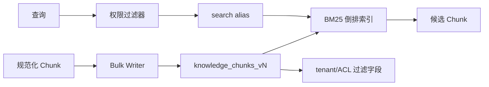

# RAG（05） - Elasticsearch 知识库索引：BM25、权限与零停机发布

> 读完后，你应能：
> - 能验证“dynamic: strict 会让未知字段直接失败，避免拼错权限字段却静默入库”，并保存输入、输出与失败样本。
> - 能验证“source_uri 只用于引用回跳，不参与检索”，并保存输入、输出与失败样本。
> - 能验证“分片数按数据规模与节点数压测决定，不要照抄固定值”，并保存输入、输出与失败样本。


## 核心知识清单

- BM25 正文检索与 exact_terms 精确过滤
- tenant_id、ACL 与检索前权限过滤
- document_id、chunk_id、source 与 version
- Alias、索引版本与零停机切换
- 更新、删除与缓存失效
- Recall@K、P95 延迟与分词回归


Elasticsearch 在 RAG 中负责错误码、产品型号、专有名词和短语匹配。它不是向量库的“备用方案”，而是多路召回中的独立证据源。生产索引必须同时解决字段语义、权限过滤、版本发布和删除传播。



<!-- article-progressive-block:start -->
# 一、先建立全局：Elasticsearch 知识库索引：BM25、权限与零停机发布 是什么？

理解“Elasticsearch 知识库索引：BM25、权限与零停机发布”，先要把标题中的对象放进同一条处理链：它接收什么输入，经过哪些状态变化，最终用什么证据判断结果。下表不另造概念，只把作者正文已经解释的章节按依赖顺序连起来。

“Elasticsearch 知识库索引：BM25、权限与零停机发布”的第一个核心判断是：dynamic: strict 会让未知字段直接失败，避免拼错权限字段却静默入库。。先弄清这个判断中的对象和输入输出，后面的实现、故障和验收才有共同语境。

| 顺序 | 章节 | 读完本节应抓住的结论 |
| --- | --- | --- |
| 1 | 先定义索引契约 | dynamic: strict 会让未知字段直接失败，避免拼错权限字段却静默入库。 |
| 2 | 带权限的 BM25 查询 | ACL 为空时应按业务语义显式拒绝或只查公开组，不能删除 terms 条件后扩大范围。 |
| 3 | 写入、更新与删除 | 删除事件必须覆盖 ES、VectorDB、缓存和对象存储引用； |
| 4 | 稳定性与成本 | 新 mapping/analyzer 发布：建 v2 → Bulk 重建 → 分词与召回评测 → 对账 → 原子切换读别名 → 保留短期回滚窗口。 -> 监控 Bulk 拒绝、刷新耗时、查询 P95、段数量、堆内存和权限过滤后候选数。 -> 原文放对象存储，ES 只保存检索所需 Chunk 与引用字段； -> 小规模索引不要过度分片；副本数依据可用性目标和节点数决定。 |
| 5 | 验收 | 同一问题在正确租户能召回目标 Chunk，跨租户零命中； |
| 6 | BM25 正文检索与 exact_terms 精确过滤 | 混合检索先分别测 BM25 与向量 Recall@K，再调融合，不能只看最终回答“似乎不错”。 |

## 1.1 核心对象之间怎样衔接


这张图只表达本文的讲解顺序，不替代正文机制。判断“Elasticsearch 知识库索引：BM25、权限与零停机发布”是否真正掌握，需要能从最后一个结果沿图回到前面每个章节的输入、状态变化和证据。

## 1.2 再看失败：问题最早会出现在哪一步？

在“Elasticsearch 知识库索引：BM25、权限与零停机发布”的对象和顺序已经明确后，再看可观察的失败：解析丢内容、正确 chunk 未召回、过滤误删、重排掉出或引用不支持结论。定位时不从最后一条错误猜原因，而是沿上图找第一个偏离正文结论的节点。
<!-- article-progressive-block:end -->

# 二、先定义索引契约

```http
PUT /knowledge_chunks_v1
{
  "settings": {
    "number_of_shards": 1,
    "number_of_replicas": 1,
    "analysis": {
      "analyzer": {
        "knowledge_zh": {
          "type": "custom",
          "tokenizer": "standard",
          "filter": ["lowercase"]
        }
      }
    }
  },
  "mappings": {
    "dynamic": "strict",
    "properties": {
      "chunk_id": {"type": "keyword"},
      "document_id": {"type": "keyword"},
      "document_version": {"type": "keyword"},
      "tenant_id": {"type": "keyword"},
      "acl_groups": {"type": "keyword"},
      "title": {"type": "text", "analyzer": "knowledge_zh", "fields": {"raw": {"type": "keyword"}}},
      "content": {"type": "text", "analyzer": "knowledge_zh"},
      "source_uri": {"type": "keyword", "index": false},
      "updated_at": {"type": "date"}
    }
  }
}
```

`dynamic: strict` 会让未知字段直接失败，避免拼错权限字段却静默入库。`source_uri` 只用于引用回跳，不参与检索。分片数按数据规模与节点数压测决定，不要照抄固定值。

建立读写别名：

```http
POST /_aliases
{
  "actions": [
    {"add": {"index": "knowledge_chunks_v1", "alias": "knowledge_chunks_read"}},
    {"add": {"index": "knowledge_chunks_v1", "alias": "knowledge_chunks_write", "is_write_index": true}}
  ]
}
```

# 三、带权限的 BM25 查询

```text
# requirements.txt
elasticsearch>=8,<10
```

```python
from __future__ import annotations

import os
from dataclasses import dataclass

from elasticsearch import Elasticsearch


# ES 服务地址由部署环境注入。
ELASTICSEARCH_URL = os.getenv("ELASTICSEARCH_URL", "http://localhost:9200")
# 查询只访问读别名，重建索引时无需修改应用配置。
READ_ALIAS = "knowledge_chunks_read"
# 默认候选数量，最终值应由 Recall@K 与延迟共同确定。
DEFAULT_TOP_K = 20


@dataclass(frozen=True)
class SearchContext:
    """保存服务端鉴权后得到的租户和权限组。"""

    # 当前租户的稳定标识。
    tenant_id: str
    # 用户有权访问的权限组集合。
    acl_groups: tuple[str, ...]


def search_bm25(
    client: Elasticsearch,
    query: str,
    context: SearchContext,
    top_k: int = DEFAULT_TOP_K,
) -> list[dict[str, object]]:
    """执行权限内 BM25 检索；query 是问题，context 是可信权限上下文。"""

    # 查询体把租户和 ACL 放入 filter，过滤条件不参与相关性打分。
    search_body = {
        "size": top_k,
        "_source": ["chunk_id", "document_id", "title", "content", "source_uri"],
        "query": {
            "bool": {
                "must": [
                    {
                        "multi_match": {
                            "query": query,
                            "fields": ["title^2", "content"],
                            "type": "best_fields",
                        }
                    }
                ],
                "filter": [
                    {"term": {"tenant_id": context.tenant_id}},
                    {"terms": {"acl_groups": list(context.acl_groups)}},
                ],
            }
        },
    }
    # 原始命中保留 `_score`，供后续融合和 Trace 分析。
    response = client.search(index=READ_ALIAS, body=search_body)
    return list(response["hits"]["hits"])


# 进程级客户端应复用连接池，示例仅展示创建方式。
es_client = Elasticsearch(ELASTICSEARCH_URL, request_timeout=3)
```

ACL 为空时应按业务语义显式拒绝或只查公开组，不能删除 `terms` 条件后扩大范围。服务端从身份令牌计算 `SearchContext`，不接受模型传入租户和权限组。

# 四、写入、更新与删除

- 使用稳定 `chunk_id` 作为 `_id`，Bulk API 重试不会制造重复数据。
- 文档更新先写新 `document_version`，对账成功后删除旧版本；或者构建完整新索引再切别名。
- 删除事件必须覆盖 ES、VectorDB、缓存和对象存储引用；删除失败进入重试队列。
- 大规模删除避免在线执行无界 `_delete_by_query`，优先索引重建或按路由分批处理。

# 五、稳定性与成本

1. 新 mapping/analyzer 发布：建 `v2` → Bulk 重建 → 分词与召回评测 → 对账 → 原子切换读别名 → 保留短期回滚窗口。
2. 监控 Bulk 拒绝、刷新耗时、查询 P95、段数量、堆内存和权限过滤后候选数。
3. 原文放对象存储，ES 只保存检索所需 Chunk 与引用字段；避免复制大附件。
4. 小规模索引不要过度分片；副本数依据可用性目标和节点数决定。
5. 混合检索先分别测 BM25 与向量 Recall@K，再调融合，不能只看最终回答“似乎不错”。

# 六、验收

同一问题在正确租户能召回目标 Chunk，跨租户零命中；错误码与专有名词命中稳定；新旧索引切换无请求错误；删除文档后所有索引和缓存不可命中；Trace 能记录索引版本、查询耗时、候选 ID 和分数。

<!-- article-progressive-block:start -->
# 七、动手验证：先跑通 Elasticsearch 知识库索引：BM25、权限与零停机发布，再改变一个变量

前面的章节已经建立问题、概念和机制。现在把“Elasticsearch 知识库索引：BM25、权限与零停机发布”放进同一套基线中运行；本节不再引入新术语，只验证前文结论能否被复现。

## 7.1 基线与候选只允许一个变量不同

验证“Elasticsearch 知识库索引：BM25、权限与零停机发布”时，先固定标注查询集、原文与 chunk 快照、Embedding 和索引版本、权限身份。候选方案只能改变本次要验证的变量；如果同时更换数据、依赖和配置，即使结果改善，也不能知道是哪一项产生作用。

执行“Elasticsearch 知识库索引：BM25、权限与零停机发布”时，动作是：依次回放解析、切分、召回、过滤、重排、上下文组装和引用生成。原始结果不能只保留截图或汇总分数，必须同步保存：原文位置、各路候选、分数、过滤前后 Diff、Recall@K、NDCG、引用和 Trace，使下一次复查可以在同一输入上重放。

| 实验要素 | 本文要求 |
| --- | --- |
| 固定条件 | 标注查询集、原文与 chunk 快照、Embedding 和索引版本、权限身份 |
| 唯一变量 | 本次候选方案与基线之间的一项明确差异 |
| 原始证据 | 原文位置、各路候选、分数、过滤前后 Diff、Recall@K、NDCG、引用和 Trace |
| 通过阈值 | 正确证据可召回可回链，无答案时拒答，权限过滤不泄漏其他主体资料 |
| 立即停止 | 解析丢内容、正确 chunk 未召回、过滤误删、重排掉出或引用不支持结论 |

## 7.2 执行前先排除不可比较条件

“Elasticsearch 知识库索引：BM25、权限与零停机发布”开始前先确认下面四项；任一项不成立，都应先修复实验条件，而不是解释结果。

- 基线能够在“Elasticsearch 知识库索引：BM25、权限与零停机发布”的当前环境重复运行。
- 候选只改变一个与“Elasticsearch 知识库索引：BM25、权限与零停机发布”结论直接相关的条件。
- “Elasticsearch 知识库索引：BM25、权限与零停机发布”的基线和候选使用同一批输入、同一版本依赖与同一通过阈值。
- “Elasticsearch 知识库索引：BM25、权限与零停机发布”的原始输出和失败现场不会被重试、格式化或汇总覆盖。

## 7.3 执行后先核对证据完整性

结果出来后先检查证据，再讨论“Elasticsearch 知识库索引：BM25、权限与零停机发布”是否通过。缺少中间状态时，最终输出只能说明现象，不能证明机制。

| 检查项 | 当前文章的判定 |
| --- | --- |
| 输入可追溯 | 标注查询集、原文与 chunk 快照、Embedding 和索引版本、权限身份 |
| 过程可回放 | 依次回放解析、切分、召回、过滤、重排、上下文组装和引用生成 |
| 结果可审计 | 原文位置、各路候选、分数、过滤前后 Diff、Recall@K、NDCG、引用和 Trace |

“Elasticsearch 知识库索引：BM25、权限与零停机发布”的一次合格基线对照按以下顺序执行：

1. 保存“Elasticsearch 知识库索引：BM25、权限与零停机发布”基线版本及输入摘要，确认基线本身可以重复运行。
2. 写下“Elasticsearch 知识库索引：BM25、权限与零停机发布”候选方案唯一变化的变量，以及它预期影响的指标。
3. 在同一环境执行“Elasticsearch 知识库索引：BM25、权限与零停机发布”：依次回放解析、切分、召回、过滤、重排、上下文组装和引用生成。
4. 为“Elasticsearch 知识库索引：BM25、权限与零停机发布”保存：原文位置、各路候选、分数、过滤前后 Diff、Recall@K、NDCG、引用和 Trace。
5. 使用“Elasticsearch 知识库索引：BM25、权限与零停机发布”预登记条件判断：正确证据可召回可回链，无答案时拒答，权限过滤不泄漏其他主体资料。
6. 如果“Elasticsearch 知识库索引：BM25、权限与零停机发布”未通过，不修改第二个变量，先恢复基线并保留失败现场。

# 八、用一张矩阵验证 Elasticsearch 知识库索引：BM25、权限与零停机发布 的关键结论

矩阵按正文顺序列出“Elasticsearch 知识库索引：BM25、权限与零停机发布”的结论。一次实验只选择一行，只改变这一行对应的条件；不要把多行合并成一个无法归因的大实验。

| 正文章节 | 已解释的结论 | 本轮唯一变量 | 必须保存的证据 |
| --- | --- | --- | --- |
| 先定义索引契约 | dynamic: strict 会让未知字段直接失败，避免拼错权限字段却静默入库。 | 只改变与“先定义索引契约”相关的条件 | 原文位置、各路候选、分数、过滤前后 Diff、Recall@K、NDCG、引用和 Trace |
| 带权限的 BM25 查询 | ACL 为空时应按业务语义显式拒绝或只查公开组，不能删除 terms 条件后扩大范围。 | 只改变与“带权限的 BM25 查询”相关的条件 | 原文位置、各路候选、分数、过滤前后 Diff、Recall@K、NDCG、引用和 Trace |
| 写入、更新与删除 | 删除事件必须覆盖 ES、VectorDB、缓存和对象存储引用； | 只改变与“写入、更新与删除”相关的条件 | 原文位置、各路候选、分数、过滤前后 Diff、Recall@K、NDCG、引用和 Trace |
| 稳定性与成本 | 新 mapping/analyzer 发布：建 v2 → Bulk 重建 → 分词与召回评测 → 对账 → 原子切换读别名 → 保留短期回滚窗口。 -> 监控 Bulk 拒绝、刷新耗时、查询 P95、段数量、堆内存和权限过滤后候选数。 -> 原文放对象存储，ES 只保存检索所需 Chunk 与引用字段； -> 小规模索引不要过度分片；副本数依据可用性目标和节点数决定。 | 只改变与“稳定性与成本”相关的条件 | 原文位置、各路候选、分数、过滤前后 Diff、Recall@K、NDCG、引用和 Trace |
| 验收 | 同一问题在正确租户能召回目标 Chunk，跨租户零命中； | 只改变与“验收”相关的条件 | 原文位置、各路候选、分数、过滤前后 Diff、Recall@K、NDCG、引用和 Trace |
| BM25 正文检索与 exact_terms 精确过滤 | 混合检索先分别测 BM25 与向量 Recall@K，再调融合，不能只看最终回答“似乎不错”。 | 只改变与“BM25 正文检索与 exact_terms 精确过滤”相关的条件 | 原文位置、各路候选、分数、过滤前后 Diff、Recall@K、NDCG、引用和 Trace |

## 8.1 记录本次实际实验

下面的记录用于“Elasticsearch 知识库索引：BM25、权限与零停机发布”当前这一次实验，不是第二套知识目录。先从矩阵选择一个章节，再填写实际值；没有填写的字段表示尚未验证。

```yaml
topic: "Elasticsearch 知识库索引：BM25、权限与零停机发布"
selected_chapter: required
claim_from_article: required
baseline_version: required
changed_condition: exactly_one
execution: "依次回放解析、切分、召回、过滤、重排、上下文组装和引用生成"
evidence: "原文位置、各路候选、分数、过滤前后 Diff、Recall@K、NDCG、引用和 Trace"
pass_when: "正确证据可召回可回链，无答案时拒答，权限过滤不泄漏其他主体资料"
stop_when: "解析丢内容、正确 chunk 未召回、过滤误删、重排掉出或引用不支持结论"
observed_result: required
first_deviation: null_or_evidence
recovery_replay: required_after_failure
```

## 8.2 边界实验必须证明能够停止和恢复

成功路径只能证明“Elasticsearch 知识库索引：BM25、权限与零停机发布”在当前样本上工作，不能证明它可以进入生产。边界实验需要主动制造：解析丢内容、正确 chunk 未召回、过滤误删、重排掉出或引用不支持结论，并观察系统是否在产生不可逆副作用前停止。

| 场景 | 只改变什么 | 应保存什么 | 通过标准 |
| --- | --- | --- | --- |
| 正常路径 | 使用已知有效输入 | 原文位置、各路候选、分数、过滤前后 Diff、Recall@K、NDCG、引用和 Trace | 正确证据可召回可回链，无答案时拒答，权限过滤不泄漏其他主体资料 |
| 边界路径 | 把一个输入推进到约束临界值 | 临界值前后的输出与指标 | 不静默降级，不把部分结果冒充成功 |
| 明确失败 | 注入：解析丢内容、正确 chunk 未召回、过滤误删、重排掉出或引用不支持结论 | 原始错误、首个异常阶段和最终状态 | 失败被正确分类且没有扩大副作用 |
| 恢复重放 | 执行：在最早丢失正确证据的阶段停止，固定该阶段输入单独修复并重放全链 | 原失败样本的复测证据 | 原样本恢复，正常样本没有回归 |

恢复动作不是简单重启。对于“Elasticsearch 知识库索引：BM25、权限与零停机发布”，第一步是：在最早丢失正确证据的阶段停止，固定该阶段输入单独修复并重放全链。完成后使用原始失败样本复测；只验证一个新样本成功，不能证明触发条件已经消失。

“Elasticsearch 知识库索引：BM25、权限与零停机发布”边界实验结束后，应把正常、临界、失败和恢复四类记录放在同一个运行批次中。这样才能区分“候选方案真的修复问题”和“环境变化让问题暂时没有出现”。

# 九、Elasticsearch 知识库索引：BM25、权限与零停机发布 的结果解释

解释“Elasticsearch 知识库索引：BM25、权限与零停机发布”实验时先看首个偏差，而不是最后一条错误。最后的异常通常只是上游状态错误的结果；从末端反推容易误把症状当根因。

| 观察结果 | 可以支持的判断 | 下一步 |
| --- | --- | --- |
| 主链路没有达到预期 | 解析丢内容、正确 chunk 未召回、过滤误删、重排掉出或引用不支持结论 | 先执行：在最早丢失正确证据的阶段停止，固定该阶段输入单独修复并重放全链 |
| 异常链路无法恢复 | 解析丢内容、正确 chunk 未召回、过滤误删、重排掉出或引用不支持结论 | 先执行：在最早丢失正确证据的阶段停止，固定该阶段输入单独修复并重放全链 |
| 新样本成功但原样本仍失败 | 修复没有覆盖原始触发条件 | 固定原失败输入，恢复基线后重新比较 |
| 指标改善但证据无法回链 | 数据、版本或中间状态没有固定 | 暂停发布，补齐可追溯记录后重跑 |

“Elasticsearch 知识库索引：BM25、权限与零停机发布”只有同时满足“正确证据可召回可回链，无答案时拒答，权限过滤不泄漏其他主体资料”，并且没有出现“解析丢内容、正确 chunk 未召回、过滤误删、重排掉出或引用不支持结论”，才可以认为主链路通过。这里的“通过”只对当前固定版本、样本和环境有效，不能外推到尚未测试的容量、权限或数据分布。

如果“Elasticsearch 知识库索引：BM25、权限与零停机发布”候选方案与基线差异很小，先检查证据分辨率是否足够；如果差异很大，先排除数据泄漏、环境漂移和版本不一致。两种情况都不能只看一个汇总均值，需要回到逐样本输出和中间状态。

“Elasticsearch 知识库索引：BM25、权限与零停机发布”故障定位完成后，记录“现象、首个偏差、根因、改动、原样本复测”五项。缺少原样本复测时，只能标记为待观察，不能标记为已解决。

# 十、Elasticsearch 知识库索引：BM25、权限与零停机发布 的发布判断

发布判断需要把“Elasticsearch 知识库索引：BM25、权限与零停机发布”的质量、失败边界和恢复能力放在同一份记录中。以下任一条件缺失，都应停止扩量，而不是用“基本正常”替代证据。

- [ ] “Elasticsearch 知识库索引：BM25、权限与零停机发布”的基线与候选只存在一个计划内变量。
- [ ] “Elasticsearch 知识库索引：BM25、权限与零停机发布”的输入、代码、依赖、配置和数据版本可以追溯。
- [ ] “Elasticsearch 知识库索引：BM25、权限与零停机发布”的正常、临界、失败和恢复样本使用同一套断言。
- [ ] “Elasticsearch 知识库索引：BM25、权限与零停机发布”的原始输出、中间状态和失败现场已经保留。
- [ ] “Elasticsearch 知识库索引：BM25、权限与零停机发布”的日志、Trace、截图和测试数据已经脱敏。
- [ ] “Elasticsearch 知识库索引：BM25、权限与零停机发布”的停止条件、负责人和回滚入口已经演练。
- [ ] “Elasticsearch 知识库索引：BM25、权限与零停机发布”尚未覆盖的输入、权限、容量和外部依赖已经登记。

最终记录至少包含基线版本、唯一变量、原始证据、首个偏差、恢复复测和发布责任人。没有参与本次修改的人如果不能据此重放“Elasticsearch 知识库索引：BM25、权限与零停机发布”的判断，就不能发布。
<!-- article-progressive-block:end -->

# 十一、总结

- **先定义索引契约**：dynamic: strict 会让未知字段直接失败，避免拼错权限字段却静默入库。
- **带权限的 BM25 查询**：ACL 为空时应按业务语义显式拒绝或只查公开组，不能删除 terms 条件后扩大范围。
- **写入、更新与删除**：删除事件必须覆盖 ES、VectorDB、缓存和对象存储引用；
- **稳定性与成本**：新 mapping/analyzer 发布：建 v2 → Bulk 重建 → 分词与召回评测 → 对账 → 原子切换读别名 → 保留短期回滚窗口。 -> 监控 Bulk 拒绝、刷新耗时、查询 P95、段数量、堆内存和权限过滤后候选数。 -> 原文放对象存储，ES 只保存检索所需 Chunk 与引用字段； -> 小规模索引不要过度分片；副本数依据可用性目标和节点数决定。
- **验收**：同一问题在正确租户能召回目标 Chunk，跨租户零命中；

## 参考资料

- [LangChain Retrieval](https://docs.langchain.com/oss/python/langchain/retrieval)
- [Milvus 文档](https://milvus.io/docs)
