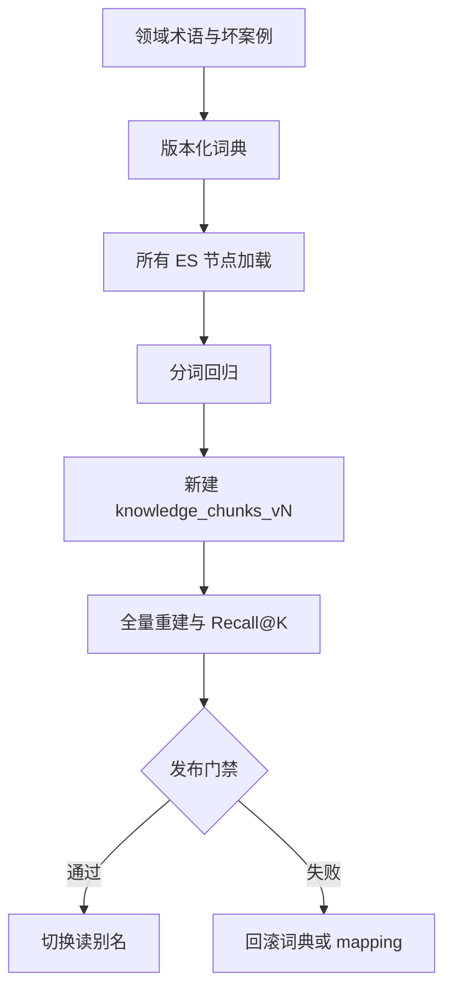

# RAG（07） - IK 分词器工程化：词典、重建与灰度发布

> 读完后，你应能：
> - 能验证“IK 可以改善中文词边界，但插件并不自动带来好召回”，并保存输入、输出与失败样本。
> - 能验证“真正的工程工作是管理插件兼容性、领域词典版本、索引重建和回归评测”，并保存输入、输出与失败样本。
> - 能验证“若产品名、缩写和错误码更适合精确匹配，应使用 keyword 子字段，不要把所有问题都推给词典”，并保存输入、输出与失败样本。


IK 可以改善中文词边界，但插件并不自动带来好召回。真正的工程工作是管理插件兼容性、领域词典版本、索引重建和回归评测。若产品名、缩写和错误码更适合精确匹配，应使用 `keyword` 子字段，不要把所有问题都推给词典。



<!-- article-progressive-block:start -->
# 一、先建立全局：IK 分词器工程化：词典、重建与灰度发布 是什么？

理解“IK 分词器工程化：词典、重建与灰度发布”，先要把标题中的对象放进同一条处理链：它接收什么输入，经过哪些状态变化，最终用什么证据判断结果。下表不另造概念，只把作者正文已经解释的章节按依赖顺序连起来。

“IK 分词器工程化：词典、重建与灰度发布”的第一个核心判断是：索引与查询使用不同 analyzer 是一种起点，不是通用真理。。先弄清这个判断中的对象和输入输出，后面的实现、故障和验收才有共同语境。

| 顺序 | 章节 | 读完本节应抓住的结论 |
| --- | --- | --- |
| 1 | 索引配置 | 索引与查询使用不同 analyzer 是一种起点，不是通用真理。 |
| 2 | 词典生命周期 | 词典文件至少记录 dictionary_version、术语来源、负责人、上线日期和回滚版本。 |
| 3 | 何时不用 IK | 领域术语变化极快：将同义词、精确字段和查询改写组合使用，避免每天重建大索引。 |
| 4 | 验收 | 分词回归和权限内 Recall@10 达标； |
| 5 | IK 可以改善中文词边界 | IK 可以改善中文词边界，但插件并不自动带来好召回。 |
| 6 | 真正的工程工作是管理插件兼容性、领域词典版本、索引重建和回归评测 | 真正的工程工作是管理插件兼容性、领域词典版本、索引重建和回归评测。 |

## 1.1 核心对象之间怎样衔接


这张图只表达本文的讲解顺序，不替代正文机制。判断“IK 分词器工程化：词典、重建与灰度发布”是否真正掌握，需要能从最后一个结果沿图回到前面每个章节的输入、状态变化和证据。

## 1.2 再看失败：问题最早会出现在哪一步？

在“IK 分词器工程化：词典、重建与灰度发布”的对象和顺序已经明确后，再看可观察的失败：解析丢内容、正确 chunk 未召回、过滤误删、重排掉出或引用不支持结论。定位时不从最后一条错误猜原因，而是沿上图找第一个偏离正文结论的节点。
<!-- article-progressive-block:end -->

# 二、索引配置

```http
PUT /knowledge_chunks_v2
{
  "mappings": {
    "dynamic": "strict",
    "properties": {
      "tenant_id": {"type": "keyword"},
      "acl_groups": {"type": "keyword"},
      "error_codes": {"type": "keyword", "normalizer": "lowercase"},
      "title": {
        "type": "text",
        "analyzer": "ik_max_word",
        "search_analyzer": "ik_smart",
        "fields": {"raw": {"type": "keyword"}}
      },
      "content": {
        "type": "text",
        "analyzer": "ik_max_word",
        "search_analyzer": "ik_smart"
      }
    }
  }
}
```

索引与查询使用不同 analyzer 是一种起点，不是通用真理。`ik_max_word` 可能制造大量词元并增加索引体积，`ik_smart` 也可能把领域短语拆错，必须用真实金标集决定。

# 三、词典生命周期

词典文件至少记录 `dictionary_version`、术语来源、负责人、上线日期和回滚版本。远程词典服务需要超时、缓存与内容哈希；任何节点加载失败都应阻止切换新索引。热更新只影响后续分析，既有文档的词元不会自动变化，因此词典变更通常需要重建。

```text
# domain.dic
Visual Worktree
离线建库
多路召回
PAY-1042
```

用 `_analyze` 同时验证索引和查询分词：

```http
POST /knowledge_chunks_v2/_analyze
{
  "field": "content",
  "text": ["Visual Worktree 离线建库失败，错误码 PAY-1042"]
}
```

# 四、可执行的集群一致性检查

```text
# requirements.txt
elasticsearch>=8,<10
```

```python
from __future__ import annotations

import os

from elasticsearch import Elasticsearch


# ES 地址来自部署环境。
ELASTICSEARCH_URL = os.getenv("ELASTICSEARCH_URL", "http://localhost:9200")
# 新索引名称用于验证最终 mapping 生效后的分词结果。
INDEX_NAME = os.getenv("INDEX_NAME", "knowledge_chunks_v2")
# 关键领域短语及必须保留的最小词元集合。
EXPECTED_TERMS = {
    "Visual Worktree 离线建库": {"visual worktree", "离线", "建库"},
    "错误码 PAY-1042": {"pay-1042"},
}


def verify_analyzer(client: Elasticsearch) -> None:
    """验证关键术语分词；client 是已鉴权的 Elasticsearch 客户端。"""

    for text, expected_tokens in EXPECTED_TERMS.items():
        # 当前样本由索引 content 字段的 search_analyzer 处理。
        response = client.indices.analyze(
            index=INDEX_NAME,
            body={"field": "content", "text": text},
        )
        # 实际词元统一为小写集合，便于判断必需术语是否缺失。
        actual_tokens = {token["token"].lower() for token in response["tokens"]}
        if not expected_tokens <= actual_tokens:
            raise RuntimeError(
                f"analyzer regression: text={text!r}, actual={sorted(actual_tokens)}"
            )


# 客户端在脚本运行期复用连接。
es_client = Elasticsearch(ELASTICSEARCH_URL, request_timeout=5)
verify_analyzer(es_client)
```

# 五、何时不用 IK

- 订单号、错误码、邮箱和版本号：独立抽取为 `keyword`。
- 多语言知识库：优先评估通用 analyzer、语言字段分流或专用搜索服务。
- 领域术语变化极快：将同义词、精确字段和查询改写组合使用，避免每天重建大索引。
- 仅靠向量召回已满足需求：不要为“技术栈齐全”增加插件运维成本；但仍需用真实错误码问题验证。

# 六、验收

所有节点插件版本一致；词典哈希可追踪；分词回归和权限内 Recall@10 达标；新索引完成文档数与 Chunk 数对账；别名切换可回滚；索引体积与 P95 没有超过预算。

<!-- article-progressive-block:start -->
# 七、动手验证：先跑通 IK 分词器工程化：词典、重建与灰度发布，再改变一个变量

前面的章节已经建立问题、概念和机制。现在把“IK 分词器工程化：词典、重建与灰度发布”放进同一套基线中运行；本节不再引入新术语，只验证前文结论能否被复现。

## 7.1 基线与候选只允许一个变量不同

验证“IK 分词器工程化：词典、重建与灰度发布”时，先固定标注查询集、原文与 chunk 快照、Embedding 和索引版本、权限身份。候选方案只能改变本次要验证的变量；如果同时更换数据、依赖和配置，即使结果改善，也不能知道是哪一项产生作用。

执行“IK 分词器工程化：词典、重建与灰度发布”时，动作是：依次回放解析、切分、召回、过滤、重排、上下文组装和引用生成。原始结果不能只保留截图或汇总分数，必须同步保存：原文位置、各路候选、分数、过滤前后 Diff、Recall@K、NDCG、引用和 Trace，使下一次复查可以在同一输入上重放。

| 实验要素 | 本文要求 |
| --- | --- |
| 固定条件 | 标注查询集、原文与 chunk 快照、Embedding 和索引版本、权限身份 |
| 唯一变量 | 本次候选方案与基线之间的一项明确差异 |
| 原始证据 | 原文位置、各路候选、分数、过滤前后 Diff、Recall@K、NDCG、引用和 Trace |
| 通过阈值 | 正确证据可召回可回链，无答案时拒答，权限过滤不泄漏其他主体资料 |
| 立即停止 | 解析丢内容、正确 chunk 未召回、过滤误删、重排掉出或引用不支持结论 |

## 7.2 执行前先排除不可比较条件

“IK 分词器工程化：词典、重建与灰度发布”开始前先确认下面四项；任一项不成立，都应先修复实验条件，而不是解释结果。

- 基线能够在“IK 分词器工程化：词典、重建与灰度发布”的当前环境重复运行。
- 候选只改变一个与“IK 分词器工程化：词典、重建与灰度发布”结论直接相关的条件。
- “IK 分词器工程化：词典、重建与灰度发布”的基线和候选使用同一批输入、同一版本依赖与同一通过阈值。
- “IK 分词器工程化：词典、重建与灰度发布”的原始输出和失败现场不会被重试、格式化或汇总覆盖。

## 7.3 执行后先核对证据完整性

结果出来后先检查证据，再讨论“IK 分词器工程化：词典、重建与灰度发布”是否通过。缺少中间状态时，最终输出只能说明现象，不能证明机制。

| 检查项 | 当前文章的判定 |
| --- | --- |
| 输入可追溯 | 标注查询集、原文与 chunk 快照、Embedding 和索引版本、权限身份 |
| 过程可回放 | 依次回放解析、切分、召回、过滤、重排、上下文组装和引用生成 |
| 结果可审计 | 原文位置、各路候选、分数、过滤前后 Diff、Recall@K、NDCG、引用和 Trace |

“IK 分词器工程化：词典、重建与灰度发布”的一次合格基线对照按以下顺序执行：

1. 保存“IK 分词器工程化：词典、重建与灰度发布”基线版本及输入摘要，确认基线本身可以重复运行。
2. 写下“IK 分词器工程化：词典、重建与灰度发布”候选方案唯一变化的变量，以及它预期影响的指标。
3. 在同一环境执行“IK 分词器工程化：词典、重建与灰度发布”：依次回放解析、切分、召回、过滤、重排、上下文组装和引用生成。
4. 为“IK 分词器工程化：词典、重建与灰度发布”保存：原文位置、各路候选、分数、过滤前后 Diff、Recall@K、NDCG、引用和 Trace。
5. 使用“IK 分词器工程化：词典、重建与灰度发布”预登记条件判断：正确证据可召回可回链，无答案时拒答，权限过滤不泄漏其他主体资料。
6. 如果“IK 分词器工程化：词典、重建与灰度发布”未通过，不修改第二个变量，先恢复基线并保留失败现场。

# 八、用一张矩阵验证 IK 分词器工程化：词典、重建与灰度发布 的关键结论

矩阵按正文顺序列出“IK 分词器工程化：词典、重建与灰度发布”的结论。一次实验只选择一行，只改变这一行对应的条件；不要把多行合并成一个无法归因的大实验。

| 正文章节 | 已解释的结论 | 本轮唯一变量 | 必须保存的证据 |
| --- | --- | --- | --- |
| 索引配置 | 索引与查询使用不同 analyzer 是一种起点，不是通用真理。 | 只改变与“索引配置”相关的条件 | 原文位置、各路候选、分数、过滤前后 Diff、Recall@K、NDCG、引用和 Trace |
| 词典生命周期 | 词典文件至少记录 dictionary_version、术语来源、负责人、上线日期和回滚版本。 | 只改变与“词典生命周期”相关的条件 | 原文位置、各路候选、分数、过滤前后 Diff、Recall@K、NDCG、引用和 Trace |
| 何时不用 IK | 领域术语变化极快：将同义词、精确字段和查询改写组合使用，避免每天重建大索引。 | 只改变与“何时不用 IK”相关的条件 | 原文位置、各路候选、分数、过滤前后 Diff、Recall@K、NDCG、引用和 Trace |
| 验收 | 分词回归和权限内 Recall@10 达标； | 只改变与“验收”相关的条件 | 原文位置、各路候选、分数、过滤前后 Diff、Recall@K、NDCG、引用和 Trace |
| IK 可以改善中文词边界 | IK 可以改善中文词边界，但插件并不自动带来好召回。 | 只改变与“IK 可以改善中文词边界”相关的条件 | 原文位置、各路候选、分数、过滤前后 Diff、Recall@K、NDCG、引用和 Trace |
| 真正的工程工作是管理插件兼容性、领域词典版本、索引重建和回归评测 | 真正的工程工作是管理插件兼容性、领域词典版本、索引重建和回归评测。 | 只改变与“真正的工程工作是管理插件兼容性、领域词典版本、索引重建和回归评测”相关的条件 | 原文位置、各路候选、分数、过滤前后 Diff、Recall@K、NDCG、引用和 Trace |

## 8.1 记录本次实际实验

下面的记录用于“IK 分词器工程化：词典、重建与灰度发布”当前这一次实验，不是第二套知识目录。先从矩阵选择一个章节，再填写实际值；没有填写的字段表示尚未验证。

```yaml
topic: "IK 分词器工程化：词典、重建与灰度发布"
selected_chapter: required
claim_from_article: required
baseline_version: required
changed_condition: exactly_one
execution: "依次回放解析、切分、召回、过滤、重排、上下文组装和引用生成"
evidence: "原文位置、各路候选、分数、过滤前后 Diff、Recall@K、NDCG、引用和 Trace"
pass_when: "正确证据可召回可回链，无答案时拒答，权限过滤不泄漏其他主体资料"
stop_when: "解析丢内容、正确 chunk 未召回、过滤误删、重排掉出或引用不支持结论"
observed_result: required
first_deviation: null_or_evidence
recovery_replay: required_after_failure
```

## 8.2 边界实验必须证明能够停止和恢复

成功路径只能证明“IK 分词器工程化：词典、重建与灰度发布”在当前样本上工作，不能证明它可以进入生产。边界实验需要主动制造：解析丢内容、正确 chunk 未召回、过滤误删、重排掉出或引用不支持结论，并观察系统是否在产生不可逆副作用前停止。

| 场景 | 只改变什么 | 应保存什么 | 通过标准 |
| --- | --- | --- | --- |
| 正常路径 | 使用已知有效输入 | 原文位置、各路候选、分数、过滤前后 Diff、Recall@K、NDCG、引用和 Trace | 正确证据可召回可回链，无答案时拒答，权限过滤不泄漏其他主体资料 |
| 边界路径 | 把一个输入推进到约束临界值 | 临界值前后的输出与指标 | 不静默降级，不把部分结果冒充成功 |
| 明确失败 | 注入：解析丢内容、正确 chunk 未召回、过滤误删、重排掉出或引用不支持结论 | 原始错误、首个异常阶段和最终状态 | 失败被正确分类且没有扩大副作用 |
| 恢复重放 | 执行：在最早丢失正确证据的阶段停止，固定该阶段输入单独修复并重放全链 | 原失败样本的复测证据 | 原样本恢复，正常样本没有回归 |

恢复动作不是简单重启。对于“IK 分词器工程化：词典、重建与灰度发布”，第一步是：在最早丢失正确证据的阶段停止，固定该阶段输入单独修复并重放全链。完成后使用原始失败样本复测；只验证一个新样本成功，不能证明触发条件已经消失。

“IK 分词器工程化：词典、重建与灰度发布”边界实验结束后，应把正常、临界、失败和恢复四类记录放在同一个运行批次中。这样才能区分“候选方案真的修复问题”和“环境变化让问题暂时没有出现”。

# 九、IK 分词器工程化：词典、重建与灰度发布 的结果解释

解释“IK 分词器工程化：词典、重建与灰度发布”实验时先看首个偏差，而不是最后一条错误。最后的异常通常只是上游状态错误的结果；从末端反推容易误把症状当根因。

| 观察结果 | 可以支持的判断 | 下一步 |
| --- | --- | --- |
| 主链路没有达到预期 | 解析丢内容、正确 chunk 未召回、过滤误删、重排掉出或引用不支持结论 | 先执行：在最早丢失正确证据的阶段停止，固定该阶段输入单独修复并重放全链 |
| 异常链路无法恢复 | 解析丢内容、正确 chunk 未召回、过滤误删、重排掉出或引用不支持结论 | 先执行：在最早丢失正确证据的阶段停止，固定该阶段输入单独修复并重放全链 |
| 新样本成功但原样本仍失败 | 修复没有覆盖原始触发条件 | 固定原失败输入，恢复基线后重新比较 |
| 指标改善但证据无法回链 | 数据、版本或中间状态没有固定 | 暂停发布，补齐可追溯记录后重跑 |

“IK 分词器工程化：词典、重建与灰度发布”只有同时满足“正确证据可召回可回链，无答案时拒答，权限过滤不泄漏其他主体资料”，并且没有出现“解析丢内容、正确 chunk 未召回、过滤误删、重排掉出或引用不支持结论”，才可以认为主链路通过。这里的“通过”只对当前固定版本、样本和环境有效，不能外推到尚未测试的容量、权限或数据分布。

如果“IK 分词器工程化：词典、重建与灰度发布”候选方案与基线差异很小，先检查证据分辨率是否足够；如果差异很大，先排除数据泄漏、环境漂移和版本不一致。两种情况都不能只看一个汇总均值，需要回到逐样本输出和中间状态。

“IK 分词器工程化：词典、重建与灰度发布”故障定位完成后，记录“现象、首个偏差、根因、改动、原样本复测”五项。缺少原样本复测时，只能标记为待观察，不能标记为已解决。

# 十、IK 分词器工程化：词典、重建与灰度发布 的发布判断

发布判断需要把“IK 分词器工程化：词典、重建与灰度发布”的质量、失败边界和恢复能力放在同一份记录中。以下任一条件缺失，都应停止扩量，而不是用“基本正常”替代证据。

- [ ] “IK 分词器工程化：词典、重建与灰度发布”的基线与候选只存在一个计划内变量。
- [ ] “IK 分词器工程化：词典、重建与灰度发布”的输入、代码、依赖、配置和数据版本可以追溯。
- [ ] “IK 分词器工程化：词典、重建与灰度发布”的正常、临界、失败和恢复样本使用同一套断言。
- [ ] “IK 分词器工程化：词典、重建与灰度发布”的原始输出、中间状态和失败现场已经保留。
- [ ] “IK 分词器工程化：词典、重建与灰度发布”的日志、Trace、截图和测试数据已经脱敏。
- [ ] “IK 分词器工程化：词典、重建与灰度发布”的停止条件、负责人和回滚入口已经演练。
- [ ] “IK 分词器工程化：词典、重建与灰度发布”尚未覆盖的输入、权限、容量和外部依赖已经登记。

最终记录至少包含基线版本、唯一变量、原始证据、首个偏差、恢复复测和发布责任人。没有参与本次修改的人如果不能据此重放“IK 分词器工程化：词典、重建与灰度发布”的判断，就不能发布。
<!-- article-progressive-block:end -->

# 十一、总结

- **索引配置**：索引与查询使用不同 analyzer 是一种起点，不是通用真理。
- **词典生命周期**：词典文件至少记录 dictionary_version、术语来源、负责人、上线日期和回滚版本。
- **何时不用 IK**：领域术语变化极快：将同义词、精确字段和查询改写组合使用，避免每天重建大索引。
- **验收**：分词回归和权限内 Recall@10 达标；

## 参考资料

- [LangChain Retrieval](https://docs.langchain.com/oss/python/langchain/retrieval)
- [Milvus 文档](https://milvus.io/docs)
