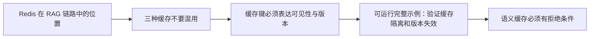
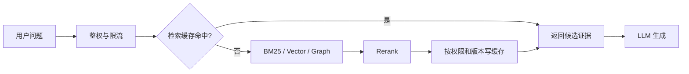

# RAG（08） - Redis 检索缓存、语义缓存与限流

> 读完后，你应能完成以下任务：
> - 绘制“RAG（08） - Redis 检索缓存、语义缓存与限流 / Redis 在 RAG 链路中的位置”的关键对象与数据流，解释“因为缓存生成后 ACL 可能已经变化。”，并用源码位置、日志或 Trace 标注证据。
> - 为“RAG（08） - Redis 检索缓存、语义缓存与限流 / 三种缓存不要混用”设计正常与异常输入，验证“企业知识库优先缓存“检索候选”，再用当前权限过滤和当前模型生成。”，输出首个偏差位置与回归测试结果。
> - 实现“RAG（08） - Redis 检索缓存、语义缓存与限流 / 缓存键必须表达可见性与版本”的最小代码或配置，检验“acl_hash 是排序后权限集合的摘要，权限变化即自然未命中。”，输出命令、结果与 Diff，并说明不适用边界。

> Redis 在 RAG 中负责保护在线热路径，不负责保存对话记忆。短期记忆的主文在[记忆系统（04） - Redis Agent Memory](/knowledge/03-AI大模型应用开发/09-记忆系统/04-Redis-Agent-Memory：短期状态、长期召回与事件流)。


## 核心知识清单

- 精确检索缓存与语义缓存的边界
- tenant、ACL、索引和模型版本进入缓存键
- TTL、主动失效与版本化失效
- 缓存穿透、击穿、雪崩和热点保护
- 分层限流、幂等与降级
- 命中率、错误复用率、延迟和成本评测

<!-- article-progressive-block:start -->
# 一、先建立全局：Redis 检索缓存、语义缓存与限流 是什么？

理解“Redis 检索缓存、语义缓存与限流”，先要把标题中的对象放进同一条处理链：它接收什么输入，经过哪些状态变化，最终用什么证据判断结果。下表不另造概念，只把作者正文已经解释的章节按依赖顺序连起来。

“Redis 检索缓存、语义缓存与限流”的第一个核心判断是：因为缓存生成后 ACL 可能已经变化。。先弄清这个判断中的对象和输入输出，后面的实现、故障和验收才有共同语境。

| 顺序 | 章节 | 读完本节应抓住的结论 |
| --- | --- | --- |
| 1 | Redis 在 RAG 链路中的位置 | 因为缓存生成后 ACL 可能已经变化。 |
| 2 | 三种缓存不要混用 | 企业知识库优先缓存“检索候选”，再用当前权限过滤和当前模型生成。 |
| 3 | 缓存键必须表达可见性与版本 | acl_hash 是排序后权限集合的摘要，权限变化即自然未命中。 |
| 4 | 可运行完整示例：验证缓存隔离和版本失效 | 它不伪装成真实网络连接，但可以直接观察租户、ACL 或索引版本变化时为什么必须未命中。 |
| 5 | 语义缓存必须有拒绝条件 | 语义缓存先用 Embedding 找相似历史问题，再判断是否复用。 |
| 6 | 限流与热点保护 | 后台建库按租户限制并发，避免影响在线查询。 |

## 1.1 核心对象之间怎样衔接



这张图只表达本文的讲解顺序，不替代正文机制。判断“Redis 检索缓存、语义缓存与限流”是否真正掌握，需要能从最后一个结果沿图回到前面每个章节的输入、状态变化和证据。

## 1.2 再看失败：问题最早会出现在哪一步？

在“Redis 检索缓存、语义缓存与限流”的对象和顺序已经明确后，再看可观察的失败：解析丢内容、正确 chunk 未召回、过滤误删、重排掉出或引用不支持结论。定位时不从最后一条错误猜原因，而是沿上图找第一个偏离正文结论的节点。
<!-- article-progressive-block:end -->

# 二、Redis 在 RAG 链路中的位置



缓存位于服务端鉴权之后。
无论命中还是未命中，
返回的 Chunk 都要再次校验当前用户权限，
因为缓存生成后 ACL 可能已经变化。
Redis 不可用时应降级为直查检索系统，而不是让整个问答服务失败。

# 三、三种缓存不要混用

| 类型 | 命中条件 | 适用数据 | 主要风险 |
| --- | --- | --- | --- |
| 精确检索缓存 | 规范化问题完全相同 | Chunk ID、分数、索引版本 | 键缺少 ACL 或版本导致越权、过期 |
| 语义检索缓存 | 问题向量相似度超过阈值 | 可复用的候选证据 | 相似问题约束不同，错误复用 |
| 生成答案缓存 | 问题、证据、模型和 Prompt 均相同 | 低风险、确定性回答 | 旧答案掩盖知识更新 |

企业知识库优先缓存“检索候选”，再用当前权限过滤和当前模型生成。
直接缓存最终答案虽然省钱，但失效维度更多，涉及价格、政策、库存、审批状态时通常不值得冒险。

# 四、缓存键必须表达可见性与版本

```text
rag:retrieval:{tenant}:{acl_hash}:{index_version}:{retriever_version}:{query_hash}
```

- `tenant` 防止租户间复用。
- `acl_hash` 是排序后权限集合的摘要，权限变化即自然未命中。
- `index_version` 在离线建库发布后切换，不需要扫描删除全部旧键。
- `retriever_version` 包含 Embedding、BM25、融合和 Rerank 配置版本。
- `query_hash` 避免把敏感问题原文暴露在键名和监控里。

仅用问题文本作为键是严重缺陷：相同问题在不同租户、角色和索引版本下可能对应完全不同的证据。

# 五、可运行完整示例：验证缓存隔离和版本失效

下面用内存字典模拟 Redis 的键语义。
它不伪装成真实网络连接，但可以直接观察租户、ACL 或索引版本变化时为什么必须未命中。

```text
# requirements.txt
# 零第三方依赖，仅使用 Python 3.10+ 标准库。
```

```python
from dataclasses import dataclass
from hashlib import sha256


@dataclass(frozen=True)
class RetrievalContext:
    """保存检索缓存的隔离维度；每个字段都会参与缓存键计算。"""

    # 当前请求所属的租户标识。
    tenant_id: str
    # 当前用户已经授权的权限组。
    permission_groups: tuple[str, ...]
    # 当前在线读取的知识索引版本。
    index_version: str
    # 检索、融合和重排配置的联合版本。
    retriever_version: str


def fingerprint(value: str) -> str:
    """返回不可逆短摘要；value 是不应直接出现在 Redis 键中的原文。"""
    return sha256(value.encode("utf-8")).hexdigest()[:16]


def build_cache_key(context: RetrievalContext, query: str) -> str:
    """构造严格隔离的缓存键；context 是权限和版本上下文，query 是原始问题。"""
    # 排序后的权限组文本，避免权限集合顺序造成无意义未命中。
    normalized_permissions: str = ",".join(sorted(context.permission_groups))
    # 权限摘要用于隔离不同可见范围，同时避免在键中暴露组名。
    permission_hash: str = fingerprint(normalized_permissions)
    # 规范化问题摘要用于精确缓存，本示例只演示大小写和首尾空格归一化。
    query_hash: str = fingerprint(query.strip().lower())
    return (
        f"rag:retrieval:{context.tenant_id}:{permission_hash}:"
        f"{context.index_version}:{context.retriever_version}:{query_hash}"
    )


def read_cache(cache: dict[str, list[str]], key: str) -> list[str] | None:
    """读取候选 Chunk ID；cache 是模拟存储，key 是已经完成隔离的缓存键。"""
    return cache.get(key)


# 模拟 Redis 中保存的检索候选缓存。
retrieval_cache: dict[str, list[str]] = {}
# 租户 A 的普通员工检索上下文。
employee_context = RetrievalContext("tenant-a", ("employee",), "index-v1", "retriever-v3")
# 同一租户管理员拥有不同权限，不能复用普通员工结果。
admin_context = RetrievalContext("tenant-a", ("admin",), "index-v1", "retriever-v3")
# 新索引发布后即使问题不变也必须重新检索。
new_index_context = RetrievalContext("tenant-a", ("employee",), "index-v2", "retriever-v3")
# 本次演示反复使用的用户问题。
question = "退款审批规则是什么？"

employee_key = build_cache_key(employee_context, question)
retrieval_cache[employee_key] = ["chunk-public-policy"]

print("same context:", read_cache(retrieval_cache, employee_key))
print("different ACL:", read_cache(retrieval_cache, build_cache_key(admin_context, question)))
print("new index:", read_cache(retrieval_cache, build_cache_key(new_index_context, question)))
```

预期只有相同上下文命中；
权限或索引版本变化均返回 `None`。
生产实现可用 `SETEX` 写入短 TTL，并为热点键增加随机抖动，避免大量键同时过期。

# 六、语义缓存必须有拒绝条件

语义缓存先用 Embedding 找相似历史问题，再判断是否复用。
相似度阈值不能凭感觉设置，应在真实查询对上统计错误复用率。
以下情况默认绕过：

- 问题包含“今天、当前、最新、余额、库存”等强时效词。
- 涉及审批、权限、金额、法律或医疗等高风险结论。
- 当前索引、Embedding、Retriever、Prompt 或模型版本已变化。
- 命中结果的来源已删除、过期或不再满足当前 ACL。
- 查询虽然语义相近，但数字、时间范围、地域或产品型号不同。

语义缓存返回的仍应是候选证据，而不是未经核验的最终事实。

# 七、限流与热点保护

至少按 `tenant_id + user_id + route + model_tier` 分层限流。
只按 IP 限流会误伤企业出口 NAT，也无法控制单个高成本租户。
Redis 中可使用 Lua 或官方限流组件保证“检查并扣减”原子化。

- 网关限制总请求，保护应用实例。
- 检索层限制高成本 MultiQuery、GraphRAG 和 Rerank。
- 模型层按 Token 预算和模型等级限流。
- 后台建库按租户限制并发，避免影响在线查询。

缓存击穿时，
同一热点查询只允许一个请求回源，
其余请求短暂等待或使用仍可接受的 stale 结果。
锁值必须带随机 token，并用 Lua 校验后释放；
不要用不安全的 `SETNX` 加直接 `DEL`。

# 八、生产验收

1. 跨租户、跨角色请求绝不命中同一个缓存键。
2. 索引、Embedding、Retriever 或权限版本变化后自然失效。
3. Redis 故障时可降级直查，Trace 明确记录 cache bypass。
4. 同时记录命中率、错误复用率、P95 延迟、回源率和单位成功成本。
5. 压测热点键、批量过期、缓存穿透和主从切换，不只验证正常命中。
6. 知识删除后，缓存最长在约定 TTL 内消失；高风险删除使用主动失效。

<!-- article-progressive-block:start -->
# 九、动手验证：先跑通 Redis 检索缓存、语义缓存与限流，再改变一个变量

前面的章节已经建立问题、概念和机制。现在把“Redis 检索缓存、语义缓存与限流”放进同一套基线中运行；本节不再引入新术语，只验证前文结论能否被复现。

## 9.1 基线与候选只允许一个变量不同

验证“Redis 检索缓存、语义缓存与限流”时，先固定标注查询集、原文与 chunk 快照、Embedding 和索引版本、权限身份。候选方案只能改变本次要验证的变量；如果同时更换数据、依赖和配置，即使结果改善，也不能知道是哪一项产生作用。

执行“Redis 检索缓存、语义缓存与限流”时，动作是：依次回放解析、切分、召回、过滤、重排、上下文组装和引用生成。原始结果不能只保留截图或汇总分数，必须同步保存：原文位置、各路候选、分数、过滤前后 Diff、Recall@K、NDCG、引用和 Trace，使下一次复查可以在同一输入上重放。

| 实验要素 | 本文要求 |
| --- | --- |
| 固定条件 | 标注查询集、原文与 chunk 快照、Embedding 和索引版本、权限身份 |
| 唯一变量 | 本次候选方案与基线之间的一项明确差异 |
| 原始证据 | 原文位置、各路候选、分数、过滤前后 Diff、Recall@K、NDCG、引用和 Trace |
| 通过阈值 | 正确证据可召回可回链，无答案时拒答，权限过滤不泄漏其他主体资料 |
| 立即停止 | 解析丢内容、正确 chunk 未召回、过滤误删、重排掉出或引用不支持结论 |

## 9.2 执行前先排除不可比较条件

“Redis 检索缓存、语义缓存与限流”开始前先确认下面四项；任一项不成立，都应先修复实验条件，而不是解释结果。

- 基线能够在“Redis 检索缓存、语义缓存与限流”的当前环境重复运行。
- 候选只改变一个与“Redis 检索缓存、语义缓存与限流”结论直接相关的条件。
- “Redis 检索缓存、语义缓存与限流”的基线和候选使用同一批输入、同一版本依赖与同一通过阈值。
- “Redis 检索缓存、语义缓存与限流”的原始输出和失败现场不会被重试、格式化或汇总覆盖。

## 9.3 执行后先核对证据完整性

结果出来后先检查证据，再讨论“Redis 检索缓存、语义缓存与限流”是否通过。缺少中间状态时，最终输出只能说明现象，不能证明机制。

| 检查项 | 当前文章的判定 |
| --- | --- |
| 输入可追溯 | 标注查询集、原文与 chunk 快照、Embedding 和索引版本、权限身份 |
| 过程可回放 | 依次回放解析、切分、召回、过滤、重排、上下文组装和引用生成 |
| 结果可审计 | 原文位置、各路候选、分数、过滤前后 Diff、Recall@K、NDCG、引用和 Trace |

“Redis 检索缓存、语义缓存与限流”的一次合格基线对照按以下顺序执行：

1. 保存“Redis 检索缓存、语义缓存与限流”基线版本及输入摘要，确认基线本身可以重复运行。
2. 写下“Redis 检索缓存、语义缓存与限流”候选方案唯一变化的变量，以及它预期影响的指标。
3. 在同一环境执行“Redis 检索缓存、语义缓存与限流”：依次回放解析、切分、召回、过滤、重排、上下文组装和引用生成。
4. 为“Redis 检索缓存、语义缓存与限流”保存：原文位置、各路候选、分数、过滤前后 Diff、Recall@K、NDCG、引用和 Trace。
5. 使用“Redis 检索缓存、语义缓存与限流”预登记条件判断：正确证据可召回可回链，无答案时拒答，权限过滤不泄漏其他主体资料。
6. 如果“Redis 检索缓存、语义缓存与限流”未通过，不修改第二个变量，先恢复基线并保留失败现场。

# 十、用一张矩阵验证 Redis 检索缓存、语义缓存与限流 的关键结论

矩阵按正文顺序列出“Redis 检索缓存、语义缓存与限流”的结论。一次实验只选择一行，只改变这一行对应的条件；不要把多行合并成一个无法归因的大实验。

| 正文章节 | 已解释的结论 | 本轮唯一变量 | 必须保存的证据 |
| --- | --- | --- | --- |
| Redis 在 RAG 链路中的位置 | 因为缓存生成后 ACL 可能已经变化。 | 只改变与“Redis 在 RAG 链路中的位置”相关的条件 | 原文位置、各路候选、分数、过滤前后 Diff、Recall@K、NDCG、引用和 Trace |
| 三种缓存不要混用 | 企业知识库优先缓存“检索候选”，再用当前权限过滤和当前模型生成。 | 只改变与“三种缓存不要混用”相关的条件 | 原文位置、各路候选、分数、过滤前后 Diff、Recall@K、NDCG、引用和 Trace |
| 缓存键必须表达可见性与版本 | acl_hash 是排序后权限集合的摘要，权限变化即自然未命中。 | 只改变与“缓存键必须表达可见性与版本”相关的条件 | 原文位置、各路候选、分数、过滤前后 Diff、Recall@K、NDCG、引用和 Trace |
| 可运行完整示例：验证缓存隔离和版本失效 | 它不伪装成真实网络连接，但可以直接观察租户、ACL 或索引版本变化时为什么必须未命中。 | 只改变与“可运行完整示例：验证缓存隔离和版本失效”相关的条件 | 原文位置、各路候选、分数、过滤前后 Diff、Recall@K、NDCG、引用和 Trace |
| 语义缓存必须有拒绝条件 | 语义缓存先用 Embedding 找相似历史问题，再判断是否复用。 | 只改变与“语义缓存必须有拒绝条件”相关的条件 | 原文位置、各路候选、分数、过滤前后 Diff、Recall@K、NDCG、引用和 Trace |
| 限流与热点保护 | 后台建库按租户限制并发，避免影响在线查询。 | 只改变与“限流与热点保护”相关的条件 | 原文位置、各路候选、分数、过滤前后 Diff、Recall@K、NDCG、引用和 Trace |

## 10.1 记录本次实际实验

下面的记录用于“Redis 检索缓存、语义缓存与限流”当前这一次实验，不是第二套知识目录。先从矩阵选择一个章节，再填写实际值；没有填写的字段表示尚未验证。

```yaml
topic: "Redis 检索缓存、语义缓存与限流"
selected_chapter: required
claim_from_article: required
baseline_version: required
changed_condition: exactly_one
execution: "依次回放解析、切分、召回、过滤、重排、上下文组装和引用生成"
evidence: "原文位置、各路候选、分数、过滤前后 Diff、Recall@K、NDCG、引用和 Trace"
pass_when: "正确证据可召回可回链，无答案时拒答，权限过滤不泄漏其他主体资料"
stop_when: "解析丢内容、正确 chunk 未召回、过滤误删、重排掉出或引用不支持结论"
observed_result: required
first_deviation: null_or_evidence
recovery_replay: required_after_failure
```

## 10.2 边界实验必须证明能够停止和恢复

成功路径只能证明“Redis 检索缓存、语义缓存与限流”在当前样本上工作，不能证明它可以进入生产。边界实验需要主动制造：解析丢内容、正确 chunk 未召回、过滤误删、重排掉出或引用不支持结论，并观察系统是否在产生不可逆副作用前停止。

| 场景 | 只改变什么 | 应保存什么 | 通过标准 |
| --- | --- | --- | --- |
| 正常路径 | 使用已知有效输入 | 原文位置、各路候选、分数、过滤前后 Diff、Recall@K、NDCG、引用和 Trace | 正确证据可召回可回链，无答案时拒答，权限过滤不泄漏其他主体资料 |
| 边界路径 | 把一个输入推进到约束临界值 | 临界值前后的输出与指标 | 不静默降级，不把部分结果冒充成功 |
| 明确失败 | 注入：解析丢内容、正确 chunk 未召回、过滤误删、重排掉出或引用不支持结论 | 原始错误、首个异常阶段和最终状态 | 失败被正确分类且没有扩大副作用 |
| 恢复重放 | 执行：在最早丢失正确证据的阶段停止，固定该阶段输入单独修复并重放全链 | 原失败样本的复测证据 | 原样本恢复，正常样本没有回归 |

恢复动作不是简单重启。对于“Redis 检索缓存、语义缓存与限流”，第一步是：在最早丢失正确证据的阶段停止，固定该阶段输入单独修复并重放全链。完成后使用原始失败样本复测；只验证一个新样本成功，不能证明触发条件已经消失。

“Redis 检索缓存、语义缓存与限流”边界实验结束后，应把正常、临界、失败和恢复四类记录放在同一个运行批次中。这样才能区分“候选方案真的修复问题”和“环境变化让问题暂时没有出现”。

# 十一、Redis 检索缓存、语义缓存与限流 的结果解释

解释“Redis 检索缓存、语义缓存与限流”实验时先看首个偏差，而不是最后一条错误。最后的异常通常只是上游状态错误的结果；从末端反推容易误把症状当根因。

| 观察结果 | 可以支持的判断 | 下一步 |
| --- | --- | --- |
| 主链路没有达到预期 | 解析丢内容、正确 chunk 未召回、过滤误删、重排掉出或引用不支持结论 | 先执行：在最早丢失正确证据的阶段停止，固定该阶段输入单独修复并重放全链 |
| 异常链路无法恢复 | 解析丢内容、正确 chunk 未召回、过滤误删、重排掉出或引用不支持结论 | 先执行：在最早丢失正确证据的阶段停止，固定该阶段输入单独修复并重放全链 |
| 新样本成功但原样本仍失败 | 修复没有覆盖原始触发条件 | 固定原失败输入，恢复基线后重新比较 |
| 指标改善但证据无法回链 | 数据、版本或中间状态没有固定 | 暂停发布，补齐可追溯记录后重跑 |

“Redis 检索缓存、语义缓存与限流”只有同时满足“正确证据可召回可回链，无答案时拒答，权限过滤不泄漏其他主体资料”，并且没有出现“解析丢内容、正确 chunk 未召回、过滤误删、重排掉出或引用不支持结论”，才可以认为主链路通过。这里的“通过”只对当前固定版本、样本和环境有效，不能外推到尚未测试的容量、权限或数据分布。

如果“Redis 检索缓存、语义缓存与限流”候选方案与基线差异很小，先检查证据分辨率是否足够；如果差异很大，先排除数据泄漏、环境漂移和版本不一致。两种情况都不能只看一个汇总均值，需要回到逐样本输出和中间状态。

“Redis 检索缓存、语义缓存与限流”故障定位完成后，记录“现象、首个偏差、根因、改动、原样本复测”五项。缺少原样本复测时，只能标记为待观察，不能标记为已解决。

# 十二、Redis 检索缓存、语义缓存与限流 的发布判断

发布判断需要把“Redis 检索缓存、语义缓存与限流”的质量、失败边界和恢复能力放在同一份记录中。以下任一条件缺失，都应停止扩量，而不是用“基本正常”替代证据。

- [ ] “Redis 检索缓存、语义缓存与限流”的基线与候选只存在一个计划内变量。
- [ ] “Redis 检索缓存、语义缓存与限流”的输入、代码、依赖、配置和数据版本可以追溯。
- [ ] “Redis 检索缓存、语义缓存与限流”的正常、临界、失败和恢复样本使用同一套断言。
- [ ] “Redis 检索缓存、语义缓存与限流”的原始输出、中间状态和失败现场已经保留。
- [ ] “Redis 检索缓存、语义缓存与限流”的日志、Trace、截图和测试数据已经脱敏。
- [ ] “Redis 检索缓存、语义缓存与限流”的停止条件、负责人和回滚入口已经演练。
- [ ] “Redis 检索缓存、语义缓存与限流”尚未覆盖的输入、权限、容量和外部依赖已经登记。

最终记录至少包含基线版本、唯一变量、原始证据、首个偏差、恢复复测和发布责任人。没有参与本次修改的人如果不能据此重放“Redis 检索缓存、语义缓存与限流”的判断，就不能发布。
<!-- article-progressive-block:end -->

# 十三、总结

- **Redis 在 RAG 链路中的位置**：无论命中还是未命中，返回的 Chunk 都要再次校验当前用户权限，因为缓存生成后 ACL 可能已经变化。
- **三种缓存不要混用**：| 类型 | 命中条件 | 适用数据 | 主要风险 |
- **缓存键必须表达可见性与版本**：acl_hash 是排序后权限集合的摘要，权限变化即自然未命中。
- **可运行完整示例：验证缓存隔离和版本失效**：它不伪装成真实网络连接，但可以直接观察租户、ACL 或索引版本变化时为什么必须未命中。
- **语义缓存必须有拒绝条件**：语义缓存先用 Embedding 找相似历史问题，再判断是否复用。
- **限流与热点保护**：后台建库按租户限制并发，避免影响在线查询。

## 参考资料

- [Redis：LangCache semantic caching](https://redis.io/docs/latest/develop/ai/context-engine/langcache/)
- [Redis：Rate limiting algorithms](https://redis.io/tutorials/howtos/ratelimiting/)
- [Redis：Agent memory](https://redis.io/docs/latest/develop/use-cases/agent-memory/)
