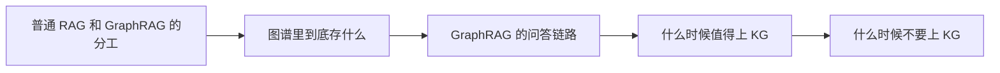

# RAG（21） - 进阶：GraphRAG 与知识图谱增强

> 读完后，你应能完成以下任务：
> - 绘制“RAG（27） - 进阶：GraphRAG 与知识图谱增强 / 普通 RAG 和 GraphRAG 的分工”的关键对象与数据流，解释“GraphRAG 不是替代普通 RAG。”，并用源码位置、日志或 Trace 标注证据。
> - 为“RAG（27） - 进阶：GraphRAG 与知识图谱增强 / 图谱里到底存什么”设计正常与异常输入，验证“关键是每个事实都要能回到来源片段。”，输出首个偏差位置与回归测试结果。
> - 实现“RAG（27） - 进阶：GraphRAG 与知识图谱增强 / GraphRAG 的问答链路”的最小代码或配置，检验“这条链路的重点是“图谱查询后还要回到原文”。”，输出命令、结果与 Diff，并说明不适用边界。

本篇负责说明 GraphRAG 如何接入完整 RAG 链路。
Neo4j 的图模型、Cypher、受控多跳检索和增量一致性集中在 [Neo4j（01） - 知识图谱和 Graph RAG](/knowledge/03-AI大模型应用开发/07-Neo4j/01-Neo4j-知识图谱和-Graph-RAG)、[Neo4j（02） - 受控多跳检索与证据回链](/knowledge/03-AI大模型应用开发/07-Neo4j/02-Neo4j-GraphRAG：受控多跳检索与证据回链)和[Neo4j（03） - 增量更新与安全删除](/knowledge/03-AI大模型应用开发/07-Neo4j/03-Neo4j-增量更新与安全删除：保持-GraphRAG-一致)，
这里不重复维护数据库专项实现。

<!-- article-progressive-block:start -->
# 一、先建立全局：进阶：GraphRAG 与知识图谱增强 是什么？

理解“进阶：GraphRAG 与知识图谱增强”，先要把标题中的对象放进同一条处理链：它接收什么输入，经过哪些状态变化，最终用什么证据判断结果。下表不另造概念，只把作者正文已经解释的章节按依赖顺序连起来。

“进阶：GraphRAG 与知识图谱增强”的第一个核心判断是：GraphRAG 不是替代普通 RAG。。先弄清这个判断中的对象和输入输出，后面的实现、故障和验收才有共同语境。

| 顺序 | 章节 | 读完本节应抓住的结论 |
| --- | --- | --- |
| 1 | 普通 RAG 和 GraphRAG 的分工 | GraphRAG 不是替代普通 RAG。 |
| 2 | 图谱里到底存什么 | 关键是每个事实都要能回到来源片段。 |
| 3 | GraphRAG 的问答链路 | 这条链路的重点是“图谱查询后还要回到原文”。 |
| 4 | 什么时候值得上 KG | 实体稳定：设备、部件、故障码、法条、合同条款这类实体不会天天变。 -> 关系有价值：问题经常需要“谁影响谁”“原因是什么”“下一步是什么”。 -> 需要多跳解释：答案不是一个片段能解决，需要跨文档串起来。 -> 原文证据能回溯：每个实体关系都能指向来源片段。 |
| 5 | 什么时候不要上 KG | 只是 FAQ 问答：一问一答能解决，图谱是过度设计。 -> 实体关系不稳定：每天大量变化，维护成本压过收益。 -> 抽取质量低：模型抽出来的关系错得多，图谱会放大错误。 -> 没有维护机制：没人审核、没人更新、没人处理冲突。 |
| 6 | 可直接复用的项目表达 | 用户提问时先识别实体，通过 Neo4j 查询故障原因和处理路径，再回到原文片段做证据聚合和回答生成，支持答案展示引用来源和多跳证据链。 |

## 1.1 核心对象之间怎样衔接



这张图只表达本文的讲解顺序，不替代正文机制。判断“进阶：GraphRAG 与知识图谱增强”是否真正掌握，需要能从最后一个结果沿图回到前面每个章节的输入、状态变化和证据。

## 1.2 再看失败：问题最早会出现在哪一步？

在“进阶：GraphRAG 与知识图谱增强”的对象和顺序已经明确后，再看可观察的失败：解析丢内容、正确 chunk 未召回、过滤误删、重排掉出或引用不支持结论。定位时不从最后一条错误猜原因，而是沿上图找第一个偏离正文结论的节点。
<!-- article-progressive-block:end -->

# 二、一个真实场景

用户问：“X200 设备出现 E17，换过传感器还是报警，下一步查哪里？
”

普通 RAG 可能召回：

- E17 故障码说明
- X200 设备说明书
- 传感器更换步骤
- 某个维修案例

这些资料都相关，
但问题真正需要的是关系：X200 包含哪些部件，
E17 对应哪个传感器，
传感器上游供电来自哪里，
维修案例里“换过还报警”最终定位到哪条线路。

这就是 GraphRAG 的价值：让系统不只“找相似文本”，还能沿着实体和关系找到证据路径。

# 三、普通 RAG 和 GraphRAG 的分工

| 问题类型 | 普通 RAG 更适合 | GraphRAG 更适合 |
|---|---|---|
| 查制度原文 | “报销几天内提交？” | 不需要上图 |
| 查编号解释 | “E17 是什么？” | 可选，用于标准化实体 |
| 多跳关系 | 容易只召回局部片段 | “故障码 -> 原因 -> 部件 -> 处理步骤” |
| 实体消歧 | 同名实体容易混 | 同名部件按设备型号区分 |
| 证据路径 | 只能列 chunk | 能展示关系链和来源片段 |

GraphRAG 不是替代普通 RAG。
更常见的组合是：图谱负责找关系路径，RAG 负责拿原文证据，LLM 负责把证据组织成回答。

# 四、图谱里到底存什么

知识图谱不是把整篇文档塞进去，而是存结构化事实：

```text
(设备:X200) -[包含]-> (部件:压力传感器)
(故障码:E17) -[对应原因]-> (原因:传感器供电异常)
(原因:传感器供电异常) -[排查]-> (步骤:测量端子电压)
(步骤:测量端子电压) -[来源]-> (片段:manual_p12_chunk_03)
```

关键是每个事实都要能回到来源片段。
没有来源的图谱很危险：看起来结构化，实际上无法验证。
企业项目里，每条边最好带：

| 字段 | 用途 |
|---|---|
| source_chunk_id | 回到原文证据 |
| confidence | 抽取置信度 |
| updated_at | 判断是否过期 |
| extractor | 人工录入、规则抽取还是模型抽取 |

# 五、GraphRAG 的问答链路

```text
用户问题
  -> 识别实体和意图
  -> 图谱查询候选路径
  -> 找到路径关联的原文片段
  -> 对原文片段做 rerank
  -> LLM 基于证据回答
  -> 输出答案 + 引用 + 关系路径
```

例子：

```text
问题：X200 出现 E17，换过传感器还报警，下一步查哪里？
实体：X200、E17、传感器
路径：E17 -> 传感器供电异常 -> 端子电压 -> 接线松动案例
证据：manual_p12、case_2024_018
回答：先检查传感器供电端子和接线，依据是……
```

这条链路的重点是“图谱查询后还要回到原文”。
只给一条图路径，不给原文证据，面试官一追问“这个关系哪里来的”，就讲不下去了。

# 六、什么时候值得上 KG

满足越多条，越值得上知识图谱：

1. **实体稳定**：设备、部件、故障码、法条、合同条款这类实体不会天天变。
2. **关系有价值**：问题经常需要“谁影响谁”“原因是什么”“下一步是什么”。
3. **需要多跳解释**：答案不是一个片段能解决，需要跨文档串起来。
4. **原文证据能回溯**：每个实体关系都能指向来源片段。

典型适合场景：工业维修、法律条文和类案、合同条款审查、医学知识、组织制度和流程依赖。

# 七、什么时候不要上 KG

这些情况先别急着上 KG：

1. **只是 FAQ 问答**：一问一答能解决，图谱是过度设计。
2. **实体关系不稳定**：每天大量变化，维护成本压过收益。
3. **抽取质量低**：模型抽出来的关系错得多，图谱会放大错误。
4. **没有维护机制**：没人审核、没人更新、没人处理冲突。

知识图谱像数据库 schema，一旦建了就要维护。
没有维护预算，宁可先把普通 RAG、混合检索、评测做好。

# 八、可直接复用的项目表达

工业知识库：

> 在工业知识库 RAG 基础上引入知识图谱增强召回，抽取设备型号、部件、故障码、原因和处理步骤等实体关系；用户提问时先识别实体，通过 Neo4j 查询故障原因和处理路径，再回到原文片段做证据聚合和回答生成，支持答案展示引用来源和多跳证据链。

法律检索：

> 构建面向法条、司法解释、裁判案例的 GraphRAG 检索链路，抽取案由、法条、争议焦点、裁判观点和案例之间的关系；复杂问题先做实体识别和 Query Rewrite，再结合图谱路径与 Hybrid Search 召回依据，生成结构化类案分析并保留法条与案例来源。

# 九、工程上真正会踩的坑

- **图谱无来源**。实体和关系没有 source_chunk_id，错了无法追责，回答也无法引用。
- **实体标准化缺失**。`X200`、`X-200`、`X200型设备` 被当成三个实体，多跳查询会断。
- **只展示图不回原文**。图谱路径不是证据本身，原文片段才是回答依据。
- **抽取错不评测**。图谱抽取也要评测实体准确率、关系准确率、冲突率。
- **把 KG 当向量库替代品**。图谱擅长关系，不擅长大规模语义召回；两者是配合，不是替换。

<!-- article-progressive-block:start -->
# 十、动手验证：先跑通 进阶：GraphRAG 与知识图谱增强，再改变一个变量

前面的章节已经建立问题、概念和机制。现在把“进阶：GraphRAG 与知识图谱增强”放进同一套基线中运行；本节不再引入新术语，只验证前文结论能否被复现。

## 10.1 基线与候选只允许一个变量不同

验证“进阶：GraphRAG 与知识图谱增强”时，先固定标注查询集、原文与 chunk 快照、Embedding 和索引版本、权限身份。候选方案只能改变本次要验证的变量；如果同时更换数据、依赖和配置，即使结果改善，也不能知道是哪一项产生作用。

执行“进阶：GraphRAG 与知识图谱增强”时，动作是：依次回放解析、切分、召回、过滤、重排、上下文组装和引用生成。原始结果不能只保留截图或汇总分数，必须同步保存：原文位置、各路候选、分数、过滤前后 Diff、Recall@K、NDCG、引用和 Trace，使下一次复查可以在同一输入上重放。

| 实验要素 | 本文要求 |
| --- | --- |
| 固定条件 | 标注查询集、原文与 chunk 快照、Embedding 和索引版本、权限身份 |
| 唯一变量 | 本次候选方案与基线之间的一项明确差异 |
| 原始证据 | 原文位置、各路候选、分数、过滤前后 Diff、Recall@K、NDCG、引用和 Trace |
| 通过阈值 | 正确证据可召回可回链，无答案时拒答，权限过滤不泄漏其他主体资料 |
| 立即停止 | 解析丢内容、正确 chunk 未召回、过滤误删、重排掉出或引用不支持结论 |

## 10.2 执行前先排除不可比较条件

“进阶：GraphRAG 与知识图谱增强”开始前先确认下面四项；任一项不成立，都应先修复实验条件，而不是解释结果。

- 基线能够在“进阶：GraphRAG 与知识图谱增强”的当前环境重复运行。
- 候选只改变一个与“进阶：GraphRAG 与知识图谱增强”结论直接相关的条件。
- “进阶：GraphRAG 与知识图谱增强”的基线和候选使用同一批输入、同一版本依赖与同一通过阈值。
- “进阶：GraphRAG 与知识图谱增强”的原始输出和失败现场不会被重试、格式化或汇总覆盖。

## 10.3 执行后先核对证据完整性

结果出来后先检查证据，再讨论“进阶：GraphRAG 与知识图谱增强”是否通过。缺少中间状态时，最终输出只能说明现象，不能证明机制。

| 检查项 | 当前文章的判定 |
| --- | --- |
| 输入可追溯 | 标注查询集、原文与 chunk 快照、Embedding 和索引版本、权限身份 |
| 过程可回放 | 依次回放解析、切分、召回、过滤、重排、上下文组装和引用生成 |
| 结果可审计 | 原文位置、各路候选、分数、过滤前后 Diff、Recall@K、NDCG、引用和 Trace |

“进阶：GraphRAG 与知识图谱增强”的一次合格基线对照按以下顺序执行：

1. 保存“进阶：GraphRAG 与知识图谱增强”基线版本及输入摘要，确认基线本身可以重复运行。
2. 写下“进阶：GraphRAG 与知识图谱增强”候选方案唯一变化的变量，以及它预期影响的指标。
3. 在同一环境执行“进阶：GraphRAG 与知识图谱增强”：依次回放解析、切分、召回、过滤、重排、上下文组装和引用生成。
4. 为“进阶：GraphRAG 与知识图谱增强”保存：原文位置、各路候选、分数、过滤前后 Diff、Recall@K、NDCG、引用和 Trace。
5. 使用“进阶：GraphRAG 与知识图谱增强”预登记条件判断：正确证据可召回可回链，无答案时拒答，权限过滤不泄漏其他主体资料。
6. 如果“进阶：GraphRAG 与知识图谱增强”未通过，不修改第二个变量，先恢复基线并保留失败现场。

# 十一、用一张矩阵验证 进阶：GraphRAG 与知识图谱增强 的关键结论

矩阵按正文顺序列出“进阶：GraphRAG 与知识图谱增强”的结论。一次实验只选择一行，只改变这一行对应的条件；不要把多行合并成一个无法归因的大实验。

| 正文章节 | 已解释的结论 | 本轮唯一变量 | 必须保存的证据 |
| --- | --- | --- | --- |
| 普通 RAG 和 GraphRAG 的分工 | GraphRAG 不是替代普通 RAG。 | 只改变与“普通 RAG 和 GraphRAG 的分工”相关的条件 | 原文位置、各路候选、分数、过滤前后 Diff、Recall@K、NDCG、引用和 Trace |
| 图谱里到底存什么 | 关键是每个事实都要能回到来源片段。 | 只改变与“图谱里到底存什么”相关的条件 | 原文位置、各路候选、分数、过滤前后 Diff、Recall@K、NDCG、引用和 Trace |
| GraphRAG 的问答链路 | 这条链路的重点是“图谱查询后还要回到原文”。 | 只改变与“GraphRAG 的问答链路”相关的条件 | 原文位置、各路候选、分数、过滤前后 Diff、Recall@K、NDCG、引用和 Trace |
| 什么时候值得上 KG | 实体稳定：设备、部件、故障码、法条、合同条款这类实体不会天天变。 -> 关系有价值：问题经常需要“谁影响谁”“原因是什么”“下一步是什么”。 -> 需要多跳解释：答案不是一个片段能解决，需要跨文档串起来。 -> 原文证据能回溯：每个实体关系都能指向来源片段。 | 只改变与“什么时候值得上 KG”相关的条件 | 原文位置、各路候选、分数、过滤前后 Diff、Recall@K、NDCG、引用和 Trace |
| 什么时候不要上 KG | 只是 FAQ 问答：一问一答能解决，图谱是过度设计。 -> 实体关系不稳定：每天大量变化，维护成本压过收益。 -> 抽取质量低：模型抽出来的关系错得多，图谱会放大错误。 -> 没有维护机制：没人审核、没人更新、没人处理冲突。 | 只改变与“什么时候不要上 KG”相关的条件 | 原文位置、各路候选、分数、过滤前后 Diff、Recall@K、NDCG、引用和 Trace |
| 可直接复用的项目表达 | 用户提问时先识别实体，通过 Neo4j 查询故障原因和处理路径，再回到原文片段做证据聚合和回答生成，支持答案展示引用来源和多跳证据链。 | 只改变与“可直接复用的项目表达”相关的条件 | 原文位置、各路候选、分数、过滤前后 Diff、Recall@K、NDCG、引用和 Trace |

## 11.1 记录本次实际实验

下面的记录用于“进阶：GraphRAG 与知识图谱增强”当前这一次实验，不是第二套知识目录。先从矩阵选择一个章节，再填写实际值；没有填写的字段表示尚未验证。

```yaml
topic: "进阶：GraphRAG 与知识图谱增强"
selected_chapter: required
claim_from_article: required
baseline_version: required
changed_condition: exactly_one
execution: "依次回放解析、切分、召回、过滤、重排、上下文组装和引用生成"
evidence: "原文位置、各路候选、分数、过滤前后 Diff、Recall@K、NDCG、引用和 Trace"
pass_when: "正确证据可召回可回链，无答案时拒答，权限过滤不泄漏其他主体资料"
stop_when: "解析丢内容、正确 chunk 未召回、过滤误删、重排掉出或引用不支持结论"
observed_result: required
first_deviation: null_or_evidence
recovery_replay: required_after_failure
```

## 11.2 边界实验必须证明能够停止和恢复

成功路径只能证明“进阶：GraphRAG 与知识图谱增强”在当前样本上工作，不能证明它可以进入生产。边界实验需要主动制造：解析丢内容、正确 chunk 未召回、过滤误删、重排掉出或引用不支持结论，并观察系统是否在产生不可逆副作用前停止。

| 场景 | 只改变什么 | 应保存什么 | 通过标准 |
| --- | --- | --- | --- |
| 正常路径 | 使用已知有效输入 | 原文位置、各路候选、分数、过滤前后 Diff、Recall@K、NDCG、引用和 Trace | 正确证据可召回可回链，无答案时拒答，权限过滤不泄漏其他主体资料 |
| 边界路径 | 把一个输入推进到约束临界值 | 临界值前后的输出与指标 | 不静默降级，不把部分结果冒充成功 |
| 明确失败 | 注入：解析丢内容、正确 chunk 未召回、过滤误删、重排掉出或引用不支持结论 | 原始错误、首个异常阶段和最终状态 | 失败被正确分类且没有扩大副作用 |
| 恢复重放 | 执行：在最早丢失正确证据的阶段停止，固定该阶段输入单独修复并重放全链 | 原失败样本的复测证据 | 原样本恢复，正常样本没有回归 |

恢复动作不是简单重启。对于“进阶：GraphRAG 与知识图谱增强”，第一步是：在最早丢失正确证据的阶段停止，固定该阶段输入单独修复并重放全链。完成后使用原始失败样本复测；只验证一个新样本成功，不能证明触发条件已经消失。

“进阶：GraphRAG 与知识图谱增强”边界实验结束后，应把正常、临界、失败和恢复四类记录放在同一个运行批次中。这样才能区分“候选方案真的修复问题”和“环境变化让问题暂时没有出现”。

# 十二、进阶：GraphRAG 与知识图谱增强 的结果解释

解释“进阶：GraphRAG 与知识图谱增强”实验时先看首个偏差，而不是最后一条错误。最后的异常通常只是上游状态错误的结果；从末端反推容易误把症状当根因。

| 观察结果 | 可以支持的判断 | 下一步 |
| --- | --- | --- |
| 主链路没有达到预期 | 解析丢内容、正确 chunk 未召回、过滤误删、重排掉出或引用不支持结论 | 先执行：在最早丢失正确证据的阶段停止，固定该阶段输入单独修复并重放全链 |
| 异常链路无法恢复 | 解析丢内容、正确 chunk 未召回、过滤误删、重排掉出或引用不支持结论 | 先执行：在最早丢失正确证据的阶段停止，固定该阶段输入单独修复并重放全链 |
| 新样本成功但原样本仍失败 | 修复没有覆盖原始触发条件 | 固定原失败输入，恢复基线后重新比较 |
| 指标改善但证据无法回链 | 数据、版本或中间状态没有固定 | 暂停发布，补齐可追溯记录后重跑 |

“进阶：GraphRAG 与知识图谱增强”只有同时满足“正确证据可召回可回链，无答案时拒答，权限过滤不泄漏其他主体资料”，并且没有出现“解析丢内容、正确 chunk 未召回、过滤误删、重排掉出或引用不支持结论”，才可以认为主链路通过。这里的“通过”只对当前固定版本、样本和环境有效，不能外推到尚未测试的容量、权限或数据分布。

如果“进阶：GraphRAG 与知识图谱增强”候选方案与基线差异很小，先检查证据分辨率是否足够；如果差异很大，先排除数据泄漏、环境漂移和版本不一致。两种情况都不能只看一个汇总均值，需要回到逐样本输出和中间状态。

“进阶：GraphRAG 与知识图谱增强”故障定位完成后，记录“现象、首个偏差、根因、改动、原样本复测”五项。缺少原样本复测时，只能标记为待观察，不能标记为已解决。

# 十三、进阶：GraphRAG 与知识图谱增强 的发布判断

发布判断需要把“进阶：GraphRAG 与知识图谱增强”的质量、失败边界和恢复能力放在同一份记录中。以下任一条件缺失，都应停止扩量，而不是用“基本正常”替代证据。

- [ ] “进阶：GraphRAG 与知识图谱增强”的基线与候选只存在一个计划内变量。
- [ ] “进阶：GraphRAG 与知识图谱增强”的输入、代码、依赖、配置和数据版本可以追溯。
- [ ] “进阶：GraphRAG 与知识图谱增强”的正常、临界、失败和恢复样本使用同一套断言。
- [ ] “进阶：GraphRAG 与知识图谱增强”的原始输出、中间状态和失败现场已经保留。
- [ ] “进阶：GraphRAG 与知识图谱增强”的日志、Trace、截图和测试数据已经脱敏。
- [ ] “进阶：GraphRAG 与知识图谱增强”的停止条件、负责人和回滚入口已经演练。
- [ ] “进阶：GraphRAG 与知识图谱增强”尚未覆盖的输入、权限、容量和外部依赖已经登记。

最终记录至少包含基线版本、唯一变量、原始证据、首个偏差、恢复复测和发布责任人。没有参与本次修改的人如果不能据此重放“进阶：GraphRAG 与知识图谱增强”的判断，就不能发布。
<!-- article-progressive-block:end -->

# 十四、总结

- **普通 RAG 和 GraphRAG 的分工**：GraphRAG 不是替代普通 RAG。
- **图谱里到底存什么**：关键是每个事实都要能回到来源片段。
- **GraphRAG 的问答链路**：这条链路的重点是“图谱查询后还要回到原文”。
- **什么时候值得上 KG**：实体稳定：设备、部件、故障码、法条、合同条款这类实体不会天天变。 -> 关系有价值：问题经常需要“谁影响谁”“原因是什么”“下一步是什么”。 -> 需要多跳解释：答案不是一个片段能解决，需要跨文档串起来。 -> 原文证据能回溯：每个实体关系都能指向来源片段。
- **什么时候不要上 KG**：只是 FAQ 问答：一问一答能解决，图谱是过度设计。 -> 实体关系不稳定：每天大量变化，维护成本压过收益。 -> 抽取质量低：模型抽出来的关系错得多，图谱会放大错误。 -> 没有维护机制：没人审核、没人更新、没人处理冲突。
- **可直接复用的项目表达**：用户提问时先识别实体，通过 Neo4j 查询故障原因和处理路径，再回到原文片段做证据聚合和回答生成，支持答案展示引用来源和多跳证据链。

## 参考资料

- [Neo4j GraphRAG Python Package](https://neo4j.com/docs/neo4j-graphrag-python/current/)
- [Microsoft GraphRAG 官方仓库](https://github.com/microsoft/graphrag)
