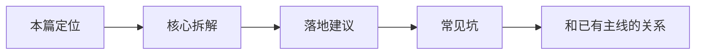

# Neo4j（01） - Neo4j 知识图谱和 Graph RAG

> 读完后，你应能完成以下任务：
> - 绘制“Neo4j（01） - Neo4j 知识图谱和 Graph RAG / 本篇定位”的关键对象与数据流，解释“这是 GraphRAG 专项篇，和 RAG（33）《进阶：GraphRAG 与知识图谱增强》 形成互补。”，并用源码位置、日志或 Trace 标注证据。
> - 为“Neo4j（01） - Neo4j 知识图谱和 Graph RAG / 核心拆解”设计正常与异常输入，验证“Neo4j 存的是节点和关系。”，输出首个偏差位置与回归测试结果。
> - 实现“Neo4j（01） - Neo4j 知识图谱和 Graph RAG / 落地建议”的最小代码或配置，检验“先从小范围核心实体建图，不要全量抽取。”，输出命令、结果与 Diff，并说明不适用边界。

<!-- article-progressive-block:start -->
# 一、先建立全局：Neo4j 知识图谱和 Graph RAG 是什么？

理解“Neo4j 知识图谱和 Graph RAG”，先要把标题中的对象放进同一条处理链：它接收什么输入，经过哪些状态变化，最终用什么证据判断结果。下表不另造概念，只把作者正文已经解释的章节按依赖顺序连起来。

“Neo4j 知识图谱和 Graph RAG”的第一个核心判断是：这是 GraphRAG 专项篇，和 RAG（33）《进阶：GraphRAG 与知识图谱增强》 形成互补。。先弄清这个判断中的对象和输入输出，后面的实现、故障和验收才有共同语境。

| 顺序 | 章节 | 读完本节应抓住的结论 |
| --- | --- | --- |
| 1 | 本篇定位 | 这是 GraphRAG 专项篇，和 RAG（33）《进阶：GraphRAG 与知识图谱增强》 形成互补。 |
| 2 | 核心拆解 | Neo4j 存的是节点和关系。 |
| 3 | 落地建议 | 先从小范围核心实体建图，不要全量抽取。 |
| 4 | 常见坑 | 图谱没有来源，关系无法核验。 |
| 5 | 和已有主线的关系 | ../09-附录/进阶-GraphRAG与知识图谱增强.md 讲思路； |
| 6 | 设计判断 | Graph RAG 最适合“关系先于文本”的问题。 |

## 1.1 核心对象之间怎样衔接



这张图只表达本文的讲解顺序，不替代正文机制。判断“Neo4j 知识图谱和 Graph RAG”是否真正掌握，需要能从最后一个结果沿图回到前面每个章节的输入、状态变化和证据。

## 1.2 再看失败：问题最早会出现在哪一步？

在“Neo4j 知识图谱和 Graph RAG”的对象和顺序已经明确后，再看可观察的失败：漏召回、排序丢失、引用断链或越权命中。定位时不从最后一条错误猜原因，而是沿上图找第一个偏离正文结论的节点。
<!-- article-progressive-block:end -->

# 二、Neo4j 知识图谱和 Graph RAG的学习定位与边界

这是 GraphRAG 专项篇，和 RAG（33）《进阶：GraphRAG 与知识图谱增强》 形成互补。

# 三、Neo4j 知识图谱和 Graph RAG的真实应用场景

用户问“设备 A 的 E17 故障和哪个传感器有关，处理步骤是什么”。普通 RAG 可能召回几段相似文本，但关系链不清楚。知识图谱可以把设备、部件、故障码、原因、处理步骤连成图，先走关系，再回原文找证据。

# 四、Neo4j 知识图谱和 Graph RAG的核心对象与机制

- Neo4j 存的是节点和关系。节点可以是设备、人员、公司、故障、条款；关系可以是属于、导致、引用、依赖。
- Graph RAG 不是替代向量 RAG，而是增加一条关系召回路径。图谱找路径，文本 RAG 找证据，模型负责组织回答。
- 图谱建设成本高，适合实体关系明确、多跳问题多、需要证据路径的领域。

# 五、Neo4j 知识图谱和 Graph RAG的工程链路

- 从文档抽取实体和关系。
- 写入 Neo4j。
- 用户问题做实体识别。
- 查询图谱路径。
- 根据路径回查原文证据。
- 结合文本证据生成回答。

# 六、Neo4j 知识图谱和 Graph RAG的落地建议

- 先从小范围核心实体建图，不要全量抽取。
- 图谱关系要能回到原文来源。
- 图查询结果要和 RAG chunk 一起给模型。

# 七、Neo4j 知识图谱和 Graph RAG的常见故障与误区

- 为了显得高级硬上图谱。
- 图谱没有来源，关系无法核验。
- 实体抽取错误后不做人工校正，图越建越脏。

# 八、Neo4j 知识图谱和 Graph RAG在学习路线中的位置

`../09-附录/进阶-GraphRAG与知识图谱增强.md` 讲思路；本篇聚焦 Neo4j 落地链路。

# 九、设计判断

Graph RAG 最适合“关系先于文本”的问题。如果用户只是问制度条款、产品说明，普通 RAG 往往足够；如果用户问 A 和 B 的关系、某故障由哪些部件导致、某公司和哪些项目关联，图谱才开始有明显价值。建图前先列 20 个真实问题，看其中是否大量需要多跳关系和实体消歧。没有这些问题，图谱会变成昂贵的装饰。

# 十、Neo4j 知识图谱和 Graph RAG的核心结论

> Graph RAG 适合多跳关系和实体消歧。Neo4j 存实体关系，向量库保存原文证据，回答时先查关系路径，再回到文本证据。它不是普通 RAG 的替代品，只有关系问题足够多时才值得引入。

<!-- article-progressive-block:start -->
# 十一、动手验证：先跑通 Neo4j 知识图谱和 Graph RAG，再改变一个变量

前面的章节已经建立问题、概念和机制。现在把“Neo4j 知识图谱和 Graph RAG”放进同一套基线中运行；本节不再引入新术语，只验证前文结论能否被复现。

## 11.1 基线与候选只允许一个变量不同

验证“Neo4j 知识图谱和 Graph RAG”时，先固定查询集、语料快照、权限身份、相关性标注。候选方案只能改变本次要验证的变量；如果同时更换数据、依赖和配置，即使结果改善，也不能知道是哪一项产生作用。

执行“Neo4j 知识图谱和 Graph RAG”时，动作是：离线回放检索，保存候选、过滤、排序和引用。原始结果不能只保留截图或汇总分数，必须同步保存：Recall@K、NDCG、引用命中率、无答案误答率、Trace，使下一次复查可以在同一输入上重放。

| 实验要素 | 本文要求 |
| --- | --- |
| 固定条件 | 查询集、语料快照、权限身份、相关性标注 |
| 唯一变量 | 本次候选方案与基线之间的一项明确差异 |
| 原始证据 | Recall@K、NDCG、引用命中率、无答案误答率、Trace |
| 通过阈值 | 证据可回链，指标达基线，权限过滤无泄漏 |
| 立即停止 | 漏召回、排序丢失、引用断链或越权命中 |

## 11.2 执行前先排除不可比较条件

“Neo4j 知识图谱和 Graph RAG”开始前先确认下面四项；任一项不成立，都应先修复实验条件，而不是解释结果。

- 基线能够在“Neo4j 知识图谱和 Graph RAG”的当前环境重复运行。
- 候选只改变一个与“Neo4j 知识图谱和 Graph RAG”结论直接相关的条件。
- “Neo4j 知识图谱和 Graph RAG”的基线和候选使用同一批输入、同一版本依赖与同一通过阈值。
- “Neo4j 知识图谱和 Graph RAG”的原始输出和失败现场不会被重试、格式化或汇总覆盖。

## 11.3 执行后先核对证据完整性

结果出来后先检查证据，再讨论“Neo4j 知识图谱和 Graph RAG”是否通过。缺少中间状态时，最终输出只能说明现象，不能证明机制。

| 检查项 | 当前文章的判定 |
| --- | --- |
| 输入可追溯 | 查询集、语料快照、权限身份、相关性标注 |
| 过程可回放 | 离线回放检索，保存候选、过滤、排序和引用 |
| 结果可审计 | Recall@K、NDCG、引用命中率、无答案误答率、Trace |

“Neo4j 知识图谱和 Graph RAG”的一次合格基线对照按以下顺序执行：

1. 保存“Neo4j 知识图谱和 Graph RAG”基线版本及输入摘要，确认基线本身可以重复运行。
2. 写下“Neo4j 知识图谱和 Graph RAG”候选方案唯一变化的变量，以及它预期影响的指标。
3. 在同一环境执行“Neo4j 知识图谱和 Graph RAG”：离线回放检索，保存候选、过滤、排序和引用。
4. 为“Neo4j 知识图谱和 Graph RAG”保存：Recall@K、NDCG、引用命中率、无答案误答率、Trace。
5. 使用“Neo4j 知识图谱和 Graph RAG”预登记条件判断：证据可回链，指标达基线，权限过滤无泄漏。
6. 如果“Neo4j 知识图谱和 Graph RAG”未通过，不修改第二个变量，先恢复基线并保留失败现场。

# 十二、用一张矩阵验证 Neo4j 知识图谱和 Graph RAG 的关键结论

矩阵按正文顺序列出“Neo4j 知识图谱和 Graph RAG”的结论。一次实验只选择一行，只改变这一行对应的条件；不要把多行合并成一个无法归因的大实验。

| 正文章节 | 已解释的结论 | 本轮唯一变量 | 必须保存的证据 |
| --- | --- | --- | --- |
| 本篇定位 | 这是 GraphRAG 专项篇，和 RAG（33）《进阶：GraphRAG 与知识图谱增强》 形成互补。 | 只改变与“本篇定位”相关的条件 | Recall@K、NDCG、引用命中率、无答案误答率、Trace |
| 核心拆解 | Neo4j 存的是节点和关系。 | 只改变与“核心拆解”相关的条件 | Recall@K、NDCG、引用命中率、无答案误答率、Trace |
| 落地建议 | 先从小范围核心实体建图，不要全量抽取。 | 只改变与“落地建议”相关的条件 | Recall@K、NDCG、引用命中率、无答案误答率、Trace |
| 常见坑 | 图谱没有来源，关系无法核验。 | 只改变与“常见坑”相关的条件 | Recall@K、NDCG、引用命中率、无答案误答率、Trace |
| 和已有主线的关系 | ../09-附录/进阶-GraphRAG与知识图谱增强.md 讲思路； | 只改变与“和已有主线的关系”相关的条件 | Recall@K、NDCG、引用命中率、无答案误答率、Trace |
| 设计判断 | Graph RAG 最适合“关系先于文本”的问题。 | 只改变与“设计判断”相关的条件 | Recall@K、NDCG、引用命中率、无答案误答率、Trace |

## 12.1 记录本次实际实验

下面的记录用于“Neo4j 知识图谱和 Graph RAG”当前这一次实验，不是第二套知识目录。先从矩阵选择一个章节，再填写实际值；没有填写的字段表示尚未验证。

```yaml
topic: "Neo4j 知识图谱和 Graph RAG"
selected_chapter: required
claim_from_article: required
baseline_version: required
changed_condition: exactly_one
execution: "离线回放检索，保存候选、过滤、排序和引用"
evidence: "Recall@K、NDCG、引用命中率、无答案误答率、Trace"
pass_when: "证据可回链，指标达基线，权限过滤无泄漏"
stop_when: "漏召回、排序丢失、引用断链或越权命中"
observed_result: required
first_deviation: null_or_evidence
recovery_replay: required_after_failure
```

## 12.2 边界实验必须证明能够停止和恢复

成功路径只能证明“Neo4j 知识图谱和 Graph RAG”在当前样本上工作，不能证明它可以进入生产。边界实验需要主动制造：漏召回、排序丢失、引用断链或越权命中，并观察系统是否在产生不可逆副作用前停止。

| 场景 | 只改变什么 | 应保存什么 | 通过标准 |
| --- | --- | --- | --- |
| 正常路径 | 使用已知有效输入 | Recall@K、NDCG、引用命中率、无答案误答率、Trace | 证据可回链，指标达基线，权限过滤无泄漏 |
| 边界路径 | 把一个输入推进到约束临界值 | 临界值前后的输出与指标 | 不静默降级，不把部分结果冒充成功 |
| 明确失败 | 注入：漏召回、排序丢失、引用断链或越权命中 | 原始错误、首个异常阶段和最终状态 | 失败被正确分类且没有扩大副作用 |
| 恢复重放 | 执行：定位解析、召回、过滤、排序或生成阶段，回滚对应版本 | 原失败样本的复测证据 | 原样本恢复，正常样本没有回归 |

恢复动作不是简单重启。对于“Neo4j 知识图谱和 Graph RAG”，第一步是：定位解析、召回、过滤、排序或生成阶段，回滚对应版本。完成后使用原始失败样本复测；只验证一个新样本成功，不能证明触发条件已经消失。

“Neo4j 知识图谱和 Graph RAG”边界实验结束后，应把正常、临界、失败和恢复四类记录放在同一个运行批次中。这样才能区分“候选方案真的修复问题”和“环境变化让问题暂时没有出现”。

# 十三、Neo4j 知识图谱和 Graph RAG 的结果解释

解释“Neo4j 知识图谱和 Graph RAG”实验时先看首个偏差，而不是最后一条错误。最后的异常通常只是上游状态错误的结果；从末端反推容易误把症状当根因。

| 观察结果 | 可以支持的判断 | 下一步 |
| --- | --- | --- |
| 主链路没有达到预期 | 漏召回、排序丢失、引用断链或越权命中 | 先执行：定位解析、召回、过滤、排序或生成阶段，回滚对应版本 |
| 异常链路无法恢复 | 漏召回、排序丢失、引用断链或越权命中 | 先执行：定位解析、召回、过滤、排序或生成阶段，回滚对应版本 |
| 新样本成功但原样本仍失败 | 修复没有覆盖原始触发条件 | 固定原失败输入，恢复基线后重新比较 |
| 指标改善但证据无法回链 | 数据、版本或中间状态没有固定 | 暂停发布，补齐可追溯记录后重跑 |

“Neo4j 知识图谱和 Graph RAG”只有同时满足“证据可回链，指标达基线，权限过滤无泄漏”，并且没有出现“漏召回、排序丢失、引用断链或越权命中”，才可以认为主链路通过。这里的“通过”只对当前固定版本、样本和环境有效，不能外推到尚未测试的容量、权限或数据分布。

如果“Neo4j 知识图谱和 Graph RAG”候选方案与基线差异很小，先检查证据分辨率是否足够；如果差异很大，先排除数据泄漏、环境漂移和版本不一致。两种情况都不能只看一个汇总均值，需要回到逐样本输出和中间状态。

“Neo4j 知识图谱和 Graph RAG”故障定位完成后，记录“现象、首个偏差、根因、改动、原样本复测”五项。缺少原样本复测时，只能标记为待观察，不能标记为已解决。

# 十四、Neo4j 知识图谱和 Graph RAG 的发布判断

发布判断需要把“Neo4j 知识图谱和 Graph RAG”的质量、失败边界和恢复能力放在同一份记录中。以下任一条件缺失，都应停止扩量，而不是用“基本正常”替代证据。

- [ ] “Neo4j 知识图谱和 Graph RAG”的基线与候选只存在一个计划内变量。
- [ ] “Neo4j 知识图谱和 Graph RAG”的输入、代码、依赖、配置和数据版本可以追溯。
- [ ] “Neo4j 知识图谱和 Graph RAG”的正常、临界、失败和恢复样本使用同一套断言。
- [ ] “Neo4j 知识图谱和 Graph RAG”的原始输出、中间状态和失败现场已经保留。
- [ ] “Neo4j 知识图谱和 Graph RAG”的日志、Trace、截图和测试数据已经脱敏。
- [ ] “Neo4j 知识图谱和 Graph RAG”的停止条件、负责人和回滚入口已经演练。
- [ ] “Neo4j 知识图谱和 Graph RAG”尚未覆盖的输入、权限、容量和外部依赖已经登记。

最终记录至少包含基线版本、唯一变量、原始证据、首个偏差、恢复复测和发布责任人。没有参与本次修改的人如果不能据此重放“Neo4j 知识图谱和 Graph RAG”的判断，就不能发布。
<!-- article-progressive-block:end -->

# 十五、总结

- **本篇定位**：这是 GraphRAG 专项篇，和 RAG（33）《进阶：GraphRAG 与知识图谱增强》 形成互补。
- **核心拆解**：Neo4j 存的是节点和关系。
- **设计判断**：Graph RAG 最适合“关系先于文本”的问题。
- **复述答法**：Graph RAG 适合多跳关系和实体消歧。

## 参考资料

- [Neo4j Cypher Manual](https://neo4j.com/docs/cypher-manual/current/)
- [Neo4j GraphRAG for Python](https://neo4j.com/docs/neo4j-graphrag-python/current/)

<!-- knowledge-scenario-inlined:AA-15 -->

## 15.1 可运行实验：GraphRAG 实体关系与路径召回


```html runnable file=index.html title="GraphRAG 实体关系与路径召回" description="调整参数并对比正常路径与典型失败路径"
<!doctype html>
<html lang="zh-CN">
<head>
  <meta charset="utf-8">
  <meta name="viewport" content="width=device-width,initial-scale=1">
  <title>AA-15 在线实验</title>
  <style>
    :root{color-scheme:dark;font-family:Inter,system-ui,sans-serif}*{box-sizing:border-box}body{margin:0;background:#0f1211;color:#e7ece9;font-size:13px}.shell{padding:16px}.top{display:flex;justify-content:space-between;gap:16px;margin-bottom:14px}h1{margin:3px 0;font-size:18px}.id,.value{color:#68e0b5;font-family:ui-monospace,monospace}.summary{margin:4px 0;color:#a5afa9}.run{border:0;border-radius:6px;background:#68e0b5;color:#07110d;padding:8px 14px;font-weight:700}.grid{display:grid;grid-template-columns:minmax(220px,.8fr) minmax(0,1.8fr);gap:12px}.panel{border:1px solid #29322e;background:#141817;padding:12px}.control{display:grid;gap:5px;margin-bottom:11px}.head{display:flex;justify-content:space-between;gap:8px}select,input{width:100%;accent-color:#68e0b5;background:#0d100f;color:#e7ece9}.toggle{display:flex;justify-content:space-between;border-top:1px solid #29322e;padding-top:9px}.toggle input{width:18px}.metrics{display:grid;grid-template-columns:repeat(4,minmax(0,1fr));gap:7px}.metric{border:1px solid #29322e;padding:8px}.metric b{display:block;color:#68e0b5;font-size:16px}.stages{display:flex;gap:6px;overflow:auto;margin:10px 0}.stage{border:1px solid #8a6230;padding:7px;min-width:90px}.stage.ok{border-color:#367a61}.stage.fail{border-color:#8b4545}table{width:100%;border-collapse:collapse}td{border-top:1px solid #29322e;padding:7px}.diagnosis{margin-top:9px;border-left:3px solid #68e0b5;background:#101412;padding:9px;line-height:1.5}.danger{border-color:#ef7f7f}@media(max-width:680px){.top,.grid{display:grid;grid-template-columns:1fr}.metrics{grid-template-columns:repeat(2,1fr)}}
  </style>
</head>
<body>
  <main class="shell">
    <header class="top"><div><div class="id">AA-15 · DETERMINISTIC LAB</div><h1 id="title"></h1><p class="summary" id="summary"></p></div><button class="run" id="run">运行实验</button></header>
    <section class="grid"><div class="panel"><div id="controls"></div><label class="toggle"><span>注入典型故障</span><input id="failure" type="checkbox"></label></div><div class="panel"><div class="metrics" id="metrics"></div><div class="stages" id="stages"></div><table><tbody id="rows"></tbody></table><div class="diagnosis" id="diagnosis"></div></div></section>
  </main>
  <script>
    const scenario = { title: 'GraphRAG 实体关系与路径召回', summary: '比较向量候选、图路径和社区摘要对多跳问题的证据贡献。', controls: [
    { key: 'hops', label: '图遍历深度', type: 'range', min: 1, max: 5, value: 2, suffix: ' hops' },
    { key: 'graphWeight', label: '图路径权重', type: 'range', min: 0, max: 100, step: 10, value: 60, suffix: '%' },
    { key: 'community', label: '社区摘要', type: 'select', value: 'on', options: [['off', '关闭'], ['on', '开启']] }
  ] };
    const controls = document.querySelector('#controls');
    const failure = document.querySelector('#failure');
    document.querySelector('#title').textContent = scenario.title;
    document.querySelector('#summary').textContent = scenario.summary;
    function renderControl(control) {
      const label = document.createElement('label'); label.className = 'control';
      const head = document.createElement('span'); head.className = 'head'; head.innerHTML = '<span>' + control.label + '</span><span class="value" data-value="' + control.key + '"></span>'; label.appendChild(head);
      const input = document.createElement(control.type === 'select' ? 'select' : 'input'); input.dataset.key = control.key;
      if (control.type === 'select') control.options.forEach(option => { const item = document.createElement('option'); item.value = option[0]; item.textContent = option[1]; item.selected = option[0] === control.value; input.appendChild(item); });
      else { input.type = 'range'; input.min = control.min; input.max = control.max; input.step = control.step || 1; input.value = control.value; }
      input.addEventListener('input', updateValues); label.appendChild(input); return label;
    }
    function updateValues() { scenario.controls.forEach(control => { const input = controls.querySelector('[data-key="' + control.key + '"]'); document.querySelector('[data-value="' + control.key + '"]').textContent = control.type === 'select' ? input.options[input.selectedIndex].text : input.value + (control.suffix || ''); }); }
    function readValues() { const values = {}; scenario.controls.forEach(control => { const input = controls.querySelector('[data-key="' + control.key + '"]'); values[control.key] = control.type === 'range' ? Number(input.value) : input.value; }); values.failure = failure.checked; return values; }
    function stage(name, state, detail) { return { name, state, detail }; }
    const aiStage = stage;
    function clamp(value, minimum, maximum) { return Math.min(maximum, Math.max(minimum, value)); }
    function simulate(values) { const fail = values.failure;
      /** 图遍历深度带来的候选路径数量。 */
      const paths = Math.pow(3, values.hops);
      /** 向量和图路径加权后的多跳命中率。 */
      const hitRate = clamp(62 + values.hops * 7 + values.graphWeight * 0.12 + (values.community === 'on' ? 6 : 0) - (values.hops > 3 ? (values.hops - 3) * 8 : 0) - (fail ? 18 : 0), 0, 98);
      /** 遍历和社区摘要带来的估算延迟。 */
      const latency = 90 + paths * 4 + (values.community === 'on' ? 80 : 0);
      return { metrics: [[paths, '候选路径'], [hitRate.toFixed(1) + '%', '多跳命中'], [latency + 'ms', '图检索延迟'], [values.graphWeight + '%', '图证据权重']], stages: [aiStage('实体抽取', fail ? 'fail' : 'ok', fail ? 'alias missing' : 'entities'), aiStage('向量召回', 'ok', 'top 10'), aiStage('图遍历', values.hops > 3 ? 'warn' : 'ok', values.hops + ' hops'), aiStage('社区摘要', values.community === 'on' ? 'ok' : 'warn', values.community), aiStage('证据融合', hitRate >= 75 ? 'ok' : 'warn', hitRate.toFixed(1))], rows: [['适用问题', '组织关系、依赖链、人物事件等需要跨文档多跳的问题'], ['路径爆炸', values.hops > 3 ? '候选指数增长，应限制关系类型、时间和最大路径数' : '遍历深度可控'], ['实体对齐', fail ? '同一实体别名未归一，路径断裂' : '实体 ID、别名和来源均可追溯']], diagnosis: fail ? '实体对齐失败，增加遍历深度只会放大噪声。' : hitRate >= 75 ? '向量、图路径和社区摘要提供互补证据。' : '应调整图权重、遍历范围或实体抽取。', danger: fail };
     }
    function render() { const result = simulate(readValues()); document.querySelector('#metrics').innerHTML = result.metrics.map(item => '<div class="metric"><b>' + item[0] + '</b><span>' + item[1] + '</span></div>').join(''); document.querySelector('#stages').innerHTML = result.stages.map(item => '<div class="stage ' + item.state + '"><b>' + item.name + '</b><div>' + item.detail + '</div></div>').join(''); document.querySelector('#rows').innerHTML = result.rows.map(item => '<tr><td>' + item[0] + '</td><td>' + item[1] + '</td></tr>').join(''); const diagnosis = document.querySelector('#diagnosis'); diagnosis.textContent = result.diagnosis; diagnosis.className = 'diagnosis' + (result.danger ? ' danger' : ''); }
    scenario.controls.forEach(control => controls.appendChild(renderControl(control))); updateValues(); document.querySelector('#run').addEventListener('click', render); render();
  </script>
</body>
</html>
```
