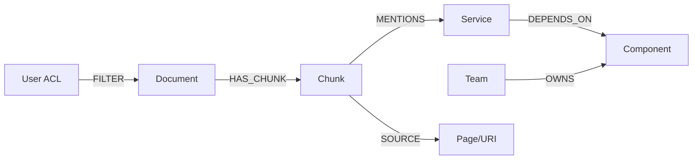
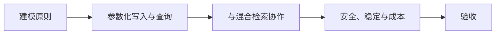

# Neo4j（02） - Neo4j GraphRAG：受控多跳检索与证据回链

> 读完后，你应能：
> - 能验证“向量检索擅长找语义相近 Chunk，知识图谱擅长回答显式关系问题，例如“服务 A 依赖哪些组件，这些组件由谁维护””，并保存输入、输出与失败样本。
> - 能验证“GraphRAG 的价值不是把所有文本变成节点，而是用稳定实体和关系补足多跳结构，再回链到原始证据”，并保存输入、输出与失败样本。
> - 能验证“节点使用 (tenant_id, entity_id) 唯一约束，名称只是可变属性”，并保存输入、输出与失败样本。


向量检索擅长找语义相近 Chunk，知识图谱擅长回答显式关系问题，例如“服务 A 依赖哪些组件，这些组件由谁维护”。GraphRAG 的价值不是把所有文本变成节点，而是用稳定实体和关系补足多跳结构，再回链到原始证据。



<!-- article-progressive-block:start -->
# 一、先建立全局：Neo4j GraphRAG：受控多跳检索与证据回链 是什么？

理解“Neo4j GraphRAG：受控多跳检索与证据回链”，先要把标题中的对象放进同一条处理链：它接收什么输入，经过哪些状态变化，最终用什么证据判断结果。下表不另造概念，只把作者正文已经解释的章节按依赖顺序连起来。

“Neo4j GraphRAG：受控多跳检索与证据回链”的第一个核心判断是：节点使用 (tenant_id, entity_id) 唯一约束，名称只是可变属性。。先弄清这个判断中的对象和输入输出，后面的实现、故障和验收才有共同语境。

| 顺序 | 章节 | 读完本节应抓住的结论 |
| --- | --- | --- |
| 1 | 建模原则 | 节点使用 (tenant_id, entity_id) 唯一约束，名称只是可变属性。 |
| 2 | 参数化写入与查询 | 自然语言应先解析为受控意图和实体 ID，不要让 LLM 直接生成并执行任意 Cypher。 |
| 3 | 与混合检索协作 | 推荐顺序是：BM25/向量召回种子 Chunk → 实体链接 → 有界图扩展 → 取回支持关系的 Chunk → 与原候选融合和 Rerank。 |
| 4 | 安全、稳定与成本 | 所有入口强制租户与 ACL 条件，缓存键包含权限摘要和图谱版本。 |
| 5 | 验收 | 至少准备一跳、两跳、同名实体、跨租户和关系已过期五类问题； |
| 6 | 向量检索擅长找语义相近 Chunk | 向量检索擅长找语义相近 Chunk，知识图谱擅长回答显式关系问题，例如“服务 A 依赖哪些组件，这些组件由谁维护”。 |

## 1.1 核心对象之间怎样衔接



这张图只表达本文的讲解顺序，不替代正文机制。判断“Neo4j GraphRAG：受控多跳检索与证据回链”是否真正掌握，需要能从最后一个结果沿图回到前面每个章节的输入、状态变化和证据。

## 1.2 再看失败：问题最早会出现在哪一步？

在“Neo4j GraphRAG：受控多跳检索与证据回链”的对象和顺序已经明确后，再看可观察的失败：漏召回、排序丢失、引用断链或越权命中。定位时不从最后一条错误猜原因，而是沿上图找第一个偏离正文结论的节点。
<!-- article-progressive-block:end -->

# 二、建模原则

- 节点使用 `(tenant_id, entity_id)` 唯一约束，名称只是可变属性。
- 关系类型使用受控枚举，禁止模型随意创造标签和关系名。
- `Chunk` 保存证据 ID 与摘要，不复制完整附件；原文由对象存储提供。
- 每条实体/关系记录来源 Chunk、抽取模型版本和置信度，低置信关系需要复核。

```cypher
CREATE CONSTRAINT service_identity IF NOT EXISTS
FOR (service:Service)
REQUIRE (service.tenant_id, service.entity_id) IS UNIQUE;

CREATE CONSTRAINT chunk_identity IF NOT EXISTS
FOR (chunk:Chunk)
REQUIRE (chunk.tenant_id, chunk.chunk_id) IS UNIQUE;
```

# 三、参数化写入与查询

```text
# requirements.txt
neo4j>=5,<7
```

```python
from __future__ import annotations

from dataclasses import dataclass

from neo4j import Driver


# 多跳查询允许的最大依赖深度，避免无界遍历。
MAX_GRAPH_DEPTH = 3
# 单次最多返回的证据数量，限制上下文成本。
MAX_EVIDENCE_COUNT = 20


@dataclass(frozen=True)
class GraphSearchContext:
    """保存 GraphRAG 查询所需的可信身份条件。"""

    # 当前租户稳定标识。
    tenant_id: str
    # 用户可访问的权限组。
    acl_groups: tuple[str, ...]


def find_dependency_evidence(
    driver: Driver,
    service_id: str,
    context: GraphSearchContext,
) -> list[dict[str, object]]:
    """查询服务依赖及证据；service_id 是实体 ID，context 是权限上下文。"""

    # Cypher 模板固定关系和深度，模型只能提供经过校验的实体 ID。
    query = f"""
    MATCH (service:Service {{tenant_id: $tenant_id, entity_id: $service_id}})
          -[:DEPENDS_ON*1..{MAX_GRAPH_DEPTH}]->(component:Component)
    MATCH (chunk:Chunk)-[:MENTIONS]->(component)
    MATCH (document:Document)-[:HAS_CHUNK]->(chunk)
    WHERE document.tenant_id = $tenant_id
      AND any(group IN document.acl_groups WHERE group IN $acl_groups)
    OPTIONAL MATCH (team:Team)-[:OWNS]->(component)
    RETURN DISTINCT component.entity_id AS component_id,
           component.name AS component_name,
           team.name AS owner,
           chunk.chunk_id AS chunk_id,
           chunk.source_uri AS source_uri
    LIMIT $limit
    """
    # 参数来自服务端实体解析和鉴权结果，不拼接用户自然语言。
    parameters = {
        "tenant_id": context.tenant_id,
        "service_id": service_id,
        "acl_groups": list(context.acl_groups),
        "limit": MAX_EVIDENCE_COUNT,
    }
    # 结果转换为普通字典，便于与 BM25/向量候选统一融合。
    records, _, _ = driver.execute_query(
        query,
        parameters_=parameters,
        database_="neo4j",
    )
    return [record.data() for record in records]
```

示例为了固定深度把常量插入查询模板；它不是用户输入。自然语言应先解析为受控意图和实体 ID，不要让 LLM 直接生成并执行任意 Cypher。

# 四、与混合检索协作

推荐顺序是：BM25/向量召回种子 Chunk → 实体链接 → 有界图扩展 → 取回支持关系的 Chunk → 与原候选融合和 Rerank。图谱返回“关系”，最终给模型的仍应是有页码、版本和 ACL 的原始证据。

图召回单独评估：实体链接准确率、多跳路径命中率、证据回链率和权限泄漏率。不要只看最终答案，否则无法区分错误来自实体抽取、图关系、证据回链还是生成。

# 五、安全、稳定与成本

- 查询模板白名单化，限制关系类型、深度、返回量和超时；执行只读账号。
- 所有入口强制租户与 ACL 条件，缓存键包含权限摘要和图谱版本。
- 关系抽取只处理对业务有价值的实体类型，控制 LLM 成本和图规模。
- 图数据库不可用时可降级为 BM25 + 向量，但 Trace 明确记录图召回缺失。
- 定期对账孤儿 Chunk、无来源关系、低置信边和已删除文档引用。

# 六、验收

至少准备一跳、两跳、同名实体、跨租户和关系已过期五类问题；每条图路径都能回到可见 Chunk；无界 Cypher 无法执行；索引删除后图节点与关系按版本清理；图召回对最终 Recall 的增益大于其延迟与维护成本。

<!-- article-progressive-block:start -->
# 七、动手验证：先跑通 Neo4j GraphRAG：受控多跳检索与证据回链，再改变一个变量

前面的章节已经建立问题、概念和机制。现在把“Neo4j GraphRAG：受控多跳检索与证据回链”放进同一套基线中运行；本节不再引入新术语，只验证前文结论能否被复现。

## 7.1 基线与候选只允许一个变量不同

验证“Neo4j GraphRAG：受控多跳检索与证据回链”时，先固定查询集、语料快照、权限身份、相关性标注。候选方案只能改变本次要验证的变量；如果同时更换数据、依赖和配置，即使结果改善，也不能知道是哪一项产生作用。

执行“Neo4j GraphRAG：受控多跳检索与证据回链”时，动作是：离线回放检索，保存候选、过滤、排序和引用。原始结果不能只保留截图或汇总分数，必须同步保存：Recall@K、NDCG、引用命中率、无答案误答率、Trace，使下一次复查可以在同一输入上重放。

| 实验要素 | 本文要求 |
| --- | --- |
| 固定条件 | 查询集、语料快照、权限身份、相关性标注 |
| 唯一变量 | 本次候选方案与基线之间的一项明确差异 |
| 原始证据 | Recall@K、NDCG、引用命中率、无答案误答率、Trace |
| 通过阈值 | 证据可回链，指标达基线，权限过滤无泄漏 |
| 立即停止 | 漏召回、排序丢失、引用断链或越权命中 |

## 7.2 执行前先排除不可比较条件

“Neo4j GraphRAG：受控多跳检索与证据回链”开始前先确认下面四项；任一项不成立，都应先修复实验条件，而不是解释结果。

- 基线能够在“Neo4j GraphRAG：受控多跳检索与证据回链”的当前环境重复运行。
- 候选只改变一个与“Neo4j GraphRAG：受控多跳检索与证据回链”结论直接相关的条件。
- “Neo4j GraphRAG：受控多跳检索与证据回链”的基线和候选使用同一批输入、同一版本依赖与同一通过阈值。
- “Neo4j GraphRAG：受控多跳检索与证据回链”的原始输出和失败现场不会被重试、格式化或汇总覆盖。

## 7.3 执行后先核对证据完整性

结果出来后先检查证据，再讨论“Neo4j GraphRAG：受控多跳检索与证据回链”是否通过。缺少中间状态时，最终输出只能说明现象，不能证明机制。

| 检查项 | 当前文章的判定 |
| --- | --- |
| 输入可追溯 | 查询集、语料快照、权限身份、相关性标注 |
| 过程可回放 | 离线回放检索，保存候选、过滤、排序和引用 |
| 结果可审计 | Recall@K、NDCG、引用命中率、无答案误答率、Trace |

“Neo4j GraphRAG：受控多跳检索与证据回链”的一次合格基线对照按以下顺序执行：

1. 保存“Neo4j GraphRAG：受控多跳检索与证据回链”基线版本及输入摘要，确认基线本身可以重复运行。
2. 写下“Neo4j GraphRAG：受控多跳检索与证据回链”候选方案唯一变化的变量，以及它预期影响的指标。
3. 在同一环境执行“Neo4j GraphRAG：受控多跳检索与证据回链”：离线回放检索，保存候选、过滤、排序和引用。
4. 为“Neo4j GraphRAG：受控多跳检索与证据回链”保存：Recall@K、NDCG、引用命中率、无答案误答率、Trace。
5. 使用“Neo4j GraphRAG：受控多跳检索与证据回链”预登记条件判断：证据可回链，指标达基线，权限过滤无泄漏。
6. 如果“Neo4j GraphRAG：受控多跳检索与证据回链”未通过，不修改第二个变量，先恢复基线并保留失败现场。

# 八、用一张矩阵验证 Neo4j GraphRAG：受控多跳检索与证据回链 的关键结论

矩阵按正文顺序列出“Neo4j GraphRAG：受控多跳检索与证据回链”的结论。一次实验只选择一行，只改变这一行对应的条件；不要把多行合并成一个无法归因的大实验。

| 正文章节 | 已解释的结论 | 本轮唯一变量 | 必须保存的证据 |
| --- | --- | --- | --- |
| 建模原则 | 节点使用 (tenant_id, entity_id) 唯一约束，名称只是可变属性。 | 只改变与“建模原则”相关的条件 | Recall@K、NDCG、引用命中率、无答案误答率、Trace |
| 参数化写入与查询 | 自然语言应先解析为受控意图和实体 ID，不要让 LLM 直接生成并执行任意 Cypher。 | 只改变与“参数化写入与查询”相关的条件 | Recall@K、NDCG、引用命中率、无答案误答率、Trace |
| 与混合检索协作 | 推荐顺序是：BM25/向量召回种子 Chunk → 实体链接 → 有界图扩展 → 取回支持关系的 Chunk → 与原候选融合和 Rerank。 | 只改变与“与混合检索协作”相关的条件 | Recall@K、NDCG、引用命中率、无答案误答率、Trace |
| 安全、稳定与成本 | 所有入口强制租户与 ACL 条件，缓存键包含权限摘要和图谱版本。 | 只改变与“安全、稳定与成本”相关的条件 | Recall@K、NDCG、引用命中率、无答案误答率、Trace |
| 验收 | 至少准备一跳、两跳、同名实体、跨租户和关系已过期五类问题； | 只改变与“验收”相关的条件 | Recall@K、NDCG、引用命中率、无答案误答率、Trace |
| 向量检索擅长找语义相近 Chunk | 向量检索擅长找语义相近 Chunk，知识图谱擅长回答显式关系问题，例如“服务 A 依赖哪些组件，这些组件由谁维护”。 | 只改变与“向量检索擅长找语义相近 Chunk”相关的条件 | Recall@K、NDCG、引用命中率、无答案误答率、Trace |

## 8.1 记录本次实际实验

下面的记录用于“Neo4j GraphRAG：受控多跳检索与证据回链”当前这一次实验，不是第二套知识目录。先从矩阵选择一个章节，再填写实际值；没有填写的字段表示尚未验证。

```yaml
topic: "Neo4j GraphRAG：受控多跳检索与证据回链"
selected_chapter: required
claim_from_article: required
baseline_version: required
changed_condition: exactly_one
execution: "离线回放检索，保存候选、过滤、排序和引用"
evidence: "Recall@K、NDCG、引用命中率、无答案误答率、Trace"
pass_when: "证据可回链，指标达基线，权限过滤无泄漏"
stop_when: "漏召回、排序丢失、引用断链或越权命中"
observed_result: required
first_deviation: null_or_evidence
recovery_replay: required_after_failure
```

## 8.2 边界实验必须证明能够停止和恢复

成功路径只能证明“Neo4j GraphRAG：受控多跳检索与证据回链”在当前样本上工作，不能证明它可以进入生产。边界实验需要主动制造：漏召回、排序丢失、引用断链或越权命中，并观察系统是否在产生不可逆副作用前停止。

| 场景 | 只改变什么 | 应保存什么 | 通过标准 |
| --- | --- | --- | --- |
| 正常路径 | 使用已知有效输入 | Recall@K、NDCG、引用命中率、无答案误答率、Trace | 证据可回链，指标达基线，权限过滤无泄漏 |
| 边界路径 | 把一个输入推进到约束临界值 | 临界值前后的输出与指标 | 不静默降级，不把部分结果冒充成功 |
| 明确失败 | 注入：漏召回、排序丢失、引用断链或越权命中 | 原始错误、首个异常阶段和最终状态 | 失败被正确分类且没有扩大副作用 |
| 恢复重放 | 执行：定位解析、召回、过滤、排序或生成阶段，回滚对应版本 | 原失败样本的复测证据 | 原样本恢复，正常样本没有回归 |

恢复动作不是简单重启。对于“Neo4j GraphRAG：受控多跳检索与证据回链”，第一步是：定位解析、召回、过滤、排序或生成阶段，回滚对应版本。完成后使用原始失败样本复测；只验证一个新样本成功，不能证明触发条件已经消失。

“Neo4j GraphRAG：受控多跳检索与证据回链”边界实验结束后，应把正常、临界、失败和恢复四类记录放在同一个运行批次中。这样才能区分“候选方案真的修复问题”和“环境变化让问题暂时没有出现”。

# 九、Neo4j GraphRAG：受控多跳检索与证据回链 的结果解释

解释“Neo4j GraphRAG：受控多跳检索与证据回链”实验时先看首个偏差，而不是最后一条错误。最后的异常通常只是上游状态错误的结果；从末端反推容易误把症状当根因。

| 观察结果 | 可以支持的判断 | 下一步 |
| --- | --- | --- |
| 主链路没有达到预期 | 漏召回、排序丢失、引用断链或越权命中 | 先执行：定位解析、召回、过滤、排序或生成阶段，回滚对应版本 |
| 异常链路无法恢复 | 漏召回、排序丢失、引用断链或越权命中 | 先执行：定位解析、召回、过滤、排序或生成阶段，回滚对应版本 |
| 新样本成功但原样本仍失败 | 修复没有覆盖原始触发条件 | 固定原失败输入，恢复基线后重新比较 |
| 指标改善但证据无法回链 | 数据、版本或中间状态没有固定 | 暂停发布，补齐可追溯记录后重跑 |

“Neo4j GraphRAG：受控多跳检索与证据回链”只有同时满足“证据可回链，指标达基线，权限过滤无泄漏”，并且没有出现“漏召回、排序丢失、引用断链或越权命中”，才可以认为主链路通过。这里的“通过”只对当前固定版本、样本和环境有效，不能外推到尚未测试的容量、权限或数据分布。

如果“Neo4j GraphRAG：受控多跳检索与证据回链”候选方案与基线差异很小，先检查证据分辨率是否足够；如果差异很大，先排除数据泄漏、环境漂移和版本不一致。两种情况都不能只看一个汇总均值，需要回到逐样本输出和中间状态。

“Neo4j GraphRAG：受控多跳检索与证据回链”故障定位完成后，记录“现象、首个偏差、根因、改动、原样本复测”五项。缺少原样本复测时，只能标记为待观察，不能标记为已解决。

# 十、Neo4j GraphRAG：受控多跳检索与证据回链 的发布判断

发布判断需要把“Neo4j GraphRAG：受控多跳检索与证据回链”的质量、失败边界和恢复能力放在同一份记录中。以下任一条件缺失，都应停止扩量，而不是用“基本正常”替代证据。

- [ ] “Neo4j GraphRAG：受控多跳检索与证据回链”的基线与候选只存在一个计划内变量。
- [ ] “Neo4j GraphRAG：受控多跳检索与证据回链”的输入、代码、依赖、配置和数据版本可以追溯。
- [ ] “Neo4j GraphRAG：受控多跳检索与证据回链”的正常、临界、失败和恢复样本使用同一套断言。
- [ ] “Neo4j GraphRAG：受控多跳检索与证据回链”的原始输出、中间状态和失败现场已经保留。
- [ ] “Neo4j GraphRAG：受控多跳检索与证据回链”的日志、Trace、截图和测试数据已经脱敏。
- [ ] “Neo4j GraphRAG：受控多跳检索与证据回链”的停止条件、负责人和回滚入口已经演练。
- [ ] “Neo4j GraphRAG：受控多跳检索与证据回链”尚未覆盖的输入、权限、容量和外部依赖已经登记。

最终记录至少包含基线版本、唯一变量、原始证据、首个偏差、恢复复测和发布责任人。没有参与本次修改的人如果不能据此重放“Neo4j GraphRAG：受控多跳检索与证据回链”的判断，就不能发布。
<!-- article-progressive-block:end -->

# 十一、总结

- **建模原则**：节点使用 (tenant_id, entity_id) 唯一约束，名称只是可变属性。
- **参数化写入与查询**：自然语言应先解析为受控意图和实体 ID，不要让 LLM 直接生成并执行任意 Cypher。
- **与混合检索协作**：推荐顺序是：BM25/向量召回种子 Chunk → 实体链接 → 有界图扩展 → 取回支持关系的 Chunk → 与原候选融合和 Rerank。
- **安全、稳定与成本**：所有入口强制租户与 ACL 条件，缓存键包含权限摘要和图谱版本。
- **验收**：至少准备一跳、两跳、同名实体、跨租户和关系已过期五类问题；

## 参考资料

- [Neo4j Cypher Manual](https://neo4j.com/docs/cypher-manual/current/)
- [Neo4j GraphRAG Python Package](https://neo4j.com/docs/neo4j-graphrag-python/current/)
