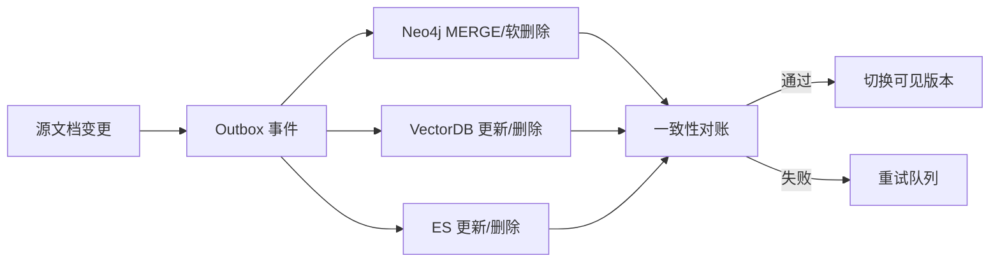
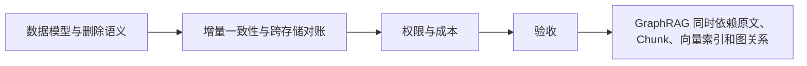

# Neo4j（03） - Neo4j 增量更新与安全删除：保持 GraphRAG 一致

> 读完后，你应能：
> - 能验证“GraphRAG 同时依赖原文、Chunk、向量索引和图关系”，并保存输入、输出与失败样本。
> - 能验证“直接执行 DETACH DELETE 虽然能删节点，却可能留下向量库孤儿记录、缓存旧答案和无法审计的数据空洞”，并保存输入、输出与失败样本。
> - 能验证“生产更新要围绕稳定 ID、版本和可重试事件设计”，并保存输入、输出与失败样本。


GraphRAG 同时依赖原文、Chunk、向量索引和图关系。直接执行 `DETACH DELETE` 虽然能删节点，却可能留下向量库孤儿记录、缓存旧答案和无法审计的数据空洞。生产更新要围绕稳定 ID、版本和可重试事件设计。



<!-- article-progressive-block:start -->
# 一、先建立全局：Neo4j 增量更新与安全删除：保持 GraphRAG 一致 是什么？

理解“Neo4j 增量更新与安全删除：保持 GraphRAG 一致”，先要把标题中的对象放进同一条处理链：它接收什么输入，经过哪些状态变化，最终用什么证据判断结果。下表不另造概念，只把作者正文已经解释的章节按依赖顺序连起来。

“Neo4j 增量更新与安全删除：保持 GraphRAG 一致”的第一个核心判断是：version 用于拒绝乱序事件；。先弄清这个判断中的对象和输入输出，后面的实现、故障和验收才有共同语境。

| 顺序 | 章节 | 读完本节应抓住的结论 |
| --- | --- | --- |
| 1 | 数据模型与删除语义 | version 用于拒绝乱序事件； |
| 2 | 增量一致性与跨存储对账 | 任何一步失败都可依据墓碑重试。 |
| 3 | 权限与成本 | 图中保留实体与关系，Chunk 通过稳定 ID 回链，可显著降低存储和遍历成本。 |
| 4 | 验收 | 对账失败可定位到具体 document_id 和索引版本。 |
| 5 | GraphRAG 同时依赖原文、Chunk、向量索引和图关系 | GraphRAG 同时依赖原文、Chunk、向量索引和图关系。 |
| 6 | 直接执行 DETACH DELETE 虽然能删节点 | 直接执行 DETACH DELETE 虽然能删节点，却可能留下向量库孤儿记录、缓存旧答案和无法审计的数据空洞。 |

## 1.1 核心对象之间怎样衔接



这张图只表达本文的讲解顺序，不替代正文机制。判断“Neo4j 增量更新与安全删除：保持 GraphRAG 一致”是否真正掌握，需要能从最后一个结果沿图回到前面每个章节的输入、状态变化和证据。

## 1.2 再看失败：问题最早会出现在哪一步？

在“Neo4j 增量更新与安全删除：保持 GraphRAG 一致”的对象和顺序已经明确后，再看可观察的失败：漏召回、排序丢失、引用断链或越权命中。定位时不从最后一条错误猜原因，而是沿上图找第一个偏离正文结论的节点。
<!-- article-progressive-block:end -->

# 二、数据模型与删除语义

- `document_id`、`entity_id` 使用业务稳定 ID，不依赖 Neo4j 内部节点 ID。
- `version` 用于拒绝乱序事件；`updated_at` 用于审计，不代替版本比较。
- 用户删除默认写入 `deleted_at` 形成墓碑；完成下游清理并超过恢复窗口后再物理删除。
- 权限关系变化也要发布事件，因为图谱、ES 和向量库都保存可见性字段。

# 三、可运行的幂等写入

```text
# requirements.txt
neo4j>=5,<7
```

```python
from __future__ import annotations

import os
from dataclasses import dataclass

from neo4j import Driver, GraphDatabase


# Neo4j 连接配置从环境变量加载，生产环境应使用 Secret 管理。
NEO4J_URI = os.getenv("NEO4J_URI", "neo4j://localhost:7687")
# 数据库用户名只用于当前示例连接。
NEO4J_USER = os.getenv("NEO4J_USER", "neo4j")
# 密码没有安全默认值，缺失时立即失败。
NEO4J_PASSWORD = os.environ["NEO4J_PASSWORD"]


@dataclass(frozen=True)
class EntityEvent:
    """保存实体变更事件；version 保证重复和乱序消费安全。"""

    # 业务域内稳定实体 ID。
    entity_id: str
    # 当前租户 ID，用于查询过滤和隔离。
    tenant_id: str
    # 实体显示名称。
    name: str
    # 单调递增的源数据版本。
    version: int
    # 是否为删除事件。
    deleted: bool


def apply_entity_event(driver: Driver, event: EntityEvent) -> None:
    """幂等应用实体事件；driver 是连接池，event 是源系统变更。"""

    # 参数化 Cypher 避免拼接注入，并只接受更新版本大于现有版本的事件。
    query = """
    MERGE (entity:Entity {tenant_id: $tenant_id, entity_id: $entity_id})
    ON CREATE SET entity.version = -1
    WITH entity
    WHERE $version > entity.version
    SET entity.name = $name,
        entity.version = $version,
        entity.deleted_at = CASE WHEN $deleted THEN datetime() ELSE null END
    RETURN entity.entity_id AS entity_id
    """
    # 当前事件参数与 Cypher 字段一一对应。
    parameters = {
        "tenant_id": event.tenant_id,
        "entity_id": event.entity_id,
        "name": event.name,
        "version": event.version,
        "deleted": event.deleted,
    }
    driver.execute_query(query, parameters_=parameters, database_="neo4j")


def main() -> None:
    """创建驱动并写入一条示例事件。"""

    # 驱动内部维护连接池，应用生命周期内应复用。
    driver = GraphDatabase.driver(NEO4J_URI, auth=(NEO4J_USER, NEO4J_PASSWORD))
    try:
        # 示例事件可重复执行，第二次不会造成重复节点。
        event = EntityEvent("product-42", "tenant-a", "知识库产品", 3, False)
        apply_entity_event(driver, event)
    finally:
        driver.close()


if __name__ == "__main__":
    main()
```

首次部署先创建唯一约束：

```cypher
CREATE CONSTRAINT entity_tenant_id_unique IF NOT EXISTS
FOR (entity:Entity)
REQUIRE (entity.tenant_id, entity.entity_id) IS UNIQUE;
```

# 四、增量一致性与跨存储对账

Neo4j、ES、VectorDB 无法共享普通 ACID 事务。推荐源库事务内同时写 Outbox，消费者分别更新三套索引，每个消费者以 `event_id` 去重，以 `version` 抵御乱序。后台对账任务比较每个版本的文档数、Chunk 数、实体数和内容哈希；未通过前不切换读别名。

物理清理顺序可采用：停止新引用 → 写墓碑并从查询中过滤 → 删除 ES/向量 Chunk → 删除图关系和节点 → 清缓存 → 写审计完成事件。任何一步失败都可依据墓碑重试。

# 五、权限与成本

- 所有节点和关系都携带 `tenant_id`，查询入口强制注入租户条件；不能依赖调用者记得写。
- 高敏实体可只保存脱敏摘要，原文保留在受控对象存储。
- 不要把所有 Chunk 都复制成图节点。图中保留实体与关系，Chunk 通过稳定 ID 回链，可显著降低存储和遍历成本。
- 对深度、返回节点数和查询超时设上限，避免模型生成无界 Cypher。

# 六、验收

重复事件不产生重复节点；乱序旧版本不覆盖新版本；删除后图、ES、向量库和缓存均不可命中；跨租户查询返回零条；对账失败可定位到具体 `document_id` 和索引版本。

<!-- article-progressive-block:start -->
# 七、动手验证：先跑通 Neo4j 增量更新与安全删除：保持 GraphRAG 一致，再改变一个变量

前面的章节已经建立问题、概念和机制。现在把“Neo4j 增量更新与安全删除：保持 GraphRAG 一致”放进同一套基线中运行；本节不再引入新术语，只验证前文结论能否被复现。

## 7.1 基线与候选只允许一个变量不同

验证“Neo4j 增量更新与安全删除：保持 GraphRAG 一致”时，先固定查询集、语料快照、权限身份、相关性标注。候选方案只能改变本次要验证的变量；如果同时更换数据、依赖和配置，即使结果改善，也不能知道是哪一项产生作用。

执行“Neo4j 增量更新与安全删除：保持 GraphRAG 一致”时，动作是：离线回放检索，保存候选、过滤、排序和引用。原始结果不能只保留截图或汇总分数，必须同步保存：Recall@K、NDCG、引用命中率、无答案误答率、Trace，使下一次复查可以在同一输入上重放。

| 实验要素 | 本文要求 |
| --- | --- |
| 固定条件 | 查询集、语料快照、权限身份、相关性标注 |
| 唯一变量 | 本次候选方案与基线之间的一项明确差异 |
| 原始证据 | Recall@K、NDCG、引用命中率、无答案误答率、Trace |
| 通过阈值 | 证据可回链，指标达基线，权限过滤无泄漏 |
| 立即停止 | 漏召回、排序丢失、引用断链或越权命中 |

## 7.2 执行前先排除不可比较条件

“Neo4j 增量更新与安全删除：保持 GraphRAG 一致”开始前先确认下面四项；任一项不成立，都应先修复实验条件，而不是解释结果。

- 基线能够在“Neo4j 增量更新与安全删除：保持 GraphRAG 一致”的当前环境重复运行。
- 候选只改变一个与“Neo4j 增量更新与安全删除：保持 GraphRAG 一致”结论直接相关的条件。
- “Neo4j 增量更新与安全删除：保持 GraphRAG 一致”的基线和候选使用同一批输入、同一版本依赖与同一通过阈值。
- “Neo4j 增量更新与安全删除：保持 GraphRAG 一致”的原始输出和失败现场不会被重试、格式化或汇总覆盖。

## 7.3 执行后先核对证据完整性

结果出来后先检查证据，再讨论“Neo4j 增量更新与安全删除：保持 GraphRAG 一致”是否通过。缺少中间状态时，最终输出只能说明现象，不能证明机制。

| 检查项 | 当前文章的判定 |
| --- | --- |
| 输入可追溯 | 查询集、语料快照、权限身份、相关性标注 |
| 过程可回放 | 离线回放检索，保存候选、过滤、排序和引用 |
| 结果可审计 | Recall@K、NDCG、引用命中率、无答案误答率、Trace |

“Neo4j 增量更新与安全删除：保持 GraphRAG 一致”的一次合格基线对照按以下顺序执行：

1. 保存“Neo4j 增量更新与安全删除：保持 GraphRAG 一致”基线版本及输入摘要，确认基线本身可以重复运行。
2. 写下“Neo4j 增量更新与安全删除：保持 GraphRAG 一致”候选方案唯一变化的变量，以及它预期影响的指标。
3. 在同一环境执行“Neo4j 增量更新与安全删除：保持 GraphRAG 一致”：离线回放检索，保存候选、过滤、排序和引用。
4. 为“Neo4j 增量更新与安全删除：保持 GraphRAG 一致”保存：Recall@K、NDCG、引用命中率、无答案误答率、Trace。
5. 使用“Neo4j 增量更新与安全删除：保持 GraphRAG 一致”预登记条件判断：证据可回链，指标达基线，权限过滤无泄漏。
6. 如果“Neo4j 增量更新与安全删除：保持 GraphRAG 一致”未通过，不修改第二个变量，先恢复基线并保留失败现场。

# 八、用一张矩阵验证 Neo4j 增量更新与安全删除：保持 GraphRAG 一致 的关键结论

矩阵按正文顺序列出“Neo4j 增量更新与安全删除：保持 GraphRAG 一致”的结论。一次实验只选择一行，只改变这一行对应的条件；不要把多行合并成一个无法归因的大实验。

| 正文章节 | 已解释的结论 | 本轮唯一变量 | 必须保存的证据 |
| --- | --- | --- | --- |
| 数据模型与删除语义 | version 用于拒绝乱序事件； | 只改变与“数据模型与删除语义”相关的条件 | Recall@K、NDCG、引用命中率、无答案误答率、Trace |
| 增量一致性与跨存储对账 | 任何一步失败都可依据墓碑重试。 | 只改变与“增量一致性与跨存储对账”相关的条件 | Recall@K、NDCG、引用命中率、无答案误答率、Trace |
| 权限与成本 | 图中保留实体与关系，Chunk 通过稳定 ID 回链，可显著降低存储和遍历成本。 | 只改变与“权限与成本”相关的条件 | Recall@K、NDCG、引用命中率、无答案误答率、Trace |
| 验收 | 对账失败可定位到具体 document_id 和索引版本。 | 只改变与“验收”相关的条件 | Recall@K、NDCG、引用命中率、无答案误答率、Trace |
| GraphRAG 同时依赖原文、Chunk、向量索引和图关系 | GraphRAG 同时依赖原文、Chunk、向量索引和图关系。 | 只改变与“GraphRAG 同时依赖原文、Chunk、向量索引和图关系”相关的条件 | Recall@K、NDCG、引用命中率、无答案误答率、Trace |
| 直接执行 DETACH DELETE 虽然能删节点 | 直接执行 DETACH DELETE 虽然能删节点，却可能留下向量库孤儿记录、缓存旧答案和无法审计的数据空洞。 | 只改变与“直接执行 DETACH DELETE 虽然能删节点”相关的条件 | Recall@K、NDCG、引用命中率、无答案误答率、Trace |

## 8.1 记录本次实际实验

下面的记录用于“Neo4j 增量更新与安全删除：保持 GraphRAG 一致”当前这一次实验，不是第二套知识目录。先从矩阵选择一个章节，再填写实际值；没有填写的字段表示尚未验证。

```yaml
topic: "Neo4j 增量更新与安全删除：保持 GraphRAG 一致"
selected_chapter: required
claim_from_article: required
baseline_version: required
changed_condition: exactly_one
execution: "离线回放检索，保存候选、过滤、排序和引用"
evidence: "Recall@K、NDCG、引用命中率、无答案误答率、Trace"
pass_when: "证据可回链，指标达基线，权限过滤无泄漏"
stop_when: "漏召回、排序丢失、引用断链或越权命中"
observed_result: required
first_deviation: null_or_evidence
recovery_replay: required_after_failure
```

## 8.2 边界实验必须证明能够停止和恢复

成功路径只能证明“Neo4j 增量更新与安全删除：保持 GraphRAG 一致”在当前样本上工作，不能证明它可以进入生产。边界实验需要主动制造：漏召回、排序丢失、引用断链或越权命中，并观察系统是否在产生不可逆副作用前停止。

| 场景 | 只改变什么 | 应保存什么 | 通过标准 |
| --- | --- | --- | --- |
| 正常路径 | 使用已知有效输入 | Recall@K、NDCG、引用命中率、无答案误答率、Trace | 证据可回链，指标达基线，权限过滤无泄漏 |
| 边界路径 | 把一个输入推进到约束临界值 | 临界值前后的输出与指标 | 不静默降级，不把部分结果冒充成功 |
| 明确失败 | 注入：漏召回、排序丢失、引用断链或越权命中 | 原始错误、首个异常阶段和最终状态 | 失败被正确分类且没有扩大副作用 |
| 恢复重放 | 执行：定位解析、召回、过滤、排序或生成阶段，回滚对应版本 | 原失败样本的复测证据 | 原样本恢复，正常样本没有回归 |

恢复动作不是简单重启。对于“Neo4j 增量更新与安全删除：保持 GraphRAG 一致”，第一步是：定位解析、召回、过滤、排序或生成阶段，回滚对应版本。完成后使用原始失败样本复测；只验证一个新样本成功，不能证明触发条件已经消失。

“Neo4j 增量更新与安全删除：保持 GraphRAG 一致”边界实验结束后，应把正常、临界、失败和恢复四类记录放在同一个运行批次中。这样才能区分“候选方案真的修复问题”和“环境变化让问题暂时没有出现”。

# 九、Neo4j 增量更新与安全删除：保持 GraphRAG 一致 的结果解释

解释“Neo4j 增量更新与安全删除：保持 GraphRAG 一致”实验时先看首个偏差，而不是最后一条错误。最后的异常通常只是上游状态错误的结果；从末端反推容易误把症状当根因。

| 观察结果 | 可以支持的判断 | 下一步 |
| --- | --- | --- |
| 主链路没有达到预期 | 漏召回、排序丢失、引用断链或越权命中 | 先执行：定位解析、召回、过滤、排序或生成阶段，回滚对应版本 |
| 异常链路无法恢复 | 漏召回、排序丢失、引用断链或越权命中 | 先执行：定位解析、召回、过滤、排序或生成阶段，回滚对应版本 |
| 新样本成功但原样本仍失败 | 修复没有覆盖原始触发条件 | 固定原失败输入，恢复基线后重新比较 |
| 指标改善但证据无法回链 | 数据、版本或中间状态没有固定 | 暂停发布，补齐可追溯记录后重跑 |

“Neo4j 增量更新与安全删除：保持 GraphRAG 一致”只有同时满足“证据可回链，指标达基线，权限过滤无泄漏”，并且没有出现“漏召回、排序丢失、引用断链或越权命中”，才可以认为主链路通过。这里的“通过”只对当前固定版本、样本和环境有效，不能外推到尚未测试的容量、权限或数据分布。

如果“Neo4j 增量更新与安全删除：保持 GraphRAG 一致”候选方案与基线差异很小，先检查证据分辨率是否足够；如果差异很大，先排除数据泄漏、环境漂移和版本不一致。两种情况都不能只看一个汇总均值，需要回到逐样本输出和中间状态。

“Neo4j 增量更新与安全删除：保持 GraphRAG 一致”故障定位完成后，记录“现象、首个偏差、根因、改动、原样本复测”五项。缺少原样本复测时，只能标记为待观察，不能标记为已解决。

# 十、Neo4j 增量更新与安全删除：保持 GraphRAG 一致 的发布判断

发布判断需要把“Neo4j 增量更新与安全删除：保持 GraphRAG 一致”的质量、失败边界和恢复能力放在同一份记录中。以下任一条件缺失，都应停止扩量，而不是用“基本正常”替代证据。

- [ ] “Neo4j 增量更新与安全删除：保持 GraphRAG 一致”的基线与候选只存在一个计划内变量。
- [ ] “Neo4j 增量更新与安全删除：保持 GraphRAG 一致”的输入、代码、依赖、配置和数据版本可以追溯。
- [ ] “Neo4j 增量更新与安全删除：保持 GraphRAG 一致”的正常、临界、失败和恢复样本使用同一套断言。
- [ ] “Neo4j 增量更新与安全删除：保持 GraphRAG 一致”的原始输出、中间状态和失败现场已经保留。
- [ ] “Neo4j 增量更新与安全删除：保持 GraphRAG 一致”的日志、Trace、截图和测试数据已经脱敏。
- [ ] “Neo4j 增量更新与安全删除：保持 GraphRAG 一致”的停止条件、负责人和回滚入口已经演练。
- [ ] “Neo4j 增量更新与安全删除：保持 GraphRAG 一致”尚未覆盖的输入、权限、容量和外部依赖已经登记。

最终记录至少包含基线版本、唯一变量、原始证据、首个偏差、恢复复测和发布责任人。没有参与本次修改的人如果不能据此重放“Neo4j 增量更新与安全删除：保持 GraphRAG 一致”的判断，就不能发布。
<!-- article-progressive-block:end -->

# 十一、总结

- **数据模型与删除语义**：version 用于拒绝乱序事件；
- **可运行的幂等写入**：首次部署先创建唯一约束：
- **跨存储一致性**：任何一步失败都可依据墓碑重试。
- **权限与成本**：图中保留实体与关系，Chunk 通过稳定 ID 回链，可显著降低存储和遍历成本。
- **验收**：对账失败可定位到具体 document_id 和索引版本。

## 参考资料

- [Neo4j Cypher Manual：MERGE](https://neo4j.com/docs/cypher-manual/current/clauses/merge/)
- [Neo4j Operations Manual：Backup and Restore](https://neo4j.com/docs/operations-manual/current/backup-restore/)
