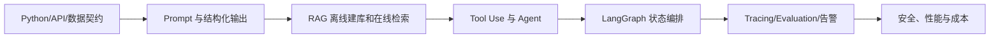

# 01 - 工程基础：AI 大模型应用开发路线

> 主分类：工程基础；关联标签：Prompt、RAG 优化、推理加速、安全合规

这条路线面向应用工程师，目标不是背框架 API，而是能交付一个可评测、可观测、可控成本且权限可靠的 AI 系统。学习顺序按依赖关系安排：先建立模型与接口契约，再完成 RAG，随后进入 Agent、状态编排和生产治理。

> DIAGRAM_DESCRIPTION：学习路线图必须包含工程语言与 API、Prompt/结构化输出、RAG、Agent、LangGraph、可观测评测和生产治理，并体现从基础契约到上线验收的依赖顺序。

## 一、先建立工程底座

学习 Python 3.10+ 类型系统、异步 I/O、HTTP/SSE、配置与 Secret、结构化日志和测试。最低产物是一个后端持有 API Key、能流式返回结构化事件、具备超时和取消能力的模型代理接口。

验收问题：请求能否追踪到 `trace_id`；上游断开后模型调用是否取消；错误是否区分限流、超时、鉴权和模型拒绝；密钥是否从未进入浏览器或日志。

## 二、Prompt 与模型接口

重点不是“提示词技巧大全”，而是输入输出契约：系统规则、用户数据、工具定义、结构化输出、重试边界和 Prompt Injection 防护。先用 JSON Schema 或 Pydantic 校验模型输出，再接业务写操作。

验收问题：非法枚举和缺字段是否被拒绝；资料区的指令能否覆盖系统规则；重试是否会重复执行有副作用的工具；Prompt、模型和参数版本能否回放。

## 三、RAG 主线

按以下顺序学习：解析与清洗 → 结构化 Chunk → Embedding 选型 → VectorDB → ES/BM25 → 混合检索 → Rerank → Context Packing → 引用校验 → Evaluation。先完成完全离线的小数据集建库与 Top-K，再连接生成模型。

不要把最终答案正确率当唯一指标。解析、切分、索引、召回、重排和生成分别需要金标样本与指标，权限隔离问题、不可回答问题和恶意文档必须进入回归集。

## 四、Agent 与状态编排

单 Agent 先掌握 Tool Schema、ReAct、终止条件、幂等与审计；多 Agent 只在角色权限、上下文隔离或并行收益明确时使用。需要循环、暂停恢复、人工审批和长任务时进入 LangGraph；普通顺序流水线不必强行图化。

验收问题：工具参数是否由服务端二次校验；写操作是否要求审批或幂等键；循环是否有步数与成本上限；中断后能否从 checkpoint 恢复；多 Agent 是否比单 Agent 在同一评测集上有可量化增益。

## 五、观测、评测与上线

LangSmith/LangFuse Trace 记录请求、检索候选、工具调用、模型版本、Token 和分阶段耗时，但敏感正文应脱敏或只保存受控引用。上线采用离线评测、影子流量、小流量和回滚门禁，不用单次手工试问代替验收。

生产最低指标：

| 维度 | 指标示例 | 失败动作 |
| --- | --- | --- |
| 质量 | Recall@K、引用准确率、拒答准确率 | 阻止索引/模型发布 |
| 安全 | 越权命中率、注入成功率、删除传播时延 | 立即回滚并审计 |
| 稳定性 | P95、超时率、降级率、队列积压 | 限流、降级或熔断 |
| 成本 | 单问 Token、Embedding 重建成本、缓存命中率 | 调整候选和模型路由 |

## 六、推荐阅读顺序

1. 工程基础：模型调用、结构化输出、流式接口、数据与部署。
2. 企业级知识库：离线建库、Embedding、VectorDB、ES/BM25、在线问答和排障。
3. LangChain 实战：LCEL、Retrieval、Memory 与 Callback。
4. Agent 工程：Tool Use、ReAct、MCP 和 Multi-Agent。
5. LangGraph：状态、循环、持久化与 HIL。
6. LangSmith/LangFuse：Tracing、Evaluation、监控和告警。
7. 面试题：用系统设计题和坏案例检验能否解释取舍，而不是只背定义。

## 七、完成标准

最终项目应能展示一次完整 Trace：文档如何入库、问题如何过滤权限、BM25/向量各召回什么、为何这样融合、模型引用哪些证据、无证据时为何拒答、一次请求花费多少。只做到“能聊天”不算完成。
