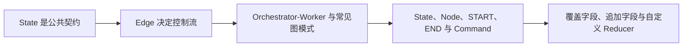

# LangGraph（02） - LangGraph 状态、Reducer 与路由模式

> 读完后，你应能完成以下任务：
> - 绘制“LangGraph（02） - LangGraph 状态、Reducer 与路由模式 / State 是公共契约”的关键对象与数据流，解释“原始输入、派生结果、错误和控制字段应分开，避免某个节点修改无关字段。”，并用源码位置、日志或 Trace 标注证据。
> - 为“LangGraph（02） - LangGraph 状态、Reducer 与路由模式 / Edge 决定控制流”设计正常与异常输入，验证“Static Edge 用于确定性顺序；”，输出首个偏差位置与回归测试结果。
> - 实现“LangGraph（02） - LangGraph 状态、Reducer 与路由模式 / Orchestrator-Worker 与常见图模式”的最小代码或配置，检验“Orchestrator-Worker 适合任务数量需要运行时决定、各子任务可以隔离执行并由统一节点汇总的场景。”，输出命令、结果与 Diff，并说明不适用边界。

> LangGraph 的核心不是画流程图，而是把状态更新、并行合并和路由条件写成可验证的契约。


## 核心知识清单

- State、Node、START、END 与 Command
- 覆盖字段、追加字段与自定义 Reducer
- Static Edge、Conditional Edge 与循环
- Parallel Fan-out/Fan-in 与并行 Reducer
- Orchestrator-Worker、Send 与动态任务
- 路由枚举、递归上限与终止条件

<!-- article-progressive-block:start -->
# 一、先建立全局：LangGraph 状态、Reducer 与路由模式 是什么？

理解“LangGraph 状态、Reducer 与路由模式”，先要把标题中的对象放进同一条处理链：它接收什么输入，经过哪些状态变化，最终用什么证据判断结果。下表不另造概念，只把作者正文已经解释的章节按依赖顺序连起来。

“LangGraph 状态、Reducer 与路由模式”的第一个核心判断是：原始输入、派生结果、错误和控制字段应分开，避免某个节点修改无关字段。。先弄清这个判断中的对象和输入输出，后面的实现、故障和验收才有共同语境。

| 顺序 | 章节 | 读完本节应抓住的结论 |
| --- | --- | --- |
| 1 | State 是公共契约 | 原始输入、派生结果、错误和控制字段应分开，避免某个节点修改无关字段。 |
| 2 | Edge 决定控制流 | Static Edge 用于确定性顺序； |
| 3 | Orchestrator-Worker 与常见图模式 | Orchestrator-Worker 适合任务数量需要运行时决定、各子任务可以隔离执行并由统一节点汇总的场景。 |
| 4 | State、Node、START、END 与 Command | # 二、State 是公共契约 |
| 5 | 覆盖字段、追加字段与自定义 Reducer | 并行分支同时写同一字段时必须定义 Reducer：列表结果可追加， |
| 6 | Static Edge、Conditional Edge 与循环 | Static Edge 用于确定性顺序； |

## 1.1 核心对象之间怎样衔接



这张图只表达本文的讲解顺序，不替代正文机制。判断“LangGraph 状态、Reducer 与路由模式”是否真正掌握，需要能从最后一个结果沿图回到前面每个章节的输入、状态变化和证据。

## 1.2 再看失败：问题最早会出现在哪一步？

在“LangGraph 状态、Reducer 与路由模式”的对象和顺序已经明确后，再看可观察的失败：文本直通执行、状态不可重放或重试重复写入。定位时不从最后一条错误猜原因，而是沿上图找第一个偏离正文结论的节点。
<!-- article-progressive-block:end -->

# 二、State 是公共契约

State 只保存跨节点需要的数据。
原始输入、派生结果、错误和控制字段应分开，避免某个节点修改无关字段。
Node 接收当前 State 并返回局部更新，不应依赖隐藏全局变量。

并行分支同时写同一字段时必须定义 Reducer：列表结果可追加，
计数可求和，
唯一结果应拒绝冲突。
默认覆盖适合单写者字段；
没有 Reducer 的并行写入会产生不确定或运行错误。

# 三、Edge 决定控制流

Static Edge 用于确定性顺序；
Conditional Edge 的路由函数返回受控枚举，不能让模型自由生成节点名。
循环必须同时具备成功条件、可恢复失败条件、最大轮次和预算条件。

```python
from typing import Annotated, TypedDict
import operator


class ResearchState(TypedDict):
    """保存调研图中可并行合并的状态。"""

    question: str
    findings: Annotated[list[str], operator.add]
    attempts: int


def route_after_search(state: ResearchState) -> str:
    """根据证据数量选择生成答案或继续检索。"""

    if len(state["findings"]) >= 2:
        return "answer"
    return "search"
```

# 四、Orchestrator-Worker 与常见图模式

- Fan-out/Fan-in：并行搜索多个来源，再由 Reducer 汇总。
- Orchestrator-Worker：规划器动态产生任务，Worker 独立执行，综合节点验收。
- Evaluator-Optimizer：生成、确定性校验、有限次数修订。
- Router：一次分类进入专用子图，不需要完整 Agent Loop。

Orchestrator-Worker 适合任务数量需要运行时决定、各子任务可以隔离执行并由统一节点汇总的场景。
Orchestrator-Worker 必须限制最大 Worker 数、单任务预算和失败策略，
综合节点还要验证覆盖率与重复结果，
不能只拼接所有输出。

每个节点应单测输入输出，每条 Edge 应覆盖正常、边界和终止路径。
图级测试使用伪模型和伪 Tool，避免把网络随机性误认为路由正确性。

<!-- article-progressive-block:start -->
# 五、动手验证：先跑通 LangGraph 状态、Reducer 与路由模式，再改变一个变量

前面的章节已经建立问题、概念和机制。现在把“LangGraph 状态、Reducer 与路由模式”放进同一套基线中运行；本节不再引入新术语，只验证前文结论能否被复现。

## 5.1 基线与候选只允许一个变量不同

验证“LangGraph 状态、Reducer 与路由模式”时，先固定工具 Schema、身份、畸形参数、超时和重复请求。候选方案只能改变本次要验证的变量；如果同时更换数据、依赖和配置，即使结果改善，也不能知道是哪一项产生作用。

执行“LangGraph 状态、Reducer 与路由模式”时，动作是：回放决策到执行链路，覆盖失败、重试、暂停和恢复。原始结果不能只保留截图或汇总分数，必须同步保存：模型提议、校验、授权、幂等键、状态迁移、Trace，使下一次复查可以在同一输入上重放。

| 实验要素 | 本文要求 |
| --- | --- |
| 固定条件 | 工具 Schema、身份、畸形参数、超时和重复请求 |
| 唯一变量 | 本次候选方案与基线之间的一项明确差异 |
| 原始证据 | 模型提议、校验、授权、幂等键、状态迁移、Trace |
| 通过阈值 | 模型只提议；执行受代码约束；失败不重复副作用 |
| 立即停止 | 文本直通执行、状态不可重放或重试重复写入 |

## 5.2 执行前先排除不可比较条件

“LangGraph 状态、Reducer 与路由模式”开始前先确认下面四项；任一项不成立，都应先修复实验条件，而不是解释结果。

- 基线能够在“LangGraph 状态、Reducer 与路由模式”的当前环境重复运行。
- 候选只改变一个与“LangGraph 状态、Reducer 与路由模式”结论直接相关的条件。
- “LangGraph 状态、Reducer 与路由模式”的基线和候选使用同一批输入、同一版本依赖与同一通过阈值。
- “LangGraph 状态、Reducer 与路由模式”的原始输出和失败现场不会被重试、格式化或汇总覆盖。

## 5.3 执行后先核对证据完整性

结果出来后先检查证据，再讨论“LangGraph 状态、Reducer 与路由模式”是否通过。缺少中间状态时，最终输出只能说明现象，不能证明机制。

| 检查项 | 当前文章的判定 |
| --- | --- |
| 输入可追溯 | 工具 Schema、身份、畸形参数、超时和重复请求 |
| 过程可回放 | 回放决策到执行链路，覆盖失败、重试、暂停和恢复 |
| 结果可审计 | 模型提议、校验、授权、幂等键、状态迁移、Trace |

“LangGraph 状态、Reducer 与路由模式”的一次合格基线对照按以下顺序执行：

1. 保存“LangGraph 状态、Reducer 与路由模式”基线版本及输入摘要，确认基线本身可以重复运行。
2. 写下“LangGraph 状态、Reducer 与路由模式”候选方案唯一变化的变量，以及它预期影响的指标。
3. 在同一环境执行“LangGraph 状态、Reducer 与路由模式”：回放决策到执行链路，覆盖失败、重试、暂停和恢复。
4. 为“LangGraph 状态、Reducer 与路由模式”保存：模型提议、校验、授权、幂等键、状态迁移、Trace。
5. 使用“LangGraph 状态、Reducer 与路由模式”预登记条件判断：模型只提议；执行受代码约束；失败不重复副作用。
6. 如果“LangGraph 状态、Reducer 与路由模式”未通过，不修改第二个变量，先恢复基线并保留失败现场。

# 六、用一张矩阵验证 LangGraph 状态、Reducer 与路由模式 的关键结论

矩阵按正文顺序列出“LangGraph 状态、Reducer 与路由模式”的结论。一次实验只选择一行，只改变这一行对应的条件；不要把多行合并成一个无法归因的大实验。

| 正文章节 | 已解释的结论 | 本轮唯一变量 | 必须保存的证据 |
| --- | --- | --- | --- |
| State 是公共契约 | 原始输入、派生结果、错误和控制字段应分开，避免某个节点修改无关字段。 | 只改变与“State 是公共契约”相关的条件 | 模型提议、校验、授权、幂等键、状态迁移、Trace |
| Edge 决定控制流 | Static Edge 用于确定性顺序； | 只改变与“Edge 决定控制流”相关的条件 | 模型提议、校验、授权、幂等键、状态迁移、Trace |
| Orchestrator-Worker 与常见图模式 | Orchestrator-Worker 适合任务数量需要运行时决定、各子任务可以隔离执行并由统一节点汇总的场景。 | 只改变与“Orchestrator-Worker 与常见图模式”相关的条件 | 模型提议、校验、授权、幂等键、状态迁移、Trace |
| State、Node、START、END 与 Command | # 二、State 是公共契约 | 只改变与“State、Node、START、END 与 Command”相关的条件 | 模型提议、校验、授权、幂等键、状态迁移、Trace |
| 覆盖字段、追加字段与自定义 Reducer | 并行分支同时写同一字段时必须定义 Reducer：列表结果可追加， | 只改变与“覆盖字段、追加字段与自定义 Reducer”相关的条件 | 模型提议、校验、授权、幂等键、状态迁移、Trace |
| Static Edge、Conditional Edge 与循环 | Static Edge 用于确定性顺序； | 只改变与“Static Edge、Conditional Edge 与循环”相关的条件 | 模型提议、校验、授权、幂等键、状态迁移、Trace |

## 6.1 记录本次实际实验

下面的记录用于“LangGraph 状态、Reducer 与路由模式”当前这一次实验，不是第二套知识目录。先从矩阵选择一个章节，再填写实际值；没有填写的字段表示尚未验证。

```yaml
topic: "LangGraph 状态、Reducer 与路由模式"
selected_chapter: required
claim_from_article: required
baseline_version: required
changed_condition: exactly_one
execution: "回放决策到执行链路，覆盖失败、重试、暂停和恢复"
evidence: "模型提议、校验、授权、幂等键、状态迁移、Trace"
pass_when: "模型只提议；执行受代码约束；失败不重复副作用"
stop_when: "文本直通执行、状态不可重放或重试重复写入"
observed_result: required
first_deviation: null_or_evidence
recovery_replay: required_after_failure
```

## 6.2 边界实验必须证明能够停止和恢复

成功路径只能证明“LangGraph 状态、Reducer 与路由模式”在当前样本上工作，不能证明它可以进入生产。边界实验需要主动制造：文本直通执行、状态不可重放或重试重复写入，并观察系统是否在产生不可逆副作用前停止。

| 场景 | 只改变什么 | 应保存什么 | 通过标准 |
| --- | --- | --- | --- |
| 正常路径 | 使用已知有效输入 | 模型提议、校验、授权、幂等键、状态迁移、Trace | 模型只提议；执行受代码约束；失败不重复副作用 |
| 边界路径 | 把一个输入推进到约束临界值 | 临界值前后的输出与指标 | 不静默降级，不把部分结果冒充成功 |
| 明确失败 | 注入：文本直通执行、状态不可重放或重试重复写入 | 原始错误、首个异常阶段和最终状态 | 失败被正确分类且没有扩大副作用 |
| 恢复重放 | 执行：关闭副作用入口，恢复检查点，补充失败契约测试 | 原失败样本的复测证据 | 原样本恢复，正常样本没有回归 |

恢复动作不是简单重启。对于“LangGraph 状态、Reducer 与路由模式”，第一步是：关闭副作用入口，恢复检查点，补充失败契约测试。完成后使用原始失败样本复测；只验证一个新样本成功，不能证明触发条件已经消失。

“LangGraph 状态、Reducer 与路由模式”边界实验结束后，应把正常、临界、失败和恢复四类记录放在同一个运行批次中。这样才能区分“候选方案真的修复问题”和“环境变化让问题暂时没有出现”。

# 七、LangGraph 状态、Reducer 与路由模式 的结果解释

解释“LangGraph 状态、Reducer 与路由模式”实验时先看首个偏差，而不是最后一条错误。最后的异常通常只是上游状态错误的结果；从末端反推容易误把症状当根因。

| 观察结果 | 可以支持的判断 | 下一步 |
| --- | --- | --- |
| 主链路没有达到预期 | 文本直通执行、状态不可重放或重试重复写入 | 先执行：关闭副作用入口，恢复检查点，补充失败契约测试 |
| 异常链路无法恢复 | 文本直通执行、状态不可重放或重试重复写入 | 先执行：关闭副作用入口，恢复检查点，补充失败契约测试 |
| 新样本成功但原样本仍失败 | 修复没有覆盖原始触发条件 | 固定原失败输入，恢复基线后重新比较 |
| 指标改善但证据无法回链 | 数据、版本或中间状态没有固定 | 暂停发布，补齐可追溯记录后重跑 |

“LangGraph 状态、Reducer 与路由模式”只有同时满足“模型只提议；执行受代码约束；失败不重复副作用”，并且没有出现“文本直通执行、状态不可重放或重试重复写入”，才可以认为主链路通过。这里的“通过”只对当前固定版本、样本和环境有效，不能外推到尚未测试的容量、权限或数据分布。

如果“LangGraph 状态、Reducer 与路由模式”候选方案与基线差异很小，先检查证据分辨率是否足够；如果差异很大，先排除数据泄漏、环境漂移和版本不一致。两种情况都不能只看一个汇总均值，需要回到逐样本输出和中间状态。

“LangGraph 状态、Reducer 与路由模式”故障定位完成后，记录“现象、首个偏差、根因、改动、原样本复测”五项。缺少原样本复测时，只能标记为待观察，不能标记为已解决。

# 八、LangGraph 状态、Reducer 与路由模式 的发布判断

发布判断需要把“LangGraph 状态、Reducer 与路由模式”的质量、失败边界和恢复能力放在同一份记录中。以下任一条件缺失，都应停止扩量，而不是用“基本正常”替代证据。

- [ ] “LangGraph 状态、Reducer 与路由模式”的基线与候选只存在一个计划内变量。
- [ ] “LangGraph 状态、Reducer 与路由模式”的输入、代码、依赖、配置和数据版本可以追溯。
- [ ] “LangGraph 状态、Reducer 与路由模式”的正常、临界、失败和恢复样本使用同一套断言。
- [ ] “LangGraph 状态、Reducer 与路由模式”的原始输出、中间状态和失败现场已经保留。
- [ ] “LangGraph 状态、Reducer 与路由模式”的日志、Trace、截图和测试数据已经脱敏。
- [ ] “LangGraph 状态、Reducer 与路由模式”的停止条件、负责人和回滚入口已经演练。
- [ ] “LangGraph 状态、Reducer 与路由模式”尚未覆盖的输入、权限、容量和外部依赖已经登记。

最终记录至少包含基线版本、唯一变量、原始证据、首个偏差、恢复复测和发布责任人。没有参与本次修改的人如果不能据此重放“LangGraph 状态、Reducer 与路由模式”的判断，就不能发布。
<!-- article-progressive-block:end -->

# 九、总结

- **State 是公共契约**：原始输入、派生结果、错误和控制字段应分开，避免某个节点修改无关字段。
- **Edge 决定控制流**：Static Edge 用于确定性顺序；
- **Orchestrator-Worker 与常见图模式**：Orchestrator 动态拆解任务并通过 Send 派发 Worker，综合节点负责去重、验收与失败收敛。
- **State、Node、START、END 与 Command**：## State 是公共契约
- **覆盖字段、追加字段与自定义 Reducer**：并行分支同时写同一字段时必须定义 Reducer：列表结果可追加，计数可求和，唯一结果应拒绝冲突。
- **Static Edge、Conditional Edge 与循环**：Static Edge 用于确定性顺序；

## 参考资料

- [LangGraph Graph API](https://docs.langchain.com/oss/python/langgraph/graph-api)
- [LangGraph Workflows and Agents](https://docs.langchain.com/oss/python/langgraph/workflows-agents)
