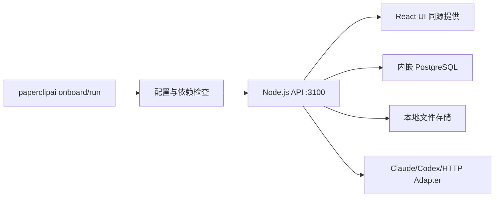

# 项目实战（08） - 五分钟跑起来：本地启动你的控制台

> 本章目标：在本机启动 Paperclip，理解 CLI、API/UI、内嵌数据库之间的启动链路，并能用健康检查、日志和隔离数据目录定位失败阶段。

---

# 一、先决条件

Paperclip **本地运行优先**，跑在你自己机器上。开始前确认：

- **Node.js ≥ 20**（必须）
- 想用 Claude Code 当 Agent 大脑的话：本机已安装并登录 `claude` CLI（第 06 章细讲，这里先跑平台本身）

> 💡 不需要你自己装数据库。Paperclip 默认用**内嵌 PostgreSQL**，零配置开箱即用。

---

# 二、最快路径：一行命令上手

官方推荐的方式，一条命令搞定引导式安装：

```sh
npx paperclipai onboard --yes
```

这条命令会：

1. 走一遍引导式配置（`--yes` 表示全部用默认值，不逐项问你）
2. 配好环境、数据目录、密钥
3. 启动 API 与同源 UI，并打开本地控制台

跑完后，打开浏览器访问：

```
http://127.0.0.1:3100
```

就能看到控制台面板了。

## 2.1 之后再次启动

配置只需做一次。以后想再启动，直接：

```sh
npx paperclipai run
```

> ⚠️ **重要约定**：如果你是用 `npx` 装的，之后所有命令都要用 `npx paperclipai ...` 这个前缀。`pnpm paperclipai` 那种写法**只在克隆下来的源码仓库里**才有效（见下文）。

---

# 三、启动链路：命令背后发生了什么

`onboard` 负责生成实例配置与本地密钥，`doctor` 校验配置、数据库、存储和密钥，`run` 在检查通过后启动 Node.js API；React UI 由同一个 API 服务提供，因此浏览器访问 `3100` 时不会再跨域请求另一个前端端口。默认数据进入内嵌 PostgreSQL，适合零依赖本地体验，不代表生产环境也应该使用单机内嵌模式。



架构边界要说清：Paperclip 是控制平面，负责任务、权限、预算、心跳与审计；真正的代码执行发生在 Claude Code、Codex 或其他 Adapter 对接的运行时中。控制台能打开，只能证明控制平面就绪，不能证明某个 Agent 已正确认证并能执行任务。

# 四、用健康检查验收启动

跑起来后，终端会打印类似这样的状态块：

```
Mode      embedded-postgres  |  vite-dev-middleware
Server    3100
UI        http://127.0.0.1:3100
Database  ~/.paperclip/instances/default/db
Auth      ready
Heartbeat enabled (30000ms)
```

逐行读懂它：

| 行 | 含义 |
|----|------|
| `Mode embedded-postgres` | 用的是内嵌 PostgreSQL（不是外部数据库） |
| `Server 3100` | API 服务监听在 3100 端口 |
| `UI http://127.0.0.1:3100` | 控制台地址，只绑本机，外部访问不了（这是 `local_trusted` 本地可信模式） |
| `Auth ready` | 认证就绪 |
| `Heartbeat enabled (30000ms)` | 心跳调度器已开，每 30 秒一个调度节拍 |

终端输出格式可能随版本变化，不要把某一行日志当作唯一成功标准。使用 HTTP 健康检查验证实际服务：

```sh
curl --fail --silent http://127.0.0.1:3100/api/health
curl --fail --silent http://127.0.0.1:3100/api/companies
```

第一条应返回健康状态，第二条在全新实例通常返回空数组。浏览器能打开、健康接口成功、日志无持续报错，三项同时满足才算控制平面启动完成。

---

# 五、数据都存在哪？（重要）

Paperclip 把所有数据放在你 home 目录下的 `~/.paperclip/`，结构是「一个实例（instance）下挂多家公司」。默认实例叫 `default`：

| 用途 | 路径 |
|------|------|
| 数据主目录 | `~/.paperclip/` |
| 默认实例 | `~/.paperclip/instances/default/` |
| 实例配置 | `~/.paperclip/instances/default/config.json` |
| 密钥文件 | `~/.paperclip/instances/default/secrets/master.key` |
| 内嵌 PostgreSQL | `~/.paperclip/instances/default/db/` |
| 日志 | `~/.paperclip/instances/default/logs/server.log` |
| 文件存储 | `~/.paperclip/instances/default/data/storage/` |

> 🔑 记住两个最有用的：
> - **日志** `logs/server.log`：出问题第一时间看这里。
> - **数据目录**：删除前必须确认实例、数据库与存储内容；“重装 CLI”和“清空业务数据”不是一回事。

做实验时优先隔离数据目录，避免污染长期使用的默认实例：

```sh
npx paperclipai run --data-dir ./tmp/paperclip-lab
```

---

# 六、另一条路：从源码跑（开发者向）

如果你想改 Paperclip 本身的代码、或者要看它的源码学习，就用克隆仓库的方式。前提：Node.js 20+、pnpm 9+。

```sh
git clone https://github.com/paperclipai/paperclip.git
cd paperclip

# 安装依赖
pnpm install

# 开发模式启动：server + UI，watch 模式（改代码自动重启）
pnpm dev
```

同样访问 `http://localhost:3100`。

源码模式下还能用这些命令：

| 命令 | 说明 |
|------|------|
| `pnpm dev` | server + UI，watch 模式（改文件自动重启），推荐 |
| `pnpm dev:once` | 启动一次，不 watch |
| `pnpm dev:server` | 只启动后端 |
| `pnpm dev:ui` | 只启动前端 |
| `pnpm paperclipai run` | 缺配置则自动 onboard，跑健康检查并自动修复，再启动 |

> 没有 pnpm？先装：`npm install -g pnpm@9.15.4`

---

# 七、`onboard` vs `run` vs `doctor` vs `configure`

很多新手在这三个命令上犯迷糊，一张表说清：

| 命令 | 什么时候用 |
|------|-----------|
| `npx paperclipai onboard --yes` | **第一次**安装；重跑也安全，会保留已有配置和数据路径 |
| `npx paperclipai run` | 已经装好了，**日常启动** |
| `npx paperclipai doctor` | 服务未启动前检查配置、数据库、存储与密钥；需要时显式加 `--repair` |
| `npx paperclipai configure` | 想**改设置**（端口、模式等）时用 |

---

# 八、按失败阶段排查

| 阶段 | 可观察证据 | 常见根因 | 下一步 |
|---|---|---|---|
| CLI 未执行 | shell 提示找不到命令或 npx 下载失败 | Node 版本、npm registry、网络 | `node -v`、`npx paperclipai --help` |
| Doctor 失败 | 明确指出 config/database/storage/secrets | 配置损坏、目录不可写、密钥缺失 | 先备份数据目录，再运行 `doctor --repair` |
| 端口未监听 | `/api/health` 连接失败 | 3100 被占用、进程崩溃 | 查日志和端口占用，不要只刷新浏览器 |
| 健康但 UI 异常 | health 成功，页面资源或 API 报错 | 浏览器缓存、构建资源、接口错误 | 看浏览器 Network 与服务端日志 |
| Agent 不工作 | 控制台正常但 Run 失败 | Adapter CLI 未安装、认证或权限不足 | 单独验证 Agent CLI，再检查 Run 事件 |

排障顺序应沿启动链从左到右，避免在 API 尚未监听时反复修改浏览器配置。

- ❌ **混用 `npx` 和 `pnpm` 两种前缀**
  → 用 `npx` 装的就一直用 `npx paperclipai`；`pnpm paperclipai` 只在克隆的源码仓库里有效。混用会找不到命令。

- ❌ **Node 版本太低**
  → 必须 ≥ 20。低版本会在安装或启动时报错，先 `node -v` 确认。

- ❌ **以为换台机器/浏览器能访问 `localhost:3100`**
  → 默认是 `local_trusted` 模式，只绑 `127.0.0.1`，**仅本机可访问**。要远程访问见第 13 章（Tailscale / 部署）。

- ❌ **端口 3100 被占用**
  → 换端口用 `npx paperclipai configure` 改，或先关掉占用进程。

- ❌ **删了 `~/.paperclip/` 想重置，结果连数据一起删了**
  → 这个目录装着你所有公司、任务、产物。删之前确认你真的不要这些数据了。

---

# 九、最佳实践

- ✅ **第一次就用 `onboard --yes`**：默认配置对本地体验足够好，别一上来折腾配置。
- ✅ **跑起来先空逛一圈控制台**：熟悉看板、Companies、Agents、Issues 这些区域长什么样，再动手建公司。
- ✅ **遇到问题先看日志**：`~/.paperclip/instances/default/logs/server.log`。
- ✅ **想学源码就克隆仓库跑 `pnpm dev`**：watch 模式改一行代码立刻热重载，边看边改最快。
- ✅ **实验使用 `--data-dir`**：把配置、数据库和存储一起隔离，验证完成后再决定是否迁入默认实例。
- ✅ **分层验收**：控制台健康、Agent CLI 可用、首个 Run 成功是三个不同验收项。

---

# 十、验收结果与能力边界

- 一行命令上手：`npx paperclipai onboard --yes`，之后 `npx paperclipai run`。
- 控制台地址：`http://127.0.0.1:3100`，默认只能本机访问。
- 数据默认在 `~/.paperclip/instances/default/`，实验可用 `--data-dir` 隔离。
- 想改源码就克隆仓库 `pnpm dev`。
- `/api/health` 成功只证明控制平面可用；还要单独验证 Adapter 的认证、权限和真实任务执行。

平台跑起来了，但你看到的还是一个空控制台。下一章我们先把「六大核心概念」过一遍，建立词汇表，后面建公司才不会晕。👉 [03 · 六大核心概念](./04-六大核心概念.md)

## 参考资料

- [Paperclip Quickstart](https://docs.paperclip.ing/start/quickstart)
- [Paperclip Setup Commands](https://docs.paperclip.ing/cli/setup-commands)
- [Paperclip Local Development](https://docs.paperclip.ing/deploy/local-development)
- [Paperclip Architecture](https://docs.paperclip.ing/start/architecture)
