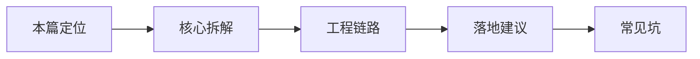

# Agent（01） - AI Agent 开发要学什么？

> 读完后，你应能完成以下任务：
> - 绘制“Agent（01） - AI Agent 开发要学什么？ / 本篇定位”的关键对象与数据流，解释“这是 53-91 进阶线的总纲。”，并用源码位置、日志或 Trace 标注证据。
> - 为“Agent（01） - AI Agent 开发要学什么？ / 核心拆解”设计正常与异常输入，验证“你要理解 messages、system prompt、stream、structured output、tool calling 这些最小接口，因为所有框架最后都落回这些请求参数。”，输出首个偏差位置与回归测试结果。
> - 实现“Agent（01） - AI Agent 开发要学什么？ / 工程链路”的最小代码或配置，检验“随后把知识库、记忆、流式输出接进去。”，输出命令、结果与 Diff，并说明不适用边界。

## 核心知识清单

- Agent Loop、停止条件与预算
- Function Calling、Tool Schema 与执行结果
- ReAct、Plan-and-Execute 与 Reflection
- Memory、State 与 Context Engineering
- LangGraph、HIL 与 Durable Execution
- Multi-Agent、MCP、Skill 与 Deep Agents
- 权限、安全、评测与可观测性

<!-- article-progressive-block:start -->
# 一、先建立全局：AI Agent 开发要学什么？ 是什么？

理解“AI Agent 开发要学什么？”，先要把标题中的对象放进同一条处理链：它接收什么输入，经过哪些状态变化，最终用什么证据判断结果。下表不另造概念，只把作者正文已经解释的章节按依赖顺序连起来。

“AI Agent 开发要学什么？”的第一个核心判断是：这是 53-91 进阶线的总纲。。先弄清这个判断中的对象和输入输出，后面的实现、故障和验收才有共同语境。

| 顺序 | 章节 | 读完本节应抓住的结论 |
| --- | --- | --- |
| 1 | 本篇定位 | 这是 53-91 进阶线的总纲。 |
| 2 | 核心拆解 | 你要理解 messages、system prompt、stream、structured output、tool calling 这些最小接口，因为所有框架最后都落回这些请求参数。 |
| 3 | 工程链路 | 随后把知识库、记忆、流式输出接进去。 |
| 4 | 落地建议 | 项目落地时先定边界：哪些事模型只负责判断，哪些事必须由后端硬校验。 |
| 5 | 常见坑 | 框架只是封装，能力地图才是底层。 |
| 6 | 和已有主线的关系 | 27-32 是 Agent 基础概念； |

## 1.1 核心对象之间怎样衔接



这张图只表达本文的讲解顺序，不替代正文机制。判断“AI Agent 开发要学什么？”是否真正掌握，需要能从最后一个结果沿图回到前面每个章节的输入、状态变化和证据。

## 1.2 再看失败：问题最早会出现在哪一步？

在“AI Agent 开发要学什么？”的对象和顺序已经明确后，再看可观察的失败：路径或命令直通执行、工具结果跨会话泄漏、循环失控或重试重复副作用。定位时不从最后一条错误猜原因，而是沿上图找第一个偏离正文结论的节点。
<!-- article-progressive-block:end -->

# 二、AI Agent 开发要学什么？的学习定位与边界

这是 53-91 进阶线的总纲。
01-52 帮你完成从前端到 AI 应用工程师的基础路线，
这一篇开始进入更贴近真实 Agent 产品的工程拆解。

# 三、AI Agent 开发要学什么？的真实应用场景

很多人学 Agent 的第一步是直接打开 LangChain 文档，
然后被 Tool、Memory、Retriever、Graph、Callback、Runnable 这些词砸晕。
问题不在于你笨，
而是学习顺序错了：Agent 不是一个库，
而是一套让模型可控地感知、决策、行动、复盘的系统。
先把系统拆开，后面看任何框架都不会迷路。

# 四、AI Agent 开发要学什么？的核心对象与机制

- 第一层是模型调用。你要理解 messages、system prompt、stream、structured output、tool calling 这些最小接口，因为所有框架最后都落回这些请求参数。
- 第二层是工具系统。Agent 真正区别于聊天机器人的地方，是它能调用文件、数据库、浏览器、业务接口。工具不是让模型随便执行命令，而是后端暴露一个有 schema、有权限、有审计的可调用能力。
- 第三层是上下文工程。模型能不能做对，很多时候不取决于模型参数，而取决于你塞进去的上下文是否及时、干净、足够短、足够有证据。RAG、Memory、Prompt Template 都属于这一层。
- 第四层是编排和工程化。单步调用可以裸写，多步任务要有状态、分支、重试、停止条件、trace 和部署方案。LangGraph、工作流引擎、队列、日志、评测都在这一层。

# 五、AI Agent 开发要学什么？的工程链路

- 先裸写一个能调工具的最小循环。
- 再给工具加参数校验、权限和确认。
- 随后把知识库、记忆、流式输出接进去。
- 最后再选择 LangChain、LangGraph、Nest、MCP 等框架承载复杂度。

# 六、AI Agent 开发要学什么？的落地建议

- 学习时每个概念都问一句：它解决的是模型不知道、不会做、做不稳，还是做了不好排查？
- 项目落地时先定边界：哪些事模型只负责判断，哪些事必须由后端硬校验。
- 面试表达时少说“智能体很自主”，多说“工具可控、证据可追溯、失败可复盘”。

# 七、AI Agent 开发要学什么？的常见故障与误区

- 把 Agent 等同于 LangChain。框架只是封装，能力地图才是底层。
- 一上来就追多 Agent。单 Agent 的工具、记忆、权限都没做好，多 Agent 只会扩大混乱。
- 忽略 trace。没有调用链，Agent 出错时只能靠猜。

# 八、AI Agent 开发要学什么？在学习路线中的位置

27-32 是 Agent 基础概念；
53 重新把它们组织成进阶路线图，后续 54-91 逐层展开。

# 九、AI Agent 开发要学什么？的核心结论

> Agent 开发要学四层：模型接口、工具系统、上下文工程、工程化编排。先裸写最小 tool loop，再补权限、RAG、Memory、状态图、trace 和部署。框架要放在理解本质之后用，它是承载复杂度的工具，不是 Agent 的定义。

<!-- article-progressive-block:start -->
# 十、动手验证：先跑通 AI Agent 开发要学什么？，再改变一个变量

前面的章节已经建立问题、概念和机制。现在把“AI Agent 开发要学什么？”放进同一套基线中运行；本节不再引入新术语，只验证前文结论能否被复现。

## 10.1 基线与候选只允许一个变量不同

验证“AI Agent 开发要学什么？”时，先固定工具 Schema、调用身份、允许资源、畸形参数、超时、重复请求和最大步骤。候选方案只能改变本次要验证的变量；如果同时更换数据、依赖和配置，即使结果改善，也不能知道是哪一项产生作用。

执行“AI Agent 开发要学什么？”时，动作是：保存模型提议，经 Schema 与授权校验后执行工具，并回放拒绝、超时和恢复路径。原始结果不能只保留截图或汇总分数，必须同步保存：模型提议、参数校验、授权决定、幂等键、工具结果、状态迁移和 Trace，使下一次复查可以在同一输入上重放。

| 实验要素 | 本文要求 |
| --- | --- |
| 固定条件 | 工具 Schema、调用身份、允许资源、畸形参数、超时、重复请求和最大步骤 |
| 唯一变量 | 本次候选方案与基线之间的一项明确差异 |
| 原始证据 | 模型提议、参数校验、授权决定、幂等键、工具结果、状态迁移和 Trace |
| 通过阈值 | 模型只提议，代码控制执行与停止；越权输入无副作用，重复请求不重复写入 |
| 立即停止 | 路径或命令直通执行、工具结果跨会话泄漏、循环失控或重试重复副作用 |

## 10.2 执行前先排除不可比较条件

“AI Agent 开发要学什么？”开始前先确认下面四项；任一项不成立，都应先修复实验条件，而不是解释结果。

- 基线能够在“AI Agent 开发要学什么？”的当前环境重复运行。
- 候选只改变一个与“AI Agent 开发要学什么？”结论直接相关的条件。
- “AI Agent 开发要学什么？”的基线和候选使用同一批输入、同一版本依赖与同一通过阈值。
- “AI Agent 开发要学什么？”的原始输出和失败现场不会被重试、格式化或汇总覆盖。

## 10.3 执行后先核对证据完整性

结果出来后先检查证据，再讨论“AI Agent 开发要学什么？”是否通过。缺少中间状态时，最终输出只能说明现象，不能证明机制。

| 检查项 | 当前文章的判定 |
| --- | --- |
| 输入可追溯 | 工具 Schema、调用身份、允许资源、畸形参数、超时、重复请求和最大步骤 |
| 过程可回放 | 保存模型提议，经 Schema 与授权校验后执行工具，并回放拒绝、超时和恢复路径 |
| 结果可审计 | 模型提议、参数校验、授权决定、幂等键、工具结果、状态迁移和 Trace |

“AI Agent 开发要学什么？”的一次合格基线对照按以下顺序执行：

1. 保存“AI Agent 开发要学什么？”基线版本及输入摘要，确认基线本身可以重复运行。
2. 写下“AI Agent 开发要学什么？”候选方案唯一变化的变量，以及它预期影响的指标。
3. 在同一环境执行“AI Agent 开发要学什么？”：保存模型提议，经 Schema 与授权校验后执行工具，并回放拒绝、超时和恢复路径。
4. 为“AI Agent 开发要学什么？”保存：模型提议、参数校验、授权决定、幂等键、工具结果、状态迁移和 Trace。
5. 使用“AI Agent 开发要学什么？”预登记条件判断：模型只提议，代码控制执行与停止；越权输入无副作用，重复请求不重复写入。
6. 如果“AI Agent 开发要学什么？”未通过，不修改第二个变量，先恢复基线并保留失败现场。

# 十一、用一张矩阵验证 AI Agent 开发要学什么？ 的关键结论

矩阵按正文顺序列出“AI Agent 开发要学什么？”的结论。一次实验只选择一行，只改变这一行对应的条件；不要把多行合并成一个无法归因的大实验。

| 正文章节 | 已解释的结论 | 本轮唯一变量 | 必须保存的证据 |
| --- | --- | --- | --- |
| 本篇定位 | 这是 53-91 进阶线的总纲。 | 只改变与“本篇定位”相关的条件 | 模型提议、参数校验、授权决定、幂等键、工具结果、状态迁移和 Trace |
| 核心拆解 | 你要理解 messages、system prompt、stream、structured output、tool calling 这些最小接口，因为所有框架最后都落回这些请求参数。 | 只改变与“核心拆解”相关的条件 | 模型提议、参数校验、授权决定、幂等键、工具结果、状态迁移和 Trace |
| 工程链路 | 随后把知识库、记忆、流式输出接进去。 | 只改变与“工程链路”相关的条件 | 模型提议、参数校验、授权决定、幂等键、工具结果、状态迁移和 Trace |
| 落地建议 | 项目落地时先定边界：哪些事模型只负责判断，哪些事必须由后端硬校验。 | 只改变与“落地建议”相关的条件 | 模型提议、参数校验、授权决定、幂等键、工具结果、状态迁移和 Trace |
| 常见坑 | 框架只是封装，能力地图才是底层。 | 只改变与“常见坑”相关的条件 | 模型提议、参数校验、授权决定、幂等键、工具结果、状态迁移和 Trace |
| 和已有主线的关系 | 27-32 是 Agent 基础概念； | 只改变与“和已有主线的关系”相关的条件 | 模型提议、参数校验、授权决定、幂等键、工具结果、状态迁移和 Trace |

## 11.1 记录本次实际实验

下面的记录用于“AI Agent 开发要学什么？”当前这一次实验，不是第二套知识目录。先从矩阵选择一个章节，再填写实际值；没有填写的字段表示尚未验证。

```yaml
topic: "AI Agent 开发要学什么？"
selected_chapter: required
claim_from_article: required
baseline_version: required
changed_condition: exactly_one
execution: "保存模型提议，经 Schema 与授权校验后执行工具，并回放拒绝、超时和恢复路径"
evidence: "模型提议、参数校验、授权决定、幂等键、工具结果、状态迁移和 Trace"
pass_when: "模型只提议，代码控制执行与停止；越权输入无副作用，重复请求不重复写入"
stop_when: "路径或命令直通执行、工具结果跨会话泄漏、循环失控或重试重复副作用"
observed_result: required
first_deviation: null_or_evidence
recovery_replay: required_after_failure
```

## 11.2 边界实验必须证明能够停止和恢复

成功路径只能证明“AI Agent 开发要学什么？”在当前样本上工作，不能证明它可以进入生产。边界实验需要主动制造：路径或命令直通执行、工具结果跨会话泄漏、循环失控或重试重复副作用，并观察系统是否在产生不可逆副作用前停止。

| 场景 | 只改变什么 | 应保存什么 | 通过标准 |
| --- | --- | --- | --- |
| 正常路径 | 使用已知有效输入 | 模型提议、参数校验、授权决定、幂等键、工具结果、状态迁移和 Trace | 模型只提议，代码控制执行与停止；越权输入无副作用，重复请求不重复写入 |
| 边界路径 | 把一个输入推进到约束临界值 | 临界值前后的输出与指标 | 不静默降级，不把部分结果冒充成功 |
| 明确失败 | 注入：路径或命令直通执行、工具结果跨会话泄漏、循环失控或重试重复副作用 | 原始错误、首个异常阶段和最终状态 | 失败被正确分类且没有扩大副作用 |
| 恢复重放 | 执行：关闭副作用入口，核对最终业务状态，从首个错误授权或状态迁移恢复 | 原失败样本的复测证据 | 原样本恢复，正常样本没有回归 |

恢复动作不是简单重启。对于“AI Agent 开发要学什么？”，第一步是：关闭副作用入口，核对最终业务状态，从首个错误授权或状态迁移恢复。完成后使用原始失败样本复测；只验证一个新样本成功，不能证明触发条件已经消失。

“AI Agent 开发要学什么？”边界实验结束后，应把正常、临界、失败和恢复四类记录放在同一个运行批次中。这样才能区分“候选方案真的修复问题”和“环境变化让问题暂时没有出现”。

# 十二、AI Agent 开发要学什么？ 的结果解释

解释“AI Agent 开发要学什么？”实验时先看首个偏差，而不是最后一条错误。最后的异常通常只是上游状态错误的结果；从末端反推容易误把症状当根因。

| 观察结果 | 可以支持的判断 | 下一步 |
| --- | --- | --- |
| 主链路没有达到预期 | 路径或命令直通执行、工具结果跨会话泄漏、循环失控或重试重复副作用 | 先执行：关闭副作用入口，核对最终业务状态，从首个错误授权或状态迁移恢复 |
| 异常链路无法恢复 | 路径或命令直通执行、工具结果跨会话泄漏、循环失控或重试重复副作用 | 先执行：关闭副作用入口，核对最终业务状态，从首个错误授权或状态迁移恢复 |
| 新样本成功但原样本仍失败 | 修复没有覆盖原始触发条件 | 固定原失败输入，恢复基线后重新比较 |
| 指标改善但证据无法回链 | 数据、版本或中间状态没有固定 | 暂停发布，补齐可追溯记录后重跑 |

“AI Agent 开发要学什么？”只有同时满足“模型只提议，代码控制执行与停止；越权输入无副作用，重复请求不重复写入”，并且没有出现“路径或命令直通执行、工具结果跨会话泄漏、循环失控或重试重复副作用”，才可以认为主链路通过。这里的“通过”只对当前固定版本、样本和环境有效，不能外推到尚未测试的容量、权限或数据分布。

如果“AI Agent 开发要学什么？”候选方案与基线差异很小，先检查证据分辨率是否足够；如果差异很大，先排除数据泄漏、环境漂移和版本不一致。两种情况都不能只看一个汇总均值，需要回到逐样本输出和中间状态。

“AI Agent 开发要学什么？”故障定位完成后，记录“现象、首个偏差、根因、改动、原样本复测”五项。缺少原样本复测时，只能标记为待观察，不能标记为已解决。

# 十三、AI Agent 开发要学什么？ 的发布判断

发布判断需要把“AI Agent 开发要学什么？”的质量、失败边界和恢复能力放在同一份记录中。以下任一条件缺失，都应停止扩量，而不是用“基本正常”替代证据。

- [ ] “AI Agent 开发要学什么？”的基线与候选只存在一个计划内变量。
- [ ] “AI Agent 开发要学什么？”的输入、代码、依赖、配置和数据版本可以追溯。
- [ ] “AI Agent 开发要学什么？”的正常、临界、失败和恢复样本使用同一套断言。
- [ ] “AI Agent 开发要学什么？”的原始输出、中间状态和失败现场已经保留。
- [ ] “AI Agent 开发要学什么？”的日志、Trace、截图和测试数据已经脱敏。
- [ ] “AI Agent 开发要学什么？”的停止条件、负责人和回滚入口已经演练。
- [ ] “AI Agent 开发要学什么？”尚未覆盖的输入、权限、容量和外部依赖已经登记。

最终记录至少包含基线版本、唯一变量、原始证据、首个偏差、恢复复测和发布责任人。没有参与本次修改的人如果不能据此重放“AI Agent 开发要学什么？”的判断，就不能发布。
<!-- article-progressive-block:end -->

# 十四、总结

- **本篇定位**：这是 53-91 进阶线的总纲。
- **核心拆解**：你要理解 messages、system prompt、stream、structured output、tool calling 这些最小接口，因为所有框架最后都落回这些请求参数。
- **工程链路**：随后把知识库、记忆、流式输出接进去。
- **落地建议**：项目落地时先定边界：哪些事模型只负责判断，哪些事必须由后端硬校验。
- **常见坑**：框架只是封装，能力地图才是底层。
- **和已有主线的关系**：27-32 是 Agent 基础概念；

## 参考资料

- [LangChain Agents](https://docs.langchain.com/oss/python/langchain/agents)
- [LangGraph 文档](https://docs.langchain.com/oss/python/langgraph/overview)
