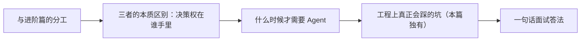

# Agent（02） - Agent 是什么

> 读完后，你应能完成以下任务：
> - 绘制“Agent（02） - Agent 是什么 / 与进阶篇的分工”的关键对象与数据流，解释“继续进入 Tool、MCP、Memory、LangGraph、多 Agent 和工程化落地。”，并用源码位置、日志或 Trace 标注证据。
> - 为“Agent（02） - Agent 是什么 / 三者的本质区别：决策权在谁手里”设计正常与异常输入，验证“流程图是你画的，每一步走哪、调什么，运行时不会变。”，输出首个偏差位置与回归测试结果。
> - 实现“Agent（02） - Agent 是什么 / 什么时候才需要 Agent”的最小代码或配置，检验“判断标准就一个：任务的路径是不是固定的。”，输出命令、结果与 Diff，并说明不适用边界。

> 一句话目标：读完你能用一句话区分 Chatbot、Workflow、Agent，并判断一个需求到底该不该上 Agent。

<!-- article-progressive-block:start -->
# 一、先建立全局：Agent 是什么 是什么？

理解“Agent 是什么”，先要把标题中的对象放进同一条处理链：它接收什么输入，经过哪些状态变化，最终用什么证据判断结果。下表不另造概念，只把作者正文已经解释的章节按依赖顺序连起来。

“Agent 是什么”的第一个核心判断是：继续进入 Tool、MCP、Memory、LangGraph、多 Agent 和工程化落地。。先弄清这个判断中的对象和输入输出，后面的实现、故障和验收才有共同语境。

| 顺序 | 章节 | 读完本节应抓住的结论 |
| --- | --- | --- |
| 1 | 与进阶篇的分工 | 继续进入 Tool、MCP、Memory、LangGraph、多 Agent 和工程化落地。 |
| 2 | 三者的本质区别：决策权在谁手里 | 流程图是你画的，每一步走哪、调什么，运行时不会变。 |
| 3 | 什么时候才需要 Agent | 判断标准就一个：任务的路径是不是固定的。 |
| 4 | 工程上真正会踩的坑（本篇独有） | 两者不是一个量级的东西。 |
| 5 | 一句话面试答法 | 区别在「谁决定下一步」。 |
| 6 | Chatbot 的决策只有一个 | Chatbot 的决策只有一个：生成什么文字。 |

## 1.1 核心对象之间怎样衔接



这张图只表达本文的讲解顺序，不替代正文机制。判断“Agent 是什么”是否真正掌握，需要能从最后一个结果沿图回到前面每个章节的输入、状态变化和证据。

## 1.2 再看失败：问题最早会出现在哪一步？

在“Agent 是什么”的对象和顺序已经明确后，再看可观察的失败：路径或命令直通执行、工具结果跨会话泄漏、循环失控或重试重复副作用。定位时不从最后一条错误猜原因，而是沿上图找第一个偏离正文结论的节点。
<!-- article-progressive-block:end -->

# 二、与进阶篇的分工

本篇保留为 Agent 概念入口：重点区分 Chatbot、Workflow 和 Agent。
进阶路线从 53《AI Agent 开发要学什么？
》开始，
继续进入 Tool、MCP、Memory、LangGraph、多 Agent 和工程化落地。

# 三、Agent 是什么的真实应用场景

产品给你提了个需求：「用户问『客户 C1001 的订单有没有风险，
有就建个工单』，
助手要能自动处理。
」

你掂量了一下能用的几种东西：

- 接个**聊天机器人**？它只会生成文字，根本碰不到你的订单库，只能回「请您登录后台查看」。
- 写个**固定流程**（workflow）？可以——抽客户号、查订单、建工单，三步串起来。但流程是写死的：不管这个客户有没有风险，到第三步都会建工单。万一没风险也建，就成了误报。
- 上 **Agent**？它会先查订单，看到结果后自己判断：确实有风险才建工单，没风险就不建。

这三者的差别，不在「谁更聪明」，而在**谁来决定下一步**。
这是理解 Agent 的钥匙。

# 四、三者的本质区别：决策权在谁手里

```text
Chatbot：   问题 → 模型生成文字 → 回答
            （只会说话，碰不到外部系统，给不出真数据）

Workflow：  问题 → [步骤1] → [步骤2] → [步骤3] → 结果
            （能调系统，但步骤和顺序是人写死的，不随情况变）

Agent：     问题 → 模型决定调哪个工具 → 看结果 → 模型决定下一步 → ... → 结果
            （决策权交给模型 + 工具循环，路径是动态的）
```

- **Chatbot** 的决策只有一个：生成什么文字。它没有工具，接触不到真实数据，问它实时信息只能编或者推脱。
- **Workflow** 把决策权握在开发者手里。流程图是你画的，每一步走哪、调什么，运行时不会变。它能干活、能调系统，胜在**稳定可控**，输在**不灵活**——遇到流程没预设的情况就僵住。
- **Agent** 把决策权交给了「模型 + 工具循环」。模型根据当前情况判断要不要用工具、用哪个，用完看结果再决定下一步。它胜在**灵活**——能处理你没预先编排好的路径，输在**不确定**：模型可能选错工具、绕圈、或者多花钱。

# 五、什么时候才需要 Agent

Agent 灵活，但也更难控、更贵、更慢。
别一上来就用。
判断标准就一个：**任务的路径是不是固定的**。

| 情况 | 该用什么 |
|---|---|
| 一问一答，不碰外部系统 | Chatbot 足够 |
| 步骤固定、顺序明确（如「下单→扣款→发货」） | Workflow，稳定可控 |
| 要根据中间结果临场决定下一步、可能用多个工具 | Agent |

那个「查订单→看有没有风险→决定建不建工单」的需求，
正卡在 Agent 的点上：建不建工单取决于查询结果，
路径是运行时才定的。
这种「依赖中间结果做分支」的任务，
写死的 workflow 处理不优雅，
正是 Agent 的主场。

反过来，能用 workflow 解决的，就别上 Agent。
可控性是工程里很值钱的东西。

# 六、工程上真正会踩的坑（本篇独有）

- **把 Agent 当成「更高级的 Chatbot」**。两者不是一个量级的东西。Chatbot 只生成文字，Agent 是「模型 + 工具 + 循环决策」。区别是有没有把决策权和行动能力交出去。
- **能用 Workflow 的场景硬上 Agent**。路径固定的任务用 Agent，等于放弃了确定性，换来一堆「模型偶尔抽风选错工具」的麻烦，还更贵更慢。可控性不要随便丢。
- **以为 Agent 一定比 Workflow 好**。恰恰相反，生产里大量「类 Agent」系统其实是 Workflow 加了几个模型节点。Agent 的灵活是有代价的，只在真正需要动态决策时才值得。
- **忽视 Agent 的不确定性**。模型可能选错工具、参数填错、循环绕不出来。Agent 必须配步数上限、工具权限校验、失败兜底，这些是后面 29~32 篇要讲的。

# 七、一句话面试答法

> **Chatbot、Workflow、Agent 怎么区分？** 区别在「谁决定下一步」。Chatbot 只生成文字，碰不到外部系统；Workflow 能调系统，但步骤是开发者写死的，不随情况变，胜在稳定可控；Agent 把决策权交给模型加工具循环，模型看中间结果动态决定下一步，胜在灵活但不确定。判断该不该用 Agent 就看任务路径是否固定——固定就用 Workflow，要根据中间结果临场分支才用 Agent。

# 八、动手实践：27 Agent 是什么

用同一个问题，
对比 **Chatbot / Workflow / Agent** 三种系统的处理轨迹。
核心区别只有一句话：谁来决定下一步。

## 8.1 在线运行

直接使用本文“可运行源码”中的沙盒执行；
源码、复制内容和实际运行入口保持一致。

零依赖，纯标准库。

## 8.2 预期输出

```text
同一个问题：客户 C1001 的订单有没有风险，有就建个工单

[Chatbot]
  只调模型生成文字，没有工具，拿不到真实订单。
  回复：我无法直接查询订单，请您登录后台或联系人工客服查看风险。

[Workflow] 固定流程：抽客户号 -> 查订单 -> 建工单
  步骤1 查订单：C1001 共 2 笔
  步骤2 建工单：T-1001（流程写死，必建，不看是否真有风险）

[Agent] 动态决策：想一步 -> 做一步 -> 看结果 -> 再决定
  思考：问题涉及订单风险，先查 C1001 的订单
  观察：查到 2 笔订单，其中 1 笔有风险
  思考：确实有风险，需要建工单跟进
  行动：建工单 T-1001（基于观察，而非写死）
```

三者差别：Chatbot 只会生成文字，碰不到订单库，给不出真数据；
Workflow 能调系统，但步骤是人写死的，哪怕没风险也照样建工单；
Agent 自己判断要不要查、查完看结果再决定建不建工单，
路径是动态的（如果这个客户没有风险订单，
Agent 不会建工单，
而 Workflow 还是会建）。

## 8.3 代码↔概念对应

| 概念 | 在 main.py 哪里 |
|---|---|
| Chatbot：只生成文字，无工具 | `run_chatbot` |
| Workflow：人写死的固定步骤 | `run_workflow` |
| Workflow 的死板（无条件建工单） | `run_workflow` 里无条件 `create_ticket` |
| Agent：动态决策（想-做-看-再想） | `run_agent` |
| Agent 的灵活（看结果再决定） | `run_agent` 里 `if risky` |

## 8.4 说明

这个 demo 里 Agent 的「思考」是写死的规则，只为把决策轨迹显示出来。
真实 Agent 的「要不要用工具、用哪个、用完怎么办」由模型自己判断（就是下一篇 ReAct 模式做的事），
但「根据观察动态决定下一步」这个本质是一样的。
Agent 不是更高级的 Chatbot，而是把「决策权」交给了模型 + 工具循环。

## 8.5 可运行源码：Agent 是什么

下方代码就是在线沙盒实际执行的完整源码。

### main.py

```python
"""对比 Chatbot、Workflow 与 Agent 的控制权。"""

from __future__ import annotations


def chatbot(question: str) -> list[str]:
    """返回单次生成轨迹；question 是用户问题。"""
    return [f"输入：{question}", "模型直接生成回答", "结束"]


def workflow(question: str) -> list[str]:
    """返回开发者预先固定的步骤轨迹。"""
    return [f"输入：{question}", "固定步骤1：检索", "固定步骤2：生成", "固定步骤3：格式化", "结束"]


def agent(question: str) -> list[str]:
    """根据当前问题动态选择下一步。"""
    # Agent 根据意图决定是否需要外部工具。
    needs_tool = "订单" in question
    # 动态执行轨迹。
    trace = [f"输入：{question}", "模型判断下一步"]
    trace.extend(["选择工具：query_order", "观察工具结果", "再次判断"] if needs_tool else ["无需工具"])
    trace.extend(["生成最终回答", "结束"])
    return trace


def main() -> None:
    """用同一问题打印三类系统轨迹。"""
    # 同时包含知识问答与业务查询意图的问题。
    question = "我的订单为什么还没发货？"
    for name, runner in (("Chatbot", chatbot), ("Workflow", workflow), ("Agent", agent)):
        print(f"\n{name}（下一步由{'模型' if name == 'Agent' else '程序/固定流程'}决定）")
        for step in runner(question):
            print("  ->", step)


if __name__ == "__main__":
    main()
```

<!-- article-progressive-block:start -->
# 九、动手验证：先跑通 Agent 是什么，再改变一个变量

前面的章节已经建立问题、概念和机制。现在把“Agent 是什么”放进同一套基线中运行；本节不再引入新术语，只验证前文结论能否被复现。

## 9.1 基线与候选只允许一个变量不同

验证“Agent 是什么”时，先固定工具 Schema、调用身份、允许资源、畸形参数、超时、重复请求和最大步骤。候选方案只能改变本次要验证的变量；如果同时更换数据、依赖和配置，即使结果改善，也不能知道是哪一项产生作用。

执行“Agent 是什么”时，动作是：保存模型提议，经 Schema 与授权校验后执行工具，并回放拒绝、超时和恢复路径。原始结果不能只保留截图或汇总分数，必须同步保存：模型提议、参数校验、授权决定、幂等键、工具结果、状态迁移和 Trace，使下一次复查可以在同一输入上重放。

| 实验要素 | 本文要求 |
| --- | --- |
| 固定条件 | 工具 Schema、调用身份、允许资源、畸形参数、超时、重复请求和最大步骤 |
| 唯一变量 | 本次候选方案与基线之间的一项明确差异 |
| 原始证据 | 模型提议、参数校验、授权决定、幂等键、工具结果、状态迁移和 Trace |
| 通过阈值 | 模型只提议，代码控制执行与停止；越权输入无副作用，重复请求不重复写入 |
| 立即停止 | 路径或命令直通执行、工具结果跨会话泄漏、循环失控或重试重复副作用 |

## 9.2 执行前先排除不可比较条件

“Agent 是什么”开始前先确认下面四项；任一项不成立，都应先修复实验条件，而不是解释结果。

- 基线能够在“Agent 是什么”的当前环境重复运行。
- 候选只改变一个与“Agent 是什么”结论直接相关的条件。
- “Agent 是什么”的基线和候选使用同一批输入、同一版本依赖与同一通过阈值。
- “Agent 是什么”的原始输出和失败现场不会被重试、格式化或汇总覆盖。

## 9.3 执行后先核对证据完整性

结果出来后先检查证据，再讨论“Agent 是什么”是否通过。缺少中间状态时，最终输出只能说明现象，不能证明机制。

| 检查项 | 当前文章的判定 |
| --- | --- |
| 输入可追溯 | 工具 Schema、调用身份、允许资源、畸形参数、超时、重复请求和最大步骤 |
| 过程可回放 | 保存模型提议，经 Schema 与授权校验后执行工具，并回放拒绝、超时和恢复路径 |
| 结果可审计 | 模型提议、参数校验、授权决定、幂等键、工具结果、状态迁移和 Trace |

“Agent 是什么”的一次合格基线对照按以下顺序执行：

1. 保存“Agent 是什么”基线版本及输入摘要，确认基线本身可以重复运行。
2. 写下“Agent 是什么”候选方案唯一变化的变量，以及它预期影响的指标。
3. 在同一环境执行“Agent 是什么”：保存模型提议，经 Schema 与授权校验后执行工具，并回放拒绝、超时和恢复路径。
4. 为“Agent 是什么”保存：模型提议、参数校验、授权决定、幂等键、工具结果、状态迁移和 Trace。
5. 使用“Agent 是什么”预登记条件判断：模型只提议，代码控制执行与停止；越权输入无副作用，重复请求不重复写入。
6. 如果“Agent 是什么”未通过，不修改第二个变量，先恢复基线并保留失败现场。

# 十、用一张矩阵验证 Agent 是什么 的关键结论

矩阵按正文顺序列出“Agent 是什么”的结论。一次实验只选择一行，只改变这一行对应的条件；不要把多行合并成一个无法归因的大实验。

| 正文章节 | 已解释的结论 | 本轮唯一变量 | 必须保存的证据 |
| --- | --- | --- | --- |
| 与进阶篇的分工 | 继续进入 Tool、MCP、Memory、LangGraph、多 Agent 和工程化落地。 | 只改变与“与进阶篇的分工”相关的条件 | 模型提议、参数校验、授权决定、幂等键、工具结果、状态迁移和 Trace |
| 三者的本质区别：决策权在谁手里 | 流程图是你画的，每一步走哪、调什么，运行时不会变。 | 只改变与“三者的本质区别：决策权在谁手里”相关的条件 | 模型提议、参数校验、授权决定、幂等键、工具结果、状态迁移和 Trace |
| 什么时候才需要 Agent | 判断标准就一个：任务的路径是不是固定的。 | 只改变与“什么时候才需要 Agent”相关的条件 | 模型提议、参数校验、授权决定、幂等键、工具结果、状态迁移和 Trace |
| 工程上真正会踩的坑（本篇独有） | 两者不是一个量级的东西。 | 只改变与“工程上真正会踩的坑（本篇独有）”相关的条件 | 模型提议、参数校验、授权决定、幂等键、工具结果、状态迁移和 Trace |
| 一句话面试答法 | 区别在「谁决定下一步」。 | 只改变与“一句话面试答法”相关的条件 | 模型提议、参数校验、授权决定、幂等键、工具结果、状态迁移和 Trace |
| Chatbot 的决策只有一个 | Chatbot 的决策只有一个：生成什么文字。 | 只改变与“Chatbot 的决策只有一个”相关的条件 | 模型提议、参数校验、授权决定、幂等键、工具结果、状态迁移和 Trace |

## 10.1 记录本次实际实验

下面的记录用于“Agent 是什么”当前这一次实验，不是第二套知识目录。先从矩阵选择一个章节，再填写实际值；没有填写的字段表示尚未验证。

```yaml
topic: "Agent 是什么"
selected_chapter: required
claim_from_article: required
baseline_version: required
changed_condition: exactly_one
execution: "保存模型提议，经 Schema 与授权校验后执行工具，并回放拒绝、超时和恢复路径"
evidence: "模型提议、参数校验、授权决定、幂等键、工具结果、状态迁移和 Trace"
pass_when: "模型只提议，代码控制执行与停止；越权输入无副作用，重复请求不重复写入"
stop_when: "路径或命令直通执行、工具结果跨会话泄漏、循环失控或重试重复副作用"
observed_result: required
first_deviation: null_or_evidence
recovery_replay: required_after_failure
```

## 10.2 边界实验必须证明能够停止和恢复

成功路径只能证明“Agent 是什么”在当前样本上工作，不能证明它可以进入生产。边界实验需要主动制造：路径或命令直通执行、工具结果跨会话泄漏、循环失控或重试重复副作用，并观察系统是否在产生不可逆副作用前停止。

| 场景 | 只改变什么 | 应保存什么 | 通过标准 |
| --- | --- | --- | --- |
| 正常路径 | 使用已知有效输入 | 模型提议、参数校验、授权决定、幂等键、工具结果、状态迁移和 Trace | 模型只提议，代码控制执行与停止；越权输入无副作用，重复请求不重复写入 |
| 边界路径 | 把一个输入推进到约束临界值 | 临界值前后的输出与指标 | 不静默降级，不把部分结果冒充成功 |
| 明确失败 | 注入：路径或命令直通执行、工具结果跨会话泄漏、循环失控或重试重复副作用 | 原始错误、首个异常阶段和最终状态 | 失败被正确分类且没有扩大副作用 |
| 恢复重放 | 执行：关闭副作用入口，核对最终业务状态，从首个错误授权或状态迁移恢复 | 原失败样本的复测证据 | 原样本恢复，正常样本没有回归 |

恢复动作不是简单重启。对于“Agent 是什么”，第一步是：关闭副作用入口，核对最终业务状态，从首个错误授权或状态迁移恢复。完成后使用原始失败样本复测；只验证一个新样本成功，不能证明触发条件已经消失。

“Agent 是什么”边界实验结束后，应把正常、临界、失败和恢复四类记录放在同一个运行批次中。这样才能区分“候选方案真的修复问题”和“环境变化让问题暂时没有出现”。

# 十一、Agent 是什么 的结果解释

解释“Agent 是什么”实验时先看首个偏差，而不是最后一条错误。最后的异常通常只是上游状态错误的结果；从末端反推容易误把症状当根因。

| 观察结果 | 可以支持的判断 | 下一步 |
| --- | --- | --- |
| 主链路没有达到预期 | 路径或命令直通执行、工具结果跨会话泄漏、循环失控或重试重复副作用 | 先执行：关闭副作用入口，核对最终业务状态，从首个错误授权或状态迁移恢复 |
| 异常链路无法恢复 | 路径或命令直通执行、工具结果跨会话泄漏、循环失控或重试重复副作用 | 先执行：关闭副作用入口，核对最终业务状态，从首个错误授权或状态迁移恢复 |
| 新样本成功但原样本仍失败 | 修复没有覆盖原始触发条件 | 固定原失败输入，恢复基线后重新比较 |
| 指标改善但证据无法回链 | 数据、版本或中间状态没有固定 | 暂停发布，补齐可追溯记录后重跑 |

“Agent 是什么”只有同时满足“模型只提议，代码控制执行与停止；越权输入无副作用，重复请求不重复写入”，并且没有出现“路径或命令直通执行、工具结果跨会话泄漏、循环失控或重试重复副作用”，才可以认为主链路通过。这里的“通过”只对当前固定版本、样本和环境有效，不能外推到尚未测试的容量、权限或数据分布。

如果“Agent 是什么”候选方案与基线差异很小，先检查证据分辨率是否足够；如果差异很大，先排除数据泄漏、环境漂移和版本不一致。两种情况都不能只看一个汇总均值，需要回到逐样本输出和中间状态。

“Agent 是什么”故障定位完成后，记录“现象、首个偏差、根因、改动、原样本复测”五项。缺少原样本复测时，只能标记为待观察，不能标记为已解决。

# 十二、Agent 是什么 的发布判断

发布判断需要把“Agent 是什么”的质量、失败边界和恢复能力放在同一份记录中。以下任一条件缺失，都应停止扩量，而不是用“基本正常”替代证据。

- [ ] “Agent 是什么”的基线与候选只存在一个计划内变量。
- [ ] “Agent 是什么”的输入、代码、依赖、配置和数据版本可以追溯。
- [ ] “Agent 是什么”的正常、临界、失败和恢复样本使用同一套断言。
- [ ] “Agent 是什么”的原始输出、中间状态和失败现场已经保留。
- [ ] “Agent 是什么”的日志、Trace、截图和测试数据已经脱敏。
- [ ] “Agent 是什么”的停止条件、负责人和回滚入口已经演练。
- [ ] “Agent 是什么”尚未覆盖的输入、权限、容量和外部依赖已经登记。

最终记录至少包含基线版本、唯一变量、原始证据、首个偏差、恢复复测和发布责任人。没有参与本次修改的人如果不能据此重放“Agent 是什么”的判断，就不能发布。
<!-- article-progressive-block:end -->

# 十三、总结

- **三者的本质区别：决策权在谁手里**：流程图是你画的，每一步走哪、调什么，运行时不会变。
- **什么时候才需要 Agent**：判断标准就一个：任务的路径是不是固定的。
- **工程边界**：模型根据当前情况判断要不要用工具、用哪个，用完看结果再决定下一步。
- **实现机制**：Chatbot 只生成文字，Agent 是「模型 + 工具 + 循环决策」。
- **选型依据**：区别是有没有把决策权和行动能力交出去。

## 参考资料

- [LangChain Agents](https://docs.langchain.com/oss/python/langchain/agents)
- [LangGraph 文档](https://docs.langchain.com/oss/python/langgraph/overview)
