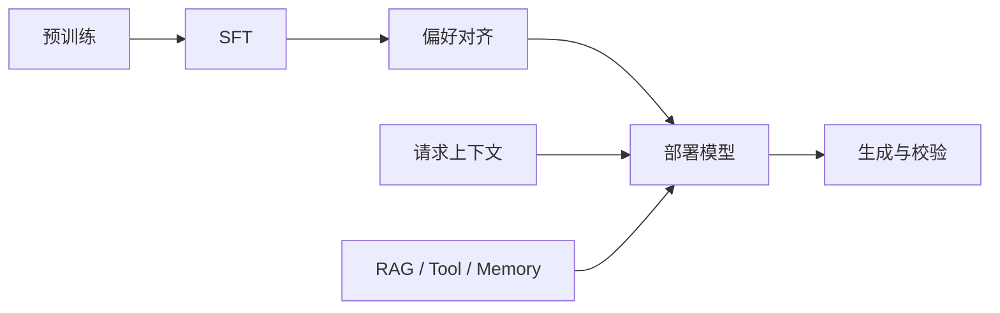

# 面试题（13） - 大模型基础与训练机制（第 101～110 题）

> 这组题考察应用工程师能否解释模型能力的来源和边界。回答应落到推理行为与工程影响，不必现场推导整篇论文。

## 第101题：为什么主流生成式大模型多采用 Decoder-only 架构？

**答案：** Decoder-only 用因果注意力统一训练与生成目标：根据前文预测下一个 Token，训练数据容易规模化，推理时还能复用 KV Cache。相比 Encoder-Decoder，它没有单独编码器和跨注意力，参数与部署链路更简单。它不是所有任务的理论最优解；翻译、编码检索等固定输入任务仍可能使用 Encoder 或 Encoder-Decoder。面试时要强调“统一目标、扩展性、推理复用”三点，而不是说其他架构已经失效。

## 第102题：自注意力为什么通常需要 Q、K、V，三者一定是独立参数吗？

**答案：** Q 表示当前 Token 要找什么，K 表示每个 Token 可被怎样匹配，`softmax(QKᵀ/√d)` 得到权重后再聚合 V。三个角色不同，但不要求三套完全独立的头：Multi-Query Attention 让多个 Query 头共享一组 K/V，Grouped-Query Attention 让一组 Query 头共享 K/V，以少量质量代价显著减少 KV Cache。Q、K、V 是计算角色，不应误解为必须独立存储三份上下文。

## 第103题：为什么很多大模型训练和推理配置很少使用 Dropout？

**答案：** 大规模预训练拥有海量且多样的数据，数据本身已提供强正则化；Dropout 会增加训练噪声、降低有效容量，也不利于精确复现。推理阶段 Dropout 本来就应关闭。不能把它说成绝对规律：小数据微调、分类头或特定架构仍可使用 Dropout，是否保留应由验证集过拟合程度决定。

## 第104题：大模型是如何“记住”上下文的？

**答案：** 单次请求内，历史 Token 通过注意力参与当前计算，推理服务通常把历史层的 K/V 缓存在显存中；它不是把对话永久写进模型参数。跨请求若没有再次传入历史、服务端会话状态或外部 Memory，模型就不记得。长期记忆通常是数据库中的事实或摘要，经检索后重新注入上下文，因此必须处理用户隔离、过期、冲突和删除。

## 第105题：大模型为什么会产生幻觉？

**答案：** 模型优化的是“生成条件概率较高的序列”，不是查询事实数据库。知识缺失、上下文冲突、问题前提错误、采样、训练噪声和对齐目标都可能让流畅性压过真实性。工程上要分层处理：RAG 提供证据，结构化工具获取实时事实，引用校验约束结论，低证据时拒答，评测集测忠实度。只把 Temperature 调低不能消除幻觉。

## 第106题：为什么 Temperature=0 仍可能得到不同输出？

**答案：** Temperature=0 通常表示贪心选择，但服务端并行归约、低精度计算、硬件内核、模型快照、动态路由或并列 Logit 的细小差异，都可能改变后续 Token。工具结果、检索排序和系统提示词变化也会放大差异。生产中应固定模型快照和参数、记录 Prompt 与依赖版本、对结构化结果做校验；不能把“近似确定”当成字节级确定。

## 第107题：为什么 SFT 后再做强化学习，某些离线指标可能先降后升？

**答案：** SFT 学习示范分布，强化学习优化的是奖励模型或可验证奖励，两者目标并不完全一致。训练初期策略偏离 SFT 分布，可能导致通用能力或格式指标下降；随着优势估计和约束稳定，目标任务收益才上升。应同时监控奖励、KL 距离、长度、能力回归集和安全集，保留基线检查点。若只看奖励上升，容易遇到 Reward Hacking。

## 第108题：向量化和词嵌入的本质区别是什么？

**答案：** 向量化是把任意对象映射为数值向量的统称，TF-IDF、图像特征、统计特征都属于向量化；Embedding 是通过学习得到的稠密表示，让语义相近对象在空间中更接近。RAG 常用句段级 Embedding，而不是逐词向量简单平均。选型要看语言、领域、最大长度、维度、检索指标、吞吐与许可证，并保证建库和查询使用同一模型与预处理版本。

## 第109题：Tokenizer 为什么会影响效果、延迟和成本？

**答案：** 模型按 Token 而不是字符计费和计算。一个领域词被拆成过多 Token，会占用窗口、增加 Prefill 计算，也可能削弱实体边界。评估模型时应在真实中文、代码、表格和业务缩写上统计 Token/字符比、截断率和成本，而不是只比较标称上下文长度。Prompt 压缩也要以 Token 数为准，不能只看字符串长度。

## 第110题：预训练、SFT 和偏好对齐分别解决什么问题？

**答案：** 预训练从大规模语料学习语言、知识和通用模式；SFT 用高质量指令示范教模型遵循任务与输出格式；偏好对齐通过人类或规则反馈改善有用性、安全性和风格。三者不能互相替代：动态企业事实应走 RAG，确定性业务动作应走工具和校验，不能靠再次训练“记住”频繁变化的数据。

## 参考资料

- [PyTorch：Scaled Dot Product Attention](https://docs.pytorch.org/docs/stable/generated/torch.nn.functional.scaled_dot_product_attention.html)
- [Hugging Face：Language modeling](https://huggingface.co/docs/transformers/tasks/language_modeling)
- [Hugging Face：Tokenizer summary](https://huggingface.co/docs/transformers/tokenizer_summary)

## 总结

模型是概率生成器；上下文、外部记忆和参数知识是三个不同层次。面试回答要能把架构机制转换成延迟、成本、可靠性和数据治理上的实际影响。

