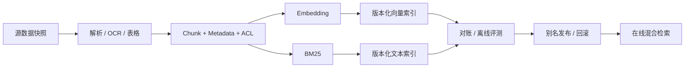

# 面试题（16） - RAG 进阶与数据工程（第 131～140 题）

> 读完你能：围绕“RAG 进阶与数据工程（第 131～140 题）”理解“第131题：RAG 准确率怎样从 60% 提升到 85%？”与“第132题：RAG 优化后怎样量化证明效果变好？”，并结合正文示例完成实践与排障。

> 本篇聚焦“库里有文档，但答案仍不好”的深层问题：解析、检索、图关系、评测和发布闭环。

## 第131题：RAG 准确率怎样从 60% 提升到 85%？

**答案：** 先把端到端失败按解析缺失、召回缺失、排序错误、上下文污染、生成不忠实分类，而不是直接换模型。解析问题修 OCR/表格；召回问题调 Chunk、Embedding、BM25 与 Query Rewrite；排序问题加 Rerank；生成问题做 Context Packing、引用和拒答。每次只改变一层，在固定评测集上做消融。60% 和 85% 必须对应明确指标及置信区间。

## 第132题：RAG 优化后怎样量化证明效果变好？

**答案：** 建立包含问题、标准证据、答案要点、权限和不可回答项的版本化评测集。检索层看 Recall@K、MRR/nDCG；生成层看忠实度、答案正确性、引用覆盖和拒答；系统层看 P95、错误率与单问成本。与旧版本同集对比并做坏案例分桶，线上再观察任务成功率和人工反馈，避免只用 LLM Judge 的单一分数。

## 第133题：RAG 从 Demo 到上线最常见的 12 个痛点是什么？

**答案：** 十二项可归为：复杂格式解析、Chunk 断义、Embedding 不匹配、专有词漏召回、Metadata/ACL 不完整、双写不一致、增量删除、索引版本切换、Rerank 延迟、上下文超预算、引用幻觉、缺少评测与 Trace。回答时应选真实项目中的两三项讲清根因、指标和修复，背完整清单但没有数据不算工程经验。

## 第134题：企业级 RAG 最危险的四类坑是什么？

**答案：** 第一是权限过滤放在召回后，造成越权和候选挤占；第二是没有稳定 ID 与版本，更新删除后残留旧块；第三是离线只看主观回答，无法定位哪层退化；第四是无发布与回滚机制，Embedding 或索引升级直接污染线上。四类问题分别对应安全、数据一致性、可评测和可运维性，比单纯调相似度阈值更关键。

## 第135题：GraphRAG 和普通 RAG 怎样选择？

**答案：** 普通 RAG 擅长从局部文本找直接证据，建设快、成本低；GraphRAG 抽取实体与关系，适合多跳关联、全局主题、影响链路和跨文档聚合。若问题主要是“某条制度怎么规定”，先用普通混合检索；若是“多家公司、人物和事件如何关联”，图检索更有价值。图谱抽取、消歧、更新和查询成本高，必须用多跳评测集证明收益。

## 第136题：“Claude Code 放弃 RAG”这个说法准确吗？

**答案：** 这个前提过度简化。代码 Agent 可以通过文件搜索、符号工具和逐步读取在请求时主动找上下文，这是一种 Agentic Retrieval，并不等于否定检索增强。预建向量索引对超大仓库、跨仓知识和语义问法仍可能有价值；即时工具检索则更新鲜、引用路径更透明。产品实现会变化，面试应比较数据新鲜度、索引成本、权限、可解释性和任务成功率，不要声称某产品“彻底放弃”某技术。

## 第137题：Agent 的 RAG 遇到 PDF 应该怎样处理？

**答案：** 先判断 PDF 是文本、扫描件还是混合版式；文本用布局感知解析，扫描页走 OCR，表格和图片单独抽取，并保留页码、坐标、标题层级和资源引用。分块不能只按字符切，应避免跨栏串行和表格拆散。建立页级抽样验收：字符/表格召回率、乱码率、页码引用和 OCR 置信度；低置信页面进入人工复核。

## 第138题：面试中怎样深入说明 Embedding 选型？

**答案：** 先说真实语料和查询类型，再比较语言与领域覆盖、最大长度、维度、归一化要求、稠密/稀疏能力、吞吐、成本、部署和许可证。在业务标注集上测 Recall@K 与下游 nDCG，而不是引用公开榜单。还要说明批处理、缓存、模型版本、双索引迁移和查询/建库一致性；这几项能区分 Demo 经验与生产经验。

## 第139题：Query Rewrite 怎样设计才不会改坏原问题？

**答案：** 只在指代不明、口语省略、多轮依赖或需要拆解时改写，保留原查询并记录改写结果。实体、数字、否定词和时间范围设为不可丢失约束；可同时召回原查询与改写查询，再用 RRF 融合。评测要同时看改写命中收益和语义漂移率，若改写超时或置信度低则退回原查询。

## 第140题：RAG 向量数据工程的完整链路是什么？

**答案：** 数据源快照进入解析和清洗，生成带稳定 ID、父子关系、ACL、来源与版本的 Chunk；批量 Embedding 后写入版本化索引，再做数量、哈希、维度和抽样查询对账；通过离线评测后原子切换别名。增量任务根据内容哈希执行新增、更新和删除，失败进入重试/死信，定期用源数据与索引做全量 reconciliation。

## 参考资料

- [Microsoft GraphRAG](https://microsoft.github.io/graphrag/)
- [Elasticsearch：Hybrid search](https://www.elastic.co/docs/solutions/search/hybrid-search)
- [LangSmith：Evaluation](https://docs.langchain.com/langsmith/evaluation)
- [Anthropic：Claude Code 官方仓库](https://github.com/anthropics/claude-code)

