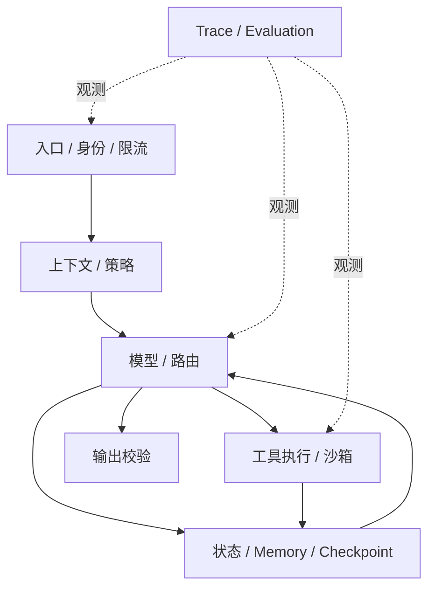

# 面试题（17） - Agent 架构与框架选型（第 141～150 题）

> 读完你能：围绕“Agent 架构与框架选型（第 141～150 题）”理解“第141题：Agent 常见的七类架构有哪些？”与“第142题：生产级 Agent 的六层架构怎样划分？”，并结合正文示例完成实践与排障。

> 这一组题要求候选人从任务确定性、状态复杂度和风险出发选架构，而不是按框架热度作答。

## 第141题：Agent 常见的七类架构有哪些？

**答案：** 可按控制流归纳为单次 Tool Calling、ReAct 循环、Plan-and-Execute、Router 分流、Supervisor-Worker、显式状态图、事件驱动多 Agent。分类不是标准答案，重点是说明控制权在哪里、状态怎样保存、失败如何恢复。确定流程优先工作流；开放探索才用动态循环；任务可独立且并行收益明确时再使用多 Agent。

## 第142题：生产级 Agent 的六层架构怎样划分？

**答案：** 可分为入口与身份层、上下文与策略层、模型与路由层、工具执行层、状态与记忆层、观测评测层。入口做租户与限流；策略层装配规则；模型层控制预算；工具层负责鉴权、幂等和隔离；状态层支持恢复；观测层记录 Trace 和指标。分层价值是能单独定位、替换和降级，而不是为了画复杂架构图。

## 第143题：Agent 和 Workflow 的核心差异是什么？

**答案：** Workflow 的步骤、分支和终止条件主要由代码预先定义，可预测、易测试；Agent 让模型根据环境动态决定下一步，适应性高但不确定。涉及付款、审批、删改数据等高风险流程，应让代码掌控主流程，只把分类、抽取或建议交给模型。很多生产系统是“确定性工作流包住少量 Agent 节点”的混合形态。

## 第144题：LangChain 和 LangGraph 怎样选择？

**答案：** LangChain 提供模型、Prompt、Retriever、Tool 与 Runnable 等通用组件，适合线性链和快速集成；LangGraph 以 State、Node、Edge 表达长生命周期、有循环、分支、持久化和人工介入的流程。两者可组合，LangGraph 节点内部可以调用 LangChain 组件。选型依据是控制流和恢复需求，不是项目规模。

## 第145题：LangGraph 的 State、Node、Edge 各解决什么问题？

**答案：** State 是跨步骤传递且可持久化的业务事实；Node 是读取旧状态并返回增量更新的计算单元；Edge 决定下一节点，条件边把路由显式化。它们让循环、重试、并行合并和中断恢复可以测试。State 应最小化并定义 Reducer，避免多个节点覆盖同一字段；Node 要尽量幂等，外部副作用需记录执行 ID。

## 第146题：Loop 与 Graph 的差异是什么？

**答案：** 单循环通常是“模型判断—工具执行—结果回灌”，适合步骤少、终止条件统一的任务；Graph 把多个业务阶段、条件、循环和人工节点显式建模，适合复杂编排。Graph 不自动提升智能，只提高控制和可观测性。若流程只有一个 ReAct 循环，硬拆大量节点会增加状态和测试成本。

## 第147题：代码 Agent 与传统聊天 Agent 的架构差异是什么？

**答案：** 代码 Agent 的环境可观察且可验证：它会搜索仓库、读取文件、编辑补丁、运行构建测试，再依据结果迭代；聊天 Agent 通常主要生成文本。生产级代码 Agent 还需要工作区隔离、命令权限、差异审查、长任务状态和终端输出压缩。模型能力重要，但工具反馈闭环与验收命令决定结果能否真正落地。

## 第148题：从零开发 Agent 的合理流程是什么？

**答案：** 先定义单一任务、成功标准和不可接受行为；用固定输入输出的单次模型调用建立基线；再逐个增加工具、状态和循环。工具先做 Schema、鉴权、超时、幂等和模拟测试；随后补 Trace、评测集、预算、人工介入与降级。上线前回放正常、边界、注入、下游失败和并发用例，避免一开始就搭多 Agent。

## 第149题：如何回答“你用过哪些 Agent 框架”？

**答案：** 不要只报名称。按层说明：模型/组件层用过什么，状态编排如何实现，观测评测接什么，为什么选择或弃用。至少讲一个真实取舍，例如线性 LCEL 足够时不引入图，长任务因需要 Checkpoint 与 HIL 才用 LangGraph。再给出版本、流量、成功率或排障案例，证明不是只跑过 Quickstart。

## 第150题：怎样做 Agent 框架选型？

**答案：** 先写需求矩阵：是否需要循环、并行、持久化、流式、HIL、多语言、部署约束、生态和可观测性。用同一小型任务做 Spike，测代码复杂度、恢复能力、P95、成本、调试体验和升级风险。核心业务状态与工具协议应保持框架无关，避免把所有逻辑绑定到某个抽象。能用普通代码清楚表达时，框架不是必选项。

## 参考资料

- [LangChain：Overview](https://docs.langchain.com/oss/python/langchain/overview)
- [LangGraph：Overview](https://docs.langchain.com/oss/python/langgraph/overview)
- [LangGraph：Persistence](https://docs.langchain.com/oss/python/langgraph/persistence)

