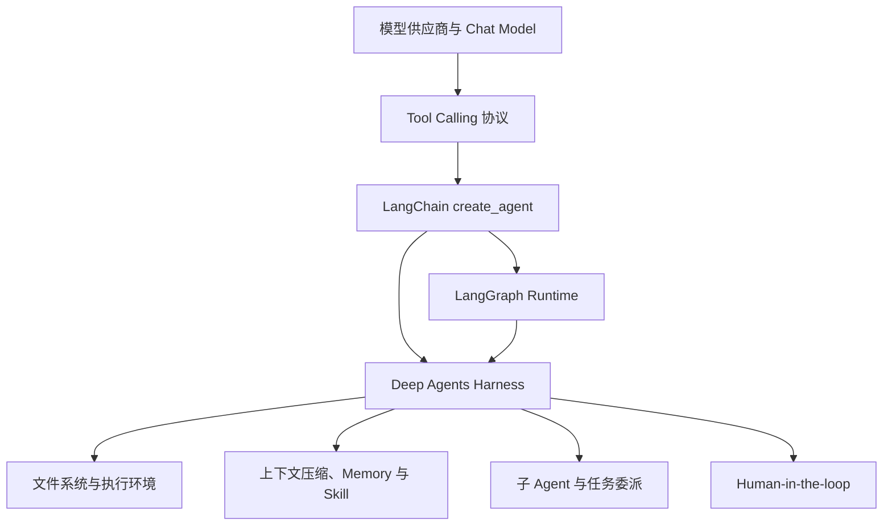

# Deep Agents（01） - Deep Agents 是什么：什么时候该用 Agent Harness

> 读完后，你应能完成以下任务：
> - 给定一个多步骤 AI 任务，能画出模型、Tool Calling、LangChain Agent、LangGraph Runtime 和 Deep Agents Harness 的分层图，输出架构记录，并用依赖方向解释每层负责什么。
> - 给定客服问答、固定审批流和深度调研三个需求，能填写框架选型表格，选择普通模型调用、LangChain `create_agent`、自定义 LangGraph 或 Deep Agents，并写出可检查的决策依据。
> - 给定一个长时间运行任务，能列出文件工作区、上下文压缩、Skill、子 Agent 和人工审批五项需求，输出缺失能力清单和停止条件。
> - 在文章沙盒运行选型检查器，用输出证明“步骤多”不是使用 Deep Agents 的充分条件，只有任务同时需要 Harness 能力时才值得引入。

# 一、先确定它在技术栈的哪一层

Deep Agents 不是一个新模型。

它也不是 RAG、向量数据库或 Prompt 模板的替代品。

官方把它定义为 Agent Harness：在核心工具调用循环之上，预装文件系统、上下文管理、子 Agent、长期记忆和人工介入等能力。

可以把技术栈画成下面几层：



这张图不是说 Deep Agents 同时“包含两个一模一样的运行时”。

它表达的是依赖关系：

- 模型提供推理和 Tool Calling 能力。
- LangChain 提供模型、工具和 Agent 的核心构件。
- LangGraph 提供持久执行、流式事件、Checkpoint 和中断恢复。
- Deep Agents 在这些构件上提供偏向长任务的 Harness 默认能力。

## 1.1 Harness 和框架有什么区别

框架提供构件，让你自己决定怎样组合。

Harness 不只提供构件，还给出一套能直接工作的运行环境和默认循环。

| 层次 | 主要问题 | 典型产物 |
| --- | --- | --- |
| 模型 API | 怎样生成文本或工具提议 | 模型响应 |
| LangChain | 怎样统一模型、消息、工具和轻量 Agent | Runnable、Tool、Agent |
| LangGraph | 怎样明确控制状态、分支、恢复和并行 | 状态图与 Checkpoint |
| Deep Agents | 怎样快速得到适合长任务的完整 Agent 工作台 | Harness、Backend、Skill、Subagent |

Harness 的价值是减少重复搭建。

代价是你需要接受更多默认行为，也要理解默认行为什么时候不适合。

# 二、Deep Agents 默认解决哪些长期任务问题

普通 Tool Calling 循环可以完成短任务。

任务变长以后，会出现五类工程问题。

## 2.1 工具结果太大

搜索、读取文件或执行命令可能返回几万字符。

如果所有结果都永久塞在消息历史里，上下文会快速膨胀。

Harness 需要把大结果存入文件或外部 Backend，只把稳定引用和必要摘要留在上下文中。

## 2.2 任务跨很多步骤

“调研三个框架、读取源码、比较能力、写报告并复核引用”不是一次工具调用能完成的。

Harness 需要保存计划、当前进度、中间产物和停止状态。

## 2.3 不同子任务需要不同上下文

搜索 Agent 需要关键词和网页结果。

代码分析 Agent 需要仓库文件。

报告 Agent 需要证据卡片，而不是全部原始网页。

子 Agent 使用隔离上下文可以减少互相污染，并允许并行执行独立任务。

## 2.4 能力不应该一次全部塞进 Prompt

几十个领域流程全部放入系统提示会增加 Token，也会干扰选择。

Skill 让 Agent 先看到简短索引，需要时再加载详细说明、示例和资源。

## 2.5 高风险动作必须能暂停

长任务经常包含写文件、执行代码、访问外部系统和发布结果。

Harness 需要在副作用之前中断，让人查看工具名、参数、风险和影响范围，再决定批准、修改或拒绝。

# 三、什么时候不应该使用 Deep Agents

Deep Agents 能做复杂任务，不代表所有任务都应该用它。

下面这些场景通常有更简单的方案：

| 场景 | 更合适的方案 | 原因 |
| --- | --- | --- |
| 单轮分类或字段抽取 | 结构化输出 | 没有工具循环和长期状态 |
| 固定的三步审批流程 | 普通代码或 LangGraph | 路径明确，不需要模型自主规划 |
| 一次数据库查询 | 单个 Tool Calling | 不需要文件、压缩和子 Agent |
| 标准两步 RAG | Retriever + 生成 Chain | 检索路径固定，Agent 自主性没有收益 |
| 需要精确事务的一组写操作 | 工作流引擎 | 确定性、补偿和审计优先 |

不要用“步骤数量”作为唯一判断标准。

十个完全固定的步骤仍然适合工作流。

三个路径不确定、结果很大并且需要委派的步骤，反而可能适合 Harness。

## 3.1 一个可执行的选型问题

依次问：

1. 任务路径是否需要模型在运行时决定？
2. 是否会读取或生成大量文件和中间产物？
3. 是否需要长上下文压缩或结果卸载？
4. 是否需要隔离上下文的子 Agent？
5. 是否需要持久恢复和人工审批？

第一个问题为“否”时，优先选择确定性工作流。

只有第一个为“是”，后续又有多项为“是”，Deep Agents 才明显优于轻量 Agent。

# 四、它和 RAG 是什么关系

RAG 解决“怎样从外部知识中找到证据并生成有引用的回答”。

Deep Agents 解决“怎样让 Agent 在长任务中管理工具、文件、上下文、委派和人工介入”。

两者可以组合，但不互相替代。

## 4.1 固定 RAG

```text
query -> retrieve -> rerank -> build context -> generate with citations
```

路径固定，容易评测，延迟和成本可预测。

## 4.2 Agentic RAG

```text
question -> decide whether to retrieve -> choose source -> inspect evidence
         -> rewrite query if needed -> stop or continue -> answer
```

路径由运行时证据决定，适合复杂问题，但更难评测和控制。

Deep Agents 可以为 Agentic RAG 提供文件工作区、长任务上下文和子 Agent。

但检索质量、引用正确性、ACL 和数据生命周期仍然属于 RAG 工程。

# 五、四种方案怎样选

| 判断维度 | 普通模型调用 | LangChain `create_agent` | 自定义 LangGraph | Deep Agents |
| --- | --- | --- | --- | --- |
| 工具调用 | 可手写一轮 | 内置 Agent 循环 | 自己定义节点 | 内置并扩展 |
| 路径控制 | 无 | 模型主导 | 代码和图主导 | 模型主导加 Harness |
| 持久恢复 | 自己实现 | 取决于配置 | 强项 | 基于 LangGraph 提供 |
| 文件工作区 | 自己实现 | 自己添加 Tool | 自己设计节点 | 内置 Backend 抽象 |
| 上下文压缩 | 自己实现 | 可加 Middleware | 自己设计 | 默认能力之一 |
| 子 Agent | 自己实现 | 可组合 | 自定义编排 | 内置委派能力 |
| 适合任务 | 短、确定 | 轻量自主任务 | 关键路径明确且复杂 | 长周期、开放式、多产物 |

选择时不要只比较“代码行数”。

还要比较故障定位、权限边界、状态恢复和团队理解成本。

# 六、可执行沙盒：先做 Harness 需求判断

下面的检查器不会安装 Deep Agents。

它把选型依据变成可以运行和修改的决策规则。

### main.py

```python runnable file=main.py title="Deep Agents 选型检查器" description="比较固定 RAG、轻量 Agent 和深度调研任务所需的最小运行层。"
"""根据任务特征选择最小够用的 AI 应用层。"""

from __future__ import annotations

from dataclasses import dataclass


@dataclass(frozen=True, slots=True)
class TaskRequirements:
    """保存影响 Agent 技术选型的任务特征。"""

    # 模型是否需要在运行时决定下一步。
    dynamic_path: bool
    # 任务是否会产生大量文件或中间产物。
    file_workspace: bool
    # 任务是否需要压缩或卸载长上下文。
    context_management: bool
    # 任务是否需要隔离上下文的子 Agent。
    delegation: bool
    # 任务是否需要中断恢复或人工审批。
    durable_approval: bool


def choose_runtime(requirements: TaskRequirements) -> tuple[str, tuple[str, ...]]:
    """返回最小够用的运行层和可复核的判断原因。"""

    # Harness 专属能力数量用于区分轻量 Agent 和长任务 Agent。
    harness_capability_count = sum(
        (
            requirements.file_workspace,
            requirements.context_management,
            requirements.delegation,
            requirements.durable_approval,
        )
    )
    # 决策原因会直接成为评审记录，不能只返回方案名。
    reasons: list[str] = []
    if not requirements.dynamic_path:
        reasons.append("任务路径固定，应优先使用确定性 Chain 或工作流")
        return "deterministic_workflow", tuple(reasons)
    if harness_capability_count >= 2:
        reasons.append(f"需要 {harness_capability_count} 项长任务 Harness 能力")
        reasons.append("运行路径由模型根据中间结果决定")
        return "deep_agents", tuple(reasons)
    if requirements.durable_approval:
        reasons.append("需要显式状态、中断和恢复，但不需要完整 Harness")
        return "langgraph", tuple(reasons)
    reasons.append("需要工具循环，但长任务能力较少")
    return "langchain_create_agent", tuple(reasons)


def main() -> None:
    """比较固定 RAG、轻量 Agent 和深度调研三个场景。"""

    # 三个任务覆盖确定性流程、轻量自主任务和 Harness 任务。
    scenarios = {
        "固定两步 RAG": TaskRequirements(False, False, False, False, False),
        "实时订单助手": TaskRequirements(True, False, False, False, False),
        "深度调研助手": TaskRequirements(True, True, True, True, True),
    }
    for scenario_name, requirements in scenarios.items():
        # 输出同时保留方案和原因，便于检查是否过度设计。
        runtime, reasons = choose_runtime(requirements)
        print(f"{scenario_name}: runtime={runtime} reasons={list(reasons)}")


if __name__ == "__main__":
    main()
```

预期结果：

- 固定两步 RAG 选择确定性工作流。
- 实时订单助手选择轻量 Agent。
- 深度调研助手选择 Deep Agents。

修改任意场景的一项需求，观察选型是否仍符合实际约束。

# 七、引入前必须确认的工程边界

## 7.1 模型能力

模型必须可靠支持 Tool Calling。

长任务还要评测：

- 工具选择准确率。
- 参数 Schema 合规率。
- 重复调用和空转概率。
- 长上下文压缩后的任务保持率。
- 子 Agent 委派质量。

## 7.2 执行环境

需要明确文件 Backend 是内存、本地目录、远端存储还是沙盒。

本地开发能读写文件，不代表生产环境应该拥有相同权限。

## 7.3 停止和恢复

必须设置最大步骤、总时间、工具预算和成本预算。

中断恢复时要验证幂等键，避免重放写操作。

## 7.4 可观测性

至少记录模型轮次、工具调用、文件变更、压缩事件、委派关系、审批决定和停止原因。

只有最终报告无法解释 Agent 为什么得到这个结论。

# 八、常见选型错误

| 错误 | 真实后果 | 修复方式 |
| --- | --- | --- |
| 把 Deep Agents 当更强模型 | 忽略模型与 Harness 的责任边界 | 分开记录模型版本和 Harness 配置 |
| 固定流程也使用自主 Agent | 成本、延迟和失败组合增加 | 先画确定性状态机 |
| 没学 Tool Calling 就直接使用 | 不知道权限和执行发生在哪里 | 先完成 Tool 前置模块 |
| 把 RAG 全部换成 Agentic RAG | 检索路径难评测、引用不稳定 | 固定 RAG 作为基线 |
| 默认开放文件和 Shell | Prompt 注入可放大为真实副作用 | 在 Backend 和 Tool 层限制权限 |
| 只看最终答案 | 无法定位错误选择、压缩或委派 | 保存结构化 Trace |

# 九、总结

- Deep Agents 是建立在 Tool Calling、LangChain 和 LangGraph 之上的 Agent Harness，不是模型或 RAG 替代品。
- 它主要解决文件工作区、长上下文、Skill、子 Agent、持久恢复和人工介入等长任务问题。
- 固定工作流、单次工具调用和标准两步 RAG 通常不需要完整 Harness。
- 选型要从路径是否动态和 Harness 能力需求出发，而不是只看步骤多少。
- 引入前必须定义执行权限、停止预算、恢复幂等和 Trace 证据。

## 9.1 参考资料

- [Deep Agents overview](https://docs.langchain.com/oss/python/deepagents/overview)
- [Deep Agents GitHub](https://github.com/langchain-ai/deepagents)
- [LangChain Agents](https://docs.langchain.com/oss/python/langchain/agents)
- [LangGraph overview](https://docs.langchain.com/oss/python/langgraph/overview)
