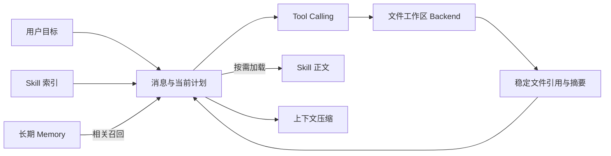

# Deep Agents（02） - Harness：文件系统、Skill 与上下文压缩

> 读完后，你应能完成以下任务：
> - 给定一个需要读取 100 个文件的任务，能设计“消息、文件、摘要、稳定引用”四层上下文，输出每层保存内容和保留期限，并用 Token 预算证明原文不会全部塞进消息历史。
> - 给定本地目录、内存状态和远端对象存储三个 Backend，能填写持久性、隔离、权限和恢复对比表格，并用故障恢复测试报告验证选择合理。
> - 给定三个领域流程，能判断哪些内容应放系统 Prompt、Tool、Skill 或 Memory，生成一份 Skill 索引，并用按需加载日志证明未使用的 Skill 没有进入上下文。
> - 在文章沙盒运行权限与上下文卸载模拟器，输出路径审计日志，验证越界路径被拒绝、大工具结果被写入工作区、消息中只保留稳定引用。

# 一、Harness 不是把更多文字塞进 Prompt

长任务最先遇到的限制通常不是模型不会推理，而是上下文越来越乱。

常见做法是把搜索结果、文件正文、历史计划和所有 Skill 一次性放进系统提示。

这样会产生三个问题：

- Token 成本随着步骤持续增长。
- 关键状态被大量原始内容淹没。
- 某次工具返回的恶意指令长期污染后续步骤。

Deep Agents Harness 的核心思路是把不同内容放在不同存储层，并按需要加载。



图里的关键不是组件数量，而是“什么内容什么时候进入模型上下文”。

# 二、文件系统为什么是上下文管理工具

文件系统不只是让 Agent 写报告。

它还承担上下文卸载：把大结果从消息历史移到可寻址的工作区。

## 2.1 哪些内容适合写入文件

- 搜索得到的原始网页正文。
- 大型日志和命令输出。
- 多个子 Agent 的中间产物。
- 结构化证据卡片。
- 最终报告草稿和审阅意见。

消息中只保留：

- 文件路径或资源 ID。
- 内容摘要。
- 版本或哈希。
- 谁生成、何时生成。
- 下一步为什么需要它。

## 2.2 Backend 决定什么

Deep Agents 的文件能力可以由不同 Backend 承载。

| Backend | 持久性 | 适合场景 | 主要风险 |
| --- | --- | --- | --- |
| 内存或状态 Backend | 当前运行或线程 | 单元测试、短期工作区 | 重启后丢失、容量有限 |
| 本地文件系统 | 取决于磁盘 | 本地开发、受控单机任务 | 路径穿越、宿主机泄露 |
| 持久 Store | 跨运行保存 | 长期 Memory、小型产物 | 租户隔离和版本管理 |
| 沙盒 Backend | 隔离环境生命周期 | 代码执行、不可信文件 | 启动成本和资源限制 |
| 远端对象存储 | 跨实例持久 | 大文件、报告和媒体 | 凭据、生命周期和下载权限 |

Backend 选择不能只看“能不能读写”。

还要看：

- 路径是否跨租户隔离。
- 运行结束后是否保留。
- 是否支持版本、删除和审计。
- 恢复时能否重新找到同一份产物。
- 大文件是否会回流到消息上下文。

# 三、文件权限必须在 Backend 层执行

Prompt 里写“不要读取工作区之外的文件”不是权限控制。

正确边界是：工具和 Backend 根本无法访问未授权路径。

## 3.1 路径校验至少包含什么

1. 把相对路径解析到明确工作区根目录。
2. 规范化 `.`、`..` 和符号链接影响。
3. 验证最终路径仍位于允许根目录。
4. 按读、写、删除和执行分别授权。
5. 对敏感扩展名和隐藏文件设置额外策略。
6. 保存调用身份、路径摘要和结果状态。

只检查字符串是否以工作区路径开头不够。

`/workspace-safe/../secrets` 可能在规范化后逃出目录。

## 3.2 Shell 和文件工具为什么要分开

文件工具可以限制为读取、精确替换和创建指定文件。

Shell 能力可以间接读取网络、环境变量和整个文件系统。

因此 Shell 应放在独立沙盒，拥有更严格的：

- 命令白名单或能力策略。
- CPU、内存、磁盘和时间限制。
- 网络白名单。
- 环境变量隔离。
- 人工审批。

# 四、Skill 解决的是按需能力加载

Skill 不是“另一个超长 Prompt 文件”。

一个可用 Skill 至少有：

- 稳定名称。
- 简短描述和触发条件。
- 详细操作步骤。
- 允许使用的工具或资源。
- 示例、模板和验收方法。
- 风险和停止条件。

Agent 首先只看到名称和简短描述。

确定需要某项能力后，再读取 Skill 正文或相关资源。

这叫渐进式披露。

## 4.1 什么应该放 Skill

适合：

- 低频但详细的领域流程。
- 可复用的调研、发布或排障方法。
- 带模板、示例和脚本的能力包。
- 会独立版本化和评测的操作规范。

不适合：

- 每次请求都必须遵守的安全规则，应放系统规则和代码策略。
- 确定性副作用，应放 Tool 和权限层。
- 用户长期偏好，应放 Memory。
- 当前任务的临时证据，应放工作区或状态。

## 4.2 Skill 描述怎样避免误加载

描述应该回答：

- 解决什么任务。
- 哪些输入是前置条件。
- 什么情况下不要使用。
- 最终会生成什么产物。

如果十个 Skill 都写“帮助完成复杂任务”，模型没有足够信号做选择。

# 五、上下文压缩到底压什么

上下文压缩不是简单删除最早消息。

一个长任务至少有四类信息：

| 信息 | 压缩策略 | 不能丢什么 |
| --- | --- | --- |
| 用户目标与约束 | 稳定保留 | 目标、范围、禁止项、验收标准 |
| 当前计划与进度 | 重写为状态摘要 | 已完成、下一步、阻塞、预算 |
| 工具原始结果 | 卸载到文件 | 文件引用、哈希、来源和关键结论 |
| 对话与推理历史 | 摘要或淘汰 | 决策理由和未解决分歧 |

## 5.1 压缩触发条件

可以按以下信号触发：

- 消息 Token 接近模型输入预算。
- 单次工具结果超过阈值。
- 一个任务阶段已经结束。
- 子 Agent 只需要向父 Agent 交付结构化产物。

不要等模型请求已经超限才压缩。

## 5.2 怎样验证压缩没有破坏任务

保存压缩前后的：

- 目标和约束字段。
- 已完成步骤。
- 未解决问题。
- 证据引用集合。
- 下一步计划。

然后运行固定恢复测试：

1. 从压缩状态继续执行下一步。
2. 询问一个依赖早期约束的问题。
3. 回链一个已卸载的证据文件。
4. 验证不会重复已经完成的副作用。

只有最终回答看起来正常，不能证明压缩正确。

# 六、Memory、Skill 和工作区不要混用

| 内容 | 工作区 | Skill | Memory |
| --- | --- | --- | --- |
| 当前调研的网页原文 | 是 | 否 | 通常否 |
| 可复用的调研流程 | 否 | 是 | 否 |
| 用户偏好的报告格式 | 否 | 可作为模板 | 是 |
| 当前运行的任务计划 | 是或状态 | 否 | 通常否 |
| 跨会话确认的稳定事实 | 可做来源 | 否 | 是 |

把临时工具结果写入长期 Memory 会污染以后会话。

把用户偏好只放当前工作区，下一次任务又会丢失。

把每次都要遵守的权限规则放 Skill，则可能因为 Skill 未加载而失效。

# 七、可执行沙盒：验证路径和上下文卸载

示例使用内存字典模拟文件 Backend。

它不访问真实文件系统，不需要 API Key。

### main.py

```python runnable file=main.py title="Deep Agents 工作区与上下文卸载" description="运行路径校验和大结果卸载场景，验证工作区边界与上下文预算。"
"""模拟受限工作区、工具结果卸载和消息引用。"""

from __future__ import annotations

from dataclasses import dataclass, field
from hashlib import sha256
from pathlib import PurePosixPath


@dataclass(slots=True)
class MemoryBackend:
    """保存单个运行的隔离文件工作区。"""

    # root 是当前运行唯一允许访问的绝对路径前缀。
    root: PurePosixPath
    # files 保存规范化绝对路径和文件正文。
    files: dict[PurePosixPath, str] = field(default_factory=dict)

    def resolve(self, relative_path: str) -> PurePosixPath:
        """解析 relative_path，并拒绝逃出 root 的路径。"""

        # 原始相对路径被拆成组件后执行显式规范化。
        raw_path = PurePosixPath(relative_path)
        # 规范化组件用于消除点目录和父目录跳转。
        normalized_parts: list[str] = []
        for path_part in raw_path.parts:
            if path_part in ("", ".", "/"):
                continue
            if path_part == "..":
                if not normalized_parts:
                    raise PermissionError("path_outside_workspace")
                normalized_parts.pop()
                continue
            normalized_parts.append(path_part)
        # 最终绝对路径始终从当前工作区根目录构造。
        resolved_path = self.root.joinpath(*normalized_parts)
        if resolved_path == self.root:
            raise PermissionError("file_path_required")
        return resolved_path

    def write(self, relative_path: str, content: str) -> str:
        """在隔离工作区写入 content，并返回稳定内容摘要。"""

        # 只有通过路径规范化的文件才能写入 Backend。
        resolved_path = self.resolve(relative_path)
        self.files[resolved_path] = content
        # 内容哈希用于验证后续引用读取的是同一版本。
        content_hash = sha256(content.encode("utf-8")).hexdigest()[:12]
        return content_hash


def offload_tool_result(
    backend: MemoryBackend,
    tool_name: str,
    tool_result: str,
    threshold: int = 80,
) -> dict[str, str]:
    """把超过 threshold 的工具结果写入工作区，并返回消息内容。"""

    if len(tool_result) <= threshold:
        return {"kind": "inline", "content": tool_result}
    # 文件名由稳定工具名和结果摘要构成，避免覆盖其他结果。
    result_hash = sha256(tool_result.encode("utf-8")).hexdigest()[:12]
    # 工作区相对路径便于跨 Backend 保持统一消息格式。
    relative_path = f"tool-results/{tool_name}-{result_hash}.txt"
    # Backend 返回的写入摘要用于消息和文件版本核对。
    stored_hash = backend.write(relative_path, tool_result)
    return {
        "kind": "file_reference",
        "path": relative_path,
        "sha256": stored_hash,
        "summary": tool_result[:40] + "...",
    }


def main() -> None:
    """验证大结果卸载和越界路径拒绝。"""

    # 当前运行拥有独立的虚拟工作区根目录。
    backend = MemoryBackend(PurePosixPath("/runs/run-42"))
    # 大型搜索结果用于触发上下文卸载。
    large_result = "证据段落。" * 40
    # 消息引用只保存路径、摘要和哈希，不保存整段原文。
    message_reference = offload_tool_result(backend, "search", large_result)
    print(f"message={message_reference}")
    print(f"stored_files={list(map(str, backend.files))}")
    try:
        # 越界样本证明提示内容不能绕过 Backend 权限。
        backend.write("../../secrets.txt", "should not be written")
    except PermissionError as error:
        print(f"blocked={error}")


if __name__ == "__main__":
    main()
```

预期结果：

- `message.kind` 是 `file_reference`。
- 消息只保留摘要、路径和哈希。
- 原始大结果存在隔离 Backend 中。
- `../../secrets.txt` 被拒绝。

# 八、怎样把这些能力接进真实项目

## 8.1 先定义运行目录

每次运行使用独立根目录或命名空间。

目录至少区分：

- 输入快照。
- 工具原始结果。
- 结构化中间产物。
- 草稿。
- 最终交付物。

## 8.2 再定义上下文清单

每轮进入模型前记录：

- 当前目标。
- 活跃计划。
- 加载的 Skill。
- 召回的 Memory。
- 文件引用。
- Token 预算。

## 8.3 最后定义压缩与恢复测试

压缩策略必须版本化。

同一份运行状态应该能使用原压缩版本恢复。

上线前至少重放：

- 压缩后继续执行。
- Backend 暂时不可用。
- 文件引用指向旧版本。
- Skill 加载失败。
- 人工审批后恢复。

# 九、常见故障与排查

| 现象 | 第一个检查点 | 常见根因 | 修复方向 |
| --- | --- | --- | --- |
| Agent 忘记用户关键限制 | 压缩前后状态 Diff | 摘要只保留最近步骤 | 把目标和禁止项做成固定字段 |
| Token 仍持续增长 | 每轮消息和文件引用 | 大工具结果仍内联 | 按阈值卸载并限制回读范围 |
| Skill 经常选错 | Skill 索引描述 | 描述过宽或能力重叠 | 增加触发条件和反向边界 |
| 跨会话看到别人文件 | Backend 命名空间 | 没有租户和运行隔离 | 根目录绑定可信身份 |
| 恢复后重复执行命令 | Checkpoint 与幂等记录 | 只恢复了消息 | 工具结果和副作用状态一起恢复 |
| 删除工作区后报告不可审计 | 产物生命周期 | 引用没有归档 | 最终证据迁移到持久存储 |

# 十、验收清单

- [ ] 每次运行拥有明确工作区和可信身份。
- [ ] 路径权限由 Backend 或工具代码执行。
- [ ] 大工具结果会卸载，消息保留摘要、路径和版本。
- [ ] Skill 通过索引按需加载，不一次注入全部正文。
- [ ] Memory、Skill、任务状态和工作区有明确边界。
- [ ] 压缩前后能对比目标、进度、证据和下一步。
- [ ] 恢复测试覆盖文件缺失、版本漂移和重复副作用。
- [ ] Trace 能看到文件、Skill、压缩和审批事件。

# 十一、总结

- 文件系统既保存产物，也把大工具结果从消息上下文卸载出去。
- Backend 决定持久性、隔离和权限，Prompt 不能替代路径控制。
- Skill 用于按需加载低频详细能力，不能承载必须始终执行的安全规则。
- 上下文压缩要保留目标、状态、证据引用和未解决问题，而不是简单删除旧消息。
- 工作区、Skill、Memory 和运行状态分别服务不同生命周期，混用会造成污染和恢复困难。

## 11.1 参考资料

- [Deep Agents overview](https://docs.langchain.com/oss/python/deepagents/overview)
- [Deep Agents Skills](https://docs.langchain.com/oss/python/deepagents/skills)
- [Deep Agents Context Engineering](https://docs.langchain.com/oss/python/deepagents/context-engineering)
- [Deep Agents Backends](https://docs.langchain.com/oss/python/deepagents/backends)
- [Deep Agents Permissions](https://docs.langchain.com/oss/python/deepagents/permissions)
