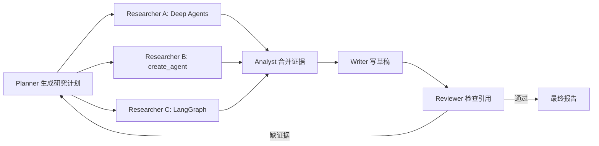

# Deep Agents（03） - 实战：用子 Agent 构建深度调研助手

> 读完后，你应能完成以下任务：
> - 给定一个技术选型问题，能拆出 Planner、Researcher、Analyst、Writer 和 Reviewer 五个职责，输出每个子 Agent 的输入、工具、产物和停止条件。
> - 给定三条网页资料，能生成带来源 ID、结论、证据、时间和置信度的证据卡片，并用引用回链检查证明最终报告没有脱离来源。
> - 给定两个可并行研究分支和一个依赖汇总步骤，能画出 fan-out / fan-in 流程，设置失败与部分成功策略，并用 Trace 证明上下文没有在子 Agent 间无条件共享。
> - 在文章沙盒运行确定性调研流水线，验证缺少证据的结论被 Reviewer 拒绝、来源冲突会进入待核对列表、合格报告能够回链全部引用。

# 一、先定义交付物，不要先定义角色人设

“做一个多 Agent 调研助手”不是可验收需求。

先定义最终交付物：

- 回答哪个决策问题。
- 比较哪些候选方案。
- 使用哪些允许来源。
- 每个结论怎样引用证据。
- 哪些冲突必须显式保留。
- 什么情况下停止并请求人工判断。

例如：

```text
问题：Deep Agents、LangChain create_agent 和自定义 LangGraph 应怎样选？
候选：三种方案。
来源：官方文档和官方仓库。
产物：对比表、推荐条件、风险、来源清单。
停止：关键能力没有一手来源，或来源之间相互冲突。
```

只有交付物明确后，才知道是否需要多个子 Agent。

## 1.1 为什么“研究员、专家、作家”还不够

角色名不能形成协作契约。

下面两种定义差异很大：

```text
Researcher：负责搜索资料。
```

```text
Researcher：输入 research_question 和 allowed_domains；
输出 source_cards[]，每张包含 source_id、URL、标题、发布日期、摘录摘要和支持的 claim_id；
不得直接写最终推荐；没有一手来源时返回 blocked_reason。
```

第二种才可以测试、重试和替换。

# 二、按上下文边界拆子 Agent

Deep Agents 支持把任务委派给隔离上下文的子 Agent。

拆分依据不是“模拟一个团队”，而是以下边界：

- 所需工具不同。
- 所需资料不同。
- 输出契约不同。
- 风险和权限不同。
- 子任务可以独立失败或并行。

## 2.1 五个角色的最小契约

| 子 Agent | 输入 | 允许工具 | 输出 | 不应该做什么 |
| --- | --- | --- | --- | --- |
| Planner | 用户目标、范围、预算 | 无或只读目录 | `research_plan` | 不搜索、不写答案 |
| Researcher | 单个研究问题、来源范围 | 搜索、抓取、读文件 | `source_cards` | 不做最终选型 |
| Analyst | 证据卡片、评价维度 | 只读证据 | `claim_table` | 不创造新来源 |
| Writer | claim table、报告模板 | 写文件 | `report_draft` | 不删除不确定性 |
| Reviewer | 草稿、证据、验收规则 | 只读文件 | `review_result` | 不静默修正证据 |

这里 Writer 不需要网络工具。

Reviewer 也不需要修改生产文件。

最小权限可以降低提示注入的影响范围。

# 三、中间产物必须是结构化契约

如果 Researcher 只返回一大段自然语言，Analyst 很难判断每句话来自哪里。

建议使用证据卡片：

```yaml
source_id: source-deepagents-overview
url: https://docs.langchain.com/oss/python/deepagents/overview
title: Deep Agents overview
retrieved_at: 2026-08-16T10:00:00+08:00
claim_id: claim-harness-capabilities
evidence_summary: Deep Agents bundles filesystem, context management, delegation and steering capabilities.
confidence: high
limitations:
  - official product documentation
```

## 3.1 证据卡片为什么不能只保存摘录

还需要保存：

- 稳定来源标识。
- URL 或本地文件路径。
- 标题和版本时间。
- 它支持哪个结论。
- 提取者和运行 ID。
- 证据限制与冲突。

原始正文可以放工作区，卡片只保存摘要和回链信息。

## 3.2 Claim Table 负责什么

Analyst 不直接写报告，而是先形成结论表：

| claim_id | 结论 | 支持来源 | 反对或限制 | 状态 |
| --- | --- | --- | --- | --- |
| C1 | Deep Agents 是 Harness | S1、S2 | 不是自定义图的通用替代品 | verified |
| C2 | 所有任务都应使用 Deep Agents | 无 | 固定流程更适合工作流 | rejected |
| C3 | 子 Agent 能降低上下文污染 | S1 | 增加调用和协调成本 | verified_with_limit |

Writer 只能使用状态允许的结论。

Reviewer 可以根据表格检查遗漏、冲突和无来源断言。

# 四、并行只用于真正独立的研究分支



三个候选方案的资料收集可以并行。

Analyst 必须等待需要的分支完成，或者明确按部分成功策略继续。

## 4.1 fan-out 前要固定什么

- 子问题列表。
- 每个分支允许的来源。
- 输出 Schema。
- 最大工具调用和时间预算。
- 去重键和来源规范化规则。

## 4.2 fan-in 时要处理什么

- 同一来源被多个分支重复抓取。
- 不同来源对同一结论发生冲突。
- 某个分支超时或没有一手来源。
- 子 Agent 使用了不同版本的评价标准。

不要把多个自然语言结果简单拼接后交给 Writer。

先规范化为统一证据卡片和 Claim Table。

# 五、父 Agent 应该掌握多少上下文

父 Agent 需要知道：

- 用户目标和验收标准。
- 研究计划和当前状态。
- 子任务输入引用。
- 子 Agent 返回的结构化摘要。
- 冲突、失败和预算。

父 Agent 不需要自动接收：

- 每个搜索查询的完整对话。
- 每个网页的全部正文。
- 子 Agent 的内部推理历史。
- 与最终决策无关的临时工具输出。

隔离上下文的价值就在这里。

如果所有子 Agent 内容最终仍复制回父消息，Token 和污染问题并没有解决。

# 六、失败和部分成功怎样处理

## 6.1 Researcher 没找到一手来源

返回：

```yaml
status: blocked
blocked_reason: no_primary_source
queries_attempted:
  - ...
```

不要用博客摘要冒充官方能力结论。

## 6.2 来源之间冲突

保留两张证据卡片，并在 Claim Table 标记 `conflicted`。

Writer 必须展示冲突，不能选择更符合预期的一条静默覆盖。

## 6.3 一个并行分支超时

提前定义：

- 全部失败才停止。
- 缺少关键候选就停止。
- 非关键分支失败可以生成部分报告。

最终报告需要写清未完成范围。

## 6.4 Reviewer 不通过

Reviewer 返回具体缺陷：

- `missing_citation:C3`
- `unknown_source:S9`
- `conflict_hidden:C5`
- `scope_not_covered:cost`

父 Agent 根据缺陷决定补研究、重写或请求人工处理。

设置最大修订轮数，防止 Reviewer 和 Writer 无限往返。

# 七、可执行沙盒：验证证据回链

示例不调用真实模型。

它用确定性数据模拟 Researcher、Analyst、Writer 和 Reviewer 的交接契约。

### main.py

```python runnable file=main.py title="Deep Agents 调研证据回链" description="运行多子任务证据汇总与声明校验，观察缺失引用和冲突证据如何阻断交付。"
"""模拟多 Agent 调研中的证据卡片、结论表和引用审查。"""

from __future__ import annotations

from dataclasses import dataclass


@dataclass(frozen=True, slots=True)
class SourceCard:
    """保存一条可回链的研究证据。"""

    # source_id 是报告引用使用的稳定标识。
    source_id: str
    # topic 表示当前来源覆盖的候选方案。
    topic: str
    # claim 表示来源能够支持的简化结论。
    claim: str
    # confidence 表示来源质量和结论直接程度。
    confidence: str


@dataclass(frozen=True, slots=True)
class ClaimRecord:
    """保存 Analyst 产出的结论和来源集合。"""

    # claim_id 用于报告和 Reviewer 之间稳定关联。
    claim_id: str
    # statement 是允许 Writer 使用的明确结论。
    statement: str
    # source_ids 保存所有支持当前结论的来源。
    source_ids: tuple[str, ...]
    # status 区分已验证、冲突和缺少证据。
    status: str


def analyze_cards(cards: tuple[SourceCard, ...]) -> tuple[ClaimRecord, ...]:
    """把证据卡片整理为结论记录，并保留冲突。"""

    # 按主题分组后的证据用于检测同一主题的结论冲突。
    cards_by_topic: dict[str, list[SourceCard]] = {}
    for card in cards:
        cards_by_topic.setdefault(card.topic, []).append(card)
    # 分析结果只包含能够回链到来源的结论。
    records: list[ClaimRecord] = []
    for topic, topic_cards in cards_by_topic.items():
        # 当前主题出现的不同结论集合用于判断冲突。
        statements = {card.claim for card in topic_cards}
        # 当前主题全部来源 ID 会原样进入结论记录。
        source_ids = tuple(card.source_id for card in topic_cards)
        if len(statements) == 1:
            records.append(ClaimRecord(f"claim-{topic}", statements.pop(), source_ids, "verified"))
        else:
            records.append(ClaimRecord(f"claim-{topic}", "来源结论冲突", source_ids, "conflicted"))
    return tuple(records)


def write_report(records: tuple[ClaimRecord, ...]) -> tuple[dict[str, str], ...]:
    """只把已验证结论写入报告草稿，并保留来源标识。"""

    # 报告段落使用结构化字段，Reviewer 不需要解析自然语言引用。
    paragraphs: list[dict[str, str]] = []
    for record in records:
        if record.status != "verified":
            continue
        paragraphs.append(
            {
                "claim_id": record.claim_id,
                "text": record.statement,
                "citations": ",".join(record.source_ids),
            }
        )
    return tuple(paragraphs)


def review_report(
    report: tuple[dict[str, str], ...],
    records: tuple[ClaimRecord, ...],
    cards: tuple[SourceCard, ...],
) -> tuple[str, ...]:
    """检查报告结论、引用和冲突是否符合交接契约。"""

    # 已知来源集合用于拒绝 Writer 创造的引用。
    known_source_ids = {card.source_id for card in cards}
    # 已验证结论映射用于检查 Writer 是否改写了事实。
    verified_records = {
        record.claim_id: record for record in records if record.status == "verified"
    }
    # 审查错误列表会成为父 Agent 的明确修订输入。
    errors: list[str] = []
    for paragraph in report:
        # 当前段落引用集合由结构化字段解析。
        citation_ids = set(filter(None, paragraph.get("citations", "").split(",")))
        # 当前段落关联的已验证结论可能不存在。
        record = verified_records.get(paragraph.get("claim_id", ""))
        if record is None:
            errors.append(f"unverified_claim:{paragraph.get('claim_id')}")
            continue
        if paragraph.get("text") != record.statement:
            errors.append(f"claim_changed:{record.claim_id}")
        if not citation_ids:
            errors.append(f"missing_citation:{record.claim_id}")
        if not citation_ids.issubset(known_source_ids):
            errors.append(f"unknown_source:{record.claim_id}")
    return tuple(errors)


def main() -> None:
    """运行合格证据、冲突证据和伪造引用三个场景。"""

    # 三张来源卡包含一个一致主题和一个冲突主题。
    cards = (
        SourceCard("S1", "harness", "Deep Agents 提供长任务 Harness 能力", "high"),
        SourceCard("S2", "runtime", "Deep Agents 构建在 LangGraph Runtime 上", "high"),
        SourceCard("S3", "runtime", "Deep Agents 不依赖任何运行时", "low"),
    )
    # Analyst 保留 runtime 冲突，不允许 Writer 选择其一。
    records = analyze_cards(cards)
    # Writer 只使用 verified 结论。
    valid_report = write_report(records)
    print(f"records={records}")
    print(f"valid_review={review_report(valid_report, records, cards)}")
    # 伪造报告用于验证 Reviewer 会拒绝未知来源。
    invalid_report = (
        {"claim_id": "claim-harness", "text": "Deep Agents 提供长任务 Harness 能力", "citations": "S999"},
    )
    print(f"invalid_review={review_report(invalid_report, records, cards)}")


if __name__ == "__main__":
    main()
```

预期结果：

- `claim-harness` 是 `verified`。
- `claim-runtime` 是 `conflicted`，不会进入报告。
- 合格报告审查结果为空元组。
- 伪造来源得到 `unknown_source` 错误。

# 八、真实 Deep Agents 实现要补什么

确定性示例验证了交接契约，但真实模型系统还要补充：

## 8.1 子 Agent 配置

每个子 Agent 明确：

- 名称和描述。
- 系统规则。
- 允许工具。
- 输入引用。
- 输出 Schema。
- 最大步骤、时间和成本。

## 8.2 工作区结构

```text
workspace/
  plan.json
  sources/
  source-cards/
  claims.json
  drafts/
  reviews/
  final-report.md
```

父 Agent 通过文件引用传递大产物，不把全部正文复制进消息。

## 8.3 委派 Trace

每次委派保存：

- 父运行 ID。
- 子 Agent 名称。
- 任务输入摘要。
- 允许工具和预算。
- 开始、结束和停止原因。
- 产物路径与哈希。
- 错误和重试。

## 8.4 人工介入点

适合暂停的位置：

- 研究范围或预算即将扩大。
- 需要访问未批准来源。
- 来源冲突会影响最终建议。
- 报告包含高风险结论。
- 最终产物准备发布或发送。

# 九、怎样验收调研助手

不要只看报告是否“像专业文章”。

至少测以下指标：

| 指标 | 怎样计算 | 失败说明 |
| --- | --- | --- |
| 引用覆盖率 | 有来源的关键结论 / 全部关键结论 | Writer 产生无证据断言 |
| 引用正确率 | 真正支持结论的引用 / 全部引用 | 引用存在但不支持文本 |
| 一手来源比例 | 官方或原始来源 / 全部来源 | 研究过度依赖二手摘要 |
| 冲突披露率 | 已展示冲突 / 已发现冲突 | Analyst 或 Writer 静默覆盖 |
| 子任务成功率 | 合格产物 / 已委派子任务 | 契约、工具或预算不合理 |
| 重复来源率 | 重复来源 / 全部来源 | fan-out 缺少去重 |

离线评测集应包含：

- 来源充足的问题。
- 没有一手来源的问题。
- 官方文档版本冲突的问题。
- 一个研究分支超时的问题。
- Prompt 注入网页。
- 报告引用存在但不支持结论的问题。

# 十、常见故障与排查

| 现象 | 第一个检查点 | 常见根因 | 修复方式 |
| --- | --- | --- | --- |
| 报告很长但没有证据 | Claim Table | Writer 直接读取网页写作 | 强制先生成证据卡片和结论表 |
| 子 Agent 反复搜索同一来源 | 查询和 URL 规范化 | 没有共享去重索引 | fan-out 前建立来源注册表 |
| 父上下文仍然超限 | 委派结果消息 | 子 Agent 返回完整原文 | 产物写工作区，只回传摘要和路径 |
| 一个分支失败后全任务卡死 | fan-in 策略 | 没有部分成功规则 | 标记关键与非关键分支 |
| Writer 和 Reviewer 无限往返 | 修订轮数与错误码 | 审查反馈不结构化 | 固定错误类型和最大修订次数 |
| 恶意网页触发危险工具 | Researcher 权限 | 子 Agent 工具过多 | 搜索子 Agent 只给只读工具 |

# 十一、总结

- 多 Agent 调研应先定义交付物和结构化中间产物，再定义角色。
- 子 Agent 按工具、上下文、产物、权限和失败隔离边界拆分，不按人设拆分。
- fan-out 可以并行独立研究，fan-in 必须处理去重、冲突、超时和部分成功。
- 父 Agent 只接收结构化摘要和文件引用，不应汇总全部子 Agent 对话。
- Reviewer 要检查结论、来源和冲突，最终报告的关键判断必须能回到证据卡片。

## 11.1 参考资料

- [Deep Agents overview](https://docs.langchain.com/oss/python/deepagents/overview)
- [Deep Agents Subagents](https://docs.langchain.com/oss/python/deepagents/subagents)
- [Deep Agents Human-in-the-loop](https://docs.langchain.com/oss/python/deepagents/human-in-the-loop)
- [Deep Agents Context Engineering](https://docs.langchain.com/oss/python/deepagents/context-engineering)
