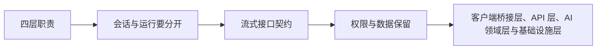

# 应用框架（05） - AI 应用分层架构、会话与接口契约

> 读完后，你应能完成以下任务：
> - 绘制“应用框架（05） - AI 应用分层架构、会话与接口契约 / 四层职责”的关键对象与数据流，解释“这种划分使模型供应商、向量库或框架可以替换，也让领域逻辑能够脱离网络和真实模型做确定性测试。”，并用源码位置、日志或 Trace 标注证据。
> - 为“应用框架（05） - AI 应用分层架构、会话与接口契约 / 会话与运行要分开”设计正常与异常输入，验证“Conversation 是长期容器，Message 是用户或助手的可见消息，Run 是一次处理过程，Event 是 Run 的增量事实。”，输出首个偏差位置与回归测试结果。
> - 实现“应用框架（05） - AI 应用分层架构、会话与接口契约 / 流式接口契约”的最小代码或配置，检验“HTTP 返回 200 只说明流建立成功，后续业务错误必须通过 error 事件表达。”，输出命令、结果与 Diff，并说明不适用边界。

> AI 应用的复杂度不在某个 SDK，而在客户端、业务规则、模型编排、数据基础设施之间的边界。


## 核心知识清单

- 客户端桥接层、API 层、AI 领域层与基础设施层
- 会话、消息、运行 Run 与事件 Event 数据模型
- start、delta、tool_call、tool_result、done 与 error 事件
- 幂等键、并发消息、取消与断线恢复
- 用户、租户、工作区与资源级授权
- 日志清洗、数据保留与删除策略

<!-- article-progressive-block:start -->
# 一、先建立全局：AI 应用分层架构、会话与接口契约 是什么？

理解“AI 应用分层架构、会话与接口契约”，先要把标题中的对象放进同一条处理链：它接收什么输入，经过哪些状态变化，最终用什么证据判断结果。下表不另造概念，只把作者正文已经解释的章节按依赖顺序连起来。

“AI 应用分层架构、会话与接口契约”的第一个核心判断是：这种划分使模型供应商、向量库或框架可以替换，也让领域逻辑能够脱离网络和真实模型做确定性测试。。先弄清这个判断中的对象和输入输出，后面的实现、故障和验收才有共同语境。

| 顺序 | 章节 | 读完本节应抓住的结论 |
| --- | --- | --- |
| 1 | 四层职责 | 这种划分使模型供应商、向量库或框架可以替换，也让领域逻辑能够脱离网络和真实模型做确定性测试。 |
| 2 | 会话与运行要分开 | Conversation 是长期容器， |
| 3 | 流式接口契约 | HTTP 返回 200 只说明流建立成功，后续业务错误必须通过 error 事件表达。 |
| 4 | 权限与数据保留 | 身份验证后仍要在 Retriever、Tool 和最终返回三个位置执行资源级授权。 |
| 5 | 客户端桥接层、API 层、AI 领域层与基础设施层 | AI 应用的复杂度不在某个 SDK，而在客户端、业务规则、模型编排、数据基础设施之间的边界。 |
| 6 | 会话、消息、运行 Run 与事件 Event 数据模型 | 推荐事件最少包含：event_id、run_id、sequence、type、created_at 和 payload。 |

## 1.1 核心对象之间怎样衔接



这张图只表达本文的讲解顺序，不替代正文机制。判断“AI 应用分层架构、会话与接口契约”是否真正掌握，需要能从最后一个结果沿图回到前面每个章节的输入、状态变化和证据。

## 1.2 再看失败：问题最早会出现在哪一步？

在“AI 应用分层架构、会话与接口契约”的对象和顺序已经明确后，再看可观察的失败：条件缺失、结果不可复现或失败后责任不清。定位时不从最后一条错误猜原因，而是沿上图找第一个偏离正文结论的节点。
<!-- article-progressive-block:end -->

# 二、四层职责

| 层 | 应负责 | 不应负责 |
| --- | --- | --- |
| 客户端桥接层 | 输入、流式渲染、取消、重连 | 保存模型密钥、决定资源权限 |
| API 层 | 鉴权、限流、协议转换、请求追踪 | 把业务流程散落在路由函数中 |
| AI 领域层 | Prompt、检索、工具、状态机、质量策略 | 直接依赖某个数据库驱动 |
| 基础设施层 | 模型、数据库、队列、对象存储适配 | 决定业务拒答或审批规则 |

这种划分使模型供应商、向量库或框架可以替换，也让领域逻辑能够脱离网络和真实模型做确定性测试。

# 三、会话与运行要分开

Conversation 是长期容器，
Message 是用户或助手的可见消息，
Run 是一次处理过程，
Event 是 Run 的增量事实。
一个用户消息可能产生多次 Run，例如失败重试或人工批准后恢复。
只存最终消息会丢失工具调用、取消位置和错误证据。

推荐事件最少包含：`event_id`、`run_id`、`sequence`、`type`、`created_at` 和 `payload`。
客户端按 `sequence` 去重排序，断线时从最后确认序号继续拉取。

# 四、流式接口契约

```text
start       -> run_id、model、prompt_version
delta       -> 增量文本或结构化片段
tool_call   -> 工具名、脱敏参数、审批状态
tool_result -> 结果摘要、耗时、错误类型
done        -> 完整结果、引用、token、finish_reason
error       -> 可重试标记、用户消息、trace_id
```

HTTP 返回 `200` 只说明流建立成功，后续业务错误必须通过 `error` 事件表达。
写操作请求携带幂等键；
同一会话的并发 Run 要么明确允许分支，要么通过版本号拒绝旧状态覆盖新状态。

# 五、权限与数据保留

身份验证后仍要在 Retriever、Tool 和最终返回三个位置执行资源级授权。
历史消息按需加载，敏感内容在进入 Trace 前清洗。
企业系统应为原始输入、模型输出、附件、向量和记忆分别定义保存期限与删除传播链。

<!-- article-progressive-block:start -->
# 六、动手验证：先跑通 AI 应用分层架构、会话与接口契约，再改变一个变量

前面的章节已经建立问题、概念和机制。现在把“AI 应用分层架构、会话与接口契约”放进同一套基线中运行；本节不再引入新术语，只验证前文结论能否被复现。

## 6.1 基线与候选只允许一个变量不同

验证“AI 应用分层架构、会话与接口契约”时，先固定样本、基线、候选、成功标准和失败边界。候选方案只能改变本次要验证的变量；如果同时更换数据、依赖和配置，即使结果改善，也不能知道是哪一项产生作用。

执行“AI 应用分层架构、会话与接口契约”时，动作是：同环境运行基线与候选，记录输入、中间状态和异常。原始结果不能只保留截图或汇总分数，必须同步保存：可重放命令、结构化日志、输出 Diff、失败样本、版本，使下一次复查可以在同一输入上重放。

| 实验要素 | 本文要求 |
| --- | --- |
| 固定条件 | 固定样本、基线、候选、成功标准和失败边界 |
| 唯一变量 | 本次候选方案与基线之间的一项明确差异 |
| 原始证据 | 可重放命令、结构化日志、输出 Diff、失败样本、版本 |
| 通过阈值 | 结果符合结论条件，异常输入可解释、可恢复 |
| 立即停止 | 条件缺失、结果不可复现或失败后责任不清 |

## 6.2 执行前先排除不可比较条件

“AI 应用分层架构、会话与接口契约”开始前先确认下面四项；任一项不成立，都应先修复实验条件，而不是解释结果。

- 基线能够在“AI 应用分层架构、会话与接口契约”的当前环境重复运行。
- 候选只改变一个与“AI 应用分层架构、会话与接口契约”结论直接相关的条件。
- “AI 应用分层架构、会话与接口契约”的基线和候选使用同一批输入、同一版本依赖与同一通过阈值。
- “AI 应用分层架构、会话与接口契约”的原始输出和失败现场不会被重试、格式化或汇总覆盖。

## 6.3 执行后先核对证据完整性

结果出来后先检查证据，再讨论“AI 应用分层架构、会话与接口契约”是否通过。缺少中间状态时，最终输出只能说明现象，不能证明机制。

| 检查项 | 当前文章的判定 |
| --- | --- |
| 输入可追溯 | 固定样本、基线、候选、成功标准和失败边界 |
| 过程可回放 | 同环境运行基线与候选，记录输入、中间状态和异常 |
| 结果可审计 | 可重放命令、结构化日志、输出 Diff、失败样本、版本 |

“AI 应用分层架构、会话与接口契约”的一次合格基线对照按以下顺序执行：

1. 保存“AI 应用分层架构、会话与接口契约”基线版本及输入摘要，确认基线本身可以重复运行。
2. 写下“AI 应用分层架构、会话与接口契约”候选方案唯一变化的变量，以及它预期影响的指标。
3. 在同一环境执行“AI 应用分层架构、会话与接口契约”：同环境运行基线与候选，记录输入、中间状态和异常。
4. 为“AI 应用分层架构、会话与接口契约”保存：可重放命令、结构化日志、输出 Diff、失败样本、版本。
5. 使用“AI 应用分层架构、会话与接口契约”预登记条件判断：结果符合结论条件，异常输入可解释、可恢复。
6. 如果“AI 应用分层架构、会话与接口契约”未通过，不修改第二个变量，先恢复基线并保留失败现场。

# 七、用一张矩阵验证 AI 应用分层架构、会话与接口契约 的关键结论

矩阵按正文顺序列出“AI 应用分层架构、会话与接口契约”的结论。一次实验只选择一行，只改变这一行对应的条件；不要把多行合并成一个无法归因的大实验。

| 正文章节 | 已解释的结论 | 本轮唯一变量 | 必须保存的证据 |
| --- | --- | --- | --- |
| 四层职责 | 这种划分使模型供应商、向量库或框架可以替换，也让领域逻辑能够脱离网络和真实模型做确定性测试。 | 只改变与“四层职责”相关的条件 | 可重放命令、结构化日志、输出 Diff、失败样本、版本 |
| 会话与运行要分开 | Conversation 是长期容器， | 只改变与“会话与运行要分开”相关的条件 | 可重放命令、结构化日志、输出 Diff、失败样本、版本 |
| 流式接口契约 | HTTP 返回 200 只说明流建立成功，后续业务错误必须通过 error 事件表达。 | 只改变与“流式接口契约”相关的条件 | 可重放命令、结构化日志、输出 Diff、失败样本、版本 |
| 权限与数据保留 | 身份验证后仍要在 Retriever、Tool 和最终返回三个位置执行资源级授权。 | 只改变与“权限与数据保留”相关的条件 | 可重放命令、结构化日志、输出 Diff、失败样本、版本 |
| 客户端桥接层、API 层、AI 领域层与基础设施层 | AI 应用的复杂度不在某个 SDK，而在客户端、业务规则、模型编排、数据基础设施之间的边界。 | 只改变与“客户端桥接层、API 层、AI 领域层与基础设施层”相关的条件 | 可重放命令、结构化日志、输出 Diff、失败样本、版本 |
| 会话、消息、运行 Run 与事件 Event 数据模型 | 推荐事件最少包含：event_id、run_id、sequence、type、created_at 和 payload。 | 只改变与“会话、消息、运行 Run 与事件 Event 数据模型”相关的条件 | 可重放命令、结构化日志、输出 Diff、失败样本、版本 |

## 7.1 记录本次实际实验

下面的记录用于“AI 应用分层架构、会话与接口契约”当前这一次实验，不是第二套知识目录。先从矩阵选择一个章节，再填写实际值；没有填写的字段表示尚未验证。

```yaml
topic: "AI 应用分层架构、会话与接口契约"
selected_chapter: required
claim_from_article: required
baseline_version: required
changed_condition: exactly_one
execution: "同环境运行基线与候选，记录输入、中间状态和异常"
evidence: "可重放命令、结构化日志、输出 Diff、失败样本、版本"
pass_when: "结果符合结论条件，异常输入可解释、可恢复"
stop_when: "条件缺失、结果不可复现或失败后责任不清"
observed_result: required
first_deviation: null_or_evidence
recovery_replay: required_after_failure
```

## 7.2 边界实验必须证明能够停止和恢复

成功路径只能证明“AI 应用分层架构、会话与接口契约”在当前样本上工作，不能证明它可以进入生产。边界实验需要主动制造：条件缺失、结果不可复现或失败后责任不清，并观察系统是否在产生不可逆副作用前停止。

| 场景 | 只改变什么 | 应保存什么 | 通过标准 |
| --- | --- | --- | --- |
| 正常路径 | 使用已知有效输入 | 可重放命令、结构化日志、输出 Diff、失败样本、版本 | 结果符合结论条件，异常输入可解释、可恢复 |
| 边界路径 | 把一个输入推进到约束临界值 | 临界值前后的输出与指标 | 不静默降级，不把部分结果冒充成功 |
| 明确失败 | 注入：条件缺失、结果不可复现或失败后责任不清 | 原始错误、首个异常阶段和最终状态 | 失败被正确分类且没有扩大副作用 |
| 恢复重放 | 执行：保留基线，缩小变量；根因确认前不扩大范围 | 原失败样本的复测证据 | 原样本恢复，正常样本没有回归 |

恢复动作不是简单重启。对于“AI 应用分层架构、会话与接口契约”，第一步是：保留基线，缩小变量；根因确认前不扩大范围。完成后使用原始失败样本复测；只验证一个新样本成功，不能证明触发条件已经消失。

“AI 应用分层架构、会话与接口契约”边界实验结束后，应把正常、临界、失败和恢复四类记录放在同一个运行批次中。这样才能区分“候选方案真的修复问题”和“环境变化让问题暂时没有出现”。

# 八、AI 应用分层架构、会话与接口契约 的结果解释

解释“AI 应用分层架构、会话与接口契约”实验时先看首个偏差，而不是最后一条错误。最后的异常通常只是上游状态错误的结果；从末端反推容易误把症状当根因。

| 观察结果 | 可以支持的判断 | 下一步 |
| --- | --- | --- |
| 主链路没有达到预期 | 条件缺失、结果不可复现或失败后责任不清 | 先执行：保留基线，缩小变量；根因确认前不扩大范围 |
| 异常链路无法恢复 | 条件缺失、结果不可复现或失败后责任不清 | 先执行：保留基线，缩小变量；根因确认前不扩大范围 |
| 新样本成功但原样本仍失败 | 修复没有覆盖原始触发条件 | 固定原失败输入，恢复基线后重新比较 |
| 指标改善但证据无法回链 | 数据、版本或中间状态没有固定 | 暂停发布，补齐可追溯记录后重跑 |

“AI 应用分层架构、会话与接口契约”只有同时满足“结果符合结论条件，异常输入可解释、可恢复”，并且没有出现“条件缺失、结果不可复现或失败后责任不清”，才可以认为主链路通过。这里的“通过”只对当前固定版本、样本和环境有效，不能外推到尚未测试的容量、权限或数据分布。

如果“AI 应用分层架构、会话与接口契约”候选方案与基线差异很小，先检查证据分辨率是否足够；如果差异很大，先排除数据泄漏、环境漂移和版本不一致。两种情况都不能只看一个汇总均值，需要回到逐样本输出和中间状态。

“AI 应用分层架构、会话与接口契约”故障定位完成后，记录“现象、首个偏差、根因、改动、原样本复测”五项。缺少原样本复测时，只能标记为待观察，不能标记为已解决。

# 九、AI 应用分层架构、会话与接口契约 的发布判断

发布判断需要把“AI 应用分层架构、会话与接口契约”的质量、失败边界和恢复能力放在同一份记录中。以下任一条件缺失，都应停止扩量，而不是用“基本正常”替代证据。

- [ ] “AI 应用分层架构、会话与接口契约”的基线与候选只存在一个计划内变量。
- [ ] “AI 应用分层架构、会话与接口契约”的输入、代码、依赖、配置和数据版本可以追溯。
- [ ] “AI 应用分层架构、会话与接口契约”的正常、临界、失败和恢复样本使用同一套断言。
- [ ] “AI 应用分层架构、会话与接口契约”的原始输出、中间状态和失败现场已经保留。
- [ ] “AI 应用分层架构、会话与接口契约”的日志、Trace、截图和测试数据已经脱敏。
- [ ] “AI 应用分层架构、会话与接口契约”的停止条件、负责人和回滚入口已经演练。
- [ ] “AI 应用分层架构、会话与接口契约”尚未覆盖的输入、权限、容量和外部依赖已经登记。

最终记录至少包含基线版本、唯一变量、原始证据、首个偏差、恢复复测和发布责任人。没有参与本次修改的人如果不能据此重放“AI 应用分层架构、会话与接口契约”的判断，就不能发布。
<!-- article-progressive-block:end -->

# 十、总结

- **四层职责**：| 层 | 应负责 | 不应负责 |
- **会话与运行要分开**：Conversation 是长期容器，Message 是用户或助手的可见消息，Run 是一次处理过程，Event 是 Run 的增量事实。
- **流式接口契约**：HTTP 返回 200 只说明流建立成功，后续业务错误必须通过 error 事件表达。
- **权限与数据保留**：身份验证后仍要在 Retriever、Tool 和最终返回三个位置执行资源级授权。

## 参考资料

- [FastAPI Bigger Applications](https://fastapi.tiangolo.com/tutorial/bigger-applications/)
- [MDN Server-Sent Events](https://developer.mozilla.org/en-US/docs/Web/API/Server-sent_events/Using_server-sent_events)
- [OpenTelemetry Trace](https://opentelemetry.io/docs/concepts/signals/traces/)
