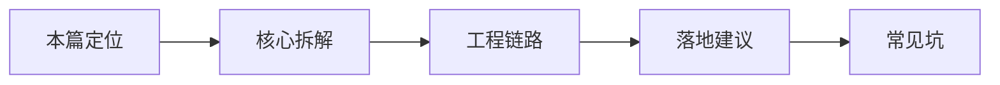

# LangSmith / Langfuse（02） - LangSmith 全链路观测：从 Agent 调试到 RAG 量化评估

> 读完后，你应能完成以下任务：
> - 绘制“LangSmith / Langfuse（02） - LangSmith 全链路观测：从 Agent 调试到 RAG 量化评估 / 本篇定位”的关键对象与数据流，解释“这是可观测性进阶篇，衔接 40 日志与可观测性。”，并用源码位置、日志或 Trace 标注证据。
> - 为“LangSmith / Langfuse（02） - LangSmith 全链路观测：从 Agent 调试到 RAG 量化评估 / 核心拆解”设计正常与异常输入，验证“Trace 是一次请求的调用树。”，输出首个偏差位置与回归测试结果。
> - 实现“LangSmith / Langfuse（02） - LangSmith 全链路观测：从 Agent 调试到 RAG 量化评估 / 工程链路”的最小代码或配置，检验“记录检索、rerank、LLM、tool 的输入输出。”，输出命令、结果与 Diff，并说明不适用边界。

<!-- article-progressive-block:start -->
# 一、先建立全局：LangSmith 全链路观测：从 Agent 调试到 RAG 量化评估 是什么？

理解“LangSmith 全链路观测：从 Agent 调试到 RAG 量化评估”，先要把标题中的对象放进同一条处理链：它接收什么输入，经过哪些状态变化，最终用什么证据判断结果。下表不另造概念，只把作者正文已经解释的章节按依赖顺序连起来。

“LangSmith 全链路观测：从 Agent 调试到 RAG 量化评估”的第一个核心判断是：这是可观测性进阶篇，衔接 40 日志与可观测性。。先弄清这个判断中的对象和输入输出，后面的实现、故障和验收才有共同语境。

| 顺序 | 章节 | 读完本节应抓住的结论 |
| --- | --- | --- |
| 1 | 本篇定位 | 这是可观测性进阶篇，衔接 40 日志与可观测性。 |
| 2 | 核心拆解 | Trace 是一次请求的调用树。 |
| 3 | 工程链路 | 记录检索、rerank、LLM、tool 的输入输出。 |
| 4 | 落地建议 | 线上日志脱敏后再进入观测平台。 |
| 5 | 常见坑 | 没有版本字段，评估结果无法复现。 |
| 6 | 和已有主线的关系 | 40 讲通用日志，26 讲 RAG 评测； |

## 1.1 核心对象之间怎样衔接



这张图只表达本文的讲解顺序，不替代正文机制。判断“LangSmith 全链路观测：从 Agent 调试到 RAG 量化评估”是否真正掌握，需要能从最后一个结果沿图回到前面每个章节的输入、状态变化和证据。

## 1.2 再看失败：问题最早会出现在哪一步？

在“LangSmith 全链路观测：从 Agent 调试到 RAG 量化评估”的对象和顺序已经明确后，再看可观察的失败：只报告均分、数据泄漏、评审器未校准、Trace 断链或回退阈值缺失。定位时不从最后一条错误猜原因，而是沿上图找第一个偏离正文结论的节点。
<!-- article-progressive-block:end -->

# 二、LangSmith 全链路观测的学习定位与边界

这是可观测性进阶篇，衔接 40 日志与可观测性。

# 三、LangSmith 全链路观测的真实应用场景

用户反馈“回答错了”。如果你只能看到最终回答，就不知道是 query 改写错、检索没命中、rerank 排错、prompt 引导差，还是模型自己编。LangSmith 这类工具的价值，是把每一步调用、输入、输出、耗时和 token 展开给你看。

# 四、LangSmith 全链路观测的核心对象与机制

- Trace 是一次请求的调用树。Agent 的每个模型调用、工具调用、检索调用都应该是一个 span。
- 调试阶段看单条 trace，定位坏 case。评估阶段跑数据集，看 Hit Rate、faithfulness、answer correctness、latency 等指标。
- RAG 评估不能只看最终答案，还要评估 retrieval：正确证据是否被召回，是否排在前面。

# 五、LangSmith 全链路观测的工程链路

- 为每次请求生成 trace_id。
- 记录检索、rerank、LLM、tool 的输入输出。
- 坏 case 进入数据集。
- 改参数后批量回放评估集。
- 对比指标和成本。

# 六、LangSmith 全链路观测的落地建议

- 线上日志脱敏后再进入观测平台。
- 每次 prompt 或检索参数改动都标版本。
- 把高频坏 case 固化成回归集。

# 七、LangSmith 全链路观测的常见故障与误区

- 只记录最终回答。
- 没有版本字段，评估结果无法复现。
- 只看平均耗时，不看 P90/P99。

# 八、LangSmith 全链路观测在学习路线中的位置

40 讲通用日志，26 讲 RAG 评测；81 把 trace 和评估平台串起来。

# 九、LangSmith 全链路观测的核心结论

> LangSmith 类工具的核心价值是 trace 和 dataset evaluation。单条 trace 帮你定位坏 case，评估集帮你对比改动是否变好。RAG 要同时看检索指标、答案忠实度、延迟和成本。

<!-- article-progressive-block:start -->
# 十、动手验证：先跑通 LangSmith 全链路观测：从 Agent 调试到 RAG 量化评估，再改变一个变量

前面的章节已经建立问题、概念和机制。现在把“LangSmith 全链路观测：从 Agent 调试到 RAG 量化评估”放进同一套基线中运行；本节不再引入新术语，只验证前文结论能否被复现。

## 10.1 基线与候选只允许一个变量不同

验证“LangSmith 全链路观测：从 Agent 调试到 RAG 量化评估”时，先固定版本化数据集、Trace Schema、质量基线、运行指标、成本预算和回退阈值。候选方案只能改变本次要验证的变量；如果同时更换数据、依赖和配置，即使结果改善，也不能知道是哪一项产生作用。

执行“LangSmith 全链路观测：从 Agent 调试到 RAG 量化评估”时，动作是：同输入运行基线与候选，逐样本比较质量并关联线上延迟、错误与成本。原始结果不能只保留截图或汇总分数，必须同步保存：逐样本输出、评分理由、Trace、指标窗口、失败标签、版本和发布判断，使下一次复查可以在同一输入上重放。

| 实验要素 | 本文要求 |
| --- | --- |
| 固定条件 | 版本化数据集、Trace Schema、质量基线、运行指标、成本预算和回退阈值 |
| 唯一变量 | 本次候选方案与基线之间的一项明确差异 |
| 原始证据 | 逐样本输出、评分理由、Trace、指标窗口、失败标签、版本和发布判断 |
| 通过阈值 | 目标切片改善且安全、延迟与成本不越界，失败样本能回链到首个异常阶段 |
| 立即停止 | 只报告均分、数据泄漏、评审器未校准、Trace 断链或回退阈值缺失 |

## 10.2 执行前先排除不可比较条件

“LangSmith 全链路观测：从 Agent 调试到 RAG 量化评估”开始前先确认下面四项；任一项不成立，都应先修复实验条件，而不是解释结果。

- 基线能够在“LangSmith 全链路观测：从 Agent 调试到 RAG 量化评估”的当前环境重复运行。
- 候选只改变一个与“LangSmith 全链路观测：从 Agent 调试到 RAG 量化评估”结论直接相关的条件。
- “LangSmith 全链路观测：从 Agent 调试到 RAG 量化评估”的基线和候选使用同一批输入、同一版本依赖与同一通过阈值。
- “LangSmith 全链路观测：从 Agent 调试到 RAG 量化评估”的原始输出和失败现场不会被重试、格式化或汇总覆盖。

## 10.3 执行后先核对证据完整性

结果出来后先检查证据，再讨论“LangSmith 全链路观测：从 Agent 调试到 RAG 量化评估”是否通过。缺少中间状态时，最终输出只能说明现象，不能证明机制。

| 检查项 | 当前文章的判定 |
| --- | --- |
| 输入可追溯 | 版本化数据集、Trace Schema、质量基线、运行指标、成本预算和回退阈值 |
| 过程可回放 | 同输入运行基线与候选，逐样本比较质量并关联线上延迟、错误与成本 |
| 结果可审计 | 逐样本输出、评分理由、Trace、指标窗口、失败标签、版本和发布判断 |

“LangSmith 全链路观测：从 Agent 调试到 RAG 量化评估”的一次合格基线对照按以下顺序执行：

1. 保存“LangSmith 全链路观测：从 Agent 调试到 RAG 量化评估”基线版本及输入摘要，确认基线本身可以重复运行。
2. 写下“LangSmith 全链路观测：从 Agent 调试到 RAG 量化评估”候选方案唯一变化的变量，以及它预期影响的指标。
3. 在同一环境执行“LangSmith 全链路观测：从 Agent 调试到 RAG 量化评估”：同输入运行基线与候选，逐样本比较质量并关联线上延迟、错误与成本。
4. 为“LangSmith 全链路观测：从 Agent 调试到 RAG 量化评估”保存：逐样本输出、评分理由、Trace、指标窗口、失败标签、版本和发布判断。
5. 使用“LangSmith 全链路观测：从 Agent 调试到 RAG 量化评估”预登记条件判断：目标切片改善且安全、延迟与成本不越界，失败样本能回链到首个异常阶段。
6. 如果“LangSmith 全链路观测：从 Agent 调试到 RAG 量化评估”未通过，不修改第二个变量，先恢复基线并保留失败现场。

# 十一、用一张矩阵验证 LangSmith 全链路观测：从 Agent 调试到 RAG 量化评估 的关键结论

矩阵按正文顺序列出“LangSmith 全链路观测：从 Agent 调试到 RAG 量化评估”的结论。一次实验只选择一行，只改变这一行对应的条件；不要把多行合并成一个无法归因的大实验。

| 正文章节 | 已解释的结论 | 本轮唯一变量 | 必须保存的证据 |
| --- | --- | --- | --- |
| 本篇定位 | 这是可观测性进阶篇，衔接 40 日志与可观测性。 | 只改变与“本篇定位”相关的条件 | 逐样本输出、评分理由、Trace、指标窗口、失败标签、版本和发布判断 |
| 核心拆解 | Trace 是一次请求的调用树。 | 只改变与“核心拆解”相关的条件 | 逐样本输出、评分理由、Trace、指标窗口、失败标签、版本和发布判断 |
| 工程链路 | 记录检索、rerank、LLM、tool 的输入输出。 | 只改变与“工程链路”相关的条件 | 逐样本输出、评分理由、Trace、指标窗口、失败标签、版本和发布判断 |
| 落地建议 | 线上日志脱敏后再进入观测平台。 | 只改变与“落地建议”相关的条件 | 逐样本输出、评分理由、Trace、指标窗口、失败标签、版本和发布判断 |
| 常见坑 | 没有版本字段，评估结果无法复现。 | 只改变与“常见坑”相关的条件 | 逐样本输出、评分理由、Trace、指标窗口、失败标签、版本和发布判断 |
| 和已有主线的关系 | 40 讲通用日志，26 讲 RAG 评测； | 只改变与“和已有主线的关系”相关的条件 | 逐样本输出、评分理由、Trace、指标窗口、失败标签、版本和发布判断 |

## 11.1 记录本次实际实验

下面的记录用于“LangSmith 全链路观测：从 Agent 调试到 RAG 量化评估”当前这一次实验，不是第二套知识目录。先从矩阵选择一个章节，再填写实际值；没有填写的字段表示尚未验证。

```yaml
topic: "LangSmith 全链路观测：从 Agent 调试到 RAG 量化评估"
selected_chapter: required
claim_from_article: required
baseline_version: required
changed_condition: exactly_one
execution: "同输入运行基线与候选，逐样本比较质量并关联线上延迟、错误与成本"
evidence: "逐样本输出、评分理由、Trace、指标窗口、失败标签、版本和发布判断"
pass_when: "目标切片改善且安全、延迟与成本不越界，失败样本能回链到首个异常阶段"
stop_when: "只报告均分、数据泄漏、评审器未校准、Trace 断链或回退阈值缺失"
observed_result: required
first_deviation: null_or_evidence
recovery_replay: required_after_failure
```

## 11.2 边界实验必须证明能够停止和恢复

成功路径只能证明“LangSmith 全链路观测：从 Agent 调试到 RAG 量化评估”在当前样本上工作，不能证明它可以进入生产。边界实验需要主动制造：只报告均分、数据泄漏、评审器未校准、Trace 断链或回退阈值缺失，并观察系统是否在产生不可逆副作用前停止。

| 场景 | 只改变什么 | 应保存什么 | 通过标准 |
| --- | --- | --- | --- |
| 正常路径 | 使用已知有效输入 | 逐样本输出、评分理由、Trace、指标窗口、失败标签、版本和发布判断 | 目标切片改善且安全、延迟与成本不越界，失败样本能回链到首个异常阶段 |
| 边界路径 | 把一个输入推进到约束临界值 | 临界值前后的输出与指标 | 不静默降级，不把部分结果冒充成功 |
| 明确失败 | 注入：只报告均分、数据泄漏、评审器未校准、Trace 断链或回退阈值缺失 | 原始错误、首个异常阶段和最终状态 | 失败被正确分类且没有扩大副作用 |
| 恢复重放 | 执行：停止扩量，保留基线，按数据、Prompt、模型、应用或评审阶段隔离失败 | 原失败样本的复测证据 | 原样本恢复，正常样本没有回归 |

恢复动作不是简单重启。对于“LangSmith 全链路观测：从 Agent 调试到 RAG 量化评估”，第一步是：停止扩量，保留基线，按数据、Prompt、模型、应用或评审阶段隔离失败。完成后使用原始失败样本复测；只验证一个新样本成功，不能证明触发条件已经消失。

“LangSmith 全链路观测：从 Agent 调试到 RAG 量化评估”边界实验结束后，应把正常、临界、失败和恢复四类记录放在同一个运行批次中。这样才能区分“候选方案真的修复问题”和“环境变化让问题暂时没有出现”。

# 十二、LangSmith 全链路观测：从 Agent 调试到 RAG 量化评估 的结果解释

解释“LangSmith 全链路观测：从 Agent 调试到 RAG 量化评估”实验时先看首个偏差，而不是最后一条错误。最后的异常通常只是上游状态错误的结果；从末端反推容易误把症状当根因。

| 观察结果 | 可以支持的判断 | 下一步 |
| --- | --- | --- |
| 主链路没有达到预期 | 只报告均分、数据泄漏、评审器未校准、Trace 断链或回退阈值缺失 | 先执行：停止扩量，保留基线，按数据、Prompt、模型、应用或评审阶段隔离失败 |
| 异常链路无法恢复 | 只报告均分、数据泄漏、评审器未校准、Trace 断链或回退阈值缺失 | 先执行：停止扩量，保留基线，按数据、Prompt、模型、应用或评审阶段隔离失败 |
| 新样本成功但原样本仍失败 | 修复没有覆盖原始触发条件 | 固定原失败输入，恢复基线后重新比较 |
| 指标改善但证据无法回链 | 数据、版本或中间状态没有固定 | 暂停发布，补齐可追溯记录后重跑 |

“LangSmith 全链路观测：从 Agent 调试到 RAG 量化评估”只有同时满足“目标切片改善且安全、延迟与成本不越界，失败样本能回链到首个异常阶段”，并且没有出现“只报告均分、数据泄漏、评审器未校准、Trace 断链或回退阈值缺失”，才可以认为主链路通过。这里的“通过”只对当前固定版本、样本和环境有效，不能外推到尚未测试的容量、权限或数据分布。

如果“LangSmith 全链路观测：从 Agent 调试到 RAG 量化评估”候选方案与基线差异很小，先检查证据分辨率是否足够；如果差异很大，先排除数据泄漏、环境漂移和版本不一致。两种情况都不能只看一个汇总均值，需要回到逐样本输出和中间状态。

“LangSmith 全链路观测：从 Agent 调试到 RAG 量化评估”故障定位完成后，记录“现象、首个偏差、根因、改动、原样本复测”五项。缺少原样本复测时，只能标记为待观察，不能标记为已解决。

# 十三、LangSmith 全链路观测：从 Agent 调试到 RAG 量化评估 的发布判断

发布判断需要把“LangSmith 全链路观测：从 Agent 调试到 RAG 量化评估”的质量、失败边界和恢复能力放在同一份记录中。以下任一条件缺失，都应停止扩量，而不是用“基本正常”替代证据。

- [ ] “LangSmith 全链路观测：从 Agent 调试到 RAG 量化评估”的基线与候选只存在一个计划内变量。
- [ ] “LangSmith 全链路观测：从 Agent 调试到 RAG 量化评估”的输入、代码、依赖、配置和数据版本可以追溯。
- [ ] “LangSmith 全链路观测：从 Agent 调试到 RAG 量化评估”的正常、临界、失败和恢复样本使用同一套断言。
- [ ] “LangSmith 全链路观测：从 Agent 调试到 RAG 量化评估”的原始输出、中间状态和失败现场已经保留。
- [ ] “LangSmith 全链路观测：从 Agent 调试到 RAG 量化评估”的日志、Trace、截图和测试数据已经脱敏。
- [ ] “LangSmith 全链路观测：从 Agent 调试到 RAG 量化评估”的停止条件、负责人和回滚入口已经演练。
- [ ] “LangSmith 全链路观测：从 Agent 调试到 RAG 量化评估”尚未覆盖的输入、权限、容量和外部依赖已经登记。

最终记录至少包含基线版本、唯一变量、原始证据、首个偏差、恢复复测和发布责任人。没有参与本次修改的人如果不能据此重放“LangSmith 全链路观测：从 Agent 调试到 RAG 量化评估”的判断，就不能发布。
<!-- article-progressive-block:end -->

# 十四、总结

- **本篇定位**：这是可观测性进阶篇，衔接 40 日志与可观测性。
- **核心拆解**：Trace 是一次请求的调用树。
- **工程链路**：记录检索、rerank、LLM、tool 的输入输出。
- **复述答法**：LangSmith 类工具的核心价值是 trace 和 dataset evaluation。

## 参考资料

- [OpenTelemetry Traces](https://opentelemetry.io/docs/concepts/signals/traces/)
- [Langfuse 文档](https://langfuse.com/docs)

<!-- knowledge-scenario-inlined:AA-08 -->

## 14.1 可运行实验：LangSmith 与 LangFuse Trace 排障


```html runnable file=index.html title="LangSmith 与 LangFuse Trace 排障" description="调整参数并对比正常路径与典型失败路径"
<!doctype html>
<html lang="zh-CN">
<head>
  <meta charset="utf-8">
  <meta name="viewport" content="width=device-width,initial-scale=1">
  <title>AA-08 在线实验</title>
  <style>
    :root{color-scheme:dark;font-family:Inter,system-ui,sans-serif}*{box-sizing:border-box}body{margin:0;background:#0f1211;color:#e7ece9;font-size:13px}.shell{padding:16px}.top{display:flex;justify-content:space-between;gap:16px;margin-bottom:14px}h1{margin:3px 0;font-size:18px}.id,.value{color:#68e0b5;font-family:ui-monospace,monospace}.summary{margin:4px 0;color:#a5afa9}.run{border:0;border-radius:6px;background:#68e0b5;color:#07110d;padding:8px 14px;font-weight:700}.grid{display:grid;grid-template-columns:minmax(220px,.8fr) minmax(0,1.8fr);gap:12px}.panel{border:1px solid #29322e;background:#141817;padding:12px}.control{display:grid;gap:5px;margin-bottom:11px}.head{display:flex;justify-content:space-between;gap:8px}select,input{width:100%;accent-color:#68e0b5;background:#0d100f;color:#e7ece9}.toggle{display:flex;justify-content:space-between;border-top:1px solid #29322e;padding-top:9px}.toggle input{width:18px}.metrics{display:grid;grid-template-columns:repeat(4,minmax(0,1fr));gap:7px}.metric{border:1px solid #29322e;padding:8px}.metric b{display:block;color:#68e0b5;font-size:16px}.stages{display:flex;gap:6px;overflow:auto;margin:10px 0}.stage{border:1px solid #8a6230;padding:7px;min-width:90px}.stage.ok{border-color:#367a61}.stage.fail{border-color:#8b4545}table{width:100%;border-collapse:collapse}td{border-top:1px solid #29322e;padding:7px}.diagnosis{margin-top:9px;border-left:3px solid #68e0b5;background:#101412;padding:9px;line-height:1.5}.danger{border-color:#ef7f7f}@media(max-width:680px){.top,.grid{display:grid;grid-template-columns:1fr}.metrics{grid-template-columns:repeat(2,1fr)}}
  </style>
</head>
<body>
  <main class="shell">
    <header class="top"><div><div class="id">AA-08 · DETERMINISTIC LAB</div><h1 id="title"></h1><p class="summary" id="summary"></p></div><button class="run" id="run">运行实验</button></header>
    <section class="grid"><div class="panel"><div id="controls"></div><label class="toggle"><span>注入典型故障</span><input id="failure" type="checkbox"></label></div><div class="panel"><div class="metrics" id="metrics"></div><div class="stages" id="stages"></div><table><tbody id="rows"></tbody></table><div class="diagnosis" id="diagnosis"></div></div></section>
  </main>
  <script>
    const scenario = { title: 'LangSmith 与 LangFuse Trace 排障', summary: '展开一次 RAG Trace，从 Span、Token、耗时和评测标签定位根因。', controls: [
    { key: 'fault', label: '故障类型', type: 'select', value: 'generation', options: [['none', '无故障'], ['retrieval', '召回为空'], ['generation', '证据正确但生成错误'], ['tool', '工具超时']] },
    { key: 'sampling', label: 'Trace 采样率', type: 'range', min: 1, max: 100, value: 20, suffix: '%' },
    { key: 'redaction', label: '敏感字段脱敏', type: 'select', value: 'on', options: [['off', '关闭'], ['on', '开启']] }
  ] };
    const controls = document.querySelector('#controls');
    const failure = document.querySelector('#failure');
    document.querySelector('#title').textContent = scenario.title;
    document.querySelector('#summary').textContent = scenario.summary;
    function renderControl(control) {
      const label = document.createElement('label'); label.className = 'control';
      const head = document.createElement('span'); head.className = 'head'; head.innerHTML = '<span>' + control.label + '</span><span class="value" data-value="' + control.key + '"></span>'; label.appendChild(head);
      const input = document.createElement(control.type === 'select' ? 'select' : 'input'); input.dataset.key = control.key;
      if (control.type === 'select') control.options.forEach(option => { const item = document.createElement('option'); item.value = option[0]; item.textContent = option[1]; item.selected = option[0] === control.value; input.appendChild(item); });
      else { input.type = 'range'; input.min = control.min; input.max = control.max; input.step = control.step || 1; input.value = control.value; }
      input.addEventListener('input', updateValues); label.appendChild(input); return label;
    }
    function updateValues() { scenario.controls.forEach(control => { const input = controls.querySelector('[data-key="' + control.key + '"]'); document.querySelector('[data-value="' + control.key + '"]').textContent = control.type === 'select' ? input.options[input.selectedIndex].text : input.value + (control.suffix || ''); }); }
    function readValues() { const values = {}; scenario.controls.forEach(control => { const input = controls.querySelector('[data-key="' + control.key + '"]'); values[control.key] = control.type === 'range' ? Number(input.value) : input.value; }); values.failure = failure.checked; return values; }
    function stage(name, state, detail) { return { name, state, detail }; }
    const aiStage = stage;
    function clamp(value, minimum, maximum) { return Math.min(maximum, Math.max(minimum, value)); }
    function simulate(values) { const fail = values.failure;
      /** 根据故障类型构造的根因 Span。 */
      const rootSpan = fail ? 'redaction' : values.fault === 'none' ? 'none' : values.fault;
      /** 一次样例 Trace 的总耗时。 */
      const latency = values.fault === 'tool' ? 6200 : values.fault === 'retrieval' ? 780 : 1450;
      /** 一次样例 Trace 的 Token 总量。 */
      const tokens = values.fault === 'retrieval' ? 420 : 2380;
      return { metrics: [[rootSpan.toUpperCase(), '根因 Span'], [latency + 'ms', '总耗时'], [tokens, 'Tokens'], [values.sampling + '%', '采样率']], stages: [aiStage('Request', 'ok', 'trace-id'), aiStage('Retriever', values.fault === 'retrieval' ? 'fail' : 'ok', values.fault === 'retrieval' ? '0 docs' : '5 docs'), aiStage('Rerank', values.fault === 'retrieval' ? 'warn' : 'ok', 'top 3'), aiStage('Tool', values.fault === 'tool' ? 'fail' : 'ok', values.fault === 'tool' ? 'timeout' : 'n/a'), aiStage('Generation', values.fault === 'generation' ? 'fail' : 'ok', tokens), aiStage('Evaluator', rootSpan === 'none' ? 'ok' : 'warn', rootSpan)], rows: [['定位方法', values.fault === 'generation' ? '检索证据正确但 Faithfulness 低，根因在生成' : values.fault === 'retrieval' ? 'Retriever 输出为空，先查过滤和索引版本' : values.fault === 'tool' ? '工具 Span 超时，重试放大总耗时' : '各 Span 指标正常'], ['脱敏', values.redaction === 'on' && !fail ? 'Prompt、metadata 中的敏感字段已遮盖' : '敏感内容可能写入 Trace，必须阻断上报'], ['采样策略', values.sampling < 5 ? '低采样可能漏掉长尾错误，错误 Trace 应 100% 保留' : '正常请求采样，错误请求全量保留']], diagnosis: rootSpan === 'none' ? 'Trace 未发现异常，指标与评测标签一致。' : '根因已定位到 ' + rootSpan + ' 阶段，可针对该 Span 修复而非盲目改 Prompt。', danger: fail || values.redaction !== 'on' };
     }
    function render() { const result = simulate(readValues()); document.querySelector('#metrics').innerHTML = result.metrics.map(item => '<div class="metric"><b>' + item[0] + '</b><span>' + item[1] + '</span></div>').join(''); document.querySelector('#stages').innerHTML = result.stages.map(item => '<div class="stage ' + item.state + '"><b>' + item.name + '</b><div>' + item.detail + '</div></div>').join(''); document.querySelector('#rows').innerHTML = result.rows.map(item => '<tr><td>' + item[0] + '</td><td>' + item[1] + '</td></tr>').join(''); const diagnosis = document.querySelector('#diagnosis'); diagnosis.textContent = result.diagnosis; diagnosis.className = 'diagnosis' + (result.danger ? ' danger' : ''); }
    scenario.controls.forEach(control => controls.appendChild(renderControl(control))); updateValues(); document.querySelector('#run').addEventListener('click', render); render();
  </script>
</body>
</html>
```
