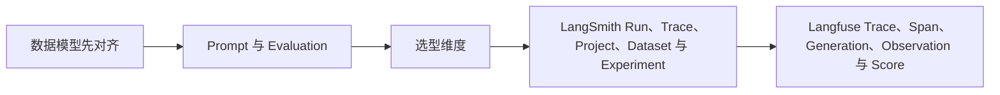

# LangSmith / Langfuse（03） - LangSmith 与 Langfuse 平台能力及选型

> 读完后，你应能完成以下任务：
> - 绘制“LangSmith / Langfuse（03） - LangSmith 与 Langfuse 平台能力及选型 / 数据模型先对齐”的关键对象与数据流，解释“Generation 需要记录模型、版本、输入输出 Token、成本和延迟；”，并用源码位置、日志或 Trace 标注证据。
> - 为“LangSmith / Langfuse（03） - LangSmith 与 Langfuse 平台能力及选型 / Prompt 与 Evaluation”设计正常与异常输入，验证“Dataset Item 保存输入、参考输出或评测元数据；”，输出首个偏差位置与回归测试结果。
> - 实现“LangSmith / Langfuse（03） - LangSmith 与 Langfuse 平台能力及选型 / 选型维度”的最小代码或配置，检验“用同一条 RAG + Agent 链做 PoC，”，输出命令、结果与 Diff，并说明不适用边界。

> 选型不能只比较 Trace 页面。要同时看数据模型、Prompt 版本、Dataset、Evaluator、部署方式、数据驻留和与当前框架的集成成本。


## 核心知识清单

- LangSmith Run、Trace、Project、Dataset 与 Experiment
- LangSmith Prompt Version、Playground 与 Deployment
- Langfuse Trace、Span、Generation、Observation 与 Score
- Langfuse Prompt Management、Dataset Item 与 Dataset Run
- 自动追踪、手动追踪与 OpenTelemetry
- 托管、自托管、数据驻留与选型 PoC

<!-- article-progressive-block:start -->
# 一、先建立全局：LangSmith 与 Langfuse 平台能力及选型 是什么？

理解“LangSmith 与 Langfuse 平台能力及选型”，先要把标题中的对象放进同一条处理链：它接收什么输入，经过哪些状态变化，最终用什么证据判断结果。下表不另造概念，只把作者正文已经解释的章节按依赖顺序连起来。

“LangSmith 与 Langfuse 平台能力及选型”的第一个核心判断是：Generation 需要记录模型、版本、输入输出 Token、成本和延迟；。先弄清这个判断中的对象和输入输出，后面的实现、故障和验收才有共同语境。

| 顺序 | 章节 | 读完本节应抓住的结论 |
| --- | --- | --- |
| 1 | 数据模型先对齐 | Generation 需要记录模型、版本、输入输出 Token、成本和延迟； |
| 2 | Prompt 与 Evaluation | Dataset Item 保存输入、参考输出或评测元数据； |
| 3 | 选型维度 | 用同一条 RAG + Agent 链做 PoC， |
| 4 | LangSmith Run、Trace、Project、Dataset 与 Experiment | 选型不能只比较 Trace 页面。 |
| 5 | Langfuse Trace、Span、Generation、Observation 与 Score | 选型不能只比较 Trace 页面。 |
| 6 | Langfuse Prompt Management、Dataset Item 与 Dataset Run | Dataset Item 保存输入、参考输出或评测元数据； |

## 1.1 核心对象之间怎样衔接



这张图只表达本文的讲解顺序，不替代正文机制。判断“LangSmith 与 Langfuse 平台能力及选型”是否真正掌握，需要能从最后一个结果沿图回到前面每个章节的输入、状态变化和证据。

## 1.2 再看失败：问题最早会出现在哪一步？

在“LangSmith 与 Langfuse 平台能力及选型”的对象和顺序已经明确后，再看可观察的失败：只报告均分、数据泄漏、评审器未校准、Trace 断链或回退阈值缺失。定位时不从最后一条错误猜原因，而是沿上图找第一个偏离正文结论的节点。
<!-- article-progressive-block:end -->

# 二、数据模型先对齐

LangSmith 用 Run 表示一次可嵌套执行，多个 Run 组成 Trace；
Langfuse 用 Observation 统一承载 Span、Generation、Agent 和 Retriever 等类型。
无论平台，
都要让模型、检索、Rerank、Tool、子 Agent 和最终生成形成正确父子关系，
而不是把所有事件平铺。

Generation 需要记录模型、版本、输入输出 Token、成本和延迟；
Retriever 记录查询、候选 ID 与分数；
Tool 记录脱敏参数、结果摘要与错误。
生产日志不能上传密钥、完整 PII 或无权限正文。

# 三、Prompt 与 Evaluation

Prompt 发布使用不可变版本或 Commit，
Trace 写入实际版本，
才能把回归关联到变更。
Dataset Item 保存输入、参考输出或评测元数据；
Dataset Run 或 Experiment 保存某个应用版本在整个数据集上的结果。
线上失败样本经脱敏与人工确认后回流 Dataset，而不是直接把所有生产数据拿来训练。

# 四、选型维度

| 维度 | 核心问题 |
| --- | --- |
| 集成 | 当前 LangChain、LangGraph 或自研链能否自动采集，缺失字段是否可手动补充 |
| 评测 | 是否支持代码、规则、LLM Judge、人工标注和基线比较 |
| 治理 | RBAC、审计、保留期、删除、区域和自托管是否满足要求 |
| 运维 | 采样、异步上报、失败缓冲、告警和成本是否可控 |
| 锁定 | Trace 是否能通过 OpenTelemetry 或导出 API 迁移 |

用同一条 RAG + Agent 链做 PoC，
比较字段完整率、额外延迟、丢失率、查询效率与运维成本，
再决定平台。
截图好看不是选型结论。

<!-- article-progressive-block:start -->
# 五、动手验证：先跑通 LangSmith 与 Langfuse 平台能力及选型，再改变一个变量

前面的章节已经建立问题、概念和机制。现在把“LangSmith 与 Langfuse 平台能力及选型”放进同一套基线中运行；本节不再引入新术语，只验证前文结论能否被复现。

## 5.1 基线与候选只允许一个变量不同

验证“LangSmith 与 Langfuse 平台能力及选型”时，先固定版本化数据集、Trace Schema、质量基线、运行指标、成本预算和回退阈值。候选方案只能改变本次要验证的变量；如果同时更换数据、依赖和配置，即使结果改善，也不能知道是哪一项产生作用。

执行“LangSmith 与 Langfuse 平台能力及选型”时，动作是：同输入运行基线与候选，逐样本比较质量并关联线上延迟、错误与成本。原始结果不能只保留截图或汇总分数，必须同步保存：逐样本输出、评分理由、Trace、指标窗口、失败标签、版本和发布判断，使下一次复查可以在同一输入上重放。

| 实验要素 | 本文要求 |
| --- | --- |
| 固定条件 | 版本化数据集、Trace Schema、质量基线、运行指标、成本预算和回退阈值 |
| 唯一变量 | 本次候选方案与基线之间的一项明确差异 |
| 原始证据 | 逐样本输出、评分理由、Trace、指标窗口、失败标签、版本和发布判断 |
| 通过阈值 | 目标切片改善且安全、延迟与成本不越界，失败样本能回链到首个异常阶段 |
| 立即停止 | 只报告均分、数据泄漏、评审器未校准、Trace 断链或回退阈值缺失 |

## 5.2 执行前先排除不可比较条件

“LangSmith 与 Langfuse 平台能力及选型”开始前先确认下面四项；任一项不成立，都应先修复实验条件，而不是解释结果。

- 基线能够在“LangSmith 与 Langfuse 平台能力及选型”的当前环境重复运行。
- 候选只改变一个与“LangSmith 与 Langfuse 平台能力及选型”结论直接相关的条件。
- “LangSmith 与 Langfuse 平台能力及选型”的基线和候选使用同一批输入、同一版本依赖与同一通过阈值。
- “LangSmith 与 Langfuse 平台能力及选型”的原始输出和失败现场不会被重试、格式化或汇总覆盖。

## 5.3 执行后先核对证据完整性

结果出来后先检查证据，再讨论“LangSmith 与 Langfuse 平台能力及选型”是否通过。缺少中间状态时，最终输出只能说明现象，不能证明机制。

| 检查项 | 当前文章的判定 |
| --- | --- |
| 输入可追溯 | 版本化数据集、Trace Schema、质量基线、运行指标、成本预算和回退阈值 |
| 过程可回放 | 同输入运行基线与候选，逐样本比较质量并关联线上延迟、错误与成本 |
| 结果可审计 | 逐样本输出、评分理由、Trace、指标窗口、失败标签、版本和发布判断 |

“LangSmith 与 Langfuse 平台能力及选型”的一次合格基线对照按以下顺序执行：

1. 保存“LangSmith 与 Langfuse 平台能力及选型”基线版本及输入摘要，确认基线本身可以重复运行。
2. 写下“LangSmith 与 Langfuse 平台能力及选型”候选方案唯一变化的变量，以及它预期影响的指标。
3. 在同一环境执行“LangSmith 与 Langfuse 平台能力及选型”：同输入运行基线与候选，逐样本比较质量并关联线上延迟、错误与成本。
4. 为“LangSmith 与 Langfuse 平台能力及选型”保存：逐样本输出、评分理由、Trace、指标窗口、失败标签、版本和发布判断。
5. 使用“LangSmith 与 Langfuse 平台能力及选型”预登记条件判断：目标切片改善且安全、延迟与成本不越界，失败样本能回链到首个异常阶段。
6. 如果“LangSmith 与 Langfuse 平台能力及选型”未通过，不修改第二个变量，先恢复基线并保留失败现场。

# 六、用一张矩阵验证 LangSmith 与 Langfuse 平台能力及选型 的关键结论

矩阵按正文顺序列出“LangSmith 与 Langfuse 平台能力及选型”的结论。一次实验只选择一行，只改变这一行对应的条件；不要把多行合并成一个无法归因的大实验。

| 正文章节 | 已解释的结论 | 本轮唯一变量 | 必须保存的证据 |
| --- | --- | --- | --- |
| 数据模型先对齐 | Generation 需要记录模型、版本、输入输出 Token、成本和延迟； | 只改变与“数据模型先对齐”相关的条件 | 逐样本输出、评分理由、Trace、指标窗口、失败标签、版本和发布判断 |
| Prompt 与 Evaluation | Dataset Item 保存输入、参考输出或评测元数据； | 只改变与“Prompt 与 Evaluation”相关的条件 | 逐样本输出、评分理由、Trace、指标窗口、失败标签、版本和发布判断 |
| 选型维度 | 用同一条 RAG + Agent 链做 PoC， | 只改变与“选型维度”相关的条件 | 逐样本输出、评分理由、Trace、指标窗口、失败标签、版本和发布判断 |
| LangSmith Run、Trace、Project、Dataset 与 Experiment | 选型不能只比较 Trace 页面。 | 只改变与“LangSmith Run、Trace、Project、Dataset 与 Experiment”相关的条件 | 逐样本输出、评分理由、Trace、指标窗口、失败标签、版本和发布判断 |
| Langfuse Trace、Span、Generation、Observation 与 Score | 选型不能只比较 Trace 页面。 | 只改变与“Langfuse Trace、Span、Generation、Observation 与 Score”相关的条件 | 逐样本输出、评分理由、Trace、指标窗口、失败标签、版本和发布判断 |
| Langfuse Prompt Management、Dataset Item 与 Dataset Run | Dataset Item 保存输入、参考输出或评测元数据； | 只改变与“Langfuse Prompt Management、Dataset Item 与 Dataset Run”相关的条件 | 逐样本输出、评分理由、Trace、指标窗口、失败标签、版本和发布判断 |

## 6.1 记录本次实际实验

下面的记录用于“LangSmith 与 Langfuse 平台能力及选型”当前这一次实验，不是第二套知识目录。先从矩阵选择一个章节，再填写实际值；没有填写的字段表示尚未验证。

```yaml
topic: "LangSmith 与 Langfuse 平台能力及选型"
selected_chapter: required
claim_from_article: required
baseline_version: required
changed_condition: exactly_one
execution: "同输入运行基线与候选，逐样本比较质量并关联线上延迟、错误与成本"
evidence: "逐样本输出、评分理由、Trace、指标窗口、失败标签、版本和发布判断"
pass_when: "目标切片改善且安全、延迟与成本不越界，失败样本能回链到首个异常阶段"
stop_when: "只报告均分、数据泄漏、评审器未校准、Trace 断链或回退阈值缺失"
observed_result: required
first_deviation: null_or_evidence
recovery_replay: required_after_failure
```

## 6.2 边界实验必须证明能够停止和恢复

成功路径只能证明“LangSmith 与 Langfuse 平台能力及选型”在当前样本上工作，不能证明它可以进入生产。边界实验需要主动制造：只报告均分、数据泄漏、评审器未校准、Trace 断链或回退阈值缺失，并观察系统是否在产生不可逆副作用前停止。

| 场景 | 只改变什么 | 应保存什么 | 通过标准 |
| --- | --- | --- | --- |
| 正常路径 | 使用已知有效输入 | 逐样本输出、评分理由、Trace、指标窗口、失败标签、版本和发布判断 | 目标切片改善且安全、延迟与成本不越界，失败样本能回链到首个异常阶段 |
| 边界路径 | 把一个输入推进到约束临界值 | 临界值前后的输出与指标 | 不静默降级，不把部分结果冒充成功 |
| 明确失败 | 注入：只报告均分、数据泄漏、评审器未校准、Trace 断链或回退阈值缺失 | 原始错误、首个异常阶段和最终状态 | 失败被正确分类且没有扩大副作用 |
| 恢复重放 | 执行：停止扩量，保留基线，按数据、Prompt、模型、应用或评审阶段隔离失败 | 原失败样本的复测证据 | 原样本恢复，正常样本没有回归 |

恢复动作不是简单重启。对于“LangSmith 与 Langfuse 平台能力及选型”，第一步是：停止扩量，保留基线，按数据、Prompt、模型、应用或评审阶段隔离失败。完成后使用原始失败样本复测；只验证一个新样本成功，不能证明触发条件已经消失。

“LangSmith 与 Langfuse 平台能力及选型”边界实验结束后，应把正常、临界、失败和恢复四类记录放在同一个运行批次中。这样才能区分“候选方案真的修复问题”和“环境变化让问题暂时没有出现”。

# 七、LangSmith 与 Langfuse 平台能力及选型 的结果解释

解释“LangSmith 与 Langfuse 平台能力及选型”实验时先看首个偏差，而不是最后一条错误。最后的异常通常只是上游状态错误的结果；从末端反推容易误把症状当根因。

| 观察结果 | 可以支持的判断 | 下一步 |
| --- | --- | --- |
| 主链路没有达到预期 | 只报告均分、数据泄漏、评审器未校准、Trace 断链或回退阈值缺失 | 先执行：停止扩量，保留基线，按数据、Prompt、模型、应用或评审阶段隔离失败 |
| 异常链路无法恢复 | 只报告均分、数据泄漏、评审器未校准、Trace 断链或回退阈值缺失 | 先执行：停止扩量，保留基线，按数据、Prompt、模型、应用或评审阶段隔离失败 |
| 新样本成功但原样本仍失败 | 修复没有覆盖原始触发条件 | 固定原失败输入，恢复基线后重新比较 |
| 指标改善但证据无法回链 | 数据、版本或中间状态没有固定 | 暂停发布，补齐可追溯记录后重跑 |

“LangSmith 与 Langfuse 平台能力及选型”只有同时满足“目标切片改善且安全、延迟与成本不越界，失败样本能回链到首个异常阶段”，并且没有出现“只报告均分、数据泄漏、评审器未校准、Trace 断链或回退阈值缺失”，才可以认为主链路通过。这里的“通过”只对当前固定版本、样本和环境有效，不能外推到尚未测试的容量、权限或数据分布。

如果“LangSmith 与 Langfuse 平台能力及选型”候选方案与基线差异很小，先检查证据分辨率是否足够；如果差异很大，先排除数据泄漏、环境漂移和版本不一致。两种情况都不能只看一个汇总均值，需要回到逐样本输出和中间状态。

“LangSmith 与 Langfuse 平台能力及选型”故障定位完成后，记录“现象、首个偏差、根因、改动、原样本复测”五项。缺少原样本复测时，只能标记为待观察，不能标记为已解决。

# 八、LangSmith 与 Langfuse 平台能力及选型 的发布判断

发布判断需要把“LangSmith 与 Langfuse 平台能力及选型”的质量、失败边界和恢复能力放在同一份记录中。以下任一条件缺失，都应停止扩量，而不是用“基本正常”替代证据。

- [ ] “LangSmith 与 Langfuse 平台能力及选型”的基线与候选只存在一个计划内变量。
- [ ] “LangSmith 与 Langfuse 平台能力及选型”的输入、代码、依赖、配置和数据版本可以追溯。
- [ ] “LangSmith 与 Langfuse 平台能力及选型”的正常、临界、失败和恢复样本使用同一套断言。
- [ ] “LangSmith 与 Langfuse 平台能力及选型”的原始输出、中间状态和失败现场已经保留。
- [ ] “LangSmith 与 Langfuse 平台能力及选型”的日志、Trace、截图和测试数据已经脱敏。
- [ ] “LangSmith 与 Langfuse 平台能力及选型”的停止条件、负责人和回滚入口已经演练。
- [ ] “LangSmith 与 Langfuse 平台能力及选型”尚未覆盖的输入、权限、容量和外部依赖已经登记。

最终记录至少包含基线版本、唯一变量、原始证据、首个偏差、恢复复测和发布责任人。没有参与本次修改的人如果不能据此重放“LangSmith 与 Langfuse 平台能力及选型”的判断，就不能发布。
<!-- article-progressive-block:end -->

# 九、总结

- **数据模型先对齐**：无论平台，都要让模型、检索、Rerank、Tool、子 Agent 和最终生成形成正确父子关系，而不是把所有事件平铺。
- **Prompt 与 Evaluation**：Dataset Item 保存输入、参考输出或评测元数据；
- **选型维度**：| 集成 | 当前 LangChain、LangGraph 或自研链能否自动采集，缺失字段是否可手动补充 |
- **LangSmith Run、Trace、Project、Dataset 与 Experiment**：选型不能只比较 Trace 页面。
- **Langfuse Trace、Span、Generation、Observation 与 Score**：选型不能只比较 Trace 页面。
- **Langfuse Prompt Management、Dataset Item 与 Dataset Run**：Dataset Item 保存输入、参考输出或评测元数据；

## 参考资料

- [LangSmith Observability](https://docs.langchain.com/langsmith/observability)
- [LangSmith Evaluation](https://docs.langchain.com/langsmith/evaluation-concepts)
- [Langfuse Observability](https://langfuse.com/docs/observability/overview)
- [Langfuse Evaluation](https://langfuse.com/docs/evaluation/overview)
- [OpenTelemetry GenAI](https://opentelemetry.io/docs/specs/semconv/gen-ai/)
