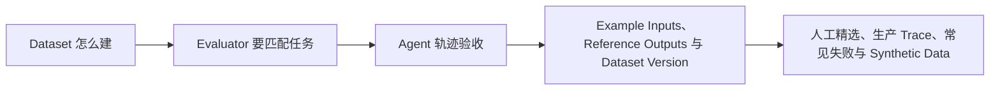

# 可观测性（05） - 离线评测、在线评测与 Agent 轨迹验收

> 读完后，你应能完成以下任务：
> - 绘制“可观测性（05） - 离线评测、在线评测与 Agent 轨迹验收 / Dataset 怎么建”的关键对象与数据流，解释“每条样本包含输入、期望行为、允许变化、标签和来源。”，并用源码位置、日志或 Trace 标注证据。
> - 为“可观测性（05） - 离线评测、在线评测与 Agent 轨迹验收 / Evaluator 要匹配任务”设计正常与异常输入，验证“Exact Match、Schema、单元测试：适合确定性输出和代码。”，输出首个偏差位置与回归测试结果。
> - 实现“可观测性（05） - 离线评测、在线评测与 Agent 轨迹验收 / Agent 轨迹验收”的最小代码或配置，检验“最终成功率之外，还要检查 Tool 选择、参数、顺序、重试次数、权限拒绝、预算和终止原因。”，输出命令、结果与 Diff，并说明不适用边界。

> 最终答案正确不代表过程可靠。Agent 可能调用了越权工具、走了昂贵路径，或只是在一次随机运行中碰巧成功。


## 核心知识清单

- Example Inputs、Reference Outputs 与 Dataset Version
- 人工精选、生产 Trace、常见失败与 Synthetic Data
- Exact Match、代码测试、规则、LLM Judge 与 Human Evaluation
- Reference-based、Reference-free 与 Pairwise
- Offline Evaluation、Online Evaluation 与 Baseline
- Agent 最终状态、Trajectory、Tool 与 Environment State
- Trial 重置、重复运行、置信区间与回归门禁

<!-- article-progressive-block:start -->
# 一、先建立全局：离线评测、在线评测与 Agent 轨迹验收 是什么？

理解“离线评测、在线评测与 Agent 轨迹验收”，先要把标题中的对象放进同一条处理链：它接收什么输入，经过哪些状态变化，最终用什么证据判断结果。下表不另造概念，只把作者正文已经解释的章节按依赖顺序连起来。

“离线评测、在线评测与 Agent 轨迹验收”的第一个核心判断是：每条样本包含输入、期望行为、允许变化、标签和来源。。先弄清这个判断中的对象和输入输出，后面的实现、故障和验收才有共同语境。

| 顺序 | 章节 | 读完本节应抓住的结论 |
| --- | --- | --- |
| 1 | Dataset 怎么建 | 每条样本包含输入、期望行为、允许变化、标签和来源。 |
| 2 | Evaluator 要匹配任务 | Exact Match、Schema、单元测试：适合确定性输出和代码。 |
| 3 | Agent 轨迹验收 | 最终成功率之外，还要检查 Tool 选择、参数、顺序、重试次数、权限拒绝、预算和终止原因。 |
| 4 | Example Inputs、Reference Outputs 与 Dataset Version | 线上失败经脱敏、去重和人工确认后进入 Dataset， |
| 5 | 人工精选、生产 Trace、常见失败与 Synthetic Data | 在线评测通过采样 Trace 发现分布漂移和新失败。 |
| 6 | Exact Match、代码测试、规则、LLM Judge 与 Human Evaluation | Human Evaluation：用于高风险、主观或 Judge 校准样本。 |

## 1.1 核心对象之间怎样衔接



这张图只表达本文的讲解顺序，不替代正文机制。判断“离线评测、在线评测与 Agent 轨迹验收”是否真正掌握，需要能从最后一个结果沿图回到前面每个章节的输入、状态变化和证据。

## 1.2 再看失败：问题最早会出现在哪一步？

在“离线评测、在线评测与 Agent 轨迹验收”的对象和顺序已经明确后，再看可观察的失败：文本直通执行、状态不可重放或重试重复写入。定位时不从最后一条错误猜原因，而是沿上图找第一个偏离正文结论的节点。
<!-- article-progressive-block:end -->

# 二、Dataset 怎么建

每条样本包含输入、期望行为、允许变化、标签和来源。
抽取与分类可给 Reference Output；
开放问答更适合关键事实、引用或 Rubric。
样本覆盖正常、边界、攻击和历史事故，并按用户或文档来源切分，防止数据泄漏。

Dataset 需要不可变版本。
Prompt、模型、Retriever、索引和代码版本共同标识一次 Experiment，
否则结果无法复现。

# 三、Evaluator 要匹配任务

- Exact Match、Schema、单元测试：适合确定性输出和代码。
- Reference-based Judge：比较候选与参考事实，但参考答案可能不完备。
- Reference-free Judge：按安全、清晰、引用等 Rubric 评分。
- Pairwise：在同一样本上比较候选与 Baseline，减少绝对分漂移。
- Human Evaluation：用于高风险、主观或 Judge 校准样本。

Judge 一次只评一个维度，输出结构化理由和证据；
定期与人工标注计算一致性，发现位置偏好、长度偏好和自我偏好。

# 四、Agent 轨迹验收

最终成功率之外，还要检查 Tool 选择、参数、顺序、重试次数、权限拒绝、预算和终止原因。
测试前重置数据库、文件和外部模拟状态，确保 Trial 独立。
对随机 Agent 重复运行，报告均值、失败分布和置信区间，而不是展示最好的一次。

离线评测阻断回归；
在线评测通过采样 Trace 发现分布漂移和新失败。
线上失败经脱敏、去重和人工确认后进入 Dataset，
修复通过离线回归、灰度和在线指标后再扩大流量。

<!-- article-progressive-block:start -->
# 五、动手验证：先跑通 离线评测、在线评测与 Agent 轨迹验收，再改变一个变量

前面的章节已经建立问题、概念和机制。现在把“离线评测、在线评测与 Agent 轨迹验收”放进同一套基线中运行；本节不再引入新术语，只验证前文结论能否被复现。

## 5.1 基线与候选只允许一个变量不同

验证“离线评测、在线评测与 Agent 轨迹验收”时，先固定工具 Schema、身份、畸形参数、超时和重复请求。候选方案只能改变本次要验证的变量；如果同时更换数据、依赖和配置，即使结果改善，也不能知道是哪一项产生作用。

执行“离线评测、在线评测与 Agent 轨迹验收”时，动作是：回放决策到执行链路，覆盖失败、重试、暂停和恢复。原始结果不能只保留截图或汇总分数，必须同步保存：模型提议、校验、授权、幂等键、状态迁移、Trace，使下一次复查可以在同一输入上重放。

| 实验要素 | 本文要求 |
| --- | --- |
| 固定条件 | 工具 Schema、身份、畸形参数、超时和重复请求 |
| 唯一变量 | 本次候选方案与基线之间的一项明确差异 |
| 原始证据 | 模型提议、校验、授权、幂等键、状态迁移、Trace |
| 通过阈值 | 模型只提议；执行受代码约束；失败不重复副作用 |
| 立即停止 | 文本直通执行、状态不可重放或重试重复写入 |

## 5.2 执行前先排除不可比较条件

“离线评测、在线评测与 Agent 轨迹验收”开始前先确认下面四项；任一项不成立，都应先修复实验条件，而不是解释结果。

- 基线能够在“离线评测、在线评测与 Agent 轨迹验收”的当前环境重复运行。
- 候选只改变一个与“离线评测、在线评测与 Agent 轨迹验收”结论直接相关的条件。
- “离线评测、在线评测与 Agent 轨迹验收”的基线和候选使用同一批输入、同一版本依赖与同一通过阈值。
- “离线评测、在线评测与 Agent 轨迹验收”的原始输出和失败现场不会被重试、格式化或汇总覆盖。

## 5.3 执行后先核对证据完整性

结果出来后先检查证据，再讨论“离线评测、在线评测与 Agent 轨迹验收”是否通过。缺少中间状态时，最终输出只能说明现象，不能证明机制。

| 检查项 | 当前文章的判定 |
| --- | --- |
| 输入可追溯 | 工具 Schema、身份、畸形参数、超时和重复请求 |
| 过程可回放 | 回放决策到执行链路，覆盖失败、重试、暂停和恢复 |
| 结果可审计 | 模型提议、校验、授权、幂等键、状态迁移、Trace |

“离线评测、在线评测与 Agent 轨迹验收”的一次合格基线对照按以下顺序执行：

1. 保存“离线评测、在线评测与 Agent 轨迹验收”基线版本及输入摘要，确认基线本身可以重复运行。
2. 写下“离线评测、在线评测与 Agent 轨迹验收”候选方案唯一变化的变量，以及它预期影响的指标。
3. 在同一环境执行“离线评测、在线评测与 Agent 轨迹验收”：回放决策到执行链路，覆盖失败、重试、暂停和恢复。
4. 为“离线评测、在线评测与 Agent 轨迹验收”保存：模型提议、校验、授权、幂等键、状态迁移、Trace。
5. 使用“离线评测、在线评测与 Agent 轨迹验收”预登记条件判断：模型只提议；执行受代码约束；失败不重复副作用。
6. 如果“离线评测、在线评测与 Agent 轨迹验收”未通过，不修改第二个变量，先恢复基线并保留失败现场。

# 六、用一张矩阵验证 离线评测、在线评测与 Agent 轨迹验收 的关键结论

矩阵按正文顺序列出“离线评测、在线评测与 Agent 轨迹验收”的结论。一次实验只选择一行，只改变这一行对应的条件；不要把多行合并成一个无法归因的大实验。

| 正文章节 | 已解释的结论 | 本轮唯一变量 | 必须保存的证据 |
| --- | --- | --- | --- |
| Dataset 怎么建 | 每条样本包含输入、期望行为、允许变化、标签和来源。 | 只改变与“Dataset 怎么建”相关的条件 | 模型提议、校验、授权、幂等键、状态迁移、Trace |
| Evaluator 要匹配任务 | Exact Match、Schema、单元测试：适合确定性输出和代码。 | 只改变与“Evaluator 要匹配任务”相关的条件 | 模型提议、校验、授权、幂等键、状态迁移、Trace |
| Agent 轨迹验收 | 最终成功率之外，还要检查 Tool 选择、参数、顺序、重试次数、权限拒绝、预算和终止原因。 | 只改变与“Agent 轨迹验收”相关的条件 | 模型提议、校验、授权、幂等键、状态迁移、Trace |
| Example Inputs、Reference Outputs 与 Dataset Version | 线上失败经脱敏、去重和人工确认后进入 Dataset， | 只改变与“Example Inputs、Reference Outputs 与 Dataset Version”相关的条件 | 模型提议、校验、授权、幂等键、状态迁移、Trace |
| 人工精选、生产 Trace、常见失败与 Synthetic Data | 在线评测通过采样 Trace 发现分布漂移和新失败。 | 只改变与“人工精选、生产 Trace、常见失败与 Synthetic Data”相关的条件 | 模型提议、校验、授权、幂等键、状态迁移、Trace |
| Exact Match、代码测试、规则、LLM Judge 与 Human Evaluation | Human Evaluation：用于高风险、主观或 Judge 校准样本。 | 只改变与“Exact Match、代码测试、规则、LLM Judge 与 Human Evaluation”相关的条件 | 模型提议、校验、授权、幂等键、状态迁移、Trace |

## 6.1 记录本次实际实验

下面的记录用于“离线评测、在线评测与 Agent 轨迹验收”当前这一次实验，不是第二套知识目录。先从矩阵选择一个章节，再填写实际值；没有填写的字段表示尚未验证。

```yaml
topic: "离线评测、在线评测与 Agent 轨迹验收"
selected_chapter: required
claim_from_article: required
baseline_version: required
changed_condition: exactly_one
execution: "回放决策到执行链路，覆盖失败、重试、暂停和恢复"
evidence: "模型提议、校验、授权、幂等键、状态迁移、Trace"
pass_when: "模型只提议；执行受代码约束；失败不重复副作用"
stop_when: "文本直通执行、状态不可重放或重试重复写入"
observed_result: required
first_deviation: null_or_evidence
recovery_replay: required_after_failure
```

## 6.2 边界实验必须证明能够停止和恢复

成功路径只能证明“离线评测、在线评测与 Agent 轨迹验收”在当前样本上工作，不能证明它可以进入生产。边界实验需要主动制造：文本直通执行、状态不可重放或重试重复写入，并观察系统是否在产生不可逆副作用前停止。

| 场景 | 只改变什么 | 应保存什么 | 通过标准 |
| --- | --- | --- | --- |
| 正常路径 | 使用已知有效输入 | 模型提议、校验、授权、幂等键、状态迁移、Trace | 模型只提议；执行受代码约束；失败不重复副作用 |
| 边界路径 | 把一个输入推进到约束临界值 | 临界值前后的输出与指标 | 不静默降级，不把部分结果冒充成功 |
| 明确失败 | 注入：文本直通执行、状态不可重放或重试重复写入 | 原始错误、首个异常阶段和最终状态 | 失败被正确分类且没有扩大副作用 |
| 恢复重放 | 执行：关闭副作用入口，恢复检查点，补充失败契约测试 | 原失败样本的复测证据 | 原样本恢复，正常样本没有回归 |

恢复动作不是简单重启。对于“离线评测、在线评测与 Agent 轨迹验收”，第一步是：关闭副作用入口，恢复检查点，补充失败契约测试。完成后使用原始失败样本复测；只验证一个新样本成功，不能证明触发条件已经消失。

“离线评测、在线评测与 Agent 轨迹验收”边界实验结束后，应把正常、临界、失败和恢复四类记录放在同一个运行批次中。这样才能区分“候选方案真的修复问题”和“环境变化让问题暂时没有出现”。

# 七、离线评测、在线评测与 Agent 轨迹验收 的结果解释

解释“离线评测、在线评测与 Agent 轨迹验收”实验时先看首个偏差，而不是最后一条错误。最后的异常通常只是上游状态错误的结果；从末端反推容易误把症状当根因。

| 观察结果 | 可以支持的判断 | 下一步 |
| --- | --- | --- |
| 主链路没有达到预期 | 文本直通执行、状态不可重放或重试重复写入 | 先执行：关闭副作用入口，恢复检查点，补充失败契约测试 |
| 异常链路无法恢复 | 文本直通执行、状态不可重放或重试重复写入 | 先执行：关闭副作用入口，恢复检查点，补充失败契约测试 |
| 新样本成功但原样本仍失败 | 修复没有覆盖原始触发条件 | 固定原失败输入，恢复基线后重新比较 |
| 指标改善但证据无法回链 | 数据、版本或中间状态没有固定 | 暂停发布，补齐可追溯记录后重跑 |

“离线评测、在线评测与 Agent 轨迹验收”只有同时满足“模型只提议；执行受代码约束；失败不重复副作用”，并且没有出现“文本直通执行、状态不可重放或重试重复写入”，才可以认为主链路通过。这里的“通过”只对当前固定版本、样本和环境有效，不能外推到尚未测试的容量、权限或数据分布。

如果“离线评测、在线评测与 Agent 轨迹验收”候选方案与基线差异很小，先检查证据分辨率是否足够；如果差异很大，先排除数据泄漏、环境漂移和版本不一致。两种情况都不能只看一个汇总均值，需要回到逐样本输出和中间状态。

“离线评测、在线评测与 Agent 轨迹验收”故障定位完成后，记录“现象、首个偏差、根因、改动、原样本复测”五项。缺少原样本复测时，只能标记为待观察，不能标记为已解决。

# 八、离线评测、在线评测与 Agent 轨迹验收 的发布判断

发布判断需要把“离线评测、在线评测与 Agent 轨迹验收”的质量、失败边界和恢复能力放在同一份记录中。以下任一条件缺失，都应停止扩量，而不是用“基本正常”替代证据。

- [ ] “离线评测、在线评测与 Agent 轨迹验收”的基线与候选只存在一个计划内变量。
- [ ] “离线评测、在线评测与 Agent 轨迹验收”的输入、代码、依赖、配置和数据版本可以追溯。
- [ ] “离线评测、在线评测与 Agent 轨迹验收”的正常、临界、失败和恢复样本使用同一套断言。
- [ ] “离线评测、在线评测与 Agent 轨迹验收”的原始输出、中间状态和失败现场已经保留。
- [ ] “离线评测、在线评测与 Agent 轨迹验收”的日志、Trace、截图和测试数据已经脱敏。
- [ ] “离线评测、在线评测与 Agent 轨迹验收”的停止条件、负责人和回滚入口已经演练。
- [ ] “离线评测、在线评测与 Agent 轨迹验收”尚未覆盖的输入、权限、容量和外部依赖已经登记。

最终记录至少包含基线版本、唯一变量、原始证据、首个偏差、恢复复测和发布责任人。没有参与本次修改的人如果不能据此重放“离线评测、在线评测与 Agent 轨迹验收”的判断，就不能发布。
<!-- article-progressive-block:end -->

# 九、总结

- **Dataset 怎么建**：每条样本包含输入、期望行为、允许变化、标签和来源。
- **Evaluator 要匹配任务**：Exact Match、Schema、单元测试：适合确定性输出和代码。
- **Agent 轨迹验收**：最终成功率之外，还要检查 Tool 选择、参数、顺序、重试次数、权限拒绝、预算和终止原因。
- **Example Inputs、Reference Outputs 与 Dataset Version**：线上失败经脱敏、去重和人工确认后进入 Dataset，修复通过离线回归、灰度和在线指标后再扩大流量。
- **人工精选、生产 Trace、常见失败与 Synthetic Data**：在线评测通过采样 Trace 发现分布漂移和新失败。
- **Exact Match、代码测试、规则、LLM Judge 与 Human Evaluation**：Human Evaluation：用于高风险、主观或 Judge 校准样本。

## 参考资料

- [LangSmith Evaluation Concepts](https://docs.langchain.com/langsmith/evaluation-concepts)
- [LangSmith Evaluate an Agent](https://docs.langchain.com/langsmith/evaluate-complex-agent)
- [OpenAI Evals](https://github.com/openai/evals)
