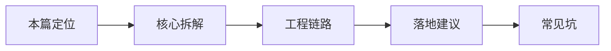

# 生产工程（12） - Nest 进阶：企业级 Node.js 后端架构与适用边界

> 读完后，你应能完成以下任务：
> - 绘制“生产工程（12） - Nest 进阶：企业级 Node.js 后端架构与适用边界 / 本篇定位”的关键对象与数据流，解释“这是 Node 后端工程篇，为前端/全栈同学把 Agent 服务做成可维护项目。”，并用源码位置、日志或 Trace 标注证据。
> - 为“生产工程（12） - Nest 进阶：企业级 Node.js 后端架构与适用边界 / 核心拆解”设计正常与异常输入，验证“Controller 负责 HTTP/SSE/WebSocket 入口，Service 负责业务流程，Provider 封装模型、向量库、数据库、工具客户端。”，输出首个偏差位置与回归测试结果。
> - 实现“生产工程（12） - Nest 进阶：企业级 Node.js 后端架构与适用边界 / 工程链路”的最小代码或配置，检验“Interceptor 写 trace 和指标。”，输出命令、结果与 Diff，并说明不适用边界。

<!-- article-progressive-block:start -->
# 一、先建立全局：Nest 进阶：企业级 Node.js 后端架构与适用边界 是什么？

理解“Nest 进阶：企业级 Node.js 后端架构与适用边界”，先要把标题中的对象放进同一条处理链：它接收什么输入，经过哪些状态变化，最终用什么证据判断结果。下表不另造概念，只把作者正文已经解释的章节按依赖顺序连起来。

“Nest 进阶：企业级 Node.js 后端架构与适用边界”的第一个核心判断是：这是 Node 后端工程篇，为前端/全栈同学把 Agent 服务做成可维护项目。。先弄清这个判断中的对象和输入输出，后面的实现、故障和验收才有共同语境。

| 顺序 | 章节 | 读完本节应抓住的结论 |
| --- | --- | --- |
| 1 | 本篇定位 | 这是 Node 后端工程篇，为前端/全栈同学把 Agent 服务做成可维护项目。 |
| 2 | 核心拆解 | Controller 负责 HTTP/SSE/WebSocket 入口，Service 负责业务流程，Provider 封装模型、向量库、数据库、工具客户端。 |
| 3 | 工程链路 | Interceptor 写 trace 和指标。 |
| 4 | 落地建议 | 工具执行统一经过 ToolService，避免散落权限逻辑。 |
| 5 | 常见坑 | Controller 里写所有业务。 |
| 6 | 和已有主线的关系 | 15 FastAPI 是 Python 入门后端； |

## 1.1 核心对象之间怎样衔接



这张图只表达本文的讲解顺序，不替代正文机制。判断“Nest 进阶：企业级 Node.js 后端架构与适用边界”是否真正掌握，需要能从最后一个结果沿图回到前面每个章节的输入、状态变化和证据。

## 1.2 再看失败：问题最早会出现在哪一步？

在“Nest 进阶：企业级 Node.js 后端架构与适用边界”的对象和顺序已经明确后，再看可观察的失败：只报告均分、数据泄漏、评审器未校准、Trace 断链或回退阈值缺失。定位时不从最后一条错误猜原因，而是沿上图找第一个偏离正文结论的节点。
<!-- article-progressive-block:end -->

# 二、本篇定位

这是 Node 后端工程篇，为前端/全栈同学把 Agent 服务做成可维护项目。

# 三、一个真实场景

一个 AI 后端慢慢会长出 chat、rag、tool、task、memory、auth、billing、observability 等模块。
如果只用一个 Express 文件堆路由，很快不可维护。
Nest 的模块、Controller、Service、Provider、Guard、Interceptor 能帮助你划清边界。

# 四、核心拆解

- Controller 负责 HTTP/SSE/WebSocket 入口，Service 负责业务流程，Provider 封装模型、向量库、数据库、工具客户端。
- Guard 适合做鉴权和权限校验，Interceptor 适合做日志、trace、耗时统计和统一响应。
- Module 让 RAG、Tool、Task、Memory 分成独立单元，依赖关系更清楚。

# 五、工程链路

- 按领域建模块。
- Controller 接收请求并做 DTO 校验。
- Service 编排业务。
- Provider 连接外部资源。
- Guard 控权限。
- Interceptor 写 trace 和指标。

# 六、落地建议

- AI 调用统一封装 ModelProvider，方便换模型。
- 工具执行统一经过 ToolService，避免散落权限逻辑。
- SSE 接口和普通 REST 接口分清响应模型。

# 七、常见坑

- Controller 里写所有业务。
- 每个模块各自调模型，成本和日志分散。
- 没有 DTO 校验，模型参数错误直接进业务层。

# 八、和已有主线的关系

15 FastAPI 是 Python 入门后端；
87 给 Node/Nest 技术栈下的企业级组织方式。

# 九、复述答法

> Nest 适合 AI 后端模块化：Controller 管入口，Service 管流程，Provider 管外部依赖，Guard 管权限，Interceptor 管日志和 trace。Agent 项目复杂后，模块边界比框架名字更重要。

<!-- article-progressive-block:start -->
# 十、动手验证：先跑通 Nest 进阶：企业级 Node.js 后端架构与适用边界，再改变一个变量

前面的章节已经建立问题、概念和机制。现在把“Nest 进阶：企业级 Node.js 后端架构与适用边界”放进同一套基线中运行；本节不再引入新术语，只验证前文结论能否被复现。

## 10.1 基线与候选只允许一个变量不同

验证“Nest 进阶：企业级 Node.js 后端架构与适用边界”时，先固定版本化数据集、Trace Schema、质量基线、运行指标、成本预算和回退阈值。候选方案只能改变本次要验证的变量；如果同时更换数据、依赖和配置，即使结果改善，也不能知道是哪一项产生作用。

执行“Nest 进阶：企业级 Node.js 后端架构与适用边界”时，动作是：同输入运行基线与候选，逐样本比较质量并关联线上延迟、错误与成本。原始结果不能只保留截图或汇总分数，必须同步保存：逐样本输出、评分理由、Trace、指标窗口、失败标签、版本和发布判断，使下一次复查可以在同一输入上重放。

| 实验要素 | 本文要求 |
| --- | --- |
| 固定条件 | 版本化数据集、Trace Schema、质量基线、运行指标、成本预算和回退阈值 |
| 唯一变量 | 本次候选方案与基线之间的一项明确差异 |
| 原始证据 | 逐样本输出、评分理由、Trace、指标窗口、失败标签、版本和发布判断 |
| 通过阈值 | 目标切片改善且安全、延迟与成本不越界，失败样本能回链到首个异常阶段 |
| 立即停止 | 只报告均分、数据泄漏、评审器未校准、Trace 断链或回退阈值缺失 |

## 10.2 执行前先排除不可比较条件

“Nest 进阶：企业级 Node.js 后端架构与适用边界”开始前先确认下面四项；任一项不成立，都应先修复实验条件，而不是解释结果。

- 基线能够在“Nest 进阶：企业级 Node.js 后端架构与适用边界”的当前环境重复运行。
- 候选只改变一个与“Nest 进阶：企业级 Node.js 后端架构与适用边界”结论直接相关的条件。
- “Nest 进阶：企业级 Node.js 后端架构与适用边界”的基线和候选使用同一批输入、同一版本依赖与同一通过阈值。
- “Nest 进阶：企业级 Node.js 后端架构与适用边界”的原始输出和失败现场不会被重试、格式化或汇总覆盖。

## 10.3 执行后先核对证据完整性

结果出来后先检查证据，再讨论“Nest 进阶：企业级 Node.js 后端架构与适用边界”是否通过。缺少中间状态时，最终输出只能说明现象，不能证明机制。

| 检查项 | 当前文章的判定 |
| --- | --- |
| 输入可追溯 | 版本化数据集、Trace Schema、质量基线、运行指标、成本预算和回退阈值 |
| 过程可回放 | 同输入运行基线与候选，逐样本比较质量并关联线上延迟、错误与成本 |
| 结果可审计 | 逐样本输出、评分理由、Trace、指标窗口、失败标签、版本和发布判断 |

“Nest 进阶：企业级 Node.js 后端架构与适用边界”的一次合格基线对照按以下顺序执行：

1. 保存“Nest 进阶：企业级 Node.js 后端架构与适用边界”基线版本及输入摘要，确认基线本身可以重复运行。
2. 写下“Nest 进阶：企业级 Node.js 后端架构与适用边界”候选方案唯一变化的变量，以及它预期影响的指标。
3. 在同一环境执行“Nest 进阶：企业级 Node.js 后端架构与适用边界”：同输入运行基线与候选，逐样本比较质量并关联线上延迟、错误与成本。
4. 为“Nest 进阶：企业级 Node.js 后端架构与适用边界”保存：逐样本输出、评分理由、Trace、指标窗口、失败标签、版本和发布判断。
5. 使用“Nest 进阶：企业级 Node.js 后端架构与适用边界”预登记条件判断：目标切片改善且安全、延迟与成本不越界，失败样本能回链到首个异常阶段。
6. 如果“Nest 进阶：企业级 Node.js 后端架构与适用边界”未通过，不修改第二个变量，先恢复基线并保留失败现场。

# 十一、用一张矩阵验证 Nest 进阶：企业级 Node.js 后端架构与适用边界 的关键结论

矩阵按正文顺序列出“Nest 进阶：企业级 Node.js 后端架构与适用边界”的结论。一次实验只选择一行，只改变这一行对应的条件；不要把多行合并成一个无法归因的大实验。

| 正文章节 | 已解释的结论 | 本轮唯一变量 | 必须保存的证据 |
| --- | --- | --- | --- |
| 本篇定位 | 这是 Node 后端工程篇，为前端/全栈同学把 Agent 服务做成可维护项目。 | 只改变与“本篇定位”相关的条件 | 逐样本输出、评分理由、Trace、指标窗口、失败标签、版本和发布判断 |
| 核心拆解 | Controller 负责 HTTP/SSE/WebSocket 入口，Service 负责业务流程，Provider 封装模型、向量库、数据库、工具客户端。 | 只改变与“核心拆解”相关的条件 | 逐样本输出、评分理由、Trace、指标窗口、失败标签、版本和发布判断 |
| 工程链路 | Interceptor 写 trace 和指标。 | 只改变与“工程链路”相关的条件 | 逐样本输出、评分理由、Trace、指标窗口、失败标签、版本和发布判断 |
| 落地建议 | 工具执行统一经过 ToolService，避免散落权限逻辑。 | 只改变与“落地建议”相关的条件 | 逐样本输出、评分理由、Trace、指标窗口、失败标签、版本和发布判断 |
| 常见坑 | Controller 里写所有业务。 | 只改变与“常见坑”相关的条件 | 逐样本输出、评分理由、Trace、指标窗口、失败标签、版本和发布判断 |
| 和已有主线的关系 | 15 FastAPI 是 Python 入门后端； | 只改变与“和已有主线的关系”相关的条件 | 逐样本输出、评分理由、Trace、指标窗口、失败标签、版本和发布判断 |

## 11.1 记录本次实际实验

下面的记录用于“Nest 进阶：企业级 Node.js 后端架构与适用边界”当前这一次实验，不是第二套知识目录。先从矩阵选择一个章节，再填写实际值；没有填写的字段表示尚未验证。

```yaml
topic: "Nest 进阶：企业级 Node.js 后端架构与适用边界"
selected_chapter: required
claim_from_article: required
baseline_version: required
changed_condition: exactly_one
execution: "同输入运行基线与候选，逐样本比较质量并关联线上延迟、错误与成本"
evidence: "逐样本输出、评分理由、Trace、指标窗口、失败标签、版本和发布判断"
pass_when: "目标切片改善且安全、延迟与成本不越界，失败样本能回链到首个异常阶段"
stop_when: "只报告均分、数据泄漏、评审器未校准、Trace 断链或回退阈值缺失"
observed_result: required
first_deviation: null_or_evidence
recovery_replay: required_after_failure
```

## 11.2 边界实验必须证明能够停止和恢复

成功路径只能证明“Nest 进阶：企业级 Node.js 后端架构与适用边界”在当前样本上工作，不能证明它可以进入生产。边界实验需要主动制造：只报告均分、数据泄漏、评审器未校准、Trace 断链或回退阈值缺失，并观察系统是否在产生不可逆副作用前停止。

| 场景 | 只改变什么 | 应保存什么 | 通过标准 |
| --- | --- | --- | --- |
| 正常路径 | 使用已知有效输入 | 逐样本输出、评分理由、Trace、指标窗口、失败标签、版本和发布判断 | 目标切片改善且安全、延迟与成本不越界，失败样本能回链到首个异常阶段 |
| 边界路径 | 把一个输入推进到约束临界值 | 临界值前后的输出与指标 | 不静默降级，不把部分结果冒充成功 |
| 明确失败 | 注入：只报告均分、数据泄漏、评审器未校准、Trace 断链或回退阈值缺失 | 原始错误、首个异常阶段和最终状态 | 失败被正确分类且没有扩大副作用 |
| 恢复重放 | 执行：停止扩量，保留基线，按数据、Prompt、模型、应用或评审阶段隔离失败 | 原失败样本的复测证据 | 原样本恢复，正常样本没有回归 |

恢复动作不是简单重启。对于“Nest 进阶：企业级 Node.js 后端架构与适用边界”，第一步是：停止扩量，保留基线，按数据、Prompt、模型、应用或评审阶段隔离失败。完成后使用原始失败样本复测；只验证一个新样本成功，不能证明触发条件已经消失。

“Nest 进阶：企业级 Node.js 后端架构与适用边界”边界实验结束后，应把正常、临界、失败和恢复四类记录放在同一个运行批次中。这样才能区分“候选方案真的修复问题”和“环境变化让问题暂时没有出现”。

# 十二、Nest 进阶：企业级 Node.js 后端架构与适用边界 的结果解释

解释“Nest 进阶：企业级 Node.js 后端架构与适用边界”实验时先看首个偏差，而不是最后一条错误。最后的异常通常只是上游状态错误的结果；从末端反推容易误把症状当根因。

| 观察结果 | 可以支持的判断 | 下一步 |
| --- | --- | --- |
| 主链路没有达到预期 | 只报告均分、数据泄漏、评审器未校准、Trace 断链或回退阈值缺失 | 先执行：停止扩量，保留基线，按数据、Prompt、模型、应用或评审阶段隔离失败 |
| 异常链路无法恢复 | 只报告均分、数据泄漏、评审器未校准、Trace 断链或回退阈值缺失 | 先执行：停止扩量，保留基线，按数据、Prompt、模型、应用或评审阶段隔离失败 |
| 新样本成功但原样本仍失败 | 修复没有覆盖原始触发条件 | 固定原失败输入，恢复基线后重新比较 |
| 指标改善但证据无法回链 | 数据、版本或中间状态没有固定 | 暂停发布，补齐可追溯记录后重跑 |

“Nest 进阶：企业级 Node.js 后端架构与适用边界”只有同时满足“目标切片改善且安全、延迟与成本不越界，失败样本能回链到首个异常阶段”，并且没有出现“只报告均分、数据泄漏、评审器未校准、Trace 断链或回退阈值缺失”，才可以认为主链路通过。这里的“通过”只对当前固定版本、样本和环境有效，不能外推到尚未测试的容量、权限或数据分布。

如果“Nest 进阶：企业级 Node.js 后端架构与适用边界”候选方案与基线差异很小，先检查证据分辨率是否足够；如果差异很大，先排除数据泄漏、环境漂移和版本不一致。两种情况都不能只看一个汇总均值，需要回到逐样本输出和中间状态。

“Nest 进阶：企业级 Node.js 后端架构与适用边界”故障定位完成后，记录“现象、首个偏差、根因、改动、原样本复测”五项。缺少原样本复测时，只能标记为待观察，不能标记为已解决。

# 十三、Nest 进阶：企业级 Node.js 后端架构与适用边界 的发布判断

发布判断需要把“Nest 进阶：企业级 Node.js 后端架构与适用边界”的质量、失败边界和恢复能力放在同一份记录中。以下任一条件缺失，都应停止扩量，而不是用“基本正常”替代证据。

- [ ] “Nest 进阶：企业级 Node.js 后端架构与适用边界”的基线与候选只存在一个计划内变量。
- [ ] “Nest 进阶：企业级 Node.js 后端架构与适用边界”的输入、代码、依赖、配置和数据版本可以追溯。
- [ ] “Nest 进阶：企业级 Node.js 后端架构与适用边界”的正常、临界、失败和恢复样本使用同一套断言。
- [ ] “Nest 进阶：企业级 Node.js 后端架构与适用边界”的原始输出、中间状态和失败现场已经保留。
- [ ] “Nest 进阶：企业级 Node.js 后端架构与适用边界”的日志、Trace、截图和测试数据已经脱敏。
- [ ] “Nest 进阶：企业级 Node.js 后端架构与适用边界”的停止条件、负责人和回滚入口已经演练。
- [ ] “Nest 进阶：企业级 Node.js 后端架构与适用边界”尚未覆盖的输入、权限、容量和外部依赖已经登记。

最终记录至少包含基线版本、唯一变量、原始证据、首个偏差、恢复复测和发布责任人。没有参与本次修改的人如果不能据此重放“Nest 进阶：企业级 Node.js 后端架构与适用边界”的判断，就不能发布。
<!-- article-progressive-block:end -->

# 十四、总结

- **本篇定位**：这是 Node 后端工程篇，为前端/全栈同学把 Agent 服务做成可维护项目。
- **核心拆解**：Controller 负责 HTTP/SSE/WebSocket 入口，Service 负责业务流程，Provider 封装模型、向量库、数据库、工具客户端。
- **工程链路**：Interceptor 写 trace 和指标。
- **落地建议**：工具执行统一经过 ToolService，避免散落权限逻辑。
- **和已有主线的关系**：15 FastAPI 是 Python 入门后端；
- **复述答法**：Nest 适合 AI 后端模块化：Controller 管入口，Service 管流程，Provider 管外部依赖，Guard 管权限，Interceptor 管日志和 trace。

## 参考资料

- [OWASP LLM Top 10](https://genai.owasp.org/llm-top-10/)
- [Google SRE Workbook](https://sre.google/workbook/table-of-contents/)
