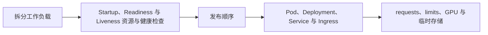

# 生产工程（22） - Kubernetes 部署、弹性与灰度回滚

> 读完后，你应能完成以下任务：
> - 绘制“生产工程（22） - Kubernetes 部署、弹性与灰度回滚 / 拆分工作负载”的关键对象与数据流，解释“无状态 AI API 负责鉴权、协议和编排；”，并用源码位置、日志或 Trace 标注证据。
> - 为“生产工程（22） - Kubernetes 部署、弹性与灰度回滚 / Startup、Readiness 与 Liveness 资源与健康检查”设计正常与异常输入，验证“requests 决定调度保证，limits 约束最大资源；”，输出首个偏差位置与回归测试结果。
> - 实现“生产工程（22） - Kubernetes 部署、弹性与灰度回滚 / 发布顺序”的最小代码或配置，检验“CI 完成静态检查、测试、评测、镜像扫描和签名。 -> 向前兼容地执行数据库迁移，再部署可同时读写新旧 Schema 的应用。 -> 新版本先接少量流量，比较错误率、延迟、质量、Token 与成本。 -> 指标越界立即停止扩大并回滚 Deployment、Prompt、模型或索引 Alias。”，输出命令、结果与 Diff，并说明不适用边界。

> Kubernetes 能维持副本和发布状态，但不会自动解决模型加载慢、流式长连接、队列积压和 GPU 容量等 AI 工作负载问题。


## 核心知识清单

- Pod、Deployment、Service 与 Ingress
- ConfigMap、Secret、ServiceAccount 与 NetworkPolicy
- requests、limits、GPU 与临时存储
- Startup、Readiness 与 Liveness Probe
- HPA、队列长度、自定义指标与预热容量
- Rolling Update、灰度、回滚与数据库迁移
- CI/CD、安全扫描、SLO 与故障演练

<!-- article-progressive-block:start -->
# 一、先建立全局：Kubernetes 部署、弹性与灰度回滚 是什么？

理解“Kubernetes 部署、弹性与灰度回滚”，先要把标题中的对象放进同一条处理链：它接收什么输入，经过哪些状态变化，最终用什么证据判断结果。下表不另造概念，只把作者正文已经解释的章节按依赖顺序连起来。

“Kubernetes 部署、弹性与灰度回滚”的第一个核心判断是：无状态 AI API 负责鉴权、协议和编排；。先弄清这个判断中的对象和输入输出，后面的实现、故障和验收才有共同语境。

| 顺序 | 章节 | 读完本节应抓住的结论 |
| --- | --- | --- |
| 1 | 拆分工作负载 | 无状态 AI API 负责鉴权、协议和编排； |
| 2 | Startup、Readiness 与 Liveness 资源与健康检查 | requests 决定调度保证，limits 约束最大资源； |
| 3 | 发布顺序 | CI 完成静态检查、测试、评测、镜像扫描和签名。 -> 向前兼容地执行数据库迁移，再部署可同时读写新旧 Schema 的应用。 -> 新版本先接少量流量，比较错误率、延迟、质量、Token 与成本。 -> 指标越界立即停止扩大并回滚 Deployment、Prompt、模型或索引 Alias。 |
| 4 | Pod、Deployment、Service 与 Ingress | 三者的扩容指标、启动时间和故障边界不同，不应塞进同一个 Pod。 |
| 5 | requests、limits、GPU 与临时存储 | requests 决定调度保证，limits 约束最大资源； |
| 6 | Startup、Readiness 与 Liveness Probe | Startup、Readiness 与 Liveness 必须使用不同的成功条件：Startup 覆盖最慢冷启动窗口， |

## 1.1 核心对象之间怎样衔接



这张图只表达本文的讲解顺序，不替代正文机制。判断“Kubernetes 部署、弹性与灰度回滚”是否真正掌握，需要能从最后一个结果沿图回到前面每个章节的输入、状态变化和证据。

## 1.2 再看失败：问题最早会出现在哪一步？

在“Kubernetes 部署、弹性与灰度回滚”的对象和顺序已经明确后，再看可观察的失败：只报告均分、数据泄漏、评审器未校准、Trace 断链或回退阈值缺失。定位时不从最后一条错误猜原因，而是沿上图找第一个偏离正文结论的节点。
<!-- article-progressive-block:end -->

# 二、拆分工作负载

无状态 AI API 负责鉴权、协议和编排；
Embedding 或文档解析 Worker 从队列消费任务；
自托管模型服务独立管理 GPU、批处理和模型版本。
三者的扩容指标、启动时间和故障边界不同，不应塞进同一个 Pod。

Service 提供稳定发现，Ingress 终止 TLS 并管理入口限制。
ConfigMap 保存非敏感配置，Secret 保存凭据但仍要开启静态加密和最小 RBAC。
NetworkPolicy 限制 Worker、模型和数据库之间的可达范围。

# 三、Startup、Readiness 与 Liveness 资源与健康检查

requests 决定调度保证，limits 约束最大资源；
Embedding 大批任务还要限制临时磁盘和单文件大小。
Startup Probe 保护模型加载期，
Readiness 在模型、依赖或预热未完成时阻止流量，
Liveness 只处理进程失活，
不能把短暂供应商故障变成重启风暴。

Startup、Readiness 与 Liveness 必须使用不同的成功条件：Startup 覆盖最慢冷启动窗口，
Readiness 反映当前副本能否安全接流量，
Liveness 只判断进程是否无法自愈。
把 Startup、Readiness 与 Liveness 指向同一个深度依赖接口，
会让临时外部故障触发整个副本组反复重启。

HPA 不应只看 CPU。
API 可参考并发、P95 延迟和请求率，
Worker 参考队列长度与最老任务年龄，
GPU 服务参考排队请求、KV Cache 和 Token 吞吐。
扩容速度要覆盖模型加载时间，并保留最小预热副本。

# 四、发布顺序

1. CI 完成静态检查、测试、评测、镜像扫描和签名。
2. 向前兼容地执行数据库迁移，再部署可同时读写新旧 Schema 的应用。
3. 新版本先接少量流量，比较错误率、延迟、质量、Token 与成本。
4. 指标越界立即停止扩大并回滚 Deployment、Prompt、模型或索引 Alias。
5. 发布后验证流式、取消、队列、告警和故障恢复，而不只检查首页。

<!-- article-progressive-block:start -->
# 五、动手验证：先跑通 Kubernetes 部署、弹性与灰度回滚，再改变一个变量

前面的章节已经建立问题、概念和机制。现在把“Kubernetes 部署、弹性与灰度回滚”放进同一套基线中运行；本节不再引入新术语，只验证前文结论能否被复现。

## 5.1 基线与候选只允许一个变量不同

验证“Kubernetes 部署、弹性与灰度回滚”时，先固定版本化数据集、Trace Schema、质量基线、运行指标、成本预算和回退阈值。候选方案只能改变本次要验证的变量；如果同时更换数据、依赖和配置，即使结果改善，也不能知道是哪一项产生作用。

执行“Kubernetes 部署、弹性与灰度回滚”时，动作是：同输入运行基线与候选，逐样本比较质量并关联线上延迟、错误与成本。原始结果不能只保留截图或汇总分数，必须同步保存：逐样本输出、评分理由、Trace、指标窗口、失败标签、版本和发布判断，使下一次复查可以在同一输入上重放。

| 实验要素 | 本文要求 |
| --- | --- |
| 固定条件 | 版本化数据集、Trace Schema、质量基线、运行指标、成本预算和回退阈值 |
| 唯一变量 | 本次候选方案与基线之间的一项明确差异 |
| 原始证据 | 逐样本输出、评分理由、Trace、指标窗口、失败标签、版本和发布判断 |
| 通过阈值 | 目标切片改善且安全、延迟与成本不越界，失败样本能回链到首个异常阶段 |
| 立即停止 | 只报告均分、数据泄漏、评审器未校准、Trace 断链或回退阈值缺失 |

## 5.2 执行前先排除不可比较条件

“Kubernetes 部署、弹性与灰度回滚”开始前先确认下面四项；任一项不成立，都应先修复实验条件，而不是解释结果。

- 基线能够在“Kubernetes 部署、弹性与灰度回滚”的当前环境重复运行。
- 候选只改变一个与“Kubernetes 部署、弹性与灰度回滚”结论直接相关的条件。
- “Kubernetes 部署、弹性与灰度回滚”的基线和候选使用同一批输入、同一版本依赖与同一通过阈值。
- “Kubernetes 部署、弹性与灰度回滚”的原始输出和失败现场不会被重试、格式化或汇总覆盖。

## 5.3 执行后先核对证据完整性

结果出来后先检查证据，再讨论“Kubernetes 部署、弹性与灰度回滚”是否通过。缺少中间状态时，最终输出只能说明现象，不能证明机制。

| 检查项 | 当前文章的判定 |
| --- | --- |
| 输入可追溯 | 版本化数据集、Trace Schema、质量基线、运行指标、成本预算和回退阈值 |
| 过程可回放 | 同输入运行基线与候选，逐样本比较质量并关联线上延迟、错误与成本 |
| 结果可审计 | 逐样本输出、评分理由、Trace、指标窗口、失败标签、版本和发布判断 |

“Kubernetes 部署、弹性与灰度回滚”的一次合格基线对照按以下顺序执行：

1. 保存“Kubernetes 部署、弹性与灰度回滚”基线版本及输入摘要，确认基线本身可以重复运行。
2. 写下“Kubernetes 部署、弹性与灰度回滚”候选方案唯一变化的变量，以及它预期影响的指标。
3. 在同一环境执行“Kubernetes 部署、弹性与灰度回滚”：同输入运行基线与候选，逐样本比较质量并关联线上延迟、错误与成本。
4. 为“Kubernetes 部署、弹性与灰度回滚”保存：逐样本输出、评分理由、Trace、指标窗口、失败标签、版本和发布判断。
5. 使用“Kubernetes 部署、弹性与灰度回滚”预登记条件判断：目标切片改善且安全、延迟与成本不越界，失败样本能回链到首个异常阶段。
6. 如果“Kubernetes 部署、弹性与灰度回滚”未通过，不修改第二个变量，先恢复基线并保留失败现场。

# 六、用一张矩阵验证 Kubernetes 部署、弹性与灰度回滚 的关键结论

矩阵按正文顺序列出“Kubernetes 部署、弹性与灰度回滚”的结论。一次实验只选择一行，只改变这一行对应的条件；不要把多行合并成一个无法归因的大实验。

| 正文章节 | 已解释的结论 | 本轮唯一变量 | 必须保存的证据 |
| --- | --- | --- | --- |
| 拆分工作负载 | 无状态 AI API 负责鉴权、协议和编排； | 只改变与“拆分工作负载”相关的条件 | 逐样本输出、评分理由、Trace、指标窗口、失败标签、版本和发布判断 |
| Startup、Readiness 与 Liveness 资源与健康检查 | requests 决定调度保证，limits 约束最大资源； | 只改变与“Startup、Readiness 与 Liveness 资源与健康检查”相关的条件 | 逐样本输出、评分理由、Trace、指标窗口、失败标签、版本和发布判断 |
| 发布顺序 | CI 完成静态检查、测试、评测、镜像扫描和签名。 -> 向前兼容地执行数据库迁移，再部署可同时读写新旧 Schema 的应用。 -> 新版本先接少量流量，比较错误率、延迟、质量、Token 与成本。 -> 指标越界立即停止扩大并回滚 Deployment、Prompt、模型或索引 Alias。 | 只改变与“发布顺序”相关的条件 | 逐样本输出、评分理由、Trace、指标窗口、失败标签、版本和发布判断 |
| Pod、Deployment、Service 与 Ingress | 三者的扩容指标、启动时间和故障边界不同，不应塞进同一个 Pod。 | 只改变与“Pod、Deployment、Service 与 Ingress”相关的条件 | 逐样本输出、评分理由、Trace、指标窗口、失败标签、版本和发布判断 |
| requests、limits、GPU 与临时存储 | requests 决定调度保证，limits 约束最大资源； | 只改变与“requests、limits、GPU 与临时存储”相关的条件 | 逐样本输出、评分理由、Trace、指标窗口、失败标签、版本和发布判断 |
| Startup、Readiness 与 Liveness Probe | Startup、Readiness 与 Liveness 必须使用不同的成功条件：Startup 覆盖最慢冷启动窗口， | 只改变与“Startup、Readiness 与 Liveness Probe”相关的条件 | 逐样本输出、评分理由、Trace、指标窗口、失败标签、版本和发布判断 |

## 6.1 记录本次实际实验

下面的记录用于“Kubernetes 部署、弹性与灰度回滚”当前这一次实验，不是第二套知识目录。先从矩阵选择一个章节，再填写实际值；没有填写的字段表示尚未验证。

```yaml
topic: "Kubernetes 部署、弹性与灰度回滚"
selected_chapter: required
claim_from_article: required
baseline_version: required
changed_condition: exactly_one
execution: "同输入运行基线与候选，逐样本比较质量并关联线上延迟、错误与成本"
evidence: "逐样本输出、评分理由、Trace、指标窗口、失败标签、版本和发布判断"
pass_when: "目标切片改善且安全、延迟与成本不越界，失败样本能回链到首个异常阶段"
stop_when: "只报告均分、数据泄漏、评审器未校准、Trace 断链或回退阈值缺失"
observed_result: required
first_deviation: null_or_evidence
recovery_replay: required_after_failure
```

## 6.2 边界实验必须证明能够停止和恢复

成功路径只能证明“Kubernetes 部署、弹性与灰度回滚”在当前样本上工作，不能证明它可以进入生产。边界实验需要主动制造：只报告均分、数据泄漏、评审器未校准、Trace 断链或回退阈值缺失，并观察系统是否在产生不可逆副作用前停止。

| 场景 | 只改变什么 | 应保存什么 | 通过标准 |
| --- | --- | --- | --- |
| 正常路径 | 使用已知有效输入 | 逐样本输出、评分理由、Trace、指标窗口、失败标签、版本和发布判断 | 目标切片改善且安全、延迟与成本不越界，失败样本能回链到首个异常阶段 |
| 边界路径 | 把一个输入推进到约束临界值 | 临界值前后的输出与指标 | 不静默降级，不把部分结果冒充成功 |
| 明确失败 | 注入：只报告均分、数据泄漏、评审器未校准、Trace 断链或回退阈值缺失 | 原始错误、首个异常阶段和最终状态 | 失败被正确分类且没有扩大副作用 |
| 恢复重放 | 执行：停止扩量，保留基线，按数据、Prompt、模型、应用或评审阶段隔离失败 | 原失败样本的复测证据 | 原样本恢复，正常样本没有回归 |

恢复动作不是简单重启。对于“Kubernetes 部署、弹性与灰度回滚”，第一步是：停止扩量，保留基线，按数据、Prompt、模型、应用或评审阶段隔离失败。完成后使用原始失败样本复测；只验证一个新样本成功，不能证明触发条件已经消失。

“Kubernetes 部署、弹性与灰度回滚”边界实验结束后，应把正常、临界、失败和恢复四类记录放在同一个运行批次中。这样才能区分“候选方案真的修复问题”和“环境变化让问题暂时没有出现”。

# 七、Kubernetes 部署、弹性与灰度回滚 的结果解释

解释“Kubernetes 部署、弹性与灰度回滚”实验时先看首个偏差，而不是最后一条错误。最后的异常通常只是上游状态错误的结果；从末端反推容易误把症状当根因。

| 观察结果 | 可以支持的判断 | 下一步 |
| --- | --- | --- |
| 主链路没有达到预期 | 只报告均分、数据泄漏、评审器未校准、Trace 断链或回退阈值缺失 | 先执行：停止扩量，保留基线，按数据、Prompt、模型、应用或评审阶段隔离失败 |
| 异常链路无法恢复 | 只报告均分、数据泄漏、评审器未校准、Trace 断链或回退阈值缺失 | 先执行：停止扩量，保留基线，按数据、Prompt、模型、应用或评审阶段隔离失败 |
| 新样本成功但原样本仍失败 | 修复没有覆盖原始触发条件 | 固定原失败输入，恢复基线后重新比较 |
| 指标改善但证据无法回链 | 数据、版本或中间状态没有固定 | 暂停发布，补齐可追溯记录后重跑 |

“Kubernetes 部署、弹性与灰度回滚”只有同时满足“目标切片改善且安全、延迟与成本不越界，失败样本能回链到首个异常阶段”，并且没有出现“只报告均分、数据泄漏、评审器未校准、Trace 断链或回退阈值缺失”，才可以认为主链路通过。这里的“通过”只对当前固定版本、样本和环境有效，不能外推到尚未测试的容量、权限或数据分布。

如果“Kubernetes 部署、弹性与灰度回滚”候选方案与基线差异很小，先检查证据分辨率是否足够；如果差异很大，先排除数据泄漏、环境漂移和版本不一致。两种情况都不能只看一个汇总均值，需要回到逐样本输出和中间状态。

“Kubernetes 部署、弹性与灰度回滚”故障定位完成后，记录“现象、首个偏差、根因、改动、原样本复测”五项。缺少原样本复测时，只能标记为待观察，不能标记为已解决。

# 八、Kubernetes 部署、弹性与灰度回滚 的发布判断

发布判断需要把“Kubernetes 部署、弹性与灰度回滚”的质量、失败边界和恢复能力放在同一份记录中。以下任一条件缺失，都应停止扩量，而不是用“基本正常”替代证据。

- [ ] “Kubernetes 部署、弹性与灰度回滚”的基线与候选只存在一个计划内变量。
- [ ] “Kubernetes 部署、弹性与灰度回滚”的输入、代码、依赖、配置和数据版本可以追溯。
- [ ] “Kubernetes 部署、弹性与灰度回滚”的正常、临界、失败和恢复样本使用同一套断言。
- [ ] “Kubernetes 部署、弹性与灰度回滚”的原始输出、中间状态和失败现场已经保留。
- [ ] “Kubernetes 部署、弹性与灰度回滚”的日志、Trace、截图和测试数据已经脱敏。
- [ ] “Kubernetes 部署、弹性与灰度回滚”的停止条件、负责人和回滚入口已经演练。
- [ ] “Kubernetes 部署、弹性与灰度回滚”尚未覆盖的输入、权限、容量和外部依赖已经登记。

最终记录至少包含基线版本、唯一变量、原始证据、首个偏差、恢复复测和发布责任人。没有参与本次修改的人如果不能据此重放“Kubernetes 部署、弹性与灰度回滚”的判断，就不能发布。
<!-- article-progressive-block:end -->

# 九、总结

- **拆分工作负载**：无状态 AI API 负责鉴权、协议和编排；
- **Startup、Readiness 与 Liveness 资源与健康检查**：Startup 保护模型加载，Readiness 控制是否接收流量，Liveness 只在进程失活时触发重启。
- **发布顺序**：CI 完成静态检查、测试、评测、镜像扫描和签名。 -> 向前兼容地执行数据库迁移，再部署可同时读写新旧 Schema 的应用。 -> 新版本先接少量流量，比较错误率、延迟、质量、Token 与成本。 -> 指标越界立即停止扩大并回滚 Deployment、Prompt、模型或索引 Alias。
- **Pod、Deployment、Service 与 Ingress**：三者的扩容指标、启动时间和故障边界不同，不应塞进同一个 Pod。
- **requests、limits、GPU 与临时存储**：requests 决定调度保证，limits 约束最大资源；
- **Startup、Readiness 与 Liveness Probe**：Startup Probe 保护模型加载期，Readiness 在模型、依赖或预热未完成时阻止流量，Liveness 只处理进程失活，不能把短暂供应商故障变成重启风暴。

## 参考资料

- [Kubernetes Deployments](https://kubernetes.io/docs/concepts/workloads/controllers/deployment/)
- [Kubernetes Probes](https://kubernetes.io/docs/concepts/configuration/liveness-readiness-startup-probes/)
- [Kubernetes HPA](https://kubernetes.io/docs/tasks/run-application/horizontal-pod-autoscale/)
- [Kubernetes Secrets](https://kubernetes.io/docs/concepts/configuration/secret/)
