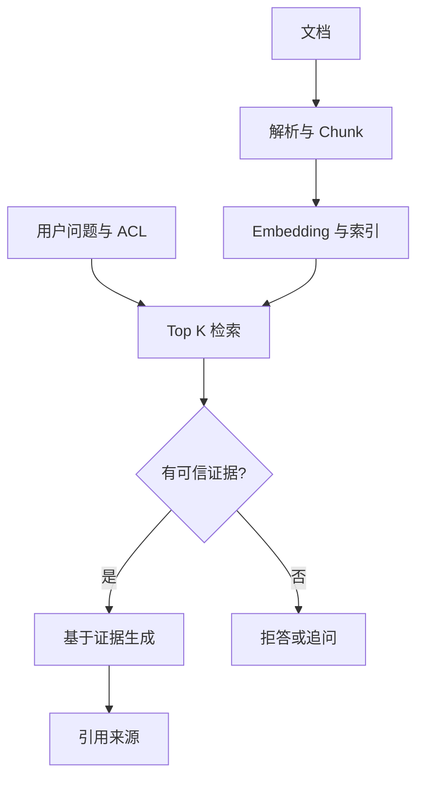

# 项目实战（04） - 项目：从最小 RAG 到可上线知识库

> 读完后，你应能完成以下任务：
> - 绘制“项目实战（04） - 项目：从最小 RAG 到可上线知识库 / 为什么先做这个项目”的关键对象与数据流，解释“面试高频：企业落地最多的就是知识库问答，面试官几乎一定会问 RAG。”，并用源码位置、日志或 Trace 标注证据。
> - 为“项目实战（04） - 项目：从最小 RAG 到可上线知识库 / 完整闭环长什么样”设计正常与异常输入，验证“这个项目的灵魂是最后那条分支：检索不到资料就老实说不知道。”，输出首个偏差位置与回归测试结果。
> - 实现“项目实战（04） - 项目：从最小 RAG 到可上线知识库 / 可运行 Demo：先跑通最小闭环”的最小代码或配置，检验“把下面代码保存为 main.py，执行 python main.py。”，输出命令、结果与 Diff，并说明不适用边界。

# 一、与进阶篇的分工

本篇保留为企业知识库 RAG 的基础项目：适合做第一个可演示闭环。进阶项目请读 91《企业级知识库项目》，那里会升级到多模态解析、对象存储、混合检索、权限过滤、引用回跳和量化评测。

# 二、为什么先做这个项目

如果你只能做一个 AI 项目放简历，选它。原因很实在：

- **闭环清晰**：上传文档 → 检索 → 回答 → 引用来源，每一步都看得见、讲得清。
- **面试高频**：企业落地最多的就是知识库问答，面试官几乎一定会问 RAG。
- **能体现全栈**：前端（聊天 UI、引用展示）、后端（接口、检索）、RAG（切分、检索、grounding）、工程化（日志、评测）全覆盖。
- **可信度好讲**：引用来源 + 资料不足时拒答，是体现工程深度的天然抓手。

# 三、完整闭环长什么样




```text
离线入库（一次）：
  文档 → 解析文本 → 切分 chunk → 生成 embedding → 存向量库（带元数据）

在线问答（每次提问）：
  用户问题 → 检索 topK chunk → 拼进 prompt → 模型基于资料回答 → 返回引用来源
              ↓ 检索为空
            明确拒答，不编造
```

这个项目的灵魂是最后那条分支：**检索不到资料就老实说不知道**。一个会编造的知识库，企业不敢用。

# 四、可运行 Demo：先跑通最小闭环

```text
# requirements.txt
# 示例仅使用 Python 3.10+ 标准库，无第三方依赖。
```

把下面代码保存为 `main.py`，执行 `python main.py`。这里用词元重合模拟检索，只验证“召回、引用、拒答”契约；生产环境再替换成真实 Embedding、BM25 与模型生成。

```python
from __future__ import annotations

import re
from dataclasses import dataclass


# 最小命中分数，零命中时必须拒答。
MINIMUM_SCORE = 1
# 返回给生成层的最大证据数量。
TOP_K = 2


@dataclass(frozen=True)
class Chunk:
    """保存一段可引用知识及其来源。"""

    # 跨检索稳定的 Chunk 标识。
    chunk_id: str
    # 可直接作为证据的正文。
    text: str
    # 用户可回跳的来源文件。
    source: str
    # 允许访问该 Chunk 的权限组。
    acl_groups: frozenset[str]


# 演示知识库，生产环境由离线索引提供。
CHUNKS = [
    Chunk("finance#1", "报销单应在费用发生后十个工作日内提交。", "财务手册", frozenset({"staff"})),
    Chunk("hr#1", "试用期员工也可以申请公司培训。", "人事制度", frozenset({"staff", "hr"})),
]


def tokenize(text: str) -> set[str]:
    """提取英文词和单个汉字，用于可复现的零依赖教学检索。"""

    # 小写词元集合只用于当前 Demo 的粗粒度匹配。
    return set(re.findall(r"[a-z0-9]+|[\u4e00-\u9fff]", text.lower()))


def retrieve(query: str, user_groups: frozenset[str]) -> list[Chunk]:
    """在权限内召回证据；query 是问题，user_groups 来自可信鉴权。"""

    # 查询词元在当前请求内只计算一次。
    query_tokens = tokenize(query)
    # 候选保存分数与 Chunk，未授权数据不会进入打分。
    candidates: list[tuple[int, Chunk]] = []
    for chunk in CHUNKS:
        if chunk.acl_groups.isdisjoint(user_groups):
            continue
        # 当前教学分数是查询与证据的词元交集数量。
        score = len(query_tokens & tokenize(chunk.text))
        if score >= MINIMUM_SCORE:
            candidates.append((score, chunk))
    candidates.sort(key=lambda item: item[0], reverse=True)
    return [chunk for _, chunk in candidates[:TOP_K]]


def answer(query: str, user_groups: frozenset[str]) -> str:
    """返回带引用的证据或拒答；两个参数分别是问题和可信权限组。"""

    # 命中结果已经过权限过滤，可进入后续模型上下文。
    hits = retrieve(query, user_groups)
    if not hits:
        return "现有资料不足，无法确认。"
    # Demo 直接返回证据；生产版应让模型基于同一组证据生成结构化答案。
    evidence = "\n".join(f"- {hit.text}（来源：{hit.source}）" for hit in hits)
    return f"根据知识库：\n{evidence}"


if __name__ == "__main__":
    # 三个问题分别验证财务命中、人事命中和知识外拒答。
    questions = ["报销多久提交", "试用期能参加培训吗", "年假有几天"]
    for question in questions:
        print(question)
        print(answer(question, frozenset({"staff"})))
```

跑完应看到两条带来源证据和一条资料不足拒答。把这三条路径讲清楚，项目的核心闭环才成立。

# 五、MVP 功能拆解（按这个顺序做）

| 模块 | 先做（MVP） | 再做（进阶） |
|---|---|---|
| 文档管理 | 上传 Markdown/TXT，查看解析状态 | PDF/Word、批量导入 |
| 切分 | 按标题/段落切 chunk | 表格切分、chunk 预览、overlap |
| 检索问答 | topK 检索 + 基于资料回答 | 混合检索、rerank、query 改写 |
| 引用来源 | 展示文件名 + 片段 | 点击定位原文 |
| 评测 | 维护 20 条问题集 | 命中率、正确率、坏 case 标签 |
| 工程化 | 日志、错误态、测试 | 权限隔离、限流、成本统计 |

先把这个最小闭环接上前端聊天框并保存 Trace，再逐项增加解析器、真实检索、流式输出和评测；每增加一层都保留可独立验收的输入与输出。

# 六、企业级版本怎么升级

MVP 跑通后，企业级版本重点补 5 块：

| 升级点 | 为什么要做 |
|---|---|
| 多格式解析 | PDF、Word、Excel、图片、表格都要进知识库 |
| 父子分块 | 小块负责召回，大块负责回答上下文 |
| 混合检索 | 编号/术语靠 BM25，口语问法靠向量 |
| 权限过滤 | 检索阶段按部门、角色、密级过滤 |
| 原文定位 | 引用能回跳到文件、页码、表格或图片 |

如果要继续做进阶版，可阅读“工程基础”模块的《进阶：企业级 RAG 项目拆解》。该文会把文档解析、图文表资产、权限、评测和上线指标串成完整项目。

# 七、接口设计参考

```text
POST /api/knowledge/upload      上传文件
GET  /api/knowledge/documents   文档列表
POST /api/rag/chat              知识库问答
GET  /api/rag/logs/:requestId   查看单次检索和生成日志
```

# 八、验收标准（也是演示脚本）

演示时按这个顺序走，最有说服力：

1. 上传一份制度文档 → 展示解析状态
2. 问一个能命中的问题（"报销几天内提交"）→ 回答 + 引用来源
3. 问一个知识库没有的问题（"年假几天"）→ 明确说资料不足
4. 打开日志 → 展示这次检索命中了哪些 chunk、得分多少

第 3 步是亮点：主动展示"我不会瞎编"，比第 2 步答对更能打动面试官。

# 九、工程上真正会踩的坑

- **chunk 切太大**：一段塞几百字，检索命中了但答案被淹没。按句/小段切，配合 overlap。
- **检索为空还硬答**：模型会拿不相关资料编一个答案。`if not hits: 拒答` 是硬性兜底。
- **引用来源对不上正文**：回答用了 A 资料却标 B 来源。citation 必须从实际命中的 chunk 元数据生成，不能事后补。
- **没有评测集**：改了切分参数不知道是变好还是变坏。哪怕只有 20 条问题，也要能跑个命中率。

# 十、简历怎么写

> 独立实现企业知识库 RAG 助手，支持文档入库、chunk 切分、语义检索、引用来源、流式问答和坏 case 评测。前端展示检索来源、生成状态和错误重试；后端记录 requestId、检索命中、模型耗时和 token 成本。引入资料不足拒答机制，将编造率控制在可接受范围。

如果要写成企业级版本，可以这样升级：

> 设计企业级知识库 RAG 系统，支持多格式文档解析、父子分块、BM25+向量混合检索、rerank 精排、权限过滤和原文定位；回答引用可回跳到文件页码、表格或图片证据。维护包含正负样本的评测集，跟踪 Hit Rate@K、拒答准确率和坏 case 回归，保证知识库不是只跑通 demo，而是可持续调优。

# 十一、动手实践：43 企业知识库 RAG 项目

一个本地可运行的真实企业 RAG 工作台：文档入库、Markdown 批量导入、chunk 切分、本地 embedding、Qdrant 向量数据库检索、基于资料回答、引用来源和检索 Trace。

当前版本不依赖 OpenAI Key。embedding 使用本地 hashing 向量模型，向量存储使用 Docker 中的 Qdrant，适合先讲清企业 RAG 工程闭环；后续可把 `LocalEmbeddingModel` 换成 OpenAI / bge / m3e 等真实 embedding 模型。

## 11.1 环境

- Python 3.10+
- Docker Desktop
- Qdrant：通过 `docker compose` 启动，无需手动安装

## 11.2 启动

```bash
cd /Users/imber/Desktop/ai-lab/worktrees/knowledge-categories/imber-blog/src/content/knowledge/03-AI大模型应用开发/02-企业级知识库/04-企业知识库项目/01-项目-企业知识库RAG/lab
docker compose up -d qdrant
python3 main.py
```

浏览器打开：

```text
http://127.0.0.1:8043
```

Qdrant REST：

```text
http://127.0.0.1:6333
```

## 11.3 导入 agent 小册

页面点击 `导入 AI 应用手册`，会从当前仓库位置自动解析并读取完整的 AI 大模型应用开发目录：

```text
03-AI大模型应用开发
```

导入规则兼容新版目录结构：

- `**/*.md`
- `**/09-附录/*.md`
- 排除当前项目的 `lab/`

导入后会重建 Qdrant collection：

```text
agent_manual_chunks
```

本次验证导入结果：

```text
导入数量会根据当前 `knowledge/Agent` 目录中的文章实时变化。
```

## 11.4 测试

```bash
python3 -m unittest discover -s tests -v
python3 -m py_compile main.py rag_core.py
node --check static/app.js
```

## 11.5 演示问题

导入 `agent小册` 后可以问：

```text
语义相近的文本为什么向量也相近？
引用来源为什么不能让模型自己报？
RAG 回答为什么要引用来源？
检索与重排 Rerank 有什么区别？
```

验证结果示例：

- `语义相近的文本为什么向量也相近？` 命中 `22-Embedding向量化.md`
- `引用来源为什么不能让模型自己报？` 命中 `25-RAG回答生成与引用来源.md`

## 11.6 接口

| 方法 | 路径 | 说明 |
|---|---|---|
| GET | `/health` | 服务健康检查，返回文档数、chunk 数、Qdrant 状态 |
| GET | `/api/knowledge/documents` | 文档列表 |
| POST | `/api/knowledge/documents` | 新增文档，JSON 字段：`title/source/text` |
| POST | `/api/knowledge/import-agent-manual` | 批量导入本地 AI 应用知识集（路径保留兼容） |
| POST | `/api/rag/chat` | 知识库问答，JSON 字段：`question/topK` |
| GET | `/api/rag/logs` | 最近问答日志 |
| GET | `/api/rag/logs/:requestId` | 单次问答日志 |

## 11.7 代码结构

| 文件 | 作用 |
|---|---|
| `docker-compose.yml` | 启动 Qdrant 向量数据库 |
| `rag_core.py` | RAG 核心：Markdown 清洗、切分、本地 embedding、Qdrant client、检索、拒答、引用、日志 |
| `main.py` | 标准库 HTTP 服务、API 路由、静态页面服务、agent 小册导入 |
| `static/` | 前端工作台 |
| `data/sample-docs/` | 首次启动时的样例企业文档 |
| `tests/` | 核心逻辑、API、向量导入测试 |

## 11.8 后续升级

- 把 `LocalEmbeddingModel` 换成真实 embedding 模型。
- 给 Markdown 解析增加标题层级、chunk overlap 和 chunk 预览。
- 加评测集，记录命中率、拒答率和坏 case。
- 接入真实 LLM，让 `_compose_answer` 从“拼接资料”升级为“基于资料生成自然语言回答”。

# 十二、总结

- **与进阶篇的分工**：本篇保留为企业知识库 RAG 的基础项目：适合做第一个可演示闭环。
- **为什么先做这个项目**：面试高频：企业落地最多的就是知识库问答，面试官几乎一定会问 RAG。
- **完整闭环长什么样**：这个项目的灵魂是最后那条分支：检索不到资料就老实说不知道。
- **可运行 Demo：先跑通最小闭环**：这里用词元重合模拟检索，只验证“召回、引用、拒答”契约；
- **MVP 功能拆解（按这个顺序做）**：先把这个最小闭环接上前端聊天框并保存 Trace，再逐项增加解析器、真实检索、流式输出和评测；
- **企业级版本怎么升级**：| 父子分块 | 小块负责召回，大块负责回答上下文 |

## 参考资料

- [FastAPI 大型应用](https://fastapi.tiangolo.com/tutorial/bigger-applications/)
- [Docker Compose](https://docs.docker.com/compose/)

<!-- knowledge-lab-sources-inlined -->

## 12.1 实现源码与运行边界


### data/sample-docs/finance-handbook.md

```markdown
# 财务报销手册

报销需在费用产生后 30 天内提交，逾期需补充直属主管说明。

差旅报销包含交通、住宿、餐补三类，餐补每天上限 80 元。

单笔金额超过 5000 元的采购报销，需要部门负责人和财务负责人双重审批。

发票抬头必须使用公司全称，电子发票需上传原始 PDF 文件。
```

### data/sample-docs/hr-policy.md

```markdown
# 人事制度

请假需提前 1 天在 OA 系统提交申请，由直属主管审批。

病假需在 3 个工作日内补交医院证明，无法补交时按事假处理。

试用期员工转正评估在入职满 80 天后发起，由直属主管填写评价。

员工离职需至少提前 30 天提交申请，并完成工作交接清单。
```

### data/sample-docs/it-support.md

```markdown
# IT 支持手册

VPN 无法连接时，请先确认员工账号未过期，并重启客户端。

企业邮箱首次登录需要绑定手机验证码，验证码 5 分钟内有效。

电脑遗失或怀疑账号泄露时，必须在 1 小时内联系 IT 值班同学冻结账号。

共享文档权限默认按部门开放，跨部门共享需由文档负责人确认。
```

### docker-compose.yml

```yaml
services:
  qdrant:
    image: qdrant/qdrant:v1.14.1
    ports:
      - "6333:6333"
      - "6334:6334"
    volumes:
      - qdrant_data:/qdrant/storage
    restart: unless-stopped

volumes:
  qdrant_data:
```

### docs/IMPLEMENTATION_PLAN.md

```markdown
# 43 企业知识库 RAG 实施计划

**目标：** 把原来的单文件命令行 demo 升级为可演示的本地 Web 项目，支持文档入库、RAG 问答、引用来源、检索日志和友好的前端界面。

**方案：** 使用 Python 标准库提供 HTTP 服务与静态文件服务，核心 RAG 逻辑拆到 `rag_core.py`。检索用本地 TF-IDF + 余弦相似度实现，避免外部 API Key 和向量库依赖。

**文件结构：**

- `rag_core.py`：文档模型、chunk 切分、TF-IDF 检索、grounded 回答、请求日志。
- `main.py`：HTTP API、静态页面服务、示例数据加载、启动入口。
- `static/index.html`、`static/styles.css`、`static/app.js`：企业知识库工作台前端。
- `data/sample-docs/*.md`：开箱即用的企业制度样例。
- `tests/test_rag_core.py`、`tests/test_api.py`：核心逻辑和 API 测试。
- `README.md`：运行、测试、演示脚本和升级方向。

**验收：**

1. `python3 -m unittest discover -s tests -v` 通过。
2. `python3 main.py` 能启动服务。
3. `GET /health` 返回 ok。
4. `POST /api/rag/chat` 对“报销多久内提交”返回答案、引用和 trace。
5. 前端页面能加载文档列表、提问、展示引用和检索过程。
```

### main.py

```python
"""企业知识库 RAG 的 HTTP API 与静态工作台。"""

from __future__ import annotations

import argparse
import json
from http.server import SimpleHTTPRequestHandler, ThreadingHTTPServer
from pathlib import Path
from typing import Any

from rag_core import LocalEmbeddingModel, QdrantClient, RagService

HOST = "127.0.0.1"
PORT = 8043
COLLECTION_NAME = "agent_manual_chunks"
LAB_DIRECTORY = Path(__file__).resolve().parent
STATIC_DIRECTORY = LAB_DIRECTORY / "static"
# lab 位于“AI 大模型应用开发/企业级知识库/项目/课程/lab”，向上四级才是当前 AI 知识根目录。
AI_KNOWLEDGE_ROOT = LAB_DIRECTORY.parents[3]


def create_service() -> RagService:
    """创建使用本地 Embedding 和 Qdrant 的 RAG 服务。"""
    # Docker Compose 暴露的 Qdrant 客户端。
    qdrant = QdrantClient("http://127.0.0.1:6333", COLLECTION_NAME)
    return RagService(qdrant, LocalEmbeddingModel())


SERVICE = create_service()


def import_ai_manual() -> dict[str, int]:
    """重建 collection 并导入 AI 大模型应用开发目录中的 Markdown。"""
    if not SERVICE.qdrant.healthy():
        raise RuntimeError("Qdrant 不可用，请先运行 docker compose up -d qdrant")
    SERVICE.qdrant.recreate_collection()
    SERVICE.documents.clear()
    # 扫描完整 AI 应用知识集，排除会重复展示代码的实验目录。
    markdown_files = [path for path in AI_KNOWLEDGE_ROOT.rglob("*.md") if "lab" not in path.parts]
    # 本次导入的 chunk 总数。
    chunk_count = 0
    for file_path in markdown_files:
        # 文档首个 H1 或文件名作为展示标题。
        markdown = file_path.read_text(encoding="utf-8")
        # 当前文档的首行标题。
        title = next((line[2:].strip() for line in markdown.splitlines() if line.startswith("# ")), file_path.stem)
        # 相对知识根目录的可追溯来源。
        source = str(file_path.relative_to(AI_KNOWLEDGE_ROOT))
        chunk_count += SERVICE.add_document(title, source, markdown, tenant_id="demo", acl="employee")
    return {"documents": len(markdown_files), "chunks": chunk_count}


class RagHandler(SimpleHTTPRequestHandler):
    """提供静态工作台和知识库 REST API。"""

    def __init__(self, *args: object, **kwargs: object) -> None:
        """固定静态文件根目录。"""
        super().__init__(*args, directory=str(STATIC_DIRECTORY), **kwargs)

    def send_json(self, status_code: int, payload: dict[str, Any]) -> None:
        """返回 UTF-8 JSON。"""
        # 编码后的响应体。
        body = json.dumps(payload, ensure_ascii=False).encode("utf-8")
        self.send_response(status_code)
        self.send_header("Content-Type", "application/json; charset=utf-8")
        self.send_header("Content-Length", str(len(body)))
        self.end_headers()
        self.wfile.write(body)

    def read_json(self) -> dict[str, Any]:
        """读取并校验对象类型 JSON 请求体。"""
        # 客户端声明的请求体长度。
        content_length = int(self.headers.get("Content-Length", "0"))
        # JSON 解码后的对象。
        payload = json.loads(self.rfile.read(content_length))
        if not isinstance(payload, dict):
            raise ValueError("请求体必须是 JSON 对象")
        return payload

    def do_GET(self) -> None:
        """处理健康、文档和 Trace 查询，其余交给静态文件服务。"""
        if self.path == "/health":
            # Qdrant 可用性决定是否能读取真实持久化点数。
            qdrant_healthy = SERVICE.qdrant.healthy()
            # 即使导入由另一个进程完成，也从 collection 读取真实点数。
            indexed_chunks = SERVICE.qdrant.indexed_point_count() if qdrant_healthy else 0
            self.send_json(200, {"status": "ok", "qdrant": qdrant_healthy, "sessionDocuments": len(SERVICE.documents), "indexedChunks": indexed_chunks})
            return
        if self.path == "/api/knowledge/documents":
            self.send_json(200, {"documents": SERVICE.documents})
            return
        if self.path == "/api/rag/logs":
            self.send_json(200, {"logs": SERVICE.logs[-50:]})
            return
        if self.path.startswith("/api/rag/logs/"):
            # 路径最后一段是待查询 requestId。
            request_id = self.path.rsplit("/", 1)[-1]
            # 对应 requestId 的 Trace。
            trace = next((item for item in SERVICE.logs if item["requestId"] == request_id), None)
            self.send_json(200 if trace else 404, trace or {"error": "trace_not_found"})
            return
        super().do_GET()

    def do_POST(self) -> None:
        """处理文档新增、批量导入和在线问答。"""
        try:
            # 当前接口的 JSON 请求对象。
            payload = self.read_json()
            if self.path == "/api/knowledge/documents":
                # 文档展示标题。
                title = str(payload.get("title", "")).strip()
                # 文档可追溯来源。
                source = str(payload.get("source", "manual")).strip()
                # 待切分入库的 Markdown 正文。
                text = str(payload.get("text", "")).strip()
                if not title or not text:
                    raise ValueError("title 和 text 不能为空")
                # 新文档生成的 chunk 数。
                chunk_count = SERVICE.add_document(title, source, text, "demo", "employee")
                self.send_json(201, {"title": title, "chunks": chunk_count})
                return
            if self.path == "/api/knowledge/import-agent-manual":
                self.send_json(200, import_ai_manual())
                return
            if self.path == "/api/rag/chat":
                # 清洗后的用户问题。
                question = str(payload.get("question", "")).strip()
                if not question:
                    raise ValueError("question 不能为空")
                # 受上限保护的候选数量。
                top_k = int(payload.get("topK", 4))
                self.send_json(200, SERVICE.ask(question, "demo", "employee", top_k))
                return
            self.send_json(404, {"error": "not_found"})
        except (ValueError, json.JSONDecodeError) as error:
            self.send_json(400, {"error": str(error)})
        except RuntimeError as error:
            self.send_json(503, {"error": str(error)})


def main() -> None:
    """检查 Qdrant 并启动 RAG 工作台。"""
    # 命令行参数解析器。
    parser = argparse.ArgumentParser(description="企业知识库 RAG 工作台")
    parser.add_argument("--import-only", action="store_true", help="只重建并导入 Agent 手册")
    # 用户传入的启动参数。
    arguments = parser.parse_args()
    if arguments.import_only:
        print(import_ai_manual())
        return
    # 工作台 HTTP 服务。
    server = ThreadingHTTPServer((HOST, PORT), RagHandler)
    print(f"RAG 工作台：http://{HOST}:{PORT}")
    print(f"Qdrant：{'可用' if SERVICE.qdrant.healthy() else '不可用，请先执行 docker compose up -d qdrant'}")
    try:
        server.serve_forever()
    except KeyboardInterrupt:
        print("\n服务已停止")
    finally:
        server.server_close()


if __name__ == "__main__":
    main()
```

### rag_core.py

```python
"""企业 RAG 的切分、Embedding、Qdrant 与问答核心。"""

from __future__ import annotations

import hashlib
import json
import math
import re
import time
import urllib.error
import urllib.request
import uuid
from dataclasses import asdict, dataclass
from typing import Any

EMBEDDING_DIMENSIONS = 128
DEFAULT_CHUNK_SIZE = 360
DEFAULT_CHUNK_OVERLAP = 60
MIN_RETRIEVAL_SCORE = 0.22


@dataclass(frozen=True, slots=True)
class Chunk:
    """保存可检索正文及企业过滤元数据。"""

    # Qdrant 使用的稳定点标识。
    chunk_id: str
    # 实际进入 Embedding 和生成阶段的正文。
    text: str
    # 文档展示标题。
    title: str
    # 可追溯的文件或业务来源。
    source: str
    # Markdown 标题形成的章节路径。
    section: str
    # 必须在检索前过滤的租户标识。
    tenant_id: str
    # 必须在检索前过滤的权限标签。
    acl: str


@dataclass(frozen=True, slots=True)
class SearchHit:
    """表示向量检索命中的证据。"""

    # Qdrant 相似度得分。
    score: float
    # 命中的完整文本块。
    chunk: Chunk


class LocalEmbeddingModel:
    """用稳定 hashing 向量提供离线 Embedding。"""

    def __init__(self, dimensions: int = EMBEDDING_DIMENSIONS) -> None:
        """初始化向量维度；dimensions 必须大于零。"""
        if dimensions <= 0:
            raise ValueError("dimensions 必须大于 0")
        # 输出向量固定维度。
        self.dimensions = dimensions

    def embed(self, text: str) -> list[float]:
        """把文本映射为归一化 hashing 向量。"""
        # 中英文字符、英文单词和数字词项。
        tokens = re.findall(r"[A-Za-z]+|\d+|[\u4e00-\u9fff]", text.lower())
        # 把相邻词项加入特征，保留少量顺序信息。
        features = tokens + [f"{left}:{right}" for left, right in zip(tokens, tokens[1:])]
        # 尚未归一化的稠密向量。
        vector = [0.0] * self.dimensions
        for feature in features:
            # Python hash 每进程随机，必须改用稳定摘要才能支持离线建库后在线检索。
            digest = hashlib.blake2b(feature.encode("utf-8"), digest_size=8).digest()
            # 摘要前四字节决定向量桶。
            bucket = int.from_bytes(digest[:4], "big") % self.dimensions
            # 摘要最后一位决定正负号，降低哈希碰撞偏差。
            sign = 1.0 if digest[-1] % 2 == 0 else -1.0
            vector[bucket] += sign
        # L2 范数用于生成余弦可比的单位向量。
        norm = math.sqrt(sum(value * value for value in vector))
        return [value / norm for value in vector] if norm else vector


def split_markdown(
    markdown: str,
    title: str,
    source: str,
    tenant_id: str,
    acl: str,
    chunk_size: int = DEFAULT_CHUNK_SIZE,
    overlap: int = DEFAULT_CHUNK_OVERLAP,
) -> list[Chunk]:
    """按 Markdown 标题和重叠窗口切分，并写入权限元数据。"""
    if chunk_size <= overlap or overlap < 0:
        raise ValueError("需要满足 chunk_size > overlap >= 0")
    # 当前一级标题。
    level_one = title
    # 当前二级标题。
    level_two = ""
    # 当前标题下的正文行。
    buffer: list[str] = []
    # 最终生成的文本块。
    chunks: list[Chunk] = []

    def flush() -> None:
        """把当前标题缓冲区按重叠窗口写入 chunks。"""
        # 合并多行后的章节正文。
        section_text = " ".join(buffer).strip()
        if not section_text:
            buffer.clear()
            return
        # 相邻窗口向前移动的字符数。
        step = chunk_size - overlap
        # 可用于引用的章节路径。
        section = "/".join(part for part in (level_one, level_two) if part)
        for start in range(0, len(section_text), step):
            # 当前窗口正文。
            chunk_text = section_text[start : start + chunk_size].strip()
            if chunk_text:
                # 内容和元数据共同决定稳定 ID，重复导入不会制造重复点。
                chunk_id = str(uuid.uuid5(uuid.NAMESPACE_URL, f"{tenant_id}:{source}:{section}:{start}:{chunk_text}"))
                chunks.append(Chunk(chunk_id, chunk_text, title, source, section, tenant_id, acl))
        buffer.clear()

    for raw_line in markdown.splitlines():
        # 去除 Markdown 行首尾空白后的文本。
        line = raw_line.strip()
        if line.startswith("# "):
            flush()
            level_one, level_two = line[2:].strip(), ""
        elif line.startswith("## "):
            flush()
            level_two = line[3:].strip()
        elif not line:
            flush()
        else:
            buffer.append(line)
    flush()
    return chunks


class QdrantClient:
    """用标准库调用 Qdrant REST API。"""

    def __init__(self, base_url: str, collection_name: str, timeout_seconds: float = 5.0) -> None:
        """保存连接参数。"""
        # 去除末尾斜杠的 Qdrant 地址。
        self.base_url = base_url.rstrip("/")
        # 当前知识库对应的 collection。
        self.collection_name = collection_name
        # 单次 HTTP 请求超时秒数。
        self.timeout_seconds = timeout_seconds

    def request(self, method: str, path: str, payload: dict[str, Any] | None = None) -> dict[str, Any]:
        """发送 JSON 请求并返回对象；非 2xx 会抛出异常。"""
        # 可选 JSON 请求体。
        body = json.dumps(payload).encode("utf-8") if payload is not None else None
        # 带超时边界的 Qdrant HTTP 请求。
        request = urllib.request.Request(f"{self.base_url}{path}", body, {"Content-Type": "application/json"}, method=method)
        with urllib.request.urlopen(request, timeout=self.timeout_seconds) as response:
            return json.loads(response.read())

    def healthy(self) -> bool:
        """检查 Qdrant 是否可访问。"""
        try:
            self.request("GET", "/collections")
            return True
        except (OSError, urllib.error.URLError, json.JSONDecodeError):
            return False

    def recreate_collection(self) -> None:
        """删除并重建 collection，适合教学导入流程。"""
        try:
            self.request("DELETE", f"/collections/{self.collection_name}")
        except urllib.error.HTTPError as error:
            if error.code != 404:
                raise
        self.request("PUT", f"/collections/{self.collection_name}", {"vectors": {"size": EMBEDDING_DIMENSIONS, "distance": "Cosine"}})

    def indexed_point_count(self) -> int:
        """读取 collection 中真实持久化的向量点数量。"""
        # Qdrant collection 详情中的统计对象。
        result = self.request("GET", f"/collections/{self.collection_name}").get("result", {})
        return int(result.get("points_count", 0))

    def upsert(self, chunks: list[Chunk], embeddings: list[list[float]]) -> None:
        """批量写入文本块和向量。"""
        # Qdrant points 写入结构。
        points = [{"id": chunk.chunk_id, "vector": embedding, "payload": asdict(chunk)} for chunk, embedding in zip(chunks, embeddings, strict=True)]
        self.request("PUT", f"/collections/{self.collection_name}/points?wait=true", {"points": points})

    def search(self, vector: list[float], top_k: int, tenant_id: str, acl: str) -> list[SearchHit]:
        """在向量检索前执行租户和 ACL 过滤。"""
        # Qdrant 的前置权限过滤条件。
        query_filter = {"must": [{"key": "tenant_id", "match": {"value": tenant_id}}, {"key": "acl", "match": {"value": acl}}]}
        # 搜索请求与得分阈值。
        payload = {"vector": vector, "limit": top_k, "with_payload": True, "score_threshold": MIN_RETRIEVAL_SCORE, "filter": query_filter}
        # Qdrant 返回的原始点列表。
        points = self.request("POST", f"/collections/{self.collection_name}/points/search", payload).get("result", [])
        # 已恢复为领域对象的命中结果。
        hits: list[SearchHit] = []
        for point in points:
            # 点中存储的 Chunk 字段。
            chunk_payload = point.get("payload", {})
            hits.append(SearchHit(float(point["score"]), Chunk(**chunk_payload)))
        return hits


class RagService:
    """编排离线建库、在线检索、回答、引用与 Trace。"""

    def __init__(self, qdrant: QdrantClient, embedding_model: LocalEmbeddingModel) -> None:
        """注入向量数据库和 Embedding 模型。"""
        # 向量存储客户端。
        self.qdrant = qdrant
        # 离线与在线必须使用相同版本的 Embedding。
        self.embedding_model = embedding_model
        # 当前进程已导入的文档摘要。
        self.documents: list[dict[str, str | int]] = []
        # 最近请求 Trace。
        self.logs: list[dict[str, Any]] = []

    def add_document(self, title: str, source: str, markdown: str, tenant_id: str, acl: str) -> int:
        """切分、向量化并入库一篇文档，返回 chunk 数。"""
        # 结构化切分后的文本块。
        chunks = split_markdown(markdown, title, source, tenant_id, acl)
        # 与文本块严格对齐的本地向量。
        embeddings = [self.embedding_model.embed(chunk.text) for chunk in chunks]
        self.qdrant.upsert(chunks, embeddings)
        self.documents.append({"title": title, "source": source, "chunks": len(chunks)})
        return len(chunks)

    def ask(self, question: str, tenant_id: str, acl: str, top_k: int = 4) -> dict[str, Any]:
        """在线向量检索并生成带引用回答。"""
        # 当前请求的稳定追踪标识。
        request_id = uuid.uuid4().hex
        # 请求开始时间用于端到端耗时。
        started_at = time.perf_counter()
        # 查询文本使用与建库一致的向量模型。
        query_vector = self.embedding_model.embed(question)
        # 已执行租户和权限过滤的命中证据。
        hits = self.qdrant.search(query_vector, max(1, min(top_k, 10)), tenant_id, acl)
        # 没有达标证据时必须拒答。
        answer = "资料不足，无法基于知识库回答。" if not hits else "\n".join(f"{hit.chunk.text} [{index}]" for index, hit in enumerate(hits, start=1))
        # 引用只来自实际用于回答的命中块。
        citations = [{"index": index, "title": hit.chunk.title, "source": hit.chunk.source, "section": hit.chunk.section, "score": round(hit.score, 4)} for index, hit in enumerate(hits, start=1)]
        # 便于定位检索、权限、阈值和生成问题的请求日志。
        trace = {"requestId": request_id, "question": question, "tenantId": tenant_id, "acl": acl, "retrieved": len(hits), "latencyMs": round((time.perf_counter() - started_at) * 1000, 2), "citations": citations}
        self.logs.append(trace)
        return {"requestId": request_id, "answer": answer, "citations": citations, "trace": trace}
```

### static/app.js

```javascript
const statusOutput = document.querySelector('#status'); // 健康与导入状态区域。
const answerOutput = document.querySelector('#answer'); // 回答、引用和 Trace 区域。

async function request(path, options = {}) {
  const response = await fetch(path, { headers: { 'Content-Type': 'application/json' }, ...options }); // API 原始响应。
  const payload = await response.json(); // JSON 响应对象。
  if (!response.ok) throw new Error(payload.error || `HTTP ${response.status}`);
  return payload;
}

document.querySelector('#health').addEventListener('click', async () => {
  try { statusOutput.textContent = JSON.stringify(await request('/health'), null, 2); }
  catch (error) { statusOutput.textContent = error.message; }
});

document.querySelector('#import').addEventListener('click', async () => {
  statusOutput.textContent = '正在重建 collection 并导入...';
  try { statusOutput.textContent = JSON.stringify(await request('/api/knowledge/import-agent-manual', { method: 'POST', body: '{}' }), null, 2); }
  catch (error) { statusOutput.textContent = error.message; }
});

document.querySelector('#add').addEventListener('click', async () => {
  const payload = { title: document.querySelector('#title').value, source: document.querySelector('#source').value, text: document.querySelector('#text').value }; // 手工文档对象。
  try { statusOutput.textContent = JSON.stringify(await request('/api/knowledge/documents', { method: 'POST', body: JSON.stringify(payload) }), null, 2); }
  catch (error) { statusOutput.textContent = error.message; }
});

document.querySelector('#ask').addEventListener('click', async () => {
  const question = document.querySelector('#question').value.trim(); // 清洗后的问答查询。
  answerOutput.textContent = '正在向量检索...';
  try { answerOutput.textContent = JSON.stringify(await request('/api/rag/chat', { method: 'POST', body: JSON.stringify({ question, topK: 4 }) }), null, 2); }
  catch (error) { answerOutput.textContent = error.message; }
});
```

### static/index.html

```html
<!doctype html>
<html lang="zh-CN">
<head>
  <meta charset="utf-8">
  <meta name="viewport" content="width=device-width,initial-scale=1">
  <title>企业知识库 RAG 工作台</title>
  <style>
    body { margin: 0; font: 15px/1.6 system-ui; color: #171717; background: #f4f5f7; }
    main { max-width: 980px; margin: 32px auto; padding: 0 20px; }
    section { padding: 20px; background: white; border: 1px solid #ddd; margin-bottom: 16px; }
    textarea, input { box-sizing: border-box; width: 100%; padding: 10px; margin: 6px 0; }
    button { padding: 9px 14px; margin-right: 8px; }
    pre { white-space: pre-wrap; background: #111; color: #d9fbe9; padding: 14px; overflow: auto; }
  </style>
</head>
<body>
  <main>
    <h1>企业知识库 RAG 工作台</h1>
    <section><button id="health">检查健康</button><button id="import">导入 AI 应用手册</button><pre id="status">尚未检查</pre></section>
    <section><h2>新增文档</h2><input id="title" placeholder="标题"><input id="source" placeholder="来源"><textarea id="text" rows="5" placeholder="# 制度标题&#10;## 章节&#10;正文"></textarea><button id="add">切分并入库</button></section>
    <section><h2>在线问答</h2><input id="question" value="RAG 回答为什么要引用来源？"><button id="ask">检索并回答</button><pre id="answer">等待提问</pre></section>
  </main>
  <script src="/app.js"></script>
</body>
</html>
```

### tests/test_rag_core.py

```python
"""企业 RAG 核心的离线单元测试。"""

from __future__ import annotations

import sys
import unittest
from pathlib import Path

LAB_DIRECTORY = Path(__file__).resolve().parents[1]
sys.path.insert(0, str(LAB_DIRECTORY))

from rag_core import EMBEDDING_DIMENSIONS, LocalEmbeddingModel, split_markdown  # noqa: E402


class RagCoreTest(unittest.TestCase):
    """验证稳定向量、结构切分与权限元数据。"""

    def test_embedding_is_stable_and_normalized(self) -> None:
        """相同文本应生成相同且固定维度的单位向量。"""
        # 当前测试的本地 Embedding 模型。
        model = LocalEmbeddingModel()
        # 第一次生成的向量。
        first = model.embed("报销需要发票")
        # 同一文本第二次生成的向量。
        second = model.embed("报销需要发票")
        self.assertEqual(first, second)
        self.assertEqual(len(first), EMBEDDING_DIMENSIONS)
        self.assertAlmostEqual(sum(value * value for value in first), 1.0)

    def test_chunk_keeps_section_and_acl(self) -> None:
        """切分结果必须保留章节、租户和 ACL。"""
        # 两级标题构成的测试文档。
        markdown = "# 报销制度\n## 时限\n员工需要在30天内提交。"
        # 当前文档生成的文本块。
        chunks = split_markdown(markdown, "报销制度", "policy.md", "tenant-a", "finance")
        self.assertEqual(len(chunks), 1)
        self.assertEqual(chunks[0].section, "报销制度/时限")
        self.assertEqual(chunks[0].tenant_id, "tenant-a")
        self.assertEqual(chunks[0].acl, "finance")


if __name__ == "__main__":
    unittest.main()
```

<!-- knowledge-scenario-inlined:AA-06 -->

## 12.2 可运行实验：RAG ACL 与跨租户泄漏


```html runnable file=index.html title="RAG ACL 与跨租户泄漏" description="调整参数并对比正常路径与典型失败路径"
<!doctype html>
<html lang="zh-CN">
<head>
  <meta charset="utf-8">
  <meta name="viewport" content="width=device-width,initial-scale=1">
  <title>AA-06 在线实验</title>
  <style>
    :root{color-scheme:dark;font-family:Inter,system-ui,sans-serif}*{box-sizing:border-box}body{margin:0;background:#0f1211;color:#e7ece9;font-size:13px}.shell{padding:16px}.top{display:flex;justify-content:space-between;gap:16px;margin-bottom:14px}h1{margin:3px 0;font-size:18px}.id,.value{color:#68e0b5;font-family:ui-monospace,monospace}.summary{margin:4px 0;color:#a5afa9}.run{border:0;border-radius:6px;background:#68e0b5;color:#07110d;padding:8px 14px;font-weight:700}.grid{display:grid;grid-template-columns:minmax(220px,.8fr) minmax(0,1.8fr);gap:12px}.panel{border:1px solid #29322e;background:#141817;padding:12px}.control{display:grid;gap:5px;margin-bottom:11px}.head{display:flex;justify-content:space-between;gap:8px}select,input{width:100%;accent-color:#68e0b5;background:#0d100f;color:#e7ece9}.toggle{display:flex;justify-content:space-between;border-top:1px solid #29322e;padding-top:9px}.toggle input{width:18px}.metrics{display:grid;grid-template-columns:repeat(4,minmax(0,1fr));gap:7px}.metric{border:1px solid #29322e;padding:8px}.metric b{display:block;color:#68e0b5;font-size:16px}.stages{display:flex;gap:6px;overflow:auto;margin:10px 0}.stage{border:1px solid #8a6230;padding:7px;min-width:90px}.stage.ok{border-color:#367a61}.stage.fail{border-color:#8b4545}table{width:100%;border-collapse:collapse}td{border-top:1px solid #29322e;padding:7px}.diagnosis{margin-top:9px;border-left:3px solid #68e0b5;background:#101412;padding:9px;line-height:1.5}.danger{border-color:#ef7f7f}@media(max-width:680px){.top,.grid{display:grid;grid-template-columns:1fr}.metrics{grid-template-columns:repeat(2,1fr)}}
  </style>
</head>
<body>
  <main class="shell">
    <header class="top"><div><div class="id">AA-06 · DETERMINISTIC LAB</div><h1 id="title"></h1><p class="summary" id="summary"></p></div><button class="run" id="run">运行实验</button></header>
    <section class="grid"><div class="panel"><div id="controls"></div><label class="toggle"><span>注入典型故障</span><input id="failure" type="checkbox"></label></div><div class="panel"><div class="metrics" id="metrics"></div><div class="stages" id="stages"></div><table><tbody id="rows"></tbody></table><div class="diagnosis" id="diagnosis"></div></div></section>
  </main>
  <script>
    const scenario = { title: 'RAG ACL 与跨租户泄漏', summary: '切换鉴权时机、缓存键和租户，验证候选与引用是否会越权。', controls: [
    { key: 'filterStage', label: 'ACL 执行时机', type: 'select', value: 'before', options: [['none', '无 ACL'], ['after', '召回后'], ['before', '召回前']] },
    { key: 'cacheKey', label: '缓存键组成', type: 'select', value: 'full', options: [['query', '仅 Query'], ['tenant', 'Query + Tenant'], ['full', 'Query + Tenant + ACL 摘要']] },
    { key: 'role', label: '当前角色', type: 'select', value: 'employee', options: [['guest', '访客'], ['employee', '员工'], ['finance', '财务管理员']] }
  ] };
    const controls = document.querySelector('#controls');
    const failure = document.querySelector('#failure');
    document.querySelector('#title').textContent = scenario.title;
    document.querySelector('#summary').textContent = scenario.summary;
    function renderControl(control) {
      const label = document.createElement('label'); label.className = 'control';
      const head = document.createElement('span'); head.className = 'head'; head.innerHTML = '<span>' + control.label + '</span><span class="value" data-value="' + control.key + '"></span>'; label.appendChild(head);
      const input = document.createElement(control.type === 'select' ? 'select' : 'input'); input.dataset.key = control.key;
      if (control.type === 'select') control.options.forEach(option => { const item = document.createElement('option'); item.value = option[0]; item.textContent = option[1]; item.selected = option[0] === control.value; input.appendChild(item); });
      else { input.type = 'range'; input.min = control.min; input.max = control.max; input.step = control.step || 1; input.value = control.value; }
      input.addEventListener('input', updateValues); label.appendChild(input); return label;
    }
    function updateValues() { scenario.controls.forEach(control => { const input = controls.querySelector('[data-key="' + control.key + '"]'); document.querySelector('[data-value="' + control.key + '"]').textContent = control.type === 'select' ? input.options[input.selectedIndex].text : input.value + (control.suffix || ''); }); }
    function readValues() { const values = {}; scenario.controls.forEach(control => { const input = controls.querySelector('[data-key="' + control.key + '"]'); values[control.key] = control.type === 'range' ? Number(input.value) : input.value; }); values.failure = failure.checked; return values; }
    function stage(name, state, detail) { return { name, state, detail }; }
    const aiStage = stage;
    function clamp(value, minimum, maximum) { return Math.min(maximum, Math.max(minimum, value)); }
    function simulate(values) { const fail = values.failure;
      /** 当前角色可访问的样例文档数量。 */
      const visible = values.role === 'finance' ? 12 : values.role === 'employee' ? 8 : 3;
      /** ACL 和缓存键不完整造成的泄漏数。 */
      const leaks = values.filterStage !== 'before' || values.cacheKey !== 'full' || fail ? (values.role === 'guest' ? 5 : 2) : 0;
      return { metrics: [[visible, '合法文档'], [leaks, '泄漏候选'], [values.filterStage.toUpperCase(), 'ACL 时机'], [leaks ? 'DENY' : 'ALLOW', '回答决策']], stages: [aiStage('解析身份', 'ok', values.role), aiStage('生成 ACL 摘要', fail ? 'fail' : 'ok', 'tenant + groups'), aiStage('召回过滤', values.filterStage === 'before' ? 'ok' : 'fail', values.filterStage), aiStage('缓存键', values.cacheKey === 'full' ? 'ok' : 'fail', values.cacheKey), aiStage('引用鉴权', leaks ? 'fail' : 'ok', leaks ? 'blocked' : 'pass')], rows: [['跨租户', values.filterStage === 'before' ? '向量与关键词查询均带 tenant_id' : '候选先进入内存，存在日志与缓存泄漏'], ['缓存隔离', values.cacheKey === 'full' ? '包含 tenant、权限摘要和知识库版本' : '不同权限用户可能复用同一答案'], ['引用接口', leaks ? '二次鉴权阻断返回，记录安全事件' : '下载或预览前再次校验文档权限']], diagnosis: leaks ? '检测到跨权限候选。系统必须拒答并修复召回、缓存和引用三层边界。' : '权限在检索前、缓存键和引用接口三处闭环。', danger: leaks > 0 };
     }
    function render() { const result = simulate(readValues()); document.querySelector('#metrics').innerHTML = result.metrics.map(item => '<div class="metric"><b>' + item[0] + '</b><span>' + item[1] + '</span></div>').join(''); document.querySelector('#stages').innerHTML = result.stages.map(item => '<div class="stage ' + item.state + '"><b>' + item.name + '</b><div>' + item.detail + '</div></div>').join(''); document.querySelector('#rows').innerHTML = result.rows.map(item => '<tr><td>' + item[0] + '</td><td>' + item[1] + '</td></tr>').join(''); const diagnosis = document.querySelector('#diagnosis'); diagnosis.textContent = result.diagnosis; diagnosis.className = 'diagnosis' + (result.danger ? ' danger' : ''); }
    scenario.controls.forEach(control => controls.appendChild(renderControl(control))); updateValues(); document.querySelector('#run').addEventListener('click', render); render();
  </script>
</body>
</html>
```
