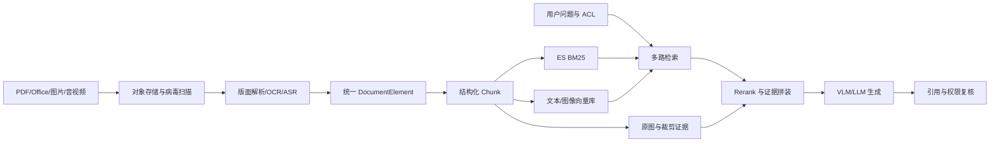

# 项目实战（05） - 多模态 RAG：版面、图片、表格与文本的证据闭环

> 读完后，你应能：
> - 能验证“多模态 RAG 不是“把图片丢给视觉模型””，并保存输入、输出与失败样本。
> - 能验证“企业文档的答案常同时依赖段落、表格单元格、截图标注和页码关系”，并保存输入、输出与失败样本。
> - 能验证“如果解析时丢掉版面结构，后续再强的模型也无法还原证据”，并保存输入、输出与失败样本。


多模态 RAG 不是“把图片丢给视觉模型”。
企业文档的答案常同时依赖段落、表格单元格、截图标注和页码关系；
如果解析时丢掉版面结构，后续再强的模型也无法还原证据。

# 一、全链路架构




# 二、统一元素而不是直接拼纯文本

解析输出建议包含 `element_id`、`document_id`、`page`、`bbox`、`element_type`、`text`、`asset_uri`、`parent_id`、`reading_order`、`acl_groups` 和解析置信度。
表格要保存行列坐标与合并单元格，图片要保存标题、邻近段落和裁剪位置，才能实现页级引用回跳。

```text
# requirements.txt
pydantic>=2,<3
```

```python
from __future__ import annotations

from typing import Literal

from pydantic import BaseModel, Field, model_validator


class DocumentElement(BaseModel):
    """统一描述文本、表格、图片和音频转写元素。"""

    # 跨重建稳定的元素主键。
    element_id: str
    # 原始文档稳定主键。
    document_id: str
    # 元素所在页码；音频等无页资源允许为空。
    page: int | None = Field(default=None, ge=1)
    # 元素类型决定后续切分和 Embedding 策略。
    element_type: Literal["text", "table", "image", "transcript"]
    # OCR、ASR 或原生解析得到的可检索文本。
    text: str
    # 页面坐标，顺序为 x1、y1、x2、y2。
    bbox: tuple[float, float, float, float] | None = None
    # 原图或音频片段的受控对象存储地址。
    asset_uri: str | None = None
    # 当前元素可见的权限组，在召回阶段下推过滤。
    acl_groups: frozenset[str]
    # 解析置信度，用于低质量元素人工复核。
    confidence: float = Field(ge=0.0, le=1.0)

    @model_validator(mode="after")
    def validate_visual_evidence(self) -> "DocumentElement":
        """校验视觉元素可回跳；self 包含当前元素全部字段。"""

        if self.element_type in {"table", "image"} and self.asset_uri is None:
            # 表格和图片必须保留视觉证据，不能只保存模型生成的描述。
            raise ValueError("visual element requires asset_uri")
        return self
```

# 三、切分与 Embedding 策略

| 元素 | 切分方式 | Embedding | 必留证据 |
| --- | --- | --- | --- |
| 正文 | 按标题层级和语义边界，保留少量重叠 | 多语言文本模型 | 页码、段落、标题路径 |
| 表格 | 表头与行组共同成块，宽表按业务列拆分 | 表格转规范文本后做文本向量 | 原表截图、行列坐标 |
| 图片/图表 | 图片说明 + 邻近段落 + OCR 文字 | 文本向量；确有图搜图需求再加视觉向量 | 裁剪图、bbox |
| 音视频 | ASR 按说话人和时间窗切分 | 文本向量 | 起止时间、媒体地址 |

Embedding 先以“能否在真实问题集上召回正确证据”选型，
再比较吞吐、维度、最大长度、语言覆盖、私有化成本。
不要一开始就维护两套视觉向量；
如果用户只用文字提问，图片描述和 OCR 往往已覆盖主要价值。

# 四、在线检索与校验

1. 先基于用户、租户和权限组构造不可由模型修改的过滤器。
2. 并行执行 BM25、文本向量、结构化表格查询；只有图像相似需求才开启视觉向量路。
3. 用稳定 `element_id` 去重，RRF 融合，再让跨编码器或 VLM 对少量候选精排。
4. Context 同时传规范文本和受控图片，限制总像素、图片数和 Token。
5. 答案中的每个关键结论必须引用 `element_id`；引用服务再次校验权限后返回页码和裁剪图。
6. 若 OCR 置信度低、证据冲突或引用覆盖不足，明确拒答或转人工复核。

# 五、稳定性、成本与安全

- 解析器和 OCR 都要版本化；升级后并行重建新索引，以金标集验收后切别名。
- 文件先做类型嗅探、病毒扫描、解压炸弹限制和沙箱解析，不能只信扩展名。
- OCR/VLM 是主要成本项：对内容哈希去重，先用原生文本层，低置信页才 OCR，候选精排后才调用 VLM。
- 对象地址使用短期签名 URL，日志不记录原图；敏感图片先脱敏再进入外部模型。
- 监控每种模态的解析成功率、低置信率、Recall@K、引用覆盖率、P95 和单文档/单问成本。

# 六、截图策略


## 验收清单

- 扫描 PDF、跨页表格、图表、纯文本和音频各有不少于一组金标问题。
- 任一答案可回跳到页码、表格行或时间片，而不是只显示文件名。
- 删除或降权后，ES、向量库、对象存储引用和缓存同步失效。
- 无权限用户无法从标题、缩略图、命中数、错误信息或模型答案推断文档存在。
- 单路解析或检索失败时可降级，证据不足时不生成确定性答案。

多模态 RAG 的分水岭不是支持多少文件格式，
而是能否把每个结论闭环到可验证、可授权、可回放的证据。

# 七、总结

- **统一元素而不是直接拼纯文本**：解析输出建议包含 element_id、document_id、page、bbox、element_type、text、asset_uri、parent_id、reading_order、acl_groups 和解析置信度。
- **切分与 Embedding 策略**：| 正文 | 按标题层级和语义边界，保留少量重叠 | 多语言文本模型 | 页码、段落、标题路径 |
- **在线检索与校验**：先基于用户、租户和权限组构造不可由模型修改的过滤器。 -> 并行执行 BM25、文本向量、结构化表格查询； -> 用稳定 element_id 去重，RRF 融合，再让跨编码器或 VLM 对少量候选精排。 -> Context 同时传规范文本和受控图片，限制总像素、图片数和 Token。
- **稳定性、成本与安全**：文件先做类型嗅探、病毒扫描、解压炸弹限制和沙箱解析，不能只信扩展名。
- **可运行实验：多模态 RAG：OCR、表格与图片引用**：调整参数并注入失败，重点对比正常路径、保护条件和失败诊断；

## 参考资料

- [FastAPI 大型应用](https://fastapi.tiangolo.com/tutorial/bigger-applications/)
- [Docker Compose](https://docs.docker.com/compose/)

<!-- knowledge-scenario-inlined:AA-16 -->

# 八、可运行实验：多模态 RAG：OCR、表格与图片引用

调整参数并注入失败，重点对比正常路径、保护条件和失败诊断；
运行源码与文章保存在同一个 Markdown 文件。

```html runnable file=index.html title="多模态 RAG：OCR、表格与图片引用" description="调整参数并对比正常路径与典型失败路径"
<!doctype html>
<html lang="zh-CN">
<head>
  <meta charset="utf-8">
  <meta name="viewport" content="width=device-width,initial-scale=1">
  <title>AA-16 在线实验</title>
  <style>
    :root{color-scheme:dark;font-family:Inter,system-ui,sans-serif}*{box-sizing:border-box}body{margin:0;background:#0f1211;color:#e7ece9;font-size:13px}.shell{padding:16px}.top{display:flex;justify-content:space-between;gap:16px;margin-bottom:14px}h1{margin:3px 0;font-size:18px}.id,.value{color:#68e0b5;font-family:ui-monospace,monospace}.summary{margin:4px 0;color:#a5afa9}.run{border:0;border-radius:6px;background:#68e0b5;color:#07110d;padding:8px 14px;font-weight:700}.grid{display:grid;grid-template-columns:minmax(220px,.8fr) minmax(0,1.8fr);gap:12px}.panel{border:1px solid #29322e;background:#141817;padding:12px}.control{display:grid;gap:5px;margin-bottom:11px}.head{display:flex;justify-content:space-between;gap:8px}select,input{width:100%;accent-color:#68e0b5;background:#0d100f;color:#e7ece9}.toggle{display:flex;justify-content:space-between;border-top:1px solid #29322e;padding-top:9px}.toggle input{width:18px}.metrics{display:grid;grid-template-columns:repeat(4,minmax(0,1fr));gap:7px}.metric{border:1px solid #29322e;padding:8px}.metric b{display:block;color:#68e0b5;font-size:16px}.stages{display:flex;gap:6px;overflow:auto;margin:10px 0}.stage{border:1px solid #8a6230;padding:7px;min-width:90px}.stage.ok{border-color:#367a61}.stage.fail{border-color:#8b4545}table{width:100%;border-collapse:collapse}td{border-top:1px solid #29322e;padding:7px}.diagnosis{margin-top:9px;border-left:3px solid #68e0b5;background:#101412;padding:9px;line-height:1.5}.danger{border-color:#ef7f7f}@media(max-width:680px){.top,.grid{display:grid;grid-template-columns:1fr}.metrics{grid-template-columns:repeat(2,1fr)}}
  </style>
</head>
<body>
  <main class="shell">
    <header class="top"><div><div class="id">AA-16 · DETERMINISTIC LAB</div><h1 id="title"></h1><p class="summary" id="summary"></p></div><button class="run" id="run">运行实验</button></header>
    <section class="grid"><div class="panel"><div id="controls"></div><label class="toggle"><span>注入典型故障</span><input id="failure" type="checkbox"></label></div><div class="panel"><div class="metrics" id="metrics"></div><div class="stages" id="stages"></div><table><tbody id="rows"></tbody></table><div class="diagnosis" id="diagnosis"></div></div></section>
  </main>
  <script>
    const scenario = { title: '多模态 RAG：OCR、表格与图片引用', summary: '观察版面解析、OCR、表格结构和坐标信息如何影响跨模态引用。', controls: [
    { key: 'ocr', label: 'OCR 准确率', type: 'range', min: 50, max: 100, value: 92, suffix: '%' },
    { key: 'layout', label: '版面解析', type: 'select', value: 'layout', options: [['plain', '纯文本'], ['layout', '版面感知'], ['vision', '视觉模型 + 版面']] },
    { key: 'coordinates', label: '保留坐标', type: 'select', value: 'yes', options: [['no', '否'], ['yes', '是']] }
  ] };
    const controls = document.querySelector('#controls');
    const failure = document.querySelector('#failure');
    document.querySelector('#title').textContent = scenario.title;
    document.querySelector('#summary').textContent = scenario.summary;
    function renderControl(control) {
      const label = document.createElement('label'); label.className = 'control';
      const head = document.createElement('span'); head.className = 'head'; head.innerHTML = '<span>' + control.label + '</span><span class="value" data-value="' + control.key + '"></span>'; label.appendChild(head);
      const input = document.createElement(control.type === 'select' ? 'select' : 'input'); input.dataset.key = control.key;
      if (control.type === 'select') control.options.forEach(option => { const item = document.createElement('option'); item.value = option[0]; item.textContent = option[1]; item.selected = option[0] === control.value; input.appendChild(item); });
      else { input.type = 'range'; input.min = control.min; input.max = control.max; input.step = control.step || 1; input.value = control.value; }
      input.addEventListener('input', updateValues); label.appendChild(input); return label;
    }
    function updateValues() { scenario.controls.forEach(control => { const input = controls.querySelector('[data-key="' + control.key + '"]'); document.querySelector('[data-value="' + control.key + '"]').textContent = control.type === 'select' ? input.options[input.selectedIndex].text : input.value + (control.suffix || ''); }); }
    function readValues() { const values = {}; scenario.controls.forEach(control => { const input = controls.querySelector('[data-key="' + control.key + '"]'); values[control.key] = control.type === 'range' ? Number(input.value) : input.value; }); values.failure = failure.checked; return values; }
    function stage(name, state, detail) { return { name, state, detail }; }
    const aiStage = stage;
    function clamp(value, minimum, maximum) { return Math.min(maximum, Math.max(minimum, value)); }
    function simulate(values) { const fail = values.failure;
      /** 版面策略对结构保真的基础增益。 */
      const layoutBonus = values.layout === 'plain' ? 0 : values.layout === 'layout' ? 8 : 13;
      /** OCR、版面和坐标共同决定的引用准确率。 */
      const citation = clamp(values.ocr * 0.72 + layoutBonus + (values.coordinates === 'yes' ? 8 : 0) - (fail ? 20 : 0), 0, 99);
      /** 表格结构是否可以在问答中安全使用。 */
      const tableSafe = values.layout !== 'plain' && values.ocr >= 80 && !fail;
      return { metrics: [[values.ocr + '%', 'OCR 准确率'], [citation.toFixed(1) + '%', '引用准确率'], [tableSafe ? 'KEPT' : 'BROKEN', '表格结构'], [values.coordinates === 'yes' ? 'VISIBLE' : 'TEXT ONLY', '可视化引用']], stages: [aiStage('页面渲染', 'ok', 'page image'), aiStage('OCR', values.ocr >= 80 ? 'ok' : 'warn', values.ocr + '%'), aiStage('版面识别', values.layout === 'plain' ? 'warn' : 'ok', values.layout), aiStage('表格解析', tableSafe ? 'ok' : 'fail', tableSafe ? 'cells' : 'flattened'), aiStage('跨模态索引', fail ? 'fail' : 'ok', 'text + image'), aiStage('坐标引用', values.coordinates === 'yes' ? 'ok' : 'warn', values.coordinates)], rows: [['Chunk 元数据', values.coordinates === 'yes' ? '保留 page、bbox、element_id 和 source_uri' : '只有文本，无法高亮原页位置'], ['表格处理', tableSafe ? '表头、行列和合并单元格关系保留' : '纯文本展开后数值可能失去所属字段'], ['故障注入', fail ? 'OCR 把金额小数点识别错误，数值校验阻断入库' : '关键数字通过格式与范围校验']], diagnosis: tableSafe && citation >= 80 && values.coordinates === 'yes' ? '文本、版面和坐标契约完整，可返回可验证的多模态引用。' : '需要提高 OCR、结构解析或坐标保留质量。', danger: fail || !tableSafe };
     }
    function render() { const result = simulate(readValues()); document.querySelector('#metrics').innerHTML = result.metrics.map(item => '<div class="metric"><b>' + item[0] + '</b><span>' + item[1] + '</span></div>').join(''); document.querySelector('#stages').innerHTML = result.stages.map(item => '<div class="stage ' + item.state + '"><b>' + item.name + '</b><div>' + item.detail + '</div></div>').join(''); document.querySelector('#rows').innerHTML = result.rows.map(item => '<tr><td>' + item[0] + '</td><td>' + item[1] + '</td></tr>').join(''); const diagnosis = document.querySelector('#diagnosis'); diagnosis.textContent = result.diagnosis; diagnosis.className = 'diagnosis' + (result.danger ? ' danger' : ''); }
    scenario.controls.forEach(control => controls.appendChild(renderControl(control))); updateValues(); document.querySelector('#run').addEventListener('click', render); render();
  </script>
</body>
</html>
```
