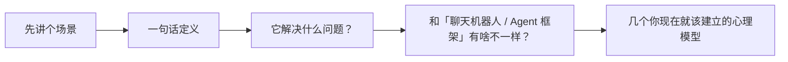

# 项目实战（06） - 认识 Paperclip：把 AI 当员工招进来

> 读完后，你应能完成以下任务：
> - 绘制“项目实战（06） - 认识 Paperclip：把 AI 当员工招进来 / 先讲个场景”的关键对象与数据流，解释“这个 CEO 不是人，是一个 AI Agent。”，并用源码位置、日志或 Trace 标注证据。
> - 为“项目实战（06） - 认识 Paperclip：把 AI 当员工招进来 / 一句话定义”设计正常与异常输入，验证“Paperclip 是「自治 AI 公司的控制平面（Control Plane）」——让你像管理一家真公司一样，雇佣、组织、管理一支 AI Agent 团队。”，输出首个偏差位置与回归测试结果。
> - 实现“项目实战（06） - 认识 Paperclip：把 AI 当员工招进来 / 它解决什么问题？”的最小代码或配置，检验“当你的整个团队都是 AI Agent 时，你需要的不只是一张 to-do list，而是一整家公司的控制平面。”，输出命令、结果与 Diff，并说明不适用边界。

> 本章目标：用一句话讲清 Paperclip 是什么，理解它和「又一个聊天机器人」的本质区别，搞懂「控制平面」「零人工公司」这两个核心定位。

---

<!-- article-progressive-block:start -->
# 一、先建立全局：认识 Paperclip：把 AI 当员工招进来 是什么？

理解“认识 Paperclip：把 AI 当员工招进来”，先要把标题中的对象放进同一条处理链：它接收什么输入，经过哪些状态变化，最终用什么证据判断结果。下表不另造概念，只把作者正文已经解释的章节按依赖顺序连起来。

“认识 Paperclip：把 AI 当员工招进来”的第一个核心判断是：这个 CEO 不是人，是一个 AI Agent。。先弄清这个判断中的对象和输入输出，后面的实现、故障和验收才有共同语境。

| 顺序 | 章节 | 读完本节应抓住的结论 |
| --- | --- | --- |
| 1 | 先讲个场景 | 这个 CEO 不是人，是一个 AI Agent。 |
| 2 | 一句话定义 | Paperclip 是「自治 AI 公司的控制平面（Control Plane）」——让你像管理一家真公司一样，雇佣、组织、管理一支 AI Agent 团队。 |
| 3 | 它解决什么问题？ | 当你的整个团队都是 AI Agent 时，你需要的不只是一张 to-do list，而是一整家公司的控制平面。 |
| 4 | 和「聊天机器人 / Agent 框架」有啥不一样？ | 很多人一听「多 Agent」就以为是 AutoGPT、CrewAI 那类编排框架。 |
| 5 | 几个你现在就该建立的心理模型 | AI Agent 就是这样——单次很强，但不记事。 |
| 6 | 常见误区 | ❌ 「Paperclip 是个更强的 ChatGPT」 |

## 1.1 核心对象之间怎样衔接



这张图只表达本文的讲解顺序，不替代正文机制。判断“认识 Paperclip：把 AI 当员工招进来”是否真正掌握，需要能从最后一个结果沿图回到前面每个章节的输入、状态变化和证据。

## 1.2 再看失败：问题最早会出现在哪一步？

在“认识 Paperclip：把 AI 当员工招进来”的对象和顺序已经明确后，再看可观察的失败：条件缺失、结果不可复现或失败后责任不清。定位时不从最后一条错误猜原因，而是沿上图找第一个偏离正文结论的节点。
<!-- article-progressive-block:end -->

# 二、先讲个场景

假设你有个想法：做一个「AI Agent 开发者学习社区」。
换作以前，你得招产品、招工程师、招运营、招市场，发工资、开周会、盯进度。

现在换个玩法：你打开一个网页控制台，
新建一家「公司」，
写下目标——「做 AI Agent 开发者学习与分享社区」，
然后点「招聘 CEO」。
这个 CEO 不是人，是一个 AI Agent。
它会自己把目标拆成任务，需要工程师就申请「雇」一个工程师 Agent，需要运营就再雇一个。
你坐在「董事会」的位置上，只做三件事：**批准关键决策、看进度、控预算**。

这就是 Paperclip 想让你做的事。

---

# 三、一句话定义

> **Paperclip 是「自治 AI 公司的控制平面（Control Plane）」——让你像管理一家真公司一样，雇佣、组织、管理一支 AI Agent 团队。**

官方原话是：

> Paperclip is the control plane for autonomous AI companies. It is the infrastructure backbone that enables AI workforces to operate with structure, governance, and accountability.
> （Paperclip 是自治 AI 公司的控制平面，是让 AI 劳动力以「有结构、有治理、有问责」的方式运转的基础设施。）

这里有三个关键词，记住它们，整本书都围着它们转：

- **结构（structure）**：有组织架构、有上下级、有任务树。
- **治理（governance）**：关键决策要你（董事会）点头。
- **问责（accountability）**：谁干了什么、花了多少钱，全程留痕可查。

---

# 四、它解决什么问题？

官方对问题的描述很犀利：

> 待办清单类的任务管理软件「不够用」。当你的整个团队都是 AI Agent 时，你需要的不只是一张 to-do list，而是一整家公司的控制平面。

拆开说，当你想认真用一批 AI Agent 干活时，会立刻撞上这些问题：

| 痛点 | 没有 Paperclip 时 | Paperclip 的答案 |
|------|------------------|------------------|
| **谁在干什么？** | 几个终端窗口各跑各的，根本不知道整体在干嘛 | 一个看板，实时看到每个 Agent 当前在做哪个任务 |
| **花了多少钱？** | token 花费散落各处，无法复盘 | 每个 Agent 有预算，spend、burn rate 一目了然 |
| **任务怎么协作？** | 手动复制粘贴上下文，Agent 之间互不知道 | Issue（任务）系统 + 任务树 + @提及，自动协同 |
| **怎么不让它失控？** | 全靠自觉，一不留神烧光预算或干坏事 | 审批闸门 + 预算硬停 + 活动审计 |
| **AI 没记性怎么办？** | 每次都要重新喂上下文 | 心跳 + session 持久化，跨次「记得」自己在干嘛 |

一句话：**Paperclip 是 AI 团队的「管理层」，不是又一个干活的工具。
**

---

# 五、和「聊天机器人 / Agent 框架」有啥不一样？

这是最容易混淆的地方。
很多人一听「多 Agent」就以为是 AutoGPT、CrewAI 那类编排框架。
区别在于**层次**：

```text
        你（董事会 / Board）
              │  设目标、批决策、控预算
              ▼
   ┌─────────────────────────┐
   │   Paperclip 控制平面      │  ← 管理层：注册表、组织架构、任务、预算、心跳
   └─────────────────────────┘
              │  通过 Adapter 触发
              ▼
   ┌─────────────────────────┐
   │  执行层：Claude Code /    │  ← 真正干活的 AI 运行时
   │  Codex / shell / HTTP    │
   └─────────────────────────┘
```

**核心原则（请重点记住）：**

> **Paperclip 不运行 Agent，它只编排 Agent。**
> Agent 在哪运行就在哪运行，干完活「打电话回家」（调 Paperclip 的 API 汇报）。

所以 Paperclip 不关心你的 Agent 底层用的是 Claude、Codex 还是一段 shell 脚本——这叫 **BYOB（Bring Your Own Brain，
自带大脑）**。
它只负责「管理」这件事：分配任务、记录花费、串联协作、把关治理。

它的运行机制是：调度器或事件触发 Heartbeat，
服务端检查预算和任务归属，
再通过 Adapter 启动外部 Agent；
Agent 使用 API 领取任务、写回状态，服务端保存 Run、成本、会话和审计事件。
任一环节失败都应停在可观察状态：控制台健康不代表 Adapter 已认证，
Heartbeat 成功也不代表任务产物通过测试，
预算或审批失败更不能绕过治理继续执行。

---

# 六、几个你现在就该建立的心理模型

## 6.1 1）「零人工公司」（0-employee company）
你只定义业务目标，剩下的招聘、拆任务、执行，由 AI 团队自动完成。
你是老板，不是打工人。

## 6.2 2）「记忆碎片」模型
还记得电影《记忆碎片》的男主吗？
能力很强，但没有持久记忆，靠满身纹身和便利贴维持上下文。
AI Agent 就是这样——单次很强，但不记事。
Paperclip 用**心跳（Heartbeat）**反复给它注入上下文和指令，
相当于那些「纹身和便利贴」。
（第 07 章细讲。
）

## 6.3 3）「一个实例，多家公司」
一个 Paperclip 实例可以同时运行多家公司，
每家公司有自己独立的目标、组织、预算、任务，
数据严格隔离。

## 6.4 4）人类的护城河是「品味」
Paperclip 创始人反复强调：模型再强，
传达价值观和**个人审美/品味（taste）**仍是人不可替代的。
你给团队喂的品牌指南、参考资料、审美判断，才是产出质量的天花板。

---

# 七、常见误区

- ❌ **「Paperclip 是个更强的 ChatGPT」**
  → 不是。它一个字都不「聊」，它是管理团队的后台。

- ❌ **「它自己会跑 AI 模型 / 自带大脑」**
→ 不会。
它不运行 Agent，大脑（Claude/Codex 等）由你接入，它只编排。

- ❌ **「建好就能完全甩手不管」**
→ 不能。
你是董事会，关键决策（雇人、CEO 策略）要你批准，预算和方向要你把关。
放权 ≠ 失控。

- ❌ **「这是个云服务，注册账号就用」**
→ 目前**本地运行优先**，跑在你自己机器上，数据也在本地，以获得最高控制权。

---

# 八、最佳实践（入门心态篇）

- ✅ **把它当「开公司」而不是「写 prompt」**：先想清楚目标、组织怎么分工，再动手。
- ✅ **目标要具体可衡量**：「做个好产品」是坏目标，「3 个月内做出 AI 笔记 App 并达到 $1M MRR」是好目标（第 05 章展开）。
- ✅ **从小开始**：先建一家公司、一个 CEO，跑通闭环，再加人。别一上来就铺十个 Agent。
- ✅ **保留你的「品味输入」**：品牌指南、参考案例、审美标准，是你能给 AI 团队的最大增量。

---

<!-- article-progressive-block:start -->
# 九、动手验证：先跑通 认识 Paperclip：把 AI 当员工招进来，再改变一个变量

前面的章节已经建立问题、概念和机制。现在把“认识 Paperclip：把 AI 当员工招进来”放进同一套基线中运行；本节不再引入新术语，只验证前文结论能否被复现。

## 9.1 基线与候选只允许一个变量不同

验证“认识 Paperclip：把 AI 当员工招进来”时，先固定样本、基线、候选、成功标准和失败边界。候选方案只能改变本次要验证的变量；如果同时更换数据、依赖和配置，即使结果改善，也不能知道是哪一项产生作用。

执行“认识 Paperclip：把 AI 当员工招进来”时，动作是：同环境运行基线与候选，记录输入、中间状态和异常。原始结果不能只保留截图或汇总分数，必须同步保存：可重放命令、结构化日志、输出 Diff、失败样本、版本，使下一次复查可以在同一输入上重放。

| 实验要素 | 本文要求 |
| --- | --- |
| 固定条件 | 固定样本、基线、候选、成功标准和失败边界 |
| 唯一变量 | 本次候选方案与基线之间的一项明确差异 |
| 原始证据 | 可重放命令、结构化日志、输出 Diff、失败样本、版本 |
| 通过阈值 | 结果符合结论条件，异常输入可解释、可恢复 |
| 立即停止 | 条件缺失、结果不可复现或失败后责任不清 |

## 9.2 执行前先排除不可比较条件

“认识 Paperclip：把 AI 当员工招进来”开始前先确认下面四项；任一项不成立，都应先修复实验条件，而不是解释结果。

- 基线能够在“认识 Paperclip：把 AI 当员工招进来”的当前环境重复运行。
- 候选只改变一个与“认识 Paperclip：把 AI 当员工招进来”结论直接相关的条件。
- “认识 Paperclip：把 AI 当员工招进来”的基线和候选使用同一批输入、同一版本依赖与同一通过阈值。
- “认识 Paperclip：把 AI 当员工招进来”的原始输出和失败现场不会被重试、格式化或汇总覆盖。

## 9.3 执行后先核对证据完整性

结果出来后先检查证据，再讨论“认识 Paperclip：把 AI 当员工招进来”是否通过。缺少中间状态时，最终输出只能说明现象，不能证明机制。

| 检查项 | 当前文章的判定 |
| --- | --- |
| 输入可追溯 | 固定样本、基线、候选、成功标准和失败边界 |
| 过程可回放 | 同环境运行基线与候选，记录输入、中间状态和异常 |
| 结果可审计 | 可重放命令、结构化日志、输出 Diff、失败样本、版本 |

“认识 Paperclip：把 AI 当员工招进来”的一次合格基线对照按以下顺序执行：

1. 保存“认识 Paperclip：把 AI 当员工招进来”基线版本及输入摘要，确认基线本身可以重复运行。
2. 写下“认识 Paperclip：把 AI 当员工招进来”候选方案唯一变化的变量，以及它预期影响的指标。
3. 在同一环境执行“认识 Paperclip：把 AI 当员工招进来”：同环境运行基线与候选，记录输入、中间状态和异常。
4. 为“认识 Paperclip：把 AI 当员工招进来”保存：可重放命令、结构化日志、输出 Diff、失败样本、版本。
5. 使用“认识 Paperclip：把 AI 当员工招进来”预登记条件判断：结果符合结论条件，异常输入可解释、可恢复。
6. 如果“认识 Paperclip：把 AI 当员工招进来”未通过，不修改第二个变量，先恢复基线并保留失败现场。

# 十、用一张矩阵验证 认识 Paperclip：把 AI 当员工招进来 的关键结论

矩阵按正文顺序列出“认识 Paperclip：把 AI 当员工招进来”的结论。一次实验只选择一行，只改变这一行对应的条件；不要把多行合并成一个无法归因的大实验。

| 正文章节 | 已解释的结论 | 本轮唯一变量 | 必须保存的证据 |
| --- | --- | --- | --- |
| 先讲个场景 | 这个 CEO 不是人，是一个 AI Agent。 | 只改变与“先讲个场景”相关的条件 | 可重放命令、结构化日志、输出 Diff、失败样本、版本 |
| 一句话定义 | Paperclip 是「自治 AI 公司的控制平面（Control Plane）」——让你像管理一家真公司一样，雇佣、组织、管理一支 AI Agent 团队。 | 只改变与“一句话定义”相关的条件 | 可重放命令、结构化日志、输出 Diff、失败样本、版本 |
| 它解决什么问题？ | 当你的整个团队都是 AI Agent 时，你需要的不只是一张 to-do list，而是一整家公司的控制平面。 | 只改变与“它解决什么问题？”相关的条件 | 可重放命令、结构化日志、输出 Diff、失败样本、版本 |
| 和「聊天机器人 / Agent 框架」有啥不一样？ | 很多人一听「多 Agent」就以为是 AutoGPT、CrewAI 那类编排框架。 | 只改变与“和「聊天机器人 / Agent 框架」有啥不一样？”相关的条件 | 可重放命令、结构化日志、输出 Diff、失败样本、版本 |
| 几个你现在就该建立的心理模型 | AI Agent 就是这样——单次很强，但不记事。 | 只改变与“几个你现在就该建立的心理模型”相关的条件 | 可重放命令、结构化日志、输出 Diff、失败样本、版本 |
| 常见误区 | ❌ 「Paperclip 是个更强的 ChatGPT」 | 只改变与“常见误区”相关的条件 | 可重放命令、结构化日志、输出 Diff、失败样本、版本 |

## 10.1 记录本次实际实验

下面的记录用于“认识 Paperclip：把 AI 当员工招进来”当前这一次实验，不是第二套知识目录。先从矩阵选择一个章节，再填写实际值；没有填写的字段表示尚未验证。

```yaml
topic: "认识 Paperclip：把 AI 当员工招进来"
selected_chapter: required
claim_from_article: required
baseline_version: required
changed_condition: exactly_one
execution: "同环境运行基线与候选，记录输入、中间状态和异常"
evidence: "可重放命令、结构化日志、输出 Diff、失败样本、版本"
pass_when: "结果符合结论条件，异常输入可解释、可恢复"
stop_when: "条件缺失、结果不可复现或失败后责任不清"
observed_result: required
first_deviation: null_or_evidence
recovery_replay: required_after_failure
```

## 10.2 边界实验必须证明能够停止和恢复

成功路径只能证明“认识 Paperclip：把 AI 当员工招进来”在当前样本上工作，不能证明它可以进入生产。边界实验需要主动制造：条件缺失、结果不可复现或失败后责任不清，并观察系统是否在产生不可逆副作用前停止。

| 场景 | 只改变什么 | 应保存什么 | 通过标准 |
| --- | --- | --- | --- |
| 正常路径 | 使用已知有效输入 | 可重放命令、结构化日志、输出 Diff、失败样本、版本 | 结果符合结论条件，异常输入可解释、可恢复 |
| 边界路径 | 把一个输入推进到约束临界值 | 临界值前后的输出与指标 | 不静默降级，不把部分结果冒充成功 |
| 明确失败 | 注入：条件缺失、结果不可复现或失败后责任不清 | 原始错误、首个异常阶段和最终状态 | 失败被正确分类且没有扩大副作用 |
| 恢复重放 | 执行：保留基线，缩小变量；根因确认前不扩大范围 | 原失败样本的复测证据 | 原样本恢复，正常样本没有回归 |

恢复动作不是简单重启。对于“认识 Paperclip：把 AI 当员工招进来”，第一步是：保留基线，缩小变量；根因确认前不扩大范围。完成后使用原始失败样本复测；只验证一个新样本成功，不能证明触发条件已经消失。

“认识 Paperclip：把 AI 当员工招进来”边界实验结束后，应把正常、临界、失败和恢复四类记录放在同一个运行批次中。这样才能区分“候选方案真的修复问题”和“环境变化让问题暂时没有出现”。

# 十一、认识 Paperclip：把 AI 当员工招进来 的结果解释

解释“认识 Paperclip：把 AI 当员工招进来”实验时先看首个偏差，而不是最后一条错误。最后的异常通常只是上游状态错误的结果；从末端反推容易误把症状当根因。

| 观察结果 | 可以支持的判断 | 下一步 |
| --- | --- | --- |
| 主链路没有达到预期 | 条件缺失、结果不可复现或失败后责任不清 | 先执行：保留基线，缩小变量；根因确认前不扩大范围 |
| 异常链路无法恢复 | 条件缺失、结果不可复现或失败后责任不清 | 先执行：保留基线，缩小变量；根因确认前不扩大范围 |
| 新样本成功但原样本仍失败 | 修复没有覆盖原始触发条件 | 固定原失败输入，恢复基线后重新比较 |
| 指标改善但证据无法回链 | 数据、版本或中间状态没有固定 | 暂停发布，补齐可追溯记录后重跑 |

“认识 Paperclip：把 AI 当员工招进来”只有同时满足“结果符合结论条件，异常输入可解释、可恢复”，并且没有出现“条件缺失、结果不可复现或失败后责任不清”，才可以认为主链路通过。这里的“通过”只对当前固定版本、样本和环境有效，不能外推到尚未测试的容量、权限或数据分布。

如果“认识 Paperclip：把 AI 当员工招进来”候选方案与基线差异很小，先检查证据分辨率是否足够；如果差异很大，先排除数据泄漏、环境漂移和版本不一致。两种情况都不能只看一个汇总均值，需要回到逐样本输出和中间状态。

“认识 Paperclip：把 AI 当员工招进来”故障定位完成后，记录“现象、首个偏差、根因、改动、原样本复测”五项。缺少原样本复测时，只能标记为待观察，不能标记为已解决。

# 十二、认识 Paperclip：把 AI 当员工招进来 的发布判断

发布判断需要把“认识 Paperclip：把 AI 当员工招进来”的质量、失败边界和恢复能力放在同一份记录中。以下任一条件缺失，都应停止扩量，而不是用“基本正常”替代证据。

- [ ] “认识 Paperclip：把 AI 当员工招进来”的基线与候选只存在一个计划内变量。
- [ ] “认识 Paperclip：把 AI 当员工招进来”的输入、代码、依赖、配置和数据版本可以追溯。
- [ ] “认识 Paperclip：把 AI 当员工招进来”的正常、临界、失败和恢复样本使用同一套断言。
- [ ] “认识 Paperclip：把 AI 当员工招进来”的原始输出、中间状态和失败现场已经保留。
- [ ] “认识 Paperclip：把 AI 当员工招进来”的日志、Trace、截图和测试数据已经脱敏。
- [ ] “认识 Paperclip：把 AI 当员工招进来”的停止条件、负责人和回滚入口已经演练。
- [ ] “认识 Paperclip：把 AI 当员工招进来”尚未覆盖的输入、权限、容量和外部依赖已经登记。

最终记录至少包含基线版本、唯一变量、原始证据、首个偏差、恢复复测和发布责任人。没有参与本次修改的人如果不能据此重放“认识 Paperclip：把 AI 当员工招进来”的判断，就不能发布。
<!-- article-progressive-block:end -->

# 十三、总结

- **先讲个场景**：这个 CEO 不是人，是一个 AI Agent。
- **一句话定义**：Paperclip 是「自治 AI 公司的控制平面（Control Plane）」——让你像管理一家真公司一样，雇佣、组织、管理一支 AI Agent 团队。
- **它解决什么问题？**：当你的整个团队都是 AI Agent 时，你需要的不只是一张 to-do list，而是一整家公司的控制平面。
- **和「聊天机器人 / Agent 框架」有啥不一样？**：很多人一听「多 Agent」就以为是 AutoGPT、CrewAI 那类编排框架。
- **几个你现在就该建立的心理模型**：AI Agent 就是这样——单次很强，但不记事。
- **常见误区**：❌ 「Paperclip 是个更强的 ChatGPT」

## 参考资料

- [Paperclip 项目与核心定位](https://github.com/paperclipai/paperclip)
- [Paperclip Architecture](https://docs.paperclip.ing/start/architecture)
- [Paperclip Agents Runtime](https://docs.paperclip.ing/agents-runtime)
