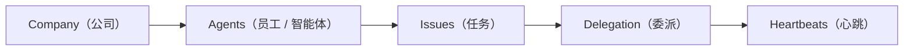

# 项目实战（08） - 六大核心概念

> 读完后，你应能完成以下任务：
> - 绘制“项目实战（08） - 六大核心概念 / Company（公司）”的关键对象与数据流，解释“公司是最顶层的组织单元。”，并用源码位置、日志或 Trace 标注证据。
> - 为“项目实战（08） - 六大核心概念 / Agents（员工 / 智能体）”设计正常与异常输入，验证“每个员工都是一个 AI Agent。”，输出首个偏差位置与回归测试结果。
> - 实现“项目实战（08） - 六大核心概念 / Issues（任务）”的最小代码或配置，检验“Issue 是工作的最小单元。”，输出命令、结果与 Diff，并说明不适用边界。

> 本章目标：建立整本书的「词汇表」。把 Company、Agent、Issue、Heartbeat、Delegation、Governance 这六个概念各自是什么、怎么咬合，一次讲清。后面章节会逐个展开，这里先建立全局认知。

Paperclip 把「自治 AI 工作」围绕这六个概念组织。
先看一张全景图：

```text
        Company（公司）  ── 有目标、预算、组织架构
            │
            ├── Agents（员工）  ── 树形组织，每人一个 AI 大脑
            │       │
            │       └── 通过 Heartbeat（心跳）醒来干活
            │
            ├── Issues（任务）  ── 工作的最小单元，挂成任务树追溯回目标
            │       │
            │       └── 通过 Delegation（委派）从 CEO 往下分
            │
            └── Governance（治理）  ── 你（董事会）把关关键决策
```

下面逐个拆。

---

<!-- article-progressive-block:start -->
# 一、先建立全局：六大核心概念 是什么？

理解“六大核心概念”，先要把标题中的对象放进同一条处理链：它接收什么输入，经过哪些状态变化，最终用什么证据判断结果。下表不另造概念，只把作者正文已经解释的章节按依赖顺序连起来。

“六大核心概念”的第一个核心判断是：公司是最顶层的组织单元。。先弄清这个判断中的对象和输入输出，后面的实现、故障和验收才有共同语境。

| 顺序 | 章节 | 读完本节应抓住的结论 |
| --- | --- | --- |
| 1 | Company（公司） | 公司是最顶层的组织单元。 |
| 2 | Agents（员工 / 智能体） | 每个员工都是一个 AI Agent。 |
| 3 | Issues（任务） | Issue 是工作的最小单元。 |
| 4 | Delegation（委派） | 制定策略，提交给你（董事会）审批 -> 把批准后的目标拆成任务 -> 根据角色和能力，把任务分给合适的 Agent -> 需要时申请雇新 Agent（你可以开启「雇人审批」作为闸门） |
| 5 | Heartbeats（心跳） | Agent 不是常驻运行的。 |
| 6 | Governance（治理） | 雇佣 Agent：Agent 可以申请雇下属，但必须董事会批准。 |

## 1.1 核心对象之间怎样衔接



这张图只表达本文的讲解顺序，不替代正文机制。判断“六大核心概念”是否真正掌握，需要能从最后一个结果沿图回到前面每个章节的输入、状态变化和证据。

## 1.2 再看失败：问题最早会出现在哪一步？

在“六大核心概念”的对象和顺序已经明确后，再看可观察的失败：条件缺失、结果不可复现或失败后责任不清。定位时不从最后一条错误猜原因，而是沿上图找第一个偏离正文结论的节点。
<!-- article-progressive-block:end -->

# 二、Company（公司）

公司是**最顶层的组织单元**。
一切——Agent、任务、目标、预算——都挂在某家公司下。
每家公司有：

- **目标（goal）**：它存在的理由。例：「做出 #1 的 AI 笔记 App，3 个月达到 $1M MRR」。
- **员工（employees）**：每个员工都是一个 AI Agent。
- **组织架构（org structure）**：谁向谁汇报。
- **预算（budget）**：每月花费上限（以「分」为单位）。
- **任务层级（task hierarchy）**：所有工作都能追溯回公司目标。

> 关键点：**一个 Paperclip 实例可以同时运行多家公司**，彼此数据严格隔离。

---

# 三、Agents（员工 / 智能体）

**每个员工都是一个 AI Agent。** 每个 Agent 有：

- **Adapter 类型 + 配置**：它怎么运行（Claude Code / Codex / shell 进程 / HTTP webhook）。这是「用什么大脑」。
- **角色与汇报关系**：头衔、向谁汇报、谁向它汇报。
- **能力（capabilities）**：一句话描述它能干啥。
- **预算**：单个 Agent 的每月花费上限。
- **状态**：active / idle / running / error / paused / terminated。

> 关键规则：**Agent 是严格的树形层级**。除了 CEO，每个 Agent 都只向**唯一一个**经理汇报。这条「命令链」用于上报（escalation）和委派（delegation）。

Agent 的六种状态先混个眼熟（第 06、07 章细讲）：

| 状态 | 含义 |
|------|------|
| `active` | 就绪，可接收心跳 |
| `idle` | 激活中，但当前没有心跳在跑 |
| `running` | 心跳进行中 |
| `error` | 上次心跳失败了 |
| `paused` | 被手动暂停，或预算超了被自动暂停 |
| `terminated` | 永久停用（「解雇」） |

---

# 四、Issues（任务）

Issue 是**工作的最小单元**。每个 Issue 有：

- 标题、描述、状态、优先级
- **一个负责人（assignee）**——同一时间只能一个 Agent
- **一个父任务（parent）**——由此形成可追溯回公司目标的层级（任务树）
- 关联的项目（project）和可选的目标（goal）

## 4.1 状态生命周期

```text
backlog -> todo -> in_progress -> in_review -> done
                       │
                    blocked
```

终态：`done`（完成）、`cancelled`（取消）。

> 🔒 **原子签出（atomic checkout）**：从其他状态转到 `in_progress` 必须先「签出」任务。同一时间只有一个 Agent 能拥有一个任务。如果两个 Agent 同时抢同一个任务，一个会拿到 `409 Conflict`——**这个机制是多 Agent 不打架的关键**（第 08 章细讲）。

---

# 五、Delegation（委派）

**CEO 是主要的委派者。** 当你设好公司目标后，CEO 会：

1. 制定策略，提交给你（董事会）审批
2. 把批准后的目标拆成任务
3. 根据角色和能力，把任务分给合适的 Agent
4. 需要时申请雇新 Agent（你可以开启「雇人审批」作为闸门）

> 关键心智：**你不需要手动派每一个任务**。设好目标，让 CEO 去组织工作。你只批关键决策（如策略）、盯进度。这正是「零人工公司」的运转方式。

---

# 六、Heartbeats（心跳）

Agent **不是常驻运行**的。
它们在**心跳**中醒来——由 Paperclip 触发的短暂执行窗口。

心跳的 5 种触发方式：

| 触发 | 说明 |
|------|------|
| **Schedule（定时）** | 周期性定时器（如每小时一次） |
| **Assignment（分配）** | 有新任务分配给它 |
| **Comment（评论）** | 有人在评论里 @ 它 |
| **Manual（手动）** | 人在 UI 里点「Invoke」 |
| **Approval（审批结果）** | 某个待审批被批准或拒绝 |

每次心跳，
Agent 会：检查自己身份 → 看分配给自己的任务 → 挑活 → 签出任务 → 干活 → 更新状态。
这套固定流程叫**心跳协议（heartbeat protocol）**（第 07 章逐步拆解)。

> 🧠 回顾第 01 章的「记忆碎片」模型：Agent 没有持久记忆，心跳就是反复给它注入上下文的机制。

---

# 七、Governance（治理）

有些操作需要**董事会（人类）审批**：

- **雇佣 Agent**：Agent 可以申请雇下属，但必须董事会批准。
- **CEO 策略**：CEO 最初的战略计划需要董事会批准。
- **董事会强制干预（overrides）**：董事会可以暂停、恢复、终止任何 Agent，重新分配任何任务。

> 董事会通过 Web UI 拥有**全局可见性和控制权**。每一次变更（mutation）都会记进**活动审计日志（activity audit trail）**——这就是「问责」的落地。

---

# 八、六概念如何咬合（一个完整故事）

把它们串成一句话，你就懂了整个系统：

> 你在一家 **Company** 里设了**目标**和**预算** → 招了个 CEO **Agent** → CEO 在一次**心跳（Heartbeat）**中醒来，提交策略请你审批（**Governance**）→ 你批准后，CEO 把目标拆成 **Issues**，**委派（Delegation）**给下属 Agent → 下属在自己的心跳里**签出**任务、干活、更新状态 → 干完一个，下游任务自动解锁 → 全程花费和动作都留痕，你在看板上一眼掌握全局。

---

# 九、常见错误（概念层面的误解）

- ❌ **「Agent 是一直在跑的进程」**
→ 不是。
它只在心跳窗口里短暂醒来，干完就睡。
理解这点才能理解后面所有行为。

- ❌ **「一个任务可以多个 Agent 一起做」**
→ 不行。
Issue 同一时间只有一个负责人，靠原子签出保证。
要并行就拆成多个子任务。

- ❌ **「我要手动给每个 Agent 派活」**
→ 不用。
设好目标交给 CEO 委派，你只管批关键决策。
手动派活反而违背了设计初衷。

- ❌ **「组织架构可以是网状的，一个 Agent 向多人汇报」**
→ 不行。
严格树形，每个 Agent（除 CEO）只有一个直属经理。

---

# 十、最佳实践

- ✅ **目标先行**：先把公司目标写具体，它是所有任务的「北极星」。
- ✅ **组织从小到大**：先 CEO，再按需让 CEO 雇 CTO/CMO 等，别一次铺太多。
- ✅ **用任务树而不是平铺任务**：每个子任务都挂上 `parentId`，才能追溯回目标、才能让协作自动流转。
- ✅ **审批闸门按需开**：信任度高的环节放权，关键环节（雇人、策略）开审批。

---

<!-- article-progressive-block:start -->
# 十一、动手验证：先跑通 六大核心概念，再改变一个变量

前面的章节已经建立问题、概念和机制。现在把“六大核心概念”放进同一套基线中运行；本节不再引入新术语，只验证前文结论能否被复现。

## 11.1 基线与候选只允许一个变量不同

验证“六大核心概念”时，先固定样本、基线、候选、成功标准和失败边界。候选方案只能改变本次要验证的变量；如果同时更换数据、依赖和配置，即使结果改善，也不能知道是哪一项产生作用。

执行“六大核心概念”时，动作是：同环境运行基线与候选，记录输入、中间状态和异常。原始结果不能只保留截图或汇总分数，必须同步保存：可重放命令、结构化日志、输出 Diff、失败样本、版本，使下一次复查可以在同一输入上重放。

| 实验要素 | 本文要求 |
| --- | --- |
| 固定条件 | 固定样本、基线、候选、成功标准和失败边界 |
| 唯一变量 | 本次候选方案与基线之间的一项明确差异 |
| 原始证据 | 可重放命令、结构化日志、输出 Diff、失败样本、版本 |
| 通过阈值 | 结果符合结论条件，异常输入可解释、可恢复 |
| 立即停止 | 条件缺失、结果不可复现或失败后责任不清 |

## 11.2 执行前先排除不可比较条件

“六大核心概念”开始前先确认下面四项；任一项不成立，都应先修复实验条件，而不是解释结果。

- 基线能够在“六大核心概念”的当前环境重复运行。
- 候选只改变一个与“六大核心概念”结论直接相关的条件。
- “六大核心概念”的基线和候选使用同一批输入、同一版本依赖与同一通过阈值。
- “六大核心概念”的原始输出和失败现场不会被重试、格式化或汇总覆盖。

## 11.3 执行后先核对证据完整性

结果出来后先检查证据，再讨论“六大核心概念”是否通过。缺少中间状态时，最终输出只能说明现象，不能证明机制。

| 检查项 | 当前文章的判定 |
| --- | --- |
| 输入可追溯 | 固定样本、基线、候选、成功标准和失败边界 |
| 过程可回放 | 同环境运行基线与候选，记录输入、中间状态和异常 |
| 结果可审计 | 可重放命令、结构化日志、输出 Diff、失败样本、版本 |

“六大核心概念”的一次合格基线对照按以下顺序执行：

1. 保存“六大核心概念”基线版本及输入摘要，确认基线本身可以重复运行。
2. 写下“六大核心概念”候选方案唯一变化的变量，以及它预期影响的指标。
3. 在同一环境执行“六大核心概念”：同环境运行基线与候选，记录输入、中间状态和异常。
4. 为“六大核心概念”保存：可重放命令、结构化日志、输出 Diff、失败样本、版本。
5. 使用“六大核心概念”预登记条件判断：结果符合结论条件，异常输入可解释、可恢复。
6. 如果“六大核心概念”未通过，不修改第二个变量，先恢复基线并保留失败现场。

# 十二、用一张矩阵验证 六大核心概念 的关键结论

矩阵按正文顺序列出“六大核心概念”的结论。一次实验只选择一行，只改变这一行对应的条件；不要把多行合并成一个无法归因的大实验。

| 正文章节 | 已解释的结论 | 本轮唯一变量 | 必须保存的证据 |
| --- | --- | --- | --- |
| Company（公司） | 公司是最顶层的组织单元。 | 只改变与“Company（公司）”相关的条件 | 可重放命令、结构化日志、输出 Diff、失败样本、版本 |
| Agents（员工 / 智能体） | 每个员工都是一个 AI Agent。 | 只改变与“Agents（员工 / 智能体）”相关的条件 | 可重放命令、结构化日志、输出 Diff、失败样本、版本 |
| Issues（任务） | Issue 是工作的最小单元。 | 只改变与“Issues（任务）”相关的条件 | 可重放命令、结构化日志、输出 Diff、失败样本、版本 |
| Delegation（委派） | 制定策略，提交给你（董事会）审批 -> 把批准后的目标拆成任务 -> 根据角色和能力，把任务分给合适的 Agent -> 需要时申请雇新 Agent（你可以开启「雇人审批」作为闸门） | 只改变与“Delegation（委派）”相关的条件 | 可重放命令、结构化日志、输出 Diff、失败样本、版本 |
| Heartbeats（心跳） | Agent 不是常驻运行的。 | 只改变与“Heartbeats（心跳）”相关的条件 | 可重放命令、结构化日志、输出 Diff、失败样本、版本 |
| Governance（治理） | 雇佣 Agent：Agent 可以申请雇下属，但必须董事会批准。 | 只改变与“Governance（治理）”相关的条件 | 可重放命令、结构化日志、输出 Diff、失败样本、版本 |

## 12.1 记录本次实际实验

下面的记录用于“六大核心概念”当前这一次实验，不是第二套知识目录。先从矩阵选择一个章节，再填写实际值；没有填写的字段表示尚未验证。

```yaml
topic: "六大核心概念"
selected_chapter: required
claim_from_article: required
baseline_version: required
changed_condition: exactly_one
execution: "同环境运行基线与候选，记录输入、中间状态和异常"
evidence: "可重放命令、结构化日志、输出 Diff、失败样本、版本"
pass_when: "结果符合结论条件，异常输入可解释、可恢复"
stop_when: "条件缺失、结果不可复现或失败后责任不清"
observed_result: required
first_deviation: null_or_evidence
recovery_replay: required_after_failure
```

## 12.2 边界实验必须证明能够停止和恢复

成功路径只能证明“六大核心概念”在当前样本上工作，不能证明它可以进入生产。边界实验需要主动制造：条件缺失、结果不可复现或失败后责任不清，并观察系统是否在产生不可逆副作用前停止。

| 场景 | 只改变什么 | 应保存什么 | 通过标准 |
| --- | --- | --- | --- |
| 正常路径 | 使用已知有效输入 | 可重放命令、结构化日志、输出 Diff、失败样本、版本 | 结果符合结论条件，异常输入可解释、可恢复 |
| 边界路径 | 把一个输入推进到约束临界值 | 临界值前后的输出与指标 | 不静默降级，不把部分结果冒充成功 |
| 明确失败 | 注入：条件缺失、结果不可复现或失败后责任不清 | 原始错误、首个异常阶段和最终状态 | 失败被正确分类且没有扩大副作用 |
| 恢复重放 | 执行：保留基线，缩小变量；根因确认前不扩大范围 | 原失败样本的复测证据 | 原样本恢复，正常样本没有回归 |

恢复动作不是简单重启。对于“六大核心概念”，第一步是：保留基线，缩小变量；根因确认前不扩大范围。完成后使用原始失败样本复测；只验证一个新样本成功，不能证明触发条件已经消失。

“六大核心概念”边界实验结束后，应把正常、临界、失败和恢复四类记录放在同一个运行批次中。这样才能区分“候选方案真的修复问题”和“环境变化让问题暂时没有出现”。

# 十三、六大核心概念 的结果解释

解释“六大核心概念”实验时先看首个偏差，而不是最后一条错误。最后的异常通常只是上游状态错误的结果；从末端反推容易误把症状当根因。

| 观察结果 | 可以支持的判断 | 下一步 |
| --- | --- | --- |
| 主链路没有达到预期 | 条件缺失、结果不可复现或失败后责任不清 | 先执行：保留基线，缩小变量；根因确认前不扩大范围 |
| 异常链路无法恢复 | 条件缺失、结果不可复现或失败后责任不清 | 先执行：保留基线，缩小变量；根因确认前不扩大范围 |
| 新样本成功但原样本仍失败 | 修复没有覆盖原始触发条件 | 固定原失败输入，恢复基线后重新比较 |
| 指标改善但证据无法回链 | 数据、版本或中间状态没有固定 | 暂停发布，补齐可追溯记录后重跑 |

“六大核心概念”只有同时满足“结果符合结论条件，异常输入可解释、可恢复”，并且没有出现“条件缺失、结果不可复现或失败后责任不清”，才可以认为主链路通过。这里的“通过”只对当前固定版本、样本和环境有效，不能外推到尚未测试的容量、权限或数据分布。

如果“六大核心概念”候选方案与基线差异很小，先检查证据分辨率是否足够；如果差异很大，先排除数据泄漏、环境漂移和版本不一致。两种情况都不能只看一个汇总均值，需要回到逐样本输出和中间状态。

“六大核心概念”故障定位完成后，记录“现象、首个偏差、根因、改动、原样本复测”五项。缺少原样本复测时，只能标记为待观察，不能标记为已解决。

# 十四、六大核心概念 的发布判断

发布判断需要把“六大核心概念”的质量、失败边界和恢复能力放在同一份记录中。以下任一条件缺失，都应停止扩量，而不是用“基本正常”替代证据。

- [ ] “六大核心概念”的基线与候选只存在一个计划内变量。
- [ ] “六大核心概念”的输入、代码、依赖、配置和数据版本可以追溯。
- [ ] “六大核心概念”的正常、临界、失败和恢复样本使用同一套断言。
- [ ] “六大核心概念”的原始输出、中间状态和失败现场已经保留。
- [ ] “六大核心概念”的日志、Trace、截图和测试数据已经脱敏。
- [ ] “六大核心概念”的停止条件、负责人和回滚入口已经演练。
- [ ] “六大核心概念”尚未覆盖的输入、权限、容量和外部依赖已经登记。

最终记录至少包含基线版本、唯一变量、原始证据、首个偏差、恢复复测和发布责任人。没有参与本次修改的人如果不能据此重放“六大核心概念”的判断，就不能发布。
<!-- article-progressive-block:end -->

# 十五、总结

- **Company（公司）**：公司是最顶层的组织单元。
- **Agents（员工 / 智能体）**：每个员工都是一个 AI Agent。
- **Issues（任务）**：Issue 是工作的最小单元。
- **Delegation（委派）**：制定策略，提交给你（董事会）审批 -> 把批准后的目标拆成任务 -> 根据角色和能力，把任务分给合适的 Agent -> 需要时申请雇新 Agent（你可以开启「雇人审批」作为闸门）
- **Heartbeats（心跳）**：Agent 不是常驻运行的。
- **Governance（治理）**：雇佣 Agent：Agent 可以申请雇下属，但必须董事会批准。

## 参考资料

- [FastAPI 大型应用](https://fastapi.tiangolo.com/tutorial/bigger-applications/)
- [Docker Compose](https://docs.docker.com/compose/)
