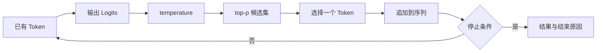
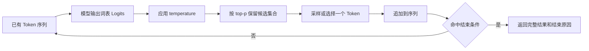

# 大模型基础（03） - 自回归生成与采样延迟：从 Logit 到首 Token

> 理解逐 Token 生成、采样参数、停止条件、Prefill、Decode 与 KV Cache 对延迟的影响。

> 读完后，你应能：
> - 用固定 Logit 序列运行 temperature、top-p 和 stop 实验，记录采样参数、生成 Token 和结束原因。
> - 将一次请求拆成排队、Prefill、Decode、解析和副作用 Span，用 TTFT、TPOT 和输出 Token 定位首个延迟偏差。
> - 构造长度耗尽、客户端取消和 KV Cache 显存压力样本，验证半成品不会被当作正常结果提交。

## 一、先建立主线：模型怎样一步步生成答案

Decoder-only 模型接收已有 Token 序列，为词表中的每个候选计算 Logit，应用采样规则选出一个 Token，再把它追加回序列。下一个 Token 必须看到前一个 Token，所以生成阶段天然是串行循环。

本文只沿“Logit → 概率 → 选择 → 追加 → 停止”展开，再解释完整输入的 Prefill、逐 Token Decode 和 KV Cache 如何影响 TTFT 与输出速度。Tokenizer 和上下文预算分别由前两篇负责。

## 二、自回归循环与因果可见性

模型不能在生成第 5 个 Token 时偷看第 6 个 Token。因果 Mask 让每个位置只能访问自己及之前的表示；训练时可以并行计算所有位置，推理时新 Token 仍要依赖上一轮结果。



## 三、Logit、Softmax 与 temperature

Logit 是模型对候选 Token 的未归一化分数。Softmax 把分数转换为概率；temperature 小于 1 会让分布更尖，temperature 增大会让低分候选获得更高机会。它只改变既有候选的选择分布，不会补充缺失事实。

temperature、top-p 不应同时大幅变化。对 JSON 抽取、分类和工具参数，优先固定低随机性并验证 Schema；创意任务才通过固定数据集评估多样性收益。

## 四、top-p 与停止条件

top-p 从高到低累加概率，只保留达到阈值的最小候选集合，再在集合中采样。`stop` 序列、结束 Token、输出上限、内容过滤、客户端取消和服务端超时都可能结束生成，应用必须区分正常结束与异常终止。

结构化输出的验收顺序是：先检查结束原因，再解析 JSON 或 Tool Call，随后验证 Schema、枚举、范围、权限和副作用。长度耗尽生成的半个 JSON 不能直接交给执行器。

## 五、Prefill、Decode 与 KV Cache

Prefill 一次处理完整输入，输入 Token 越多，首 Token 前的计算通常越重；TTFT 反映用户多久看到第一个结果。Decode 每轮生成一个 Token，输出长度和单 Token 时间共同决定总延迟。

在 Decode 过程中，历史 Token 的 Key/Value 可以缓存，下一轮只计算新 Token 的表示并复用历史 KV，这就是 KV Cache。它减少重复计算，但会占用显存；并发、上下文长度和输出长度都会扩大缓存需求。KV Cache 不是业务层答案缓存，也不是可以无限增长的磁盘缓存。

| 阶段 | 主要输入 | 主要指标 | 常见优化 |
| --- | --- | --- | --- |
| 排队 | 请求到达率与并发 | queue wait | 限流、优先级、过载拒绝 |
| Prefill | 完整输入 Token | TTFT | 缩短上下文、前缀复用、批处理 |
| Decode | 每轮新 Token | TPOT、tokens/s | KV Cache、连续批处理、量化 |
| 收尾 | 解析与副作用 | 完成延迟 | 流式解析、取消传播、Schema 校验 |

## 六、可运行的采样与停止模拟

```python runnable file=decode_simulator.py
from dataclasses import dataclass
import math
import random


@dataclass(frozen=True)
class DecodeResult:
    """保存模拟生成的 Token、结束原因和轮数。"""

    tokens: list[str]
    finish_reason: str


def softmax(logits: list[float], temperature: float) -> list[float]:
    """按 temperature 把 Logit 转换成概率。"""
    if temperature <= 0:
        raise ValueError('temperature must be positive')
    scaled = [value / temperature for value in logits]
    maximum = max(scaled)
    exponentials = [math.exp(value - maximum) for value in scaled]
    total = sum(exponentials)
    return [value / total for value in exponentials]


def decode(max_tokens: int, stop_token: str, temperature: float) -> DecodeResult:
    """使用固定 Logit 序列验证正常停止与长度耗尽。"""
    vocabulary = ['A', 'B', stop_token]
    generated = []
    random.seed(7)
    for _ in range(max_tokens):
        probabilities = softmax([1.4, 0.7, 0.2], temperature)
        token = random.choices(vocabulary, weights=probabilities, k=1)[0]
        generated.append(token)
        if token == stop_token:
            return DecodeResult(generated, 'stop')
    return DecodeResult(generated, 'length')


print(decode(max_tokens=6, stop_token='<END>', temperature=0.2))
```

实验验收不能只看“打印出一段文本”。应分别构造命中 stop、达到长度上限、客户端取消和非法结构化输出的样本，并检查结束原因、已生成 Token、取消状态和副作用是否一致。

## 七、延迟排障：不要只看总耗时

| 现象 | 首个偏差 | 处理 |
| --- | --- | --- |
| 首 Token 慢，后续正常 | 输入过长或排队 | 拆分 queue wait 与 Prefill，压缩上下文 |
| 首 Token 正常，完整回答慢 | Decode 轮数或 TPOT 偏高 | 限制输出、优化 KV Cache 和批处理 |
| 并发升高后显存爆满 | KV Cache 按请求增长 | 设置最大上下文、并发和缓存回收 |
| JSON 偶尔半截 | 结束原因为 length 或 cancel | 检查结束原因后再解析和重试 |
| 调低 temperature 仍有事实错 | 缺证据而非随机性 | 回到 Token/上下文文章检查输入 |

Trace 至少保留模型、输入 Token、输出 Token、排队时间、Prefill 时间、TTFT、TPOT、结束原因、KV Cache 命中或回收状态和取消时间点。

## 八、落地步骤与验收

1. 固定模型、Tokenizer、采样参数、输出上限和停止协议。
2. 把排队、Prefill、Decode、解析和副作用拆成独立 Span。
3. 对结构化任务先验证结束原因与 Schema，再允许执行 Tool Call。
4. 按输入长度、输出长度和并发分桶测量 TTFT、TPOT、P95/P99。
5. 逐项引入 KV Cache、连续批处理或量化，并用质量集回归。
6. 取消、超时和长度耗尽都要保存原始输出，不能冒充正常成功。

验收条件：正常结束与异常结束可区分；采样变化可被固定数据集解释；Prefill 和 Decode 的瓶颈可定位；KV Cache 显存不会随失败请求无限增长；原始失败样本可重放。

## 九、总结

自回归生成把完整回答拆成一轮轮“预测下一个 Token”的循环。temperature 和 top-p 只控制候选选择，停止条件决定协议是否完整；Prefill 决定首 Token，Decode 决定后续速度，KV Cache 用显存换取重复计算的减少。生产指标必须把这些阶段拆开观察。

## 参考资料

- [Attention Is All You Need](https://arxiv.org/abs/1706.03762)
- [The Curious Case of Neural Text Degeneration](https://arxiv.org/abs/1904.09751)
- [vLLM Documentation](https://docs.vllm.ai/)

## 十、来自原稿的详细推导

## 模型为什么只能逐 Token 生成？

Decoder-only 大模型使用已有序列预测下一个 Token。模型为词表中所有候选输出 Logit，采样器选出一个 Token，把它追加到序列，再开始下一轮。



> DIAGRAM_DESCRIPTION：图中展示 Logit 经 temperature 与 top-p 处理后选出一个 Token，追加到序列并循环，直到命中结束条件。

这个串行依赖解释了两个现象：流式响应可以边生成边展示，但第 100 个输出 Token 仍要等待前 99 个；输出越长，Decode 轮数越多。

## temperature 与 top-p 怎么选？

## 6.1 temperature 改变分布，不提供知识

Softmax 把 Logit 转成概率。temperature 小于 1 时分布更尖，模型更偏向高分候选；temperature 增大时分布更平，低分候选被采到的机会增加。

降低 temperature 不能修复过期资料、缺少证据或错误权限。它只改变“在模型现有候选中如何选择”，不会把外部事实写进模型。

## 6.2 top-p 控制候选集合

top-p（Nucleus Sampling）按概率从高到低累加，只保留累计概率达到阈值的最小候选集合，再从中采样。候选集合会随每一步的分布动态变化。

不要在没有评测的情况下同时大幅调整 temperature 与 top-p，否则很难解释质量变化来自哪个参数。先固定一个参数，对任务集重复运行，再观察格式成功率、事实正确率、重复率和多样性。

| 任务 | 起始策略 | 必须验证 |
|---|---|---|
| JSON 抽取、分类 | 低随机性，优先结构化输出 | Schema 通过率、字段正确率 |
| 有证据问答 | 较低随机性 | 引用忠实度、拒答正确率 |
| 营销文案候选 | 允许更高多样性 | 品牌约束、事实错误、重复率 |
| 代码修改 | 稳定优先，并依赖测试 | 编译、测试、Diff 范围 |

## 停止条件为什么必须由应用设计？

生成不会只因为“答案看起来完整”就可靠停止。常见结束条件包括模型生成结束 Token、命中 stop 序列、达到输出上限、内容过滤、客户端取消或服务端超时。

应用必须记录结束原因。达到输出上限时，JSON 可能只生成一半；客户端取消时，后端可能仍在消耗算力；工具调用参数未闭合时，不能直接交给执行器。

结构化任务的验收顺序应是：

1. 检查请求是否正常结束，而不是长度耗尽。
2. 解析 JSON 或 Tool Call。
3. 校验 Schema、枚举、范围和必填字段。
4. 对真实副作用再次做身份、权限和业务校验。
5. 失败时决定重试、修复输出或返回可解释错误。

## Prefill 与 Decode 分别影响什么延迟？

Prefill 一次处理完整输入，输入越长，首 Token 前的计算通常越重。TTFT（Time To First Token）适合衡量用户多久看到第一个结果。

Decode 每轮生成一个新 Token。输出 Token 数和单 Token 时间共同决定回答完成速度。只看总延迟无法区分是 Prompt 太长、请求排队，还是逐 Token 生成太慢。

生产 Trace 至少记录：

- 目标模型与 Tokenizer 版本。
- System、历史、证据、工具和问题各自 Token 数。
- 排队、检索、Prompt 装配和 TTFT。
- 输出 Token 数、总生成时间和结束原因。
- 是否发生摘要、截断、重试或模型降级。

## 十一、发布前的证据记录

| 证据 | 记录内容 | 不满足时的动作 |
| --- | --- | --- |
| 输入版本 | 模型、Tokenizer、Prompt 或样本版本 | 固定版本并重新运行 |
| 中间状态 | 计数、装配、生成阶段或解析状态 | 补齐 Trace 后再判断 |
| 失败现场 | 原始输入、输出、结束原因和首个偏差 | 禁止只保留成功截图 |
| 回归结果 | 正常、边界、失败、恢复四类样本 | 逐类记录通过条件 |

这篇文章的“通过”只表示当前版本、当前样本和当前环境满足预先写下的条件。一次成功运行不能推出生产可用；必须复测原始失败样本，并确认未引入权限、质量、延迟或成本回退。

## 十二、参考资料

- [Hugging Face LLM Course](https://huggingface.co/learn/llm-course/chapter1/1)
- [OpenAI API Reference](https://platform.openai.com/docs/api-reference)
