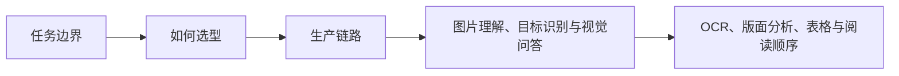

# 大模型基础（11） - 多模态输入任务选型：OCR、ASR、TTS 与视觉模型边界

> 读完后，你应能完成以下任务：
> - 绘制“大模型基础（09） - 多模态输入任务选型：OCR、ASR、TTS 与视觉模型边界 / 任务边界”的关键对象与数据流，解释“图片理解回答“画面是什么”，目标识别关注对象和位置，视觉问答结合问题读取图像；”，并用源码位置、日志或 Trace 标注证据。
> - 为“大模型基础（09） - 多模态输入任务选型：OCR、ASR、TTS 与视觉模型边界 / 如何选型”设计正常与异常输入，验证“通用多模态模型适合开放式理解、复杂页面问答和低量探索；”，输出首个偏差位置与回归测试结果。
> - 实现“大模型基础（09） - 多模态输入任务选型：OCR、ASR、TTS 与视觉模型边界 / 生产链路”的最小代码或配置，检验“校验 MIME、文件大小、像素、页数、时长和恶意内容。 -> 对图片做方向校正和清晰度检查，对音频做声道与采样率归一化。 -> 保留页码、坐标、时间戳、说话人和置信度，不只保存摘要。 -> 低置信度、金额、身份和高风险字段进入人工复核。”，输出命令、结果与 Diff，并说明不适用边界。

> 多模态不等于一个模型包办所有任务。视觉理解、OCR、语音识别和语音合成有不同输入契约、指标与失败模式。


## 核心知识清单

- 图片理解、目标识别与视觉问答
- OCR、版面分析、表格与阅读顺序
- ASR、说话人分离、时间戳与置信度
- TTS、音色、流式播放与内容安全
- 图片分辨率、音频采样率与 Token 成本
- 专用模型、通用多模态模型与级联架构
- 原始证据、人工复核与隐私治理

<!-- article-progressive-block:start -->
# 一、先建立全局：多模态输入任务选型：OCR、ASR、TTS 与视觉模型边界 是什么？

理解“多模态输入任务选型：OCR、ASR、TTS 与视觉模型边界”，先要把标题中的对象放进同一条处理链：它接收什么输入，经过哪些状态变化，最终用什么证据判断结果。下表不另造概念，只把作者正文已经解释的章节按依赖顺序连起来。

“多模态输入任务选型：OCR、ASR、TTS 与视觉模型边界”的第一个核心判断是：图片理解回答“画面是什么”，目标识别关注对象和位置，视觉问答结合问题读取图像；。先弄清这个判断中的对象和输入输出，后面的实现、故障和验收才有共同语境。

| 顺序 | 章节 | 读完本节应抓住的结论 |
| --- | --- | --- |
| 1 | 任务边界 | 图片理解回答“画面是什么”，目标识别关注对象和位置，视觉问答结合问题读取图像； |
| 2 | 如何选型 | 通用多模态模型适合开放式理解、复杂页面问答和低量探索； |
| 3 | 生产链路 | 校验 MIME、文件大小、像素、页数、时长和恶意内容。 -> 对图片做方向校正和清晰度检查，对音频做声道与采样率归一化。 -> 保留页码、坐标、时间戳、说话人和置信度，不只保存摘要。 -> 低置信度、金额、身份和高风险字段进入人工复核。 |
| 4 | 图片理解、目标识别与视觉问答 | 图片理解回答“画面是什么”，目标识别关注对象和位置，视觉问答结合问题读取图像； |
| 5 | OCR、版面分析、表格与阅读顺序 | # 大模型基础（09） - 多模态输入任务选型：OCR、ASR、TTS 与视觉模型边界 |
| 6 | ASR、说话人分离、时间戳与置信度 | # 大模型基础（09） - 多模态输入任务选型：OCR、ASR、TTS 与视觉模型边界 |

## 1.1 核心对象之间怎样衔接



这张图只表达本文的讲解顺序，不替代正文机制。判断“多模态输入任务选型：OCR、ASR、TTS 与视觉模型边界”是否真正掌握，需要能从最后一个结果沿图回到前面每个章节的输入、状态变化和证据。

## 1.2 再看失败：问题最早会出现在哪一步？

在“多模态输入任务选型：OCR、ASR、TTS 与视觉模型边界”的对象和顺序已经明确后，再看可观察的失败：媒体解码失败、OCR 版面错序、ASR 专名错误、跨模态幻觉或 TTS 中断。定位时不从最后一条错误猜原因，而是沿上图找第一个偏离正文结论的节点。
<!-- article-progressive-block:end -->

# 二、任务边界

图片理解回答“画面是什么”，目标识别关注对象和位置，视觉问答结合问题读取图像；
OCR 专门恢复文字，文档解析还要重建标题、段落、表格和阅读顺序。
扫描合同只做 OCR 会得到文本，却可能丢失表格单元格和跨页关系。

ASR 把音频转成带时间戳的文本，说话人分离标记谁在说话；
TTS 把文本生成音频。
客服质检通常是 ASR → 脱敏 → 分类/摘要，而不是让聊天模型直接处理整段原始音频。

# 三、如何选型

通用多模态模型适合开放式理解、复杂页面问答和低量探索；
专用 OCR、ASR 或检测模型适合高吞吐、固定任务和明确指标。
级联架构先用专用模型结构化，再让大模型推理，通常更容易评测和控制成本。

# 四、生产链路

1. 校验 MIME、文件大小、像素、页数、时长和恶意内容。
2. 对图片做方向校正和清晰度检查，对音频做声道与采样率归一化。
3. 保留页码、坐标、时间戳、说话人和置信度，不只保存摘要。
4. 低置信度、金额、身份和高风险字段进入人工复核。
5. Trace 记录模型、预处理版本、输入哈希、延迟和失败原因。

图片和语音都可能包含人脸、证件、声音特征和背景敏感信息。
上传、存储、模型调用、日志和删除链必须分别定义权限与保留期。

<!-- article-progressive-block:start -->
# 五、动手验证：先跑通 多模态输入任务选型：OCR、ASR、TTS 与视觉模型边界，再改变一个变量

前面的章节已经建立问题、概念和机制。现在把“多模态输入任务选型：OCR、ASR、TTS 与视觉模型边界”放进同一套基线中运行；本节不再引入新术语，只验证前文结论能否被复现。

## 5.1 基线与候选只允许一个变量不同

验证“多模态输入任务选型：OCR、ASR、TTS 与视觉模型边界”时，先固定原始媒体、编码格式、语言、噪声等级、模型版本、文本真值和授权范围。候选方案只能改变本次要验证的变量；如果同时更换数据、依赖和配置，即使结果改善，也不能知道是哪一项产生作用。

执行“多模态输入任务选型：OCR、ASR、TTS 与视觉模型边界”时，动作是：分开回放媒体解析、OCR 或 ASR、文本理解、结果生成和 TTS，逐段替换为真值做对照。原始结果不能只保留截图或汇总分数，必须同步保存：解析状态、WER 或 CER、字段准确率、时间戳、引用位置、音频时长和端到端 Trace，使下一次复查可以在同一输入上重放。

| 实验要素 | 本文要求 |
| --- | --- |
| 固定条件 | 固定原始媒体、编码格式、语言、噪声等级、模型版本、文本真值和授权范围 |
| 唯一变量 | 本次候选方案与基线之间的一项明确差异 |
| 原始证据 | 解析状态、WER 或 CER、字段准确率、时间戳、引用位置、音频时长和端到端 Trace |
| 通过阈值 | 每段误差可量化且不会被后续模型掩盖，隐私、延迟和成本满足场景边界 |
| 立即停止 | 媒体解码失败、OCR 版面错序、ASR 专名错误、跨模态幻觉或 TTS 中断 |

## 5.2 执行前先排除不可比较条件

“多模态输入任务选型：OCR、ASR、TTS 与视觉模型边界”开始前先确认下面四项；任一项不成立，都应先修复实验条件，而不是解释结果。

- 基线能够在“多模态输入任务选型：OCR、ASR、TTS 与视觉模型边界”的当前环境重复运行。
- 候选只改变一个与“多模态输入任务选型：OCR、ASR、TTS 与视觉模型边界”结论直接相关的条件。
- “多模态输入任务选型：OCR、ASR、TTS 与视觉模型边界”的基线和候选使用同一批输入、同一版本依赖与同一通过阈值。
- “多模态输入任务选型：OCR、ASR、TTS 与视觉模型边界”的原始输出和失败现场不会被重试、格式化或汇总覆盖。

## 5.3 执行后先核对证据完整性

结果出来后先检查证据，再讨论“多模态输入任务选型：OCR、ASR、TTS 与视觉模型边界”是否通过。缺少中间状态时，最终输出只能说明现象，不能证明机制。

| 检查项 | 当前文章的判定 |
| --- | --- |
| 输入可追溯 | 固定原始媒体、编码格式、语言、噪声等级、模型版本、文本真值和授权范围 |
| 过程可回放 | 分开回放媒体解析、OCR 或 ASR、文本理解、结果生成和 TTS，逐段替换为真值做对照 |
| 结果可审计 | 解析状态、WER 或 CER、字段准确率、时间戳、引用位置、音频时长和端到端 Trace |

“多模态输入任务选型：OCR、ASR、TTS 与视觉模型边界”的一次合格基线对照按以下顺序执行：

1. 保存“多模态输入任务选型：OCR、ASR、TTS 与视觉模型边界”基线版本及输入摘要，确认基线本身可以重复运行。
2. 写下“多模态输入任务选型：OCR、ASR、TTS 与视觉模型边界”候选方案唯一变化的变量，以及它预期影响的指标。
3. 在同一环境执行“多模态输入任务选型：OCR、ASR、TTS 与视觉模型边界”：分开回放媒体解析、OCR 或 ASR、文本理解、结果生成和 TTS，逐段替换为真值做对照。
4. 为“多模态输入任务选型：OCR、ASR、TTS 与视觉模型边界”保存：解析状态、WER 或 CER、字段准确率、时间戳、引用位置、音频时长和端到端 Trace。
5. 使用“多模态输入任务选型：OCR、ASR、TTS 与视觉模型边界”预登记条件判断：每段误差可量化且不会被后续模型掩盖，隐私、延迟和成本满足场景边界。
6. 如果“多模态输入任务选型：OCR、ASR、TTS 与视觉模型边界”未通过，不修改第二个变量，先恢复基线并保留失败现场。

# 六、用一张矩阵验证 多模态输入任务选型：OCR、ASR、TTS 与视觉模型边界 的关键结论

矩阵按正文顺序列出“多模态输入任务选型：OCR、ASR、TTS 与视觉模型边界”的结论。一次实验只选择一行，只改变这一行对应的条件；不要把多行合并成一个无法归因的大实验。

| 正文章节 | 已解释的结论 | 本轮唯一变量 | 必须保存的证据 |
| --- | --- | --- | --- |
| 任务边界 | 图片理解回答“画面是什么”，目标识别关注对象和位置，视觉问答结合问题读取图像； | 只改变与“任务边界”相关的条件 | 解析状态、WER 或 CER、字段准确率、时间戳、引用位置、音频时长和端到端 Trace |
| 如何选型 | 通用多模态模型适合开放式理解、复杂页面问答和低量探索； | 只改变与“如何选型”相关的条件 | 解析状态、WER 或 CER、字段准确率、时间戳、引用位置、音频时长和端到端 Trace |
| 生产链路 | 校验 MIME、文件大小、像素、页数、时长和恶意内容。 -> 对图片做方向校正和清晰度检查，对音频做声道与采样率归一化。 -> 保留页码、坐标、时间戳、说话人和置信度，不只保存摘要。 -> 低置信度、金额、身份和高风险字段进入人工复核。 | 只改变与“生产链路”相关的条件 | 解析状态、WER 或 CER、字段准确率、时间戳、引用位置、音频时长和端到端 Trace |
| 图片理解、目标识别与视觉问答 | 图片理解回答“画面是什么”，目标识别关注对象和位置，视觉问答结合问题读取图像； | 只改变与“图片理解、目标识别与视觉问答”相关的条件 | 解析状态、WER 或 CER、字段准确率、时间戳、引用位置、音频时长和端到端 Trace |
| OCR、版面分析、表格与阅读顺序 | # 大模型基础（09） - 多模态输入任务选型：OCR、ASR、TTS 与视觉模型边界 | 只改变与“OCR、版面分析、表格与阅读顺序”相关的条件 | 解析状态、WER 或 CER、字段准确率、时间戳、引用位置、音频时长和端到端 Trace |
| ASR、说话人分离、时间戳与置信度 | # 大模型基础（09） - 多模态输入任务选型：OCR、ASR、TTS 与视觉模型边界 | 只改变与“ASR、说话人分离、时间戳与置信度”相关的条件 | 解析状态、WER 或 CER、字段准确率、时间戳、引用位置、音频时长和端到端 Trace |

## 6.1 记录本次实际实验

下面的记录用于“多模态输入任务选型：OCR、ASR、TTS 与视觉模型边界”当前这一次实验，不是第二套知识目录。先从矩阵选择一个章节，再填写实际值；没有填写的字段表示尚未验证。

```yaml
topic: "多模态输入任务选型：OCR、ASR、TTS 与视觉模型边界"
selected_chapter: required
claim_from_article: required
baseline_version: required
changed_condition: exactly_one
execution: "分开回放媒体解析、OCR 或 ASR、文本理解、结果生成和 TTS，逐段替换为真值做对照"
evidence: "解析状态、WER 或 CER、字段准确率、时间戳、引用位置、音频时长和端到端 Trace"
pass_when: "每段误差可量化且不会被后续模型掩盖，隐私、延迟和成本满足场景边界"
stop_when: "媒体解码失败、OCR 版面错序、ASR 专名错误、跨模态幻觉或 TTS 中断"
observed_result: required
first_deviation: null_or_evidence
recovery_replay: required_after_failure
```

## 6.2 边界实验必须证明能够停止和恢复

成功路径只能证明“多模态输入任务选型：OCR、ASR、TTS 与视觉模型边界”在当前样本上工作，不能证明它可以进入生产。边界实验需要主动制造：媒体解码失败、OCR 版面错序、ASR 专名错误、跨模态幻觉或 TTS 中断，并观察系统是否在产生不可逆副作用前停止。

| 场景 | 只改变什么 | 应保存什么 | 通过标准 |
| --- | --- | --- | --- |
| 正常路径 | 使用已知有效输入 | 解析状态、WER 或 CER、字段准确率、时间戳、引用位置、音频时长和端到端 Trace | 每段误差可量化且不会被后续模型掩盖，隐私、延迟和成本满足场景边界 |
| 边界路径 | 把一个输入推进到约束临界值 | 临界值前后的输出与指标 | 不静默降级，不把部分结果冒充成功 |
| 明确失败 | 注入：媒体解码失败、OCR 版面错序、ASR 专名错误、跨模态幻觉或 TTS 中断 | 原始错误、首个异常阶段和最终状态 | 失败被正确分类且没有扩大副作用 |
| 恢复重放 | 执行：停在首个误差阶段，保留原始媒体与中间产物，单独修复后再重放端到端链路 | 原失败样本的复测证据 | 原样本恢复，正常样本没有回归 |

恢复动作不是简单重启。对于“多模态输入任务选型：OCR、ASR、TTS 与视觉模型边界”，第一步是：停在首个误差阶段，保留原始媒体与中间产物，单独修复后再重放端到端链路。完成后使用原始失败样本复测；只验证一个新样本成功，不能证明触发条件已经消失。

“多模态输入任务选型：OCR、ASR、TTS 与视觉模型边界”边界实验结束后，应把正常、临界、失败和恢复四类记录放在同一个运行批次中。这样才能区分“候选方案真的修复问题”和“环境变化让问题暂时没有出现”。

# 七、多模态输入任务选型：OCR、ASR、TTS 与视觉模型边界 的结果解释

解释“多模态输入任务选型：OCR、ASR、TTS 与视觉模型边界”实验时先看首个偏差，而不是最后一条错误。最后的异常通常只是上游状态错误的结果；从末端反推容易误把症状当根因。

| 观察结果 | 可以支持的判断 | 下一步 |
| --- | --- | --- |
| 主链路没有达到预期 | 媒体解码失败、OCR 版面错序、ASR 专名错误、跨模态幻觉或 TTS 中断 | 先执行：停在首个误差阶段，保留原始媒体与中间产物，单独修复后再重放端到端链路 |
| 异常链路无法恢复 | 媒体解码失败、OCR 版面错序、ASR 专名错误、跨模态幻觉或 TTS 中断 | 先执行：停在首个误差阶段，保留原始媒体与中间产物，单独修复后再重放端到端链路 |
| 新样本成功但原样本仍失败 | 修复没有覆盖原始触发条件 | 固定原失败输入，恢复基线后重新比较 |
| 指标改善但证据无法回链 | 数据、版本或中间状态没有固定 | 暂停发布，补齐可追溯记录后重跑 |

“多模态输入任务选型：OCR、ASR、TTS 与视觉模型边界”只有同时满足“每段误差可量化且不会被后续模型掩盖，隐私、延迟和成本满足场景边界”，并且没有出现“媒体解码失败、OCR 版面错序、ASR 专名错误、跨模态幻觉或 TTS 中断”，才可以认为主链路通过。这里的“通过”只对当前固定版本、样本和环境有效，不能外推到尚未测试的容量、权限或数据分布。

如果“多模态输入任务选型：OCR、ASR、TTS 与视觉模型边界”候选方案与基线差异很小，先检查证据分辨率是否足够；如果差异很大，先排除数据泄漏、环境漂移和版本不一致。两种情况都不能只看一个汇总均值，需要回到逐样本输出和中间状态。

“多模态输入任务选型：OCR、ASR、TTS 与视觉模型边界”故障定位完成后，记录“现象、首个偏差、根因、改动、原样本复测”五项。缺少原样本复测时，只能标记为待观察，不能标记为已解决。

# 八、多模态输入任务选型：OCR、ASR、TTS 与视觉模型边界 的发布判断

发布判断需要把“多模态输入任务选型：OCR、ASR、TTS 与视觉模型边界”的质量、失败边界和恢复能力放在同一份记录中。以下任一条件缺失，都应停止扩量，而不是用“基本正常”替代证据。

- [ ] “多模态输入任务选型：OCR、ASR、TTS 与视觉模型边界”的基线与候选只存在一个计划内变量。
- [ ] “多模态输入任务选型：OCR、ASR、TTS 与视觉模型边界”的输入、代码、依赖、配置和数据版本可以追溯。
- [ ] “多模态输入任务选型：OCR、ASR、TTS 与视觉模型边界”的正常、临界、失败和恢复样本使用同一套断言。
- [ ] “多模态输入任务选型：OCR、ASR、TTS 与视觉模型边界”的原始输出、中间状态和失败现场已经保留。
- [ ] “多模态输入任务选型：OCR、ASR、TTS 与视觉模型边界”的日志、Trace、截图和测试数据已经脱敏。
- [ ] “多模态输入任务选型：OCR、ASR、TTS 与视觉模型边界”的停止条件、负责人和回滚入口已经演练。
- [ ] “多模态输入任务选型：OCR、ASR、TTS 与视觉模型边界”尚未覆盖的输入、权限、容量和外部依赖已经登记。

最终记录至少包含基线版本、唯一变量、原始证据、首个偏差、恢复复测和发布责任人。没有参与本次修改的人如果不能据此重放“多模态输入任务选型：OCR、ASR、TTS 与视觉模型边界”的判断，就不能发布。
<!-- article-progressive-block:end -->

# 九、总结

- **任务边界**：图片理解回答“画面是什么”，目标识别关注对象和位置，视觉问答结合问题读取图像；
- **如何选型**：通用多模态模型适合开放式理解、复杂页面问答和低量探索；
- **生产链路**：校验 MIME、文件大小、像素、页数、时长和恶意内容。 -> 对图片做方向校正和清晰度检查，对音频做声道与采样率归一化。 -> 保留页码、坐标、时间戳、说话人和置信度，不只保存摘要。 -> 低置信度、金额、身份和高风险字段进入人工复核。
- **图片理解、目标识别与视觉问答**：图片理解回答“画面是什么”，目标识别关注对象和位置，视觉问答结合问题读取图像；
- **OCR、版面分析、表格与阅读顺序**：# 大模型基础（11） - 多模态输入任务选型：OCR、ASR、TTS 与视觉模型边界
- **ASR、说话人分离、时间戳与置信度**：# 大模型基础（11） - 多模态输入任务选型：OCR、ASR、TTS 与视觉模型边界

## 参考资料

- [OpenAI Images and Vision](https://platform.openai.com/docs/guides/images-vision)
- [Hugging Face Automatic Speech Recognition](https://huggingface.co/docs/transformers/tasks/asr)
- [Hugging Face Text-to-Speech](https://huggingface.co/docs/transformers/tasks/text-to-speech)
- [Google Cloud Vision OCR](https://cloud.google.com/vision/docs/ocr)
