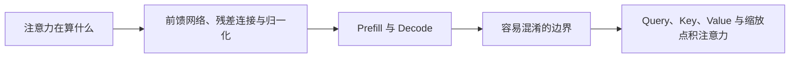

# Transformer（01） - Transformer 注意力与推理过程

> 读完后，你应能完成以下任务：
> - 绘制“Transformer（01） - Transformer 注意力与推理过程 / 注意力在算什么”的关键对象与数据流，解释“多头注意力让不同子空间并行学习指代、位置和语义关系。”，并用源码位置、日志或 Trace 标注证据。
> - 为“Transformer（01） - Transformer 注意力与推理过程 / 前馈网络、残差连接与归一化”设计正常与异常输入，验证“注意力负责让 Token 交换上下文信息，前馈网络则对每个位置独立进行非线性特征变换，通常先扩维再投影回隐藏维度。”，输出首个偏差位置与回归测试结果。
> - 实现“Transformer（01） - Transformer 注意力与推理过程 / Prefill 与 Decode”的最小代码或配置，检验“Prefill 并行处理完整输入，计算每层 Key/Value；”，输出命令、结果与 Diff，并说明不适用边界。

> 从 Token 进入模型到生成下一个 Token，理解 Q/K/V、残差、归一化、Prefill 和 KV Cache 如何共同工作。


## 核心知识清单

- Embedding 与位置编码
- Query、Key、Value 与缩放点积注意力
- 多头注意力与因果掩码
- 前馈网络、残差连接与归一化
- Decoder-only 与自回归生成
- Prefill、Decode 与 KV Cache

<!-- article-progressive-block:start -->
# 一、先建立全局：Transformer 注意力与推理过程 是什么？

理解“Transformer 注意力与推理过程”，先要把标题中的对象放进同一条处理链：它接收什么输入，经过哪些状态变化，最终用什么证据判断结果。下表不另造概念，只把作者正文已经解释的章节按依赖顺序连起来。

“Transformer 注意力与推理过程”的第一个核心判断是：多头注意力让不同子空间并行学习指代、位置和语义关系。。先弄清这个判断中的对象和输入输出，后面的实现、故障和验收才有共同语境。

| 顺序 | 章节 | 读完本节应抓住的结论 |
| --- | --- | --- |
| 1 | 注意力在算什么 | 多头注意力让不同子空间并行学习指代、位置和语义关系。 |
| 2 | 前馈网络、残差连接与归一化 | 注意力负责让 Token 交换上下文信息， |
| 3 | Prefill 与 Decode | Prefill 并行处理完整输入，计算每层 Key/Value； |
| 4 | 容易混淆的边界 | Embedding 层把 Token ID 映射为隐藏向量，不等于 RAG 使用的句向量模型。 |
| 5 | Query、Key、Value 与缩放点积注意力 | Prefill 并行处理完整输入，计算每层 Key/Value； |
| 6 | 多头注意力与因果掩码 | 多头注意力让不同子空间并行学习指代、位置和语义关系。 |

## 1.1 核心对象之间怎样衔接



这张图只表达本文的讲解顺序，不替代正文机制。判断“Transformer 注意力与推理过程”是否真正掌握，需要能从最后一个结果沿图回到前面每个章节的输入、状态变化和证据。

## 1.2 再看失败：问题最早会出现在哪一步？

在“Transformer 注意力与推理过程”的对象和顺序已经明确后，再看可观察的失败：条件缺失、结果不可复现或失败后责任不清。定位时不从最后一条错误猜原因，而是沿上图找第一个偏离正文结论的节点。
<!-- article-progressive-block:end -->

# 二、注意力在算什么

每个 Token 的隐藏状态分别投影成 Query、Key、Value。
Query 与所有可见 Key 的相似度经过缩放和 Softmax 得到权重，
再对 Value 加权求和。
因果掩码阻止当前位置看到未来 Token；
多头注意力让不同子空间并行学习指代、位置和语义关系。

# 三、前馈网络、残差连接与归一化

注意力负责让 Token 交换上下文信息，
前馈网络则对每个位置独立进行非线性特征变换，
通常先扩维再投影回隐藏维度。
它不负责跨 Token 读取，但承担了大量参数和表示变换能力。

残差连接把子层输入直接加回输出，为深层网络保留梯度与原始信息；
归一化控制激活尺度，降低训练和推理中的数值漂移。
三者与注意力共同构成 Transformer Block，
缺少其中任一部分都不能只靠 Attention 替代。

```python
import math


def scaled_dot_attention(query: list[float], keys: list[list[float]], values: list[list[float]]) -> list[float]:
    """计算单个 Query 对一组 Key/Value 的缩放点积注意力。"""
    # 每个 Key 对当前 Query 的未归一化相关性分数。
    scores = [sum(q * k for q, k in zip(query, key)) / math.sqrt(len(query)) for key in keys]
    # 数值稳定的 Softmax 概率。
    maximum_score = max(scores)
    exponentials = [math.exp(score - maximum_score) for score in scores]
    probability_sum = sum(exponentials)
    attention_weights = [value / probability_sum for value in exponentials]
    # 加权后的上下文向量。
    return [sum(weight * value[index] for weight, value in zip(attention_weights, values)) for index in range(len(values[0]))]
```

# 四、Prefill 与 Decode

Prefill 并行处理完整输入，计算每层 Key/Value；
Decode 每轮只生成一个新 Token，并复用 KV Cache。
输入越长，Prefill 和首字延迟越高；
输出越长，Decode 次数越多。
KV Cache 用显存换计算，长上下文和高并发会快速占满显存，因此吞吐优化不能只看权重大小。

# 五、容易混淆的边界

- Embedding 层把 Token ID 映射为隐藏向量，不等于 RAG 使用的句向量模型。
- Attention 能建立上下文关系，不保证模型记住长文本中的全部事实。
- KV Cache 只复用推理中间状态，不会更新模型参数或形成长期记忆。

<!-- article-progressive-block:start -->
# 六、动手验证：先跑通 Transformer 注意力与推理过程，再改变一个变量

前面的章节已经建立问题、概念和机制。现在把“Transformer 注意力与推理过程”放进同一套基线中运行；本节不再引入新术语，只验证前文结论能否被复现。

## 6.1 基线与候选只允许一个变量不同

验证“Transformer 注意力与推理过程”时，先固定样本、基线、候选、成功标准和失败边界。候选方案只能改变本次要验证的变量；如果同时更换数据、依赖和配置，即使结果改善，也不能知道是哪一项产生作用。

执行“Transformer 注意力与推理过程”时，动作是：同环境运行基线与候选，记录输入、中间状态和异常。原始结果不能只保留截图或汇总分数，必须同步保存：可重放命令、结构化日志、输出 Diff、失败样本、版本，使下一次复查可以在同一输入上重放。

| 实验要素 | 本文要求 |
| --- | --- |
| 固定条件 | 固定样本、基线、候选、成功标准和失败边界 |
| 唯一变量 | 本次候选方案与基线之间的一项明确差异 |
| 原始证据 | 可重放命令、结构化日志、输出 Diff、失败样本、版本 |
| 通过阈值 | 结果符合结论条件，异常输入可解释、可恢复 |
| 立即停止 | 条件缺失、结果不可复现或失败后责任不清 |

## 6.2 执行前先排除不可比较条件

“Transformer 注意力与推理过程”开始前先确认下面四项；任一项不成立，都应先修复实验条件，而不是解释结果。

- 基线能够在“Transformer 注意力与推理过程”的当前环境重复运行。
- 候选只改变一个与“Transformer 注意力与推理过程”结论直接相关的条件。
- “Transformer 注意力与推理过程”的基线和候选使用同一批输入、同一版本依赖与同一通过阈值。
- “Transformer 注意力与推理过程”的原始输出和失败现场不会被重试、格式化或汇总覆盖。

## 6.3 执行后先核对证据完整性

结果出来后先检查证据，再讨论“Transformer 注意力与推理过程”是否通过。缺少中间状态时，最终输出只能说明现象，不能证明机制。

| 检查项 | 当前文章的判定 |
| --- | --- |
| 输入可追溯 | 固定样本、基线、候选、成功标准和失败边界 |
| 过程可回放 | 同环境运行基线与候选，记录输入、中间状态和异常 |
| 结果可审计 | 可重放命令、结构化日志、输出 Diff、失败样本、版本 |

“Transformer 注意力与推理过程”的一次合格基线对照按以下顺序执行：

1. 保存“Transformer 注意力与推理过程”基线版本及输入摘要，确认基线本身可以重复运行。
2. 写下“Transformer 注意力与推理过程”候选方案唯一变化的变量，以及它预期影响的指标。
3. 在同一环境执行“Transformer 注意力与推理过程”：同环境运行基线与候选，记录输入、中间状态和异常。
4. 为“Transformer 注意力与推理过程”保存：可重放命令、结构化日志、输出 Diff、失败样本、版本。
5. 使用“Transformer 注意力与推理过程”预登记条件判断：结果符合结论条件，异常输入可解释、可恢复。
6. 如果“Transformer 注意力与推理过程”未通过，不修改第二个变量，先恢复基线并保留失败现场。

# 七、用一张矩阵验证 Transformer 注意力与推理过程 的关键结论

矩阵按正文顺序列出“Transformer 注意力与推理过程”的结论。一次实验只选择一行，只改变这一行对应的条件；不要把多行合并成一个无法归因的大实验。

| 正文章节 | 已解释的结论 | 本轮唯一变量 | 必须保存的证据 |
| --- | --- | --- | --- |
| 注意力在算什么 | 多头注意力让不同子空间并行学习指代、位置和语义关系。 | 只改变与“注意力在算什么”相关的条件 | 可重放命令、结构化日志、输出 Diff、失败样本、版本 |
| 前馈网络、残差连接与归一化 | 注意力负责让 Token 交换上下文信息， | 只改变与“前馈网络、残差连接与归一化”相关的条件 | 可重放命令、结构化日志、输出 Diff、失败样本、版本 |
| Prefill 与 Decode | Prefill 并行处理完整输入，计算每层 Key/Value； | 只改变与“Prefill 与 Decode”相关的条件 | 可重放命令、结构化日志、输出 Diff、失败样本、版本 |
| 容易混淆的边界 | Embedding 层把 Token ID 映射为隐藏向量，不等于 RAG 使用的句向量模型。 | 只改变与“容易混淆的边界”相关的条件 | 可重放命令、结构化日志、输出 Diff、失败样本、版本 |
| Query、Key、Value 与缩放点积注意力 | Prefill 并行处理完整输入，计算每层 Key/Value； | 只改变与“Query、Key、Value 与缩放点积注意力”相关的条件 | 可重放命令、结构化日志、输出 Diff、失败样本、版本 |
| 多头注意力与因果掩码 | 多头注意力让不同子空间并行学习指代、位置和语义关系。 | 只改变与“多头注意力与因果掩码”相关的条件 | 可重放命令、结构化日志、输出 Diff、失败样本、版本 |

## 7.1 记录本次实际实验

下面的记录用于“Transformer 注意力与推理过程”当前这一次实验，不是第二套知识目录。先从矩阵选择一个章节，再填写实际值；没有填写的字段表示尚未验证。

```yaml
topic: "Transformer 注意力与推理过程"
selected_chapter: required
claim_from_article: required
baseline_version: required
changed_condition: exactly_one
execution: "同环境运行基线与候选，记录输入、中间状态和异常"
evidence: "可重放命令、结构化日志、输出 Diff、失败样本、版本"
pass_when: "结果符合结论条件，异常输入可解释、可恢复"
stop_when: "条件缺失、结果不可复现或失败后责任不清"
observed_result: required
first_deviation: null_or_evidence
recovery_replay: required_after_failure
```

## 7.2 边界实验必须证明能够停止和恢复

成功路径只能证明“Transformer 注意力与推理过程”在当前样本上工作，不能证明它可以进入生产。边界实验需要主动制造：条件缺失、结果不可复现或失败后责任不清，并观察系统是否在产生不可逆副作用前停止。

| 场景 | 只改变什么 | 应保存什么 | 通过标准 |
| --- | --- | --- | --- |
| 正常路径 | 使用已知有效输入 | 可重放命令、结构化日志、输出 Diff、失败样本、版本 | 结果符合结论条件，异常输入可解释、可恢复 |
| 边界路径 | 把一个输入推进到约束临界值 | 临界值前后的输出与指标 | 不静默降级，不把部分结果冒充成功 |
| 明确失败 | 注入：条件缺失、结果不可复现或失败后责任不清 | 原始错误、首个异常阶段和最终状态 | 失败被正确分类且没有扩大副作用 |
| 恢复重放 | 执行：保留基线，缩小变量；根因确认前不扩大范围 | 原失败样本的复测证据 | 原样本恢复，正常样本没有回归 |

恢复动作不是简单重启。对于“Transformer 注意力与推理过程”，第一步是：保留基线，缩小变量；根因确认前不扩大范围。完成后使用原始失败样本复测；只验证一个新样本成功，不能证明触发条件已经消失。

“Transformer 注意力与推理过程”边界实验结束后，应把正常、临界、失败和恢复四类记录放在同一个运行批次中。这样才能区分“候选方案真的修复问题”和“环境变化让问题暂时没有出现”。

# 八、Transformer 注意力与推理过程 的结果解释

解释“Transformer 注意力与推理过程”实验时先看首个偏差，而不是最后一条错误。最后的异常通常只是上游状态错误的结果；从末端反推容易误把症状当根因。

| 观察结果 | 可以支持的判断 | 下一步 |
| --- | --- | --- |
| 主链路没有达到预期 | 条件缺失、结果不可复现或失败后责任不清 | 先执行：保留基线，缩小变量；根因确认前不扩大范围 |
| 异常链路无法恢复 | 条件缺失、结果不可复现或失败后责任不清 | 先执行：保留基线，缩小变量；根因确认前不扩大范围 |
| 新样本成功但原样本仍失败 | 修复没有覆盖原始触发条件 | 固定原失败输入，恢复基线后重新比较 |
| 指标改善但证据无法回链 | 数据、版本或中间状态没有固定 | 暂停发布，补齐可追溯记录后重跑 |

“Transformer 注意力与推理过程”只有同时满足“结果符合结论条件，异常输入可解释、可恢复”，并且没有出现“条件缺失、结果不可复现或失败后责任不清”，才可以认为主链路通过。这里的“通过”只对当前固定版本、样本和环境有效，不能外推到尚未测试的容量、权限或数据分布。

如果“Transformer 注意力与推理过程”候选方案与基线差异很小，先检查证据分辨率是否足够；如果差异很大，先排除数据泄漏、环境漂移和版本不一致。两种情况都不能只看一个汇总均值，需要回到逐样本输出和中间状态。

“Transformer 注意力与推理过程”故障定位完成后，记录“现象、首个偏差、根因、改动、原样本复测”五项。缺少原样本复测时，只能标记为待观察，不能标记为已解决。

# 九、Transformer 注意力与推理过程 的发布判断

发布判断需要把“Transformer 注意力与推理过程”的质量、失败边界和恢复能力放在同一份记录中。以下任一条件缺失，都应停止扩量，而不是用“基本正常”替代证据。

- [ ] “Transformer 注意力与推理过程”的基线与候选只存在一个计划内变量。
- [ ] “Transformer 注意力与推理过程”的输入、代码、依赖、配置和数据版本可以追溯。
- [ ] “Transformer 注意力与推理过程”的正常、临界、失败和恢复样本使用同一套断言。
- [ ] “Transformer 注意力与推理过程”的原始输出、中间状态和失败现场已经保留。
- [ ] “Transformer 注意力与推理过程”的日志、Trace、截图和测试数据已经脱敏。
- [ ] “Transformer 注意力与推理过程”的停止条件、负责人和回滚入口已经演练。
- [ ] “Transformer 注意力与推理过程”尚未覆盖的输入、权限、容量和外部依赖已经登记。

最终记录至少包含基线版本、唯一变量、原始证据、首个偏差、恢复复测和发布责任人。没有参与本次修改的人如果不能据此重放“Transformer 注意力与推理过程”的判断，就不能发布。
<!-- article-progressive-block:end -->

# 十、总结

- **注意力在算什么**：多头注意力让不同子空间并行学习指代、位置和语义关系。
- **前馈网络、残差连接与归一化**：注意力负责让 Token 交换上下文信息，前馈网络则对每个位置独立进行非线性特征变换，通常先扩维再投影回隐藏维度。
- **Prefill 与 Decode**：Prefill 并行处理完整输入，计算每层 Key/Value；
- **容易混淆的边界**：Embedding 层把 Token ID 映射为隐藏向量，不等于 RAG 使用的句向量模型。

## 参考资料

- [Attention Is All You Need](https://arxiv.org/abs/1706.03762)
- [The Illustrated Transformer](https://jalammar.github.io/illustrated-transformer/)
