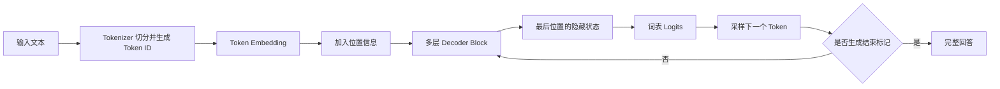
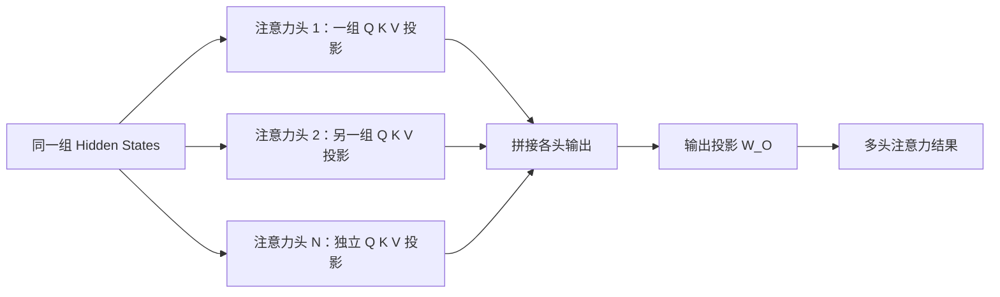
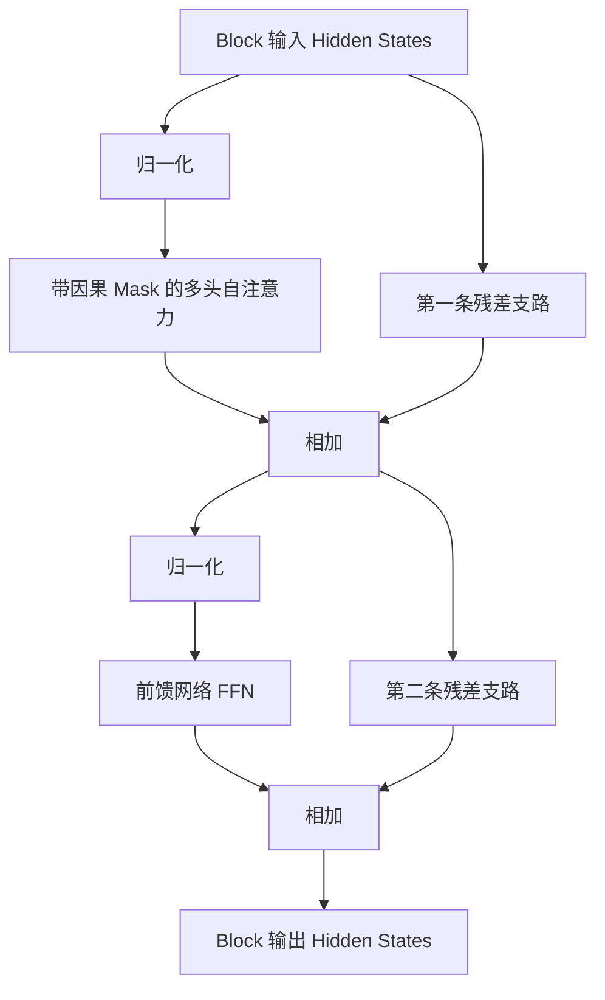
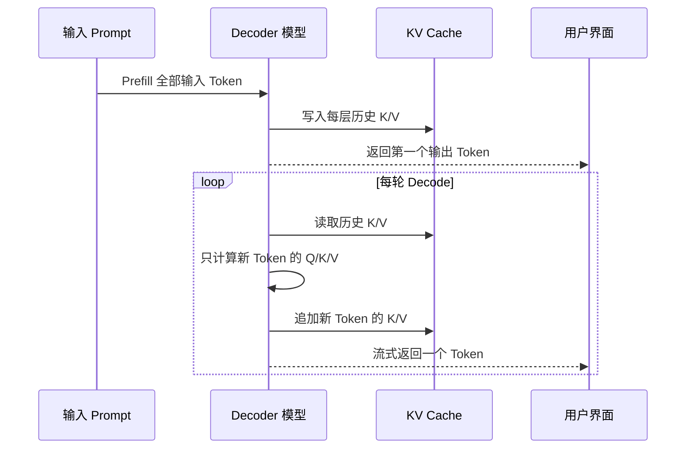

# Transformer（02） - 图解 Transformer 架构：大模型底层原理

> 读完后，你应能完成以下任务：
> - 绘制“Transformer（02） - 图解 Transformer 架构：大模型底层原理 / 先看全局：一句话是怎样穿过模型的？”的关键对象与数据流，解释“进入模型的是一组离散 ID。”，并用源码位置、日志或 Trace 标注证据。
> - 为“Transformer（02） - 图解 Transformer 架构：大模型底层原理 / Token Embedding：把离散编号变成可计算的向量”设计正常与异常输入，验证“Token ID 只是词表索引：ID 1024 不代表它比 ID 1023 的语义更大或更相似。”，输出首个偏差位置与回归测试结果。
> - 实现“Transformer（02） - 图解 Transformer 架构：大模型底层原理 / 只有词向量，模型分不清顺序”的最小代码或配置，检验“上下文上限不只由位置编码决定，还受训练长度、注意力实现和推理资源约束。”，输出命令、结果与 Diff，并说明不适用边界。

> 这篇文章面向需要调用、部署或优化大模型的应用工程师。目标不是推导整篇论文，而是把一次生成真正经过的数据流讲清楚。


## 核心知识清单

- Token Embedding 与位置编码
- Query、Key、Value 与缩放点积注意力
- 多头注意力与因果 Mask
- 前馈网络、残差连接与归一化
- Decoder-only 与自回归生成
- Prefill、Decode 与 KV Cache

# 一、先看全局：一句话是怎样穿过模型的？

假设用户输入“成都今天适合跑步吗”。分词器先把文本切成 Token，并把每个 Token 转成整数 ID。模型不会直接处理汉字，也不会在内部保存一句可读的中文；进入模型的是一组离散 ID。

Embedding 层把每个 ID 查表变成向量，位置编码再告诉模型这些 Token 的先后关系。随后，向量依次穿过多个 Transformer Block。每个 Block 先通过自注意力读取上下文，再通过前馈网络改写每个位置的表示。

最后一个位置的隐藏状态经过输出投影，得到词表中每个候选 Token 的 Logit。采样器选出一个 Token 接回序列，再开始下一轮；流式回答就是这个循环的可见结果。



> DIAGRAM_DESCRIPTION：图中包含文本到采样的完整主链路，并用分支表示继续生成或结束回答。

图中最重要的结论是：一次前向计算只给下一个 Token 打分；隐藏状态仍是向量，经过词表投影和采样后才重新变成文本。

# 二、Token Embedding：把离散编号变成可计算的向量

## 2.1 Token ID 本身没有语义距离

分词器可能把“跑步”切成一个或多个 Token。Token ID 只是词表索引：ID 1024 不代表它比 ID 1023 的语义更大或更相似。

如果词表大小是 `V`，隐藏维度是 `d_model`，Embedding 矩阵的形状就是：

```text
Embedding 矩阵形状：E = [V, d_model]
```

第 `i` 个 Token 的初始向量就是矩阵 `E` 的第 `i` 行，训练会持续调整它。它也不是 RAG Embedding：前者表示单个 Token，后者通常把一句话或文本块压成可检索向量，二者不能互换。

## 2.2 只有词向量，模型分不清顺序

自注意力本身不感知排列；没有位置信息时，“我喜欢你”和“你喜欢我”难以区分。原始 Transformer 使用正弦、余弦位置编码，现代 Decoder-only 模型常见 RoPE（Rotary Position Embedding，旋转位置编码）等方案，让注意力分数体现顺序或相对距离。

上下文上限不只由位置编码决定，还受训练长度、注意力实现和推理资源约束。

| 表示 | 输入粒度 | 主要作用 | 不应该理解成什么 |
|---|---|---|---|
| Token ID | 单个 Token | 定位词表条目 | 语义大小或相似度 |
| Token Embedding | 单个 Token | 提供初始语义向量 | 可直接用于 RAG 的句向量 |
| 位置编码 | 序列位置 | 把顺序或相对距离带入计算 | 一段额外的自然语言提示词 |
| Hidden State | 某层某位置 | 保存该位置吸收上下文后的表示 | 永远不变的词义向量 |

初始 Token Embedding 只由 ID 决定，Hidden State 却会逐层吸收上下文。同一个“苹果”在水果和公司语境中起点相同，穿过多层后的表示不同。

# 三、Query、Key、Value：注意力到底在算什么？

## 3.1 Q、K、V 不是三份输入文本

对某一层的输入矩阵 `X`，模型用三组训练得到的权重做线性投影：

```text
Q = X * W_Q
K = X * W_K
V = X * W_V
```

可以把三者的职责理解为：

- Query（查询）：当前位置现在想找什么信息。
- Key（键）：每个可见位置用什么特征声明“我能提供什么”。
- Value（值）：如果当前位置关注到我，实际应该取走什么内容。

Q 和 K 通过向量乘法决定相关性权重，V 决定聚合内容；它们不是问题文本、数据库索引和原文答案。

## 3.2 缩放点积注意力分四步

单个注意力头可以写成：

```text
Attention(Q, K, V) = softmax((Q * K^T) / sqrt(d_k) + M) * V
```

这条公式按顺序做了四件事：

1. `QK^T`：让每个 Query 和每个 Key 做点积，得到相关性分数。
2. 除以 `sqrt(d_k)`：控制分数尺度，避免维度增大后 Softmax 过早饱和。
3. 加上 Mask `M`：把不允许关注的位置改成极小值。
4. `Softmax` 后乘 `V`：把分数变成总和为 1 的权重，再对 Value 加权求和。

## 3.3 用一个小例子看懂权重

假设当前位置的 Query 是 `[1, 0]`，前面两个位置的 Key 分别是 `[1, 0]` 和 `[0, 1]`。两个点积分数分别为 `1` 和 `0`。

Key 维度 `d_k = 2`，缩放后得到约 `[0.707, 0]`。经过 Softmax，权重大约是 `[0.67, 0.33]`。如果两个 Value 分别为 `[2, 0]` 和 `[0, 3]`，加权结果约为 `[1.34, 0.99]`。

结果不是选中一个 Token，而是按权重混合多个 Value。除以 `sqrt(d_k)` 也不能省：维度增大时点积分数会膨胀，Softmax 容易过早接近 0 或 1，缩放能稳定数值与梯度。

## 3.4 用 Python 验证手算结果

下面示例只用 Python 3.10+ 标准库。它让第三个 Key 对当前 Query 不可见，用来模拟因果 Mask；保存为 `attention_demo.py` 后运行 `python attention_demo.py`。

```python runnable file=attention_demo.py
import math

# 被 Mask 遮住的位置使用足够小的分数，使其 Softmax 权重接近 0。
MASKED_SCORE = -1e9
# 当前 Token 用来查询上下文的向量。
QUERY = [1.0, 0.0]
# 三个上下文位置用于匹配 Query 的 Key 向量。
KEYS = [[1.0, 0.0], [0.0, 1.0], [1.0, 1.0]]
# 三个上下文位置被注意力读取的 Value 向量。
VALUES = [[2.0, 0.0], [0.0, 3.0], [9.0, 9.0]]
# 当前 Query 对三个位置的可见性，第三个未来位置不可见。
VISIBLE_POSITIONS = [True, True, False]


def softmax(scores: list[float]) -> list[float]:
    """把任意实数分数转换为总和为 1 的稳定概率。"""
    # 减去最大值，避免指数计算产生不必要的数值溢出。
    maximum_score = max(scores)
    # 每个平移后分数对应的指数值。
    exponentials = [math.exp(score - maximum_score) for score in scores]
    # 全部指数值之和，用于概率归一化。
    exponential_sum = sum(exponentials)
    return [exponential / exponential_sum for exponential in exponentials]


def scaled_dot_attention(
    query: list[float],
    keys: list[list[float]],
    values: list[list[float]],
    visible_positions: list[bool],
) -> tuple[list[float], list[float]]:
    """计算单个 Query 的缩放点积注意力，并返回权重和聚合结果。"""
    # Key 的维度决定点积分数的缩放系数。
    key_dimension = len(query)
    # 每个 Key 与当前 Query 的缩放点积分数。
    attention_scores = [
        sum(query_value * key_value for query_value, key_value in zip(query, key))
        / math.sqrt(key_dimension)
        for key in keys
    ]
    # 不可见位置被替换为极小值，Softmax 后不会贡献 Value。
    masked_scores = [
        score if is_visible else MASKED_SCORE
        for score, is_visible in zip(attention_scores, visible_positions)
    ]
    # 当前 Query 分配给各个可见位置的注意力权重。
    attention_weights = softmax(masked_scores)
    # Value 的输出维度，用于逐维完成加权求和。
    value_dimension = len(values[0])
    # 多个 Value 按注意力权重混合后的上下文向量。
    attention_output = [
        sum(weight * value[dimension] for weight, value in zip(attention_weights, values))
        for dimension in range(value_dimension)
    ]
    return attention_weights, attention_output


# 固定示例计算出的注意力权重和上下文向量。
weights, output = scaled_dot_attention(QUERY, KEYS, VALUES, VISIBLE_POSITIONS)
print("weights:", [round(weight, 3) for weight in weights])
print("output:", [round(value, 3) for value in output])
```

预期输出如下：

```text
weights: [0.67, 0.33, 0.0]
output: [1.34, 0.99]
```

验收重点不是小数位完全一致，而是第三个 Value 明明很大，遮住后权重仍为 0，最终输出与前面的两位置手算一致。若把 `VISIBLE_POSITIONS` 的第三项改成 `True`，输出应明显变化，证明 Mask 在 Softmax 前生效。

# 四、多头注意力：为什么不只算一组 Q、K、V？

一个注意力头只在一个投影子空间里计算关系。多头注意力把隐藏维度拆给多个头，让每个头拥有独立的 `W_Q`、`W_K`、`W_V`，并行产生多组上下文表示。



> DIAGRAM_DESCRIPTION：图中展示多个独立注意力头并行投影，输出拼接后再统一投影。

不同头可能学习指代、搭配或长距离依赖，但职责不是人工固定的。若隐藏维度为 4096、共有 32 个头，一种常见拆法是每头 128 维；拼接并经 `W_O` 投影后仍回到 4096 维，才能接回残差主干。

# 五、因果 Mask：为什么生成时看不到未来？

Decoder-only 模型做自回归生成：位置 `t` 只能使用位置 `0...t` 的信息，不能偷看 `t+1` 之后的正确答案。训练时整段文本可以并行送进模型，所以必须用因果 Mask 主动遮住未来位置。

四个 Token 的可见关系可以画成下三角矩阵：

| Query 位置 | Token 1 | Token 2 | Token 3 | Token 4 |
|---|---:|---:|---:|---:|
| Token 1 | 可见 | 遮住 | 遮住 | 遮住 |
| Token 2 | 可见 | 可见 | 遮住 | 遮住 |
| Token 3 | 可见 | 可见 | 可见 | 遮住 |
| Token 4 | 可见 | 可见 | 可见 | 可见 |

实现时，遮住的位置通常在 Softmax 前加上负无穷或足够小的数。Softmax 后这些位置的权重变成 0，未来 Token 就不会参与当前输出。

因果 Mask 防止看到未来，Padding Mask 则忽略批处理中用于对齐的空位。训练能用矩阵并行覆盖所有 Query，但因果约束仍然存在，并行不等于偷看答案。

# 六、一个 Decoder Block 里还有什么？

只讲 Attention 仍然解释不了完整的 Transformer Block。现代 Decoder-only 模型通常还包含归一化、残差连接和逐位置前馈网络。



> DIAGRAM_DESCRIPTION：图中展示 Pre-Norm Block 的注意力与 FFN 两段子层，以及各自的残差相加。

图中是先归一化再进子层的 Pre-Norm；原始论文采用 Post-Norm，具体模型还可能使用 LayerNorm 或 RMSNorm，应以模型实现为准。

## 6.1 前馈网络负责逐位置改写

Attention 负责跨 Token 搬运和组合信息，FFN（Feed-Forward Network，前馈网络）则对每个位置独立做非线性变换。经典形式是先扩维、经过激活函数、再投影回隐藏维度：

```text
FFN(x) = W_2 * activation(W_1 * x + b_1) + b_2
```

现代模型也常用 SwiGLU 等门控变体。FFN 不直接读取别的位置，但它的输入已包含 Attention 聚合的上下文。

## 6.2 残差连接保留原信息和梯度通道

残差连接把子层输入加回输出，使 Block 学习增量修正并保留梯度通道。两边维度必须一致，所以注意力和 FFN 都要投影回 `d_model`；残差也不是跨请求缓存。

## 6.3 归一化控制数值尺度

归一化稳定激活尺度，减少深层堆叠时的数值漂移，但不负责注入知识或压缩上下文。多层“跨位置聚合 + 逐位置变换”之后，Hidden State 已是当前语境中的动态表示。

# 七、Decoder-only：下一个 Token 是怎样生成的？

Encoder-only 偏向双向理解，Encoder-Decoder 先编码再生成；主流生成式大模型常用 Decoder-only，把提示词和已生成内容放在同一条因果序列里。

| 架构 | 可见性与数据流 | 常见任务倾向 | 关键边界 |
|---|---|---|---|
| Encoder-only | 每个位置通常可双向关注 | 分类、表示学习 | 不天然按因果方式连续生成 |
| Encoder-Decoder | 编码输入，解码器通过交叉注意力读取编码结果 | 翻译、条件生成 | 有两套主干数据流 |
| Decoder-only | 单序列因果注意力 | 对话、续写、代码生成 | 每轮预测下一个 Token |

Decoder-only 的最后隐藏状态经过语言模型头投影到词表大小，得到 Logits。Softmax 可以把 Logits 转成概率分布，但实际推理通常还会应用 temperature、top-k、top-p 或重复惩罚等采样策略。

temperature 只改变候选分布的尖锐程度，不能补充事实。自回归输出又有串行依赖：后一个 Token 必须等待前一个结果，长输出无法像 Prefill 一样全部并行。

# 八、Prefill、Decode 与 KV Cache：推理成本贵在哪里？

## 8.1 Prefill 一次处理完整输入

Prefill 阶段把 System Prompt、历史消息、检索证据和本轮问题组成的输入序列一次送进模型。所有输入位置可以在因果 Mask 约束下并行计算，并为每一层产生 Key 和 Value。

输入越长，Prefill 越重，通常会拉高 TTFT（Time To First Token，首 Token 延迟）。

## 8.2 Decode 每轮只处理一个新 Token

Decode 阶段每轮生成一个新 Token。新 Token 的 Query 需要和所有历史 Key 比较，再按权重读取历史 Value。输出越长，Decode 轮数越多，用户看到的整段完成时间越长。

TTFT 反映首字等待，TPOT（Time Per Output Token）反映流式速度：长输入主要压 Prefill，长输出主要累积 Decode。

## 8.3 KV Cache 用显存换重复计算

如果每生成一个 Token 都重新计算所有历史 Token 的 K、V，会浪费大量算力。KV Cache 把每一层历史位置的 Key、Value 保存下来，下一轮只计算新 Token 的 Q、K、V，再复用旧缓存。



> DIAGRAM_DESCRIPTION：图中区分一次 Prefill 和循环 Decode，并展示每轮读取、追加 K/V 后返回新 Token。

KV Cache 保存各层推理中间状态，不是答案、参数或长期记忆。它的显存随层数、序列长度、并发和 K/V 头数增长；权重能装进 GPU，不代表高并发长上下文不会 OOM。

## 8.4 三种输入形态对应三种成本

| 请求形态 | 主要压力 | 常见现象 | 优先优化方向 |
|---|---|---|---|
| 长输入、短输出 | Prefill 计算与首字延迟 | 很久才出现第一个字 | 压缩历史、筛选 RAG 证据、复用稳定前缀 |
| 短输入、长输出 | 多轮 Decode | 首字快但回答结束慢 | 限制无价值展开、优化批处理与解码吞吐 |
| 长输入、高并发 | KV Cache 显存与调度 | 排队、吞吐下降或 OOM | 限制上下文、容量规划、分页式缓存与并发控制 |

排查时要先分清 Prefill 与 Decode，再判断瓶颈在计算、显存、调度还是网络。

# 九、把原理映射回应用工程

## 9.1 为什么 RAG 不能把所有资料都塞进去？

更多上下文会增加 Prefill 与缓存成本，也会稀释关键证据。RAG 应在权限正确的前提下提供少量、相关、可引用的证据，并同时验证召回命中、上下文 Token、TTFT 和答案引用。

## 9.2 为什么流式输出不能缩短首字之前的全部等待？

流式响应只能及时发送 Decode 结果；Tokenizer、RAG、Prompt 组装和 Prefill 都在首 Token 之前。应记录各段耗时、输入/输出 Token 和排队时间，只优化前端打字机效果无法降低 TTFT。

## 9.3 为什么“记住这句话”不等于长期记忆？

历史内容只通过输入和 KV Cache 参与当前推理，不会更新权重。长期记忆是应用层的保存、检索、权限和删除问题；KV Cache 只是短生命周期的计算优化。

# 十、常见错误：从现象定位到根因

| 现象 | 根因 | 定位方法 | 修复与预防 |
|---|---|---|---|
| 首字越来越慢 | 历史消息和检索证据持续增长，Prefill 变重 | 对比输入 Token 数、排队时间和 TTFT | 对历史做有损可控压缩，限制证据预算，并持续回归答案质量 |
| 首字很快但整段很慢 | 输出过长，Decode 串行轮数过多 | 对比输出 Token 数、TPOT 和结束原因 | 设置合理输出上限，让提示词要求先结论后细节，避免重复展开 |
| 并发升高后突然 OOM | KV Cache 随并发和上下文增长，显存容量不足 | 分开统计权重、运行时张量和 KV Cache 显存 | 限制上下文与并发，做容量压测，选择适合的缓存管理方案 |
| 以为低 temperature 能修复事实错误 | 采样随机性和知识来源被混为一谈 | 固定证据与随机种子，对比候选分布和事实引用 | 给模型可靠证据并校验引用，temperature 只按输出稳定性调节 |
| 以为 Attention 权重就是可靠解释 | 权重只表示一次前向中的数值分配，不能自动证明因果 | 用遮挡、对照输入和任务评测验证结论 | 把权重图当诊断线索，不当作事实或因果证明 |

共同原则是先量化阶段，再改参数；至少记录输入/输出 Token、TTFT、TPOT、缓存占用和结束原因。

# 十一、如何验收自己真的理解了？

可以用下面的检查清单做一次口头或纸面验收：

- [ ] 能说明 Token ID、Token Embedding、位置编码和 Hidden State 的区别。
- [ ] 能写出缩放点积注意力公式，并逐项解释 `QK^T`、`sqrt(d_k)`、Mask、Softmax 和 `V`。
- [ ] 能画出四个 Token 的下三角因果 Mask，并说明训练并行不等于看到未来。
- [ ] 能解释多头输出为什么要拼接并投影回隐藏维度。
- [ ] 能在 Decoder Block 图中指出 Attention、FFN、两条残差和两次归一化。
- [ ] 能说明 Decoder-only 为什么必须逐 Token 生成，以及 temperature 不能补知识的原因。
- [ ] 能根据“长输入短输出”和“短输入长输出”判断主要压力在 Prefill 还是 Decode。
- [ ] 能说明 KV Cache 保存什么、不保存什么，以及它为什么可能导致高并发 OOM。

工程推演：输入从 2K 增到 20K Token、输出仍为 100 Token，但首字变慢。第一步应核对 Prompt 占比、证据相关性、排队与 Prefill 指标，再决定压缩历史、收紧召回还是扩容；降低 temperature 与此无关。

# 十二、总结

- 文本先变成 Token ID，再由 Embedding 和位置信息变成可计算、可区分顺序的向量；Token Embedding 不等于 RAG 句向量。
- 缩放点积注意力用 Q 与 K 计算相关性，用 Mask 限制可见范围，再按权重聚合 V；缩放用于控制 Softmax 的数值尺度。
- 多头注意力在不同投影子空间并行建模关系，输出拼接后投影回隐藏维度，才能继续走残差主干。
- Decoder Block 不只有 Attention：FFN 负责逐位置非线性变换，残差保留信息与梯度通道，归一化稳定激活尺度。
- Decoder-only 模型通过因果 Mask 预测下一个 Token，输出存在串行依赖；temperature 只改变采样分布，不提供新知识。
- Prefill 处理完整输入并决定首 Token 前的大量成本，Decode 逐 Token 循环；长输入和长输出应使用不同指标定位。
- KV Cache 复用历史 K/V 来减少重复计算，但会随上下文和并发占用显存；它既不是长期记忆，也不会更新模型参数。
- 应用侧优化应把输入/输出 Token、TTFT、TPOT、KV Cache 和检索质量放在同一条链路观察，不能只凭“模型慢”做判断。

## 参考资料

- [Attention Is All You Need](https://arxiv.org/abs/1706.03762)
- [Language Models are Few-Shot Learners](https://arxiv.org/abs/2005.14165)
- [RoFormer: Enhanced Transformer with Rotary Position Embedding](https://arxiv.org/abs/2104.09864)
- [NVIDIA TensorRT-LLM：KV Cache Reuse](https://nvidia.github.io/TensorRT-LLM/advanced/kv-cache-reuse.html)
