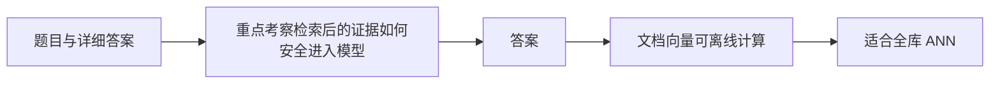

# 面试题（06） - Rerank、生成、引用与评测（第 41～50 题）

> 读完后，你应能：
> - 能验证“重点考察检索后的证据如何安全进入模型，以及如何把“答案好不好”拆成可测指标”，并保存输入、输出与失败样本。
> - 能验证“答案： Bi-Encoder 分别编码 Query 和文档，文档向量可离线计算，适合全库 ANN”，并保存输入、输出与失败样本。
> - 能验证“Cross-Encoder 同时读取 Query-文档对，交互更充分，通常相关性更准，但每个候选都要推理”，并保存输入、输出与失败样本。


> 重点考察检索后的证据如何安全进入模型，以及如何把“答案好不好”拆成可测指标。

<!-- article-progressive-block:start -->
# 一、先建立全局：Rerank、生成、引用与评测（第 41～50 题） 是什么？

理解“Rerank、生成、引用与评测（第 41～50 题）”，先要把标题中的对象放进同一条处理链：它接收什么输入，经过哪些状态变化，最终用什么证据判断结果。下表不另造概念，只把作者正文已经解释的章节按依赖顺序连起来。

“Rerank、生成、引用与评测（第 41～50 题）”的第一个核心判断是：典型漏斗是 Bi-Encoder 召回几十到上百条，再用 Cross-Encoder 精排。。先弄清这个判断中的对象和输入输出，后面的实现、故障和验收才有共同语境。

| 顺序 | 章节 | 读完本节应抓住的结论 |
| --- | --- | --- |
| 1 | 题目与详细答案 | 典型漏斗是 Bi-Encoder 召回几十到上百条，再用 Cross-Encoder 精排。 |
| 2 | 重点考察检索后的证据如何安全进入模型 | 重点考察检索后的证据如何安全进入模型，以及如何把“答案好不好”拆成可测指标。 |
| 3 | 答案 | 答案： Bi-Encoder 分别编码 Query 和文档， |
| 4 | 文档向量可离线计算 | 文档向量可离线计算， |
| 5 | 适合全库 ANN | 适合全库 ANN； |
| 6 | Cross-Encoder 同时读取 Query-文档对 | Cross-Encoder 同时读取 Query-文档对， |

## 1.1 核心对象之间怎样衔接



这张图只表达本文的讲解顺序，不替代正文机制。判断“Rerank、生成、引用与评测（第 41～50 题）”是否真正掌握，需要能从最后一个结果沿图回到前面每个章节的输入、状态变化和证据。

## 1.2 再看失败：问题最早会出现在哪一步？

在“Rerank、生成、引用与评测（第 41～50 题）”的对象和顺序已经明确后，再看可观察的失败：漏召回、排序丢失、引用断链或越权命中。定位时不从最后一条错误猜原因，而是沿上图找第一个偏离正文结论的节点。
<!-- article-progressive-block:end -->

# 二、题目与详细答案

## 2.1 第41题：Bi-Encoder 和 Cross-Encoder 有什么区别？

**答案：** Bi-Encoder 分别编码 Query 和文档，
文档向量可离线计算，
适合全库 ANN；
Cross-Encoder 同时读取 Query-文档对，
交互更充分，
通常相关性更准，
但每个候选都要推理。
典型漏斗是 Bi-Encoder 召回几十到上百条，再用 Cross-Encoder 精排。
比较时同时看 Recall、nDCG、吞吐、P95 和候选长度截断。

## 2.2 第42题：Context Packing 需要解决什么？

**答案：** 它不是简单拼接 Top N，
而是在 Token 预算内选择覆盖问题的最小证据集。
要合并相邻父子块、去除重复、限制单一来源占比、保留标题和引用 ID、处理冲突与时效，
并避免在句中硬截断。
可按 Rerank 分数与边际新信息选择；
多子问题还要保证每个子问题都有证据。

## 2.3 第43题：如何防止模型编造引用？

**答案：** 给每条证据分配程序生成的稳定 ID，
要求模型结构化返回允许列表中的 ID，
生成后验证所有引用都属于本次 Context。
引用展示再由应用查询真实来源、页码和片段，不能让模型自由书写 URL。
还要检查关键结论是否有引用覆盖，以及引用片段是否真正支持结论，而不只是 ID 合法。

## 2.4 第44题：如何评估回答忠实度？

**答案：** 把答案拆成原子陈述，逐条判断能否由提供证据蕴含；
可用人工标注、规则和 LLM-as-judge 组合。
Judge 要固定 Prompt/版本、提供明确评分标准，并用人工样本校准偏差。
高风险数值、日期和实体最好用程序比对。
忠实不等于正确：证据本身过期时，答案可能忠实但仍不符合现实。

## 2.5 第45题：Recall@K、MRR、nDCG 分别衡量什么？

**答案：** Recall@K 看 K 个候选是否覆盖正确证据，适合召回层；
MRR 关注第一个正确结果排名的倒数，强调尽快出现；
nDCG 支持多级相关性并对靠前结果给更高权重，适合 Rerank。
指标前提是有可靠标注和稳定 Chunk ID。
最终回答评分不能替代这些检索指标。

## 2.6 第46题：如何构建 RAG 评测集？

**答案：** 从真实日志、专家问题和线上坏案例抽取，
保存问题、正确 Chunk、答案要点、不可回答条件、权限身份和标签。
覆盖精确词、同义改写、多跳、表格、冲突、过期、越权与 Prompt Injection。
划分开发集和保留测试集，避免针对测试集过拟合。
每个修复追加回归样本，但先确认标注不是错误。

## 2.7 第47题：LLM-as-judge 有哪些风险？

**答案：** Judge 可能偏好更长、更流畅或与自身表达相似的答案，
也会受位置、提示和模型升级影响。
缓解方法包括明确 Rubric、随机答案顺序、多 Judge/人工抽检、输出理由与证据、对已知正负样本校准，
并版本化 Judge。
它适合规模化辅助评测，不应独自决定高风险上线。

## 2.8 第48题：如何评估拒答能力？

**答案：** 评测集同时包含“证据不足必须拒答”和“证据充分必须回答”两类。
计算不足场景的正确拒答率、充分场景的误拒率，并按问题类型校准阈值。
还要观察拒答是否给出合理追问或可用来源。
只追求高拒答率会得到一个永远说不知道但毫无价值的系统。

## 2.9 第49题：Query Rewrite 有什么作用和风险？

**答案：** 它可补全省略、解析多轮指代、扩展同义词和拆解子问题，提高召回。
但改写可能删掉错误码、否定和用户限定，或引入不存在实体。
应同时保留原 Query，精确路可用原文，语义路用改写；
记录改写结果并评测“改写后 Recall 增益”和实体保真率。
低置信时不要覆盖原问题。

## 2.10 第50题：RAG A/B 测试应关注什么？

**答案：** 除任务成功率和用户反馈，
还要看拒答、升级人工、引用点击、P95、Token、成本和安全事件。
实验随机化应按用户或会话避免版本串扰，索引/模型/Prompt 版本要完整记录。
先通过离线门槛和影子流量，再小流量上线；
显著性之外还要看坏案例类型是否发生危险回归。

<!-- article-progressive-block:start -->
# 三、动手验证：先跑通 Rerank、生成、引用与评测（第 41～50 题），再改变一个变量

前面的章节已经建立问题、概念和机制。现在把“Rerank、生成、引用与评测（第 41～50 题）”放进同一套基线中运行；本节不再引入新术语，只验证前文结论能否被复现。

## 3.1 基线与候选只允许一个变量不同

验证“Rerank、生成、引用与评测（第 41～50 题）”时，先固定查询集、语料快照、权限身份、相关性标注。候选方案只能改变本次要验证的变量；如果同时更换数据、依赖和配置，即使结果改善，也不能知道是哪一项产生作用。

执行“Rerank、生成、引用与评测（第 41～50 题）”时，动作是：离线回放检索，保存候选、过滤、排序和引用。原始结果不能只保留截图或汇总分数，必须同步保存：Recall@K、NDCG、引用命中率、无答案误答率、Trace，使下一次复查可以在同一输入上重放。

| 实验要素 | 本文要求 |
| --- | --- |
| 固定条件 | 查询集、语料快照、权限身份、相关性标注 |
| 唯一变量 | 本次候选方案与基线之间的一项明确差异 |
| 原始证据 | Recall@K、NDCG、引用命中率、无答案误答率、Trace |
| 通过阈值 | 证据可回链，指标达基线，权限过滤无泄漏 |
| 立即停止 | 漏召回、排序丢失、引用断链或越权命中 |

## 3.2 执行前先排除不可比较条件

“Rerank、生成、引用与评测（第 41～50 题）”开始前先确认下面四项；任一项不成立，都应先修复实验条件，而不是解释结果。

- 基线能够在“Rerank、生成、引用与评测（第 41～50 题）”的当前环境重复运行。
- 候选只改变一个与“Rerank、生成、引用与评测（第 41～50 题）”结论直接相关的条件。
- “Rerank、生成、引用与评测（第 41～50 题）”的基线和候选使用同一批输入、同一版本依赖与同一通过阈值。
- “Rerank、生成、引用与评测（第 41～50 题）”的原始输出和失败现场不会被重试、格式化或汇总覆盖。

## 3.3 执行后先核对证据完整性

结果出来后先检查证据，再讨论“Rerank、生成、引用与评测（第 41～50 题）”是否通过。缺少中间状态时，最终输出只能说明现象，不能证明机制。

| 检查项 | 当前文章的判定 |
| --- | --- |
| 输入可追溯 | 查询集、语料快照、权限身份、相关性标注 |
| 过程可回放 | 离线回放检索，保存候选、过滤、排序和引用 |
| 结果可审计 | Recall@K、NDCG、引用命中率、无答案误答率、Trace |

“Rerank、生成、引用与评测（第 41～50 题）”的一次合格基线对照按以下顺序执行：

1. 保存“Rerank、生成、引用与评测（第 41～50 题）”基线版本及输入摘要，确认基线本身可以重复运行。
2. 写下“Rerank、生成、引用与评测（第 41～50 题）”候选方案唯一变化的变量，以及它预期影响的指标。
3. 在同一环境执行“Rerank、生成、引用与评测（第 41～50 题）”：离线回放检索，保存候选、过滤、排序和引用。
4. 为“Rerank、生成、引用与评测（第 41～50 题）”保存：Recall@K、NDCG、引用命中率、无答案误答率、Trace。
5. 使用“Rerank、生成、引用与评测（第 41～50 题）”预登记条件判断：证据可回链，指标达基线，权限过滤无泄漏。
6. 如果“Rerank、生成、引用与评测（第 41～50 题）”未通过，不修改第二个变量，先恢复基线并保留失败现场。

# 四、用一张矩阵验证 Rerank、生成、引用与评测（第 41～50 题） 的关键结论

矩阵按正文顺序列出“Rerank、生成、引用与评测（第 41～50 题）”的结论。一次实验只选择一行，只改变这一行对应的条件；不要把多行合并成一个无法归因的大实验。

| 正文章节 | 已解释的结论 | 本轮唯一变量 | 必须保存的证据 |
| --- | --- | --- | --- |
| 题目与详细答案 | 典型漏斗是 Bi-Encoder 召回几十到上百条，再用 Cross-Encoder 精排。 | 只改变与“题目与详细答案”相关的条件 | Recall@K、NDCG、引用命中率、无答案误答率、Trace |
| 重点考察检索后的证据如何安全进入模型 | 重点考察检索后的证据如何安全进入模型，以及如何把“答案好不好”拆成可测指标。 | 只改变与“重点考察检索后的证据如何安全进入模型”相关的条件 | Recall@K、NDCG、引用命中率、无答案误答率、Trace |
| 答案 | 答案： Bi-Encoder 分别编码 Query 和文档， | 只改变与“答案”相关的条件 | Recall@K、NDCG、引用命中率、无答案误答率、Trace |
| 文档向量可离线计算 | 文档向量可离线计算， | 只改变与“文档向量可离线计算”相关的条件 | Recall@K、NDCG、引用命中率、无答案误答率、Trace |
| 适合全库 ANN | 适合全库 ANN； | 只改变与“适合全库 ANN”相关的条件 | Recall@K、NDCG、引用命中率、无答案误答率、Trace |
| Cross-Encoder 同时读取 Query-文档对 | Cross-Encoder 同时读取 Query-文档对， | 只改变与“Cross-Encoder 同时读取 Query-文档对”相关的条件 | Recall@K、NDCG、引用命中率、无答案误答率、Trace |

## 4.1 记录本次实际实验

下面的记录用于“Rerank、生成、引用与评测（第 41～50 题）”当前这一次实验，不是第二套知识目录。先从矩阵选择一个章节，再填写实际值；没有填写的字段表示尚未验证。

```yaml
topic: "Rerank、生成、引用与评测（第 41～50 题）"
selected_chapter: required
claim_from_article: required
baseline_version: required
changed_condition: exactly_one
execution: "离线回放检索，保存候选、过滤、排序和引用"
evidence: "Recall@K、NDCG、引用命中率、无答案误答率、Trace"
pass_when: "证据可回链，指标达基线，权限过滤无泄漏"
stop_when: "漏召回、排序丢失、引用断链或越权命中"
observed_result: required
first_deviation: null_or_evidence
recovery_replay: required_after_failure
```

## 4.2 边界实验必须证明能够停止和恢复

成功路径只能证明“Rerank、生成、引用与评测（第 41～50 题）”在当前样本上工作，不能证明它可以进入生产。边界实验需要主动制造：漏召回、排序丢失、引用断链或越权命中，并观察系统是否在产生不可逆副作用前停止。

| 场景 | 只改变什么 | 应保存什么 | 通过标准 |
| --- | --- | --- | --- |
| 正常路径 | 使用已知有效输入 | Recall@K、NDCG、引用命中率、无答案误答率、Trace | 证据可回链，指标达基线，权限过滤无泄漏 |
| 边界路径 | 把一个输入推进到约束临界值 | 临界值前后的输出与指标 | 不静默降级，不把部分结果冒充成功 |
| 明确失败 | 注入：漏召回、排序丢失、引用断链或越权命中 | 原始错误、首个异常阶段和最终状态 | 失败被正确分类且没有扩大副作用 |
| 恢复重放 | 执行：定位解析、召回、过滤、排序或生成阶段，回滚对应版本 | 原失败样本的复测证据 | 原样本恢复，正常样本没有回归 |

恢复动作不是简单重启。对于“Rerank、生成、引用与评测（第 41～50 题）”，第一步是：定位解析、召回、过滤、排序或生成阶段，回滚对应版本。完成后使用原始失败样本复测；只验证一个新样本成功，不能证明触发条件已经消失。

“Rerank、生成、引用与评测（第 41～50 题）”边界实验结束后，应把正常、临界、失败和恢复四类记录放在同一个运行批次中。这样才能区分“候选方案真的修复问题”和“环境变化让问题暂时没有出现”。

# 五、Rerank、生成、引用与评测（第 41～50 题） 的结果解释

解释“Rerank、生成、引用与评测（第 41～50 题）”实验时先看首个偏差，而不是最后一条错误。最后的异常通常只是上游状态错误的结果；从末端反推容易误把症状当根因。

| 观察结果 | 可以支持的判断 | 下一步 |
| --- | --- | --- |
| 主链路没有达到预期 | 漏召回、排序丢失、引用断链或越权命中 | 先执行：定位解析、召回、过滤、排序或生成阶段，回滚对应版本 |
| 异常链路无法恢复 | 漏召回、排序丢失、引用断链或越权命中 | 先执行：定位解析、召回、过滤、排序或生成阶段，回滚对应版本 |
| 新样本成功但原样本仍失败 | 修复没有覆盖原始触发条件 | 固定原失败输入，恢复基线后重新比较 |
| 指标改善但证据无法回链 | 数据、版本或中间状态没有固定 | 暂停发布，补齐可追溯记录后重跑 |

“Rerank、生成、引用与评测（第 41～50 题）”只有同时满足“证据可回链，指标达基线，权限过滤无泄漏”，并且没有出现“漏召回、排序丢失、引用断链或越权命中”，才可以认为主链路通过。这里的“通过”只对当前固定版本、样本和环境有效，不能外推到尚未测试的容量、权限或数据分布。

如果“Rerank、生成、引用与评测（第 41～50 题）”候选方案与基线差异很小，先检查证据分辨率是否足够；如果差异很大，先排除数据泄漏、环境漂移和版本不一致。两种情况都不能只看一个汇总均值，需要回到逐样本输出和中间状态。

“Rerank、生成、引用与评测（第 41～50 题）”故障定位完成后，记录“现象、首个偏差、根因、改动、原样本复测”五项。缺少原样本复测时，只能标记为待观察，不能标记为已解决。

# 六、Rerank、生成、引用与评测（第 41～50 题） 的发布判断

发布判断需要把“Rerank、生成、引用与评测（第 41～50 题）”的质量、失败边界和恢复能力放在同一份记录中。以下任一条件缺失，都应停止扩量，而不是用“基本正常”替代证据。

- [ ] “Rerank、生成、引用与评测（第 41～50 题）”的基线与候选只存在一个计划内变量。
- [ ] “Rerank、生成、引用与评测（第 41～50 题）”的输入、代码、依赖、配置和数据版本可以追溯。
- [ ] “Rerank、生成、引用与评测（第 41～50 题）”的正常、临界、失败和恢复样本使用同一套断言。
- [ ] “Rerank、生成、引用与评测（第 41～50 题）”的原始输出、中间状态和失败现场已经保留。
- [ ] “Rerank、生成、引用与评测（第 41～50 题）”的日志、Trace、截图和测试数据已经脱敏。
- [ ] “Rerank、生成、引用与评测（第 41～50 题）”的停止条件、负责人和回滚入口已经演练。
- [ ] “Rerank、生成、引用与评测（第 41～50 题）”尚未覆盖的输入、权限、容量和外部依赖已经登记。

最终记录至少包含基线版本、唯一变量、原始证据、首个偏差、恢复复测和发布责任人。没有参与本次修改的人如果不能据此重放“Rerank、生成、引用与评测（第 41～50 题）”的判断，就不能发布。
<!-- article-progressive-block:end -->

# 七、总结

- **题目与详细答案**：答案： Bi-Encoder 分别编码 Query 和文档，文档向量可离线计算，适合全库 ANN；
- **第41题：Bi-Encoder 和 Cross-Encoder 有什么区别？**：答案： Bi-Encoder 分别编码 Query 和文档，文档向量可离线计算，适合全库 ANN；
- **第42题：Context Packing 需要解决什么？**：答案： 它不是简单拼接 Top N，而是在 Token 预算内选择覆盖问题的最小证据集。
- **第43题：如何防止模型编造引用？**：答案： 给每条证据分配程序生成的稳定 ID，要求模型结构化返回允许列表中的 ID，生成后验证所有引用都属于本次 Context。
- **第44题：如何评估回答忠实度？**：高风险数值、日期和实体最好用程序比对。
- **第45题：Recall@K、MRR、nDCG 分别衡量什么？**：答案： Recall@K 看 K 个候选是否覆盖正确证据，适合召回层；

## 参考资料

- [LangSmith Evaluation](https://docs.langchain.com/langsmith/evaluation-approaches)
- [Milvus 官方文档：Rerankers](https://github.com/milvus-io/milvus-docs/blob/v3.0.x/site/en/rerankers/rerankers-overview.md)

## 参考资料

- [OpenAI Cookbook](https://cookbook.openai.com/)
- [LangChain 文档](https://docs.langchain.com/)
