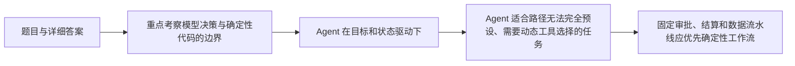

# 面试题（08） - Agent、工具调用与工作流（第 61～70 题）

> 读完后，你应能：
> - 能验证“重点考察模型决策与确定性代码的边界，以及工具副作用如何被约束”，并保存输入、输出与失败样本。
> - 能验证“答案： 普通调用通常是固定输入到输出”，并保存输入、输出与失败样本。
> - 能验证“Agent 在目标和状态驱动下，由模型选择工具或下一步，多轮观察结果直到结束”，并保存输入、输出与失败样本。


> 重点考察模型决策与确定性代码的边界，以及工具副作用如何被约束。

<!-- article-progressive-block:start -->
# 一、先建立全局：Agent、工具调用与工作流（第 61～70 题） 是什么？

理解“Agent、工具调用与工作流（第 61～70 题）”，先要把标题中的对象放进同一条处理链：它接收什么输入，经过哪些状态变化，最终用什么证据判断结果。下表不另造概念，只把作者正文已经解释的章节按依赖顺序连起来。

“Agent、工具调用与工作流（第 61～70 题）”的第一个核心判断是：答案： 普通调用通常是固定输入到输出；。先弄清这个判断中的对象和输入输出，后面的实现、故障和验收才有共同语境。

| 顺序 | 章节 | 读完本节应抓住的结论 |
| --- | --- | --- |
| 1 | 题目与详细答案 | 答案： 普通调用通常是固定输入到输出； |
| 2 | 重点考察模型决策与确定性代码的边界 | 重点考察模型决策与确定性代码的边界，以及工具副作用如何被约束。 |
| 3 | Agent 在目标和状态驱动下 | Agent 在目标和状态驱动下，由模型选择工具或下一步，多轮观察结果直到结束。 |
| 4 | Agent 适合路径无法完全预设、需要动态工具选择的任务 | Agent 适合路径无法完全预设、需要动态工具选择的任务。 |
| 5 | 固定审批、结算和数据流水线应优先确定性工作流 | 固定审批、结算和数据流水线应优先确定性工作流。 |
| 6 | 模型的灵活性必须由最大步骤、预算、权限和停止条件约束 | 模型的灵活性必须由最大步骤、预算、权限和停止条件约束。 |

## 1.1 核心对象之间怎样衔接



这张图只表达本文的讲解顺序，不替代正文机制。判断“Agent、工具调用与工作流（第 61～70 题）”是否真正掌握，需要能从最后一个结果沿图回到前面每个章节的输入、状态变化和证据。

## 1.2 再看失败：问题最早会出现在哪一步？

在“Agent、工具调用与工作流（第 61～70 题）”的对象和顺序已经明确后，再看可观察的失败：文本直通执行、状态不可重放或重试重复写入。定位时不从最后一条错误猜原因，而是沿上图找第一个偏离正文结论的节点。
<!-- article-progressive-block:end -->

# 二、题目与详细答案

## 2.1 第61题：什么是 Agent，它和普通 LLM 调用有什么区别？

**答案：** 普通调用通常是固定输入到输出；
Agent 在目标和状态驱动下，由模型选择工具或下一步，多轮观察结果直到结束。
Agent 适合路径无法完全预设、需要动态工具选择的任务。
固定审批、结算和数据流水线应优先确定性工作流。
模型的灵活性必须由最大步骤、预算、权限和停止条件约束。

## 2.2 第62题：ReAct 模式是什么？

**答案：** ReAct 让模型在推理决策与行动之间循环：根据当前观察选择工具，
读取结果，
再决定下一步。
生产系统通常不保存或展示自由形式思维链，而是记录可审计的工具选择、参数、观察摘要和最终状态。
它的风险是循环、工具误选和上下文膨胀，因此需要步骤上限、工具 Schema 和失败路由。

## 2.3 第63题：工具 Schema 为什么重要？

**答案：** 清晰名称、用途、参数类型、必填项、枚举和错误语义能显著降低误调用。
Schema 负责结构校验，但不能代替业务授权；
即使 JSON 合法，也可能操作无权限订单。
工具输出也要结构化并限制长度，错误区分可重试、不可重试和需要用户补充。
模糊的“大万能工具”比多个边界清晰的小工具更难控制。

## 2.4 第64题：有副作用的工具怎样保证安全？

**答案：** 采用“模型提议 → Schema 校验 → 权限检查 → 风险/审批 → 幂等执行 → 审计”的链路。
模型不直接持有高权限凭证；
付款、删除、发布等动作要求确认或策略审批。
执行使用业务幂等键，重试前查询结果。
参数中资源 ID 必须再次校验归属，不能信任模型或用户上下文里的描述。

## 2.5 第65题：工具调用如何处理超时和重试？

**答案：** 为每个工具设置连接、读取和总超时，
错误分类后只重试瞬时故障，
采用指数退避和抖动。
非幂等操作不得盲重试；
必须使用幂等键或先查询执行状态。
全局请求有截止时间，子工具超时不能超过剩余预算。
重试次数、最终状态和外部请求 ID 进入 Trace。

## 2.6 第66题：Agent 如何避免无限循环？

**答案：** 同时设置最大步骤、全局时间、Token/费用预算、重复动作检测和显式终止状态。
若连续调用同一工具且输入相同，应停止并报告卡点；
工具错误要路由到恢复、询问用户或失败，而不是原样重试。
状态图比纯 Prompt 更适合表达循环边界。
停止原因要对用户和监控可见。

## 2.7 第67题：什么时候用工作流，什么时候用 Agent？

**答案：** 步骤、分支和合规规则确定时用工作流，例如审批、发布和订单处理；
需要理解自然语言、动态选择资料或工具时用 Agent。
常见最佳方案是混合：代码控制主流程与风险节点，模型只在分类、抽取、规划和生成节点决策。
不要让 Agent 接管本可用 if/SQL 明确实现的逻辑。

## 2.8 第68题：如何管理 Agent 上下文？

**答案：** 只给当前步骤需要的信息：系统规则、目标、裁剪状态、相关工具和证据。
大结果放外部存储，以 ID 和摘要传递；
旧消息截断/总结；
工具描述按需加载。
区分可信系统数据与不可信网页/用户内容，后者不能覆盖规则。
监控每步 Token 和上下文构成，定位膨胀来源。

## 2.9 第69题：Agent 工具结果中的 Prompt Injection 怎么处理？

**答案：** 网页、邮件和文档都是不可信数据，即使其中写“忽略系统提示”。
在 Prompt 中用明确边界包裹，工具输出做类型、长度和敏感字段过滤；
不从资料动态生成工具权限。
有副作用动作仍需独立授权。
还要建立恶意文档评测，检查模型是否泄密、越权或执行隐藏指令。

## 2.10 第70题：如何评估 Agent？

**答案：** 任务级看成功率、人工接管和最终事实正确；
轨迹级看路由、工具选择、参数、步骤数、循环和恢复；
系统级看 P95、Token、费用和安全事件。
固定任务集包含成功、缺参数、工具失败、越权、注入和不可完成场景。
评测最终答案而不看轨迹，会漏掉“结果偶然正确但执行危险”的问题。

<!-- article-progressive-block:start -->
# 三、动手验证：先跑通 Agent、工具调用与工作流（第 61～70 题），再改变一个变量

前面的章节已经建立问题、概念和机制。现在把“Agent、工具调用与工作流（第 61～70 题）”放进同一套基线中运行；本节不再引入新术语，只验证前文结论能否被复现。

## 3.1 基线与候选只允许一个变量不同

验证“Agent、工具调用与工作流（第 61～70 题）”时，先固定工具 Schema、身份、畸形参数、超时和重复请求。候选方案只能改变本次要验证的变量；如果同时更换数据、依赖和配置，即使结果改善，也不能知道是哪一项产生作用。

执行“Agent、工具调用与工作流（第 61～70 题）”时，动作是：回放决策到执行链路，覆盖失败、重试、暂停和恢复。原始结果不能只保留截图或汇总分数，必须同步保存：模型提议、校验、授权、幂等键、状态迁移、Trace，使下一次复查可以在同一输入上重放。

| 实验要素 | 本文要求 |
| --- | --- |
| 固定条件 | 工具 Schema、身份、畸形参数、超时和重复请求 |
| 唯一变量 | 本次候选方案与基线之间的一项明确差异 |
| 原始证据 | 模型提议、校验、授权、幂等键、状态迁移、Trace |
| 通过阈值 | 模型只提议；执行受代码约束；失败不重复副作用 |
| 立即停止 | 文本直通执行、状态不可重放或重试重复写入 |

## 3.2 执行前先排除不可比较条件

“Agent、工具调用与工作流（第 61～70 题）”开始前先确认下面四项；任一项不成立，都应先修复实验条件，而不是解释结果。

- 基线能够在“Agent、工具调用与工作流（第 61～70 题）”的当前环境重复运行。
- 候选只改变一个与“Agent、工具调用与工作流（第 61～70 题）”结论直接相关的条件。
- “Agent、工具调用与工作流（第 61～70 题）”的基线和候选使用同一批输入、同一版本依赖与同一通过阈值。
- “Agent、工具调用与工作流（第 61～70 题）”的原始输出和失败现场不会被重试、格式化或汇总覆盖。

## 3.3 执行后先核对证据完整性

结果出来后先检查证据，再讨论“Agent、工具调用与工作流（第 61～70 题）”是否通过。缺少中间状态时，最终输出只能说明现象，不能证明机制。

| 检查项 | 当前文章的判定 |
| --- | --- |
| 输入可追溯 | 工具 Schema、身份、畸形参数、超时和重复请求 |
| 过程可回放 | 回放决策到执行链路，覆盖失败、重试、暂停和恢复 |
| 结果可审计 | 模型提议、校验、授权、幂等键、状态迁移、Trace |

“Agent、工具调用与工作流（第 61～70 题）”的一次合格基线对照按以下顺序执行：

1. 保存“Agent、工具调用与工作流（第 61～70 题）”基线版本及输入摘要，确认基线本身可以重复运行。
2. 写下“Agent、工具调用与工作流（第 61～70 题）”候选方案唯一变化的变量，以及它预期影响的指标。
3. 在同一环境执行“Agent、工具调用与工作流（第 61～70 题）”：回放决策到执行链路，覆盖失败、重试、暂停和恢复。
4. 为“Agent、工具调用与工作流（第 61～70 题）”保存：模型提议、校验、授权、幂等键、状态迁移、Trace。
5. 使用“Agent、工具调用与工作流（第 61～70 题）”预登记条件判断：模型只提议；执行受代码约束；失败不重复副作用。
6. 如果“Agent、工具调用与工作流（第 61～70 题）”未通过，不修改第二个变量，先恢复基线并保留失败现场。

# 四、用一张矩阵验证 Agent、工具调用与工作流（第 61～70 题） 的关键结论

矩阵按正文顺序列出“Agent、工具调用与工作流（第 61～70 题）”的结论。一次实验只选择一行，只改变这一行对应的条件；不要把多行合并成一个无法归因的大实验。

| 正文章节 | 已解释的结论 | 本轮唯一变量 | 必须保存的证据 |
| --- | --- | --- | --- |
| 题目与详细答案 | 答案： 普通调用通常是固定输入到输出； | 只改变与“题目与详细答案”相关的条件 | 模型提议、校验、授权、幂等键、状态迁移、Trace |
| 重点考察模型决策与确定性代码的边界 | 重点考察模型决策与确定性代码的边界，以及工具副作用如何被约束。 | 只改变与“重点考察模型决策与确定性代码的边界”相关的条件 | 模型提议、校验、授权、幂等键、状态迁移、Trace |
| Agent 在目标和状态驱动下 | Agent 在目标和状态驱动下，由模型选择工具或下一步，多轮观察结果直到结束。 | 只改变与“Agent 在目标和状态驱动下”相关的条件 | 模型提议、校验、授权、幂等键、状态迁移、Trace |
| Agent 适合路径无法完全预设、需要动态工具选择的任务 | Agent 适合路径无法完全预设、需要动态工具选择的任务。 | 只改变与“Agent 适合路径无法完全预设、需要动态工具选择的任务”相关的条件 | 模型提议、校验、授权、幂等键、状态迁移、Trace |
| 固定审批、结算和数据流水线应优先确定性工作流 | 固定审批、结算和数据流水线应优先确定性工作流。 | 只改变与“固定审批、结算和数据流水线应优先确定性工作流”相关的条件 | 模型提议、校验、授权、幂等键、状态迁移、Trace |
| 模型的灵活性必须由最大步骤、预算、权限和停止条件约束 | 模型的灵活性必须由最大步骤、预算、权限和停止条件约束。 | 只改变与“模型的灵活性必须由最大步骤、预算、权限和停止条件约束”相关的条件 | 模型提议、校验、授权、幂等键、状态迁移、Trace |

## 4.1 记录本次实际实验

下面的记录用于“Agent、工具调用与工作流（第 61～70 题）”当前这一次实验，不是第二套知识目录。先从矩阵选择一个章节，再填写实际值；没有填写的字段表示尚未验证。

```yaml
topic: "Agent、工具调用与工作流（第 61～70 题）"
selected_chapter: required
claim_from_article: required
baseline_version: required
changed_condition: exactly_one
execution: "回放决策到执行链路，覆盖失败、重试、暂停和恢复"
evidence: "模型提议、校验、授权、幂等键、状态迁移、Trace"
pass_when: "模型只提议；执行受代码约束；失败不重复副作用"
stop_when: "文本直通执行、状态不可重放或重试重复写入"
observed_result: required
first_deviation: null_or_evidence
recovery_replay: required_after_failure
```

## 4.2 边界实验必须证明能够停止和恢复

成功路径只能证明“Agent、工具调用与工作流（第 61～70 题）”在当前样本上工作，不能证明它可以进入生产。边界实验需要主动制造：文本直通执行、状态不可重放或重试重复写入，并观察系统是否在产生不可逆副作用前停止。

| 场景 | 只改变什么 | 应保存什么 | 通过标准 |
| --- | --- | --- | --- |
| 正常路径 | 使用已知有效输入 | 模型提议、校验、授权、幂等键、状态迁移、Trace | 模型只提议；执行受代码约束；失败不重复副作用 |
| 边界路径 | 把一个输入推进到约束临界值 | 临界值前后的输出与指标 | 不静默降级，不把部分结果冒充成功 |
| 明确失败 | 注入：文本直通执行、状态不可重放或重试重复写入 | 原始错误、首个异常阶段和最终状态 | 失败被正确分类且没有扩大副作用 |
| 恢复重放 | 执行：关闭副作用入口，恢复检查点，补充失败契约测试 | 原失败样本的复测证据 | 原样本恢复，正常样本没有回归 |

恢复动作不是简单重启。对于“Agent、工具调用与工作流（第 61～70 题）”，第一步是：关闭副作用入口，恢复检查点，补充失败契约测试。完成后使用原始失败样本复测；只验证一个新样本成功，不能证明触发条件已经消失。

“Agent、工具调用与工作流（第 61～70 题）”边界实验结束后，应把正常、临界、失败和恢复四类记录放在同一个运行批次中。这样才能区分“候选方案真的修复问题”和“环境变化让问题暂时没有出现”。

# 五、Agent、工具调用与工作流（第 61～70 题） 的结果解释

解释“Agent、工具调用与工作流（第 61～70 题）”实验时先看首个偏差，而不是最后一条错误。最后的异常通常只是上游状态错误的结果；从末端反推容易误把症状当根因。

| 观察结果 | 可以支持的判断 | 下一步 |
| --- | --- | --- |
| 主链路没有达到预期 | 文本直通执行、状态不可重放或重试重复写入 | 先执行：关闭副作用入口，恢复检查点，补充失败契约测试 |
| 异常链路无法恢复 | 文本直通执行、状态不可重放或重试重复写入 | 先执行：关闭副作用入口，恢复检查点，补充失败契约测试 |
| 新样本成功但原样本仍失败 | 修复没有覆盖原始触发条件 | 固定原失败输入，恢复基线后重新比较 |
| 指标改善但证据无法回链 | 数据、版本或中间状态没有固定 | 暂停发布，补齐可追溯记录后重跑 |

“Agent、工具调用与工作流（第 61～70 题）”只有同时满足“模型只提议；执行受代码约束；失败不重复副作用”，并且没有出现“文本直通执行、状态不可重放或重试重复写入”，才可以认为主链路通过。这里的“通过”只对当前固定版本、样本和环境有效，不能外推到尚未测试的容量、权限或数据分布。

如果“Agent、工具调用与工作流（第 61～70 题）”候选方案与基线差异很小，先检查证据分辨率是否足够；如果差异很大，先排除数据泄漏、环境漂移和版本不一致。两种情况都不能只看一个汇总均值，需要回到逐样本输出和中间状态。

“Agent、工具调用与工作流（第 61～70 题）”故障定位完成后，记录“现象、首个偏差、根因、改动、原样本复测”五项。缺少原样本复测时，只能标记为待观察，不能标记为已解决。

# 六、Agent、工具调用与工作流（第 61～70 题） 的发布判断

发布判断需要把“Agent、工具调用与工作流（第 61～70 题）”的质量、失败边界和恢复能力放在同一份记录中。以下任一条件缺失，都应停止扩量，而不是用“基本正常”替代证据。

- [ ] “Agent、工具调用与工作流（第 61～70 题）”的基线与候选只存在一个计划内变量。
- [ ] “Agent、工具调用与工作流（第 61～70 题）”的输入、代码、依赖、配置和数据版本可以追溯。
- [ ] “Agent、工具调用与工作流（第 61～70 题）”的正常、临界、失败和恢复样本使用同一套断言。
- [ ] “Agent、工具调用与工作流（第 61～70 题）”的原始输出、中间状态和失败现场已经保留。
- [ ] “Agent、工具调用与工作流（第 61～70 题）”的日志、Trace、截图和测试数据已经脱敏。
- [ ] “Agent、工具调用与工作流（第 61～70 题）”的停止条件、负责人和回滚入口已经演练。
- [ ] “Agent、工具调用与工作流（第 61～70 题）”尚未覆盖的输入、权限、容量和外部依赖已经登记。

最终记录至少包含基线版本、唯一变量、原始证据、首个偏差、恢复复测和发布责任人。没有参与本次修改的人如果不能据此重放“Agent、工具调用与工作流（第 61～70 题）”的判断，就不能发布。
<!-- article-progressive-block:end -->

# 七、总结

- **题目与详细答案**：答案： 普通调用通常是固定输入到输出；
- **第61题：什么是 Agent，它和普通 LLM 调用有什么区别？**：答案： 普通调用通常是固定输入到输出；
- **第62题：ReAct 模式是什么？**：答案： ReAct 让模型在推理决策与行动之间循环：根据当前观察选择工具，读取结果，再决定下一步。
- **第63题：工具 Schema 为什么重要？**：Schema 负责结构校验，但不能代替业务授权；
- **第64题：有副作用的工具怎样保证安全？**：答案： 采用“模型提议 → Schema 校验 → 权限检查 → 风险/审批 → 幂等执行 → 审计”的链路。
- **第65题：工具调用如何处理超时和重试？**：答案： 为每个工具设置连接、读取和总超时，错误分类后只重试瞬时故障，采用指数退避和抖动。

## 参考资料

- [LangChain Agents](https://docs.langchain.com/oss/python/langchain/agents)
- [LangChain Tools](https://docs.langchain.com/oss/python/langchain/tools)

## 参考资料

- [OpenAI Cookbook](https://cookbook.openai.com/)
- [LangChain 文档](https://docs.langchain.com/)
