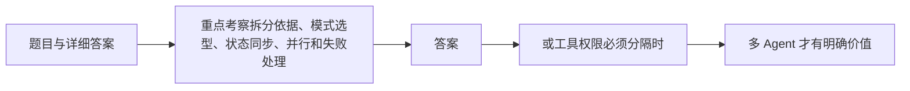

# 面试题（09） - Multi-Agent 与 LangGraph（第 71～80 题）

> 读完后，你应能：
> - 能验证“重点考察拆分依据、模式选型、状态同步、并行和失败处理”，并保存输入、输出与失败样本。
> - 能验证“答案： 当单 Agent 工具过多而持续误选、不同领域上下文庞大需要隔离、子任务可独立并行、能力由不同团队维护，或工具权限必须分隔时，多 Agent 才有明确价值”，并保存输入、输出与失败样本。
> - 能验证“任务复杂不等于需要多个角色”，并保存输入、输出与失败样本。


> 重点考察拆分依据、模式选型、状态同步、并行和失败处理。

<!-- article-progressive-block:start -->
# 一、先建立全局：Multi-Agent 与 LangGraph（第 71～80 题） 是什么？

理解“Multi-Agent 与 LangGraph（第 71～80 题）”，先要把标题中的对象放进同一条处理链：它接收什么输入，经过哪些状态变化，最终用什么证据判断结果。下表不另造概念，只把作者正文已经解释的章节按依赖顺序连起来。

“Multi-Agent 与 LangGraph（第 71～80 题）”的第一个核心判断是：负责路由、传入裁剪上下文并汇总结果；。先弄清这个判断中的对象和输入输出，后面的实现、故障和验收才有共同语境。

| 顺序 | 章节 | 读完本节应抓住的结论 |
| --- | --- | --- |
| 1 | 题目与详细答案 | 负责路由、传入裁剪上下文并汇总结果； |
| 2 | 重点考察拆分依据、模式选型、状态同步、并行和失败处理 | 重点考察拆分依据、模式选型、状态同步、并行和失败处理。 |
| 3 | 答案 | 答案： 当单 Agent 工具过多而持续误选、不同领域上下文庞大需要隔离、子任务可独立并行、能力由不同团队维护， |
| 4 | 或工具权限必须分隔时 | 或工具权限必须分隔时， |
| 5 | 多 Agent 才有明确价值 | 多 Agent 才有明确价值。 |
| 6 | 任务复杂不等于需要多个角色 | 任务复杂不等于需要多个角色。 |

## 1.1 核心对象之间怎样衔接



这张图只表达本文的讲解顺序，不替代正文机制。判断“Multi-Agent 与 LangGraph（第 71～80 题）”是否真正掌握，需要能从最后一个结果沿图回到前面每个章节的输入、状态变化和证据。

## 1.2 再看失败：问题最早会出现在哪一步？

在“Multi-Agent 与 LangGraph（第 71～80 题）”的对象和顺序已经明确后，再看可观察的失败：文本直通执行、状态不可重放或重试重复写入。定位时不从最后一条错误猜原因，而是沿上图找第一个偏离正文结论的节点。
<!-- article-progressive-block:end -->

# 二、题目与详细答案

## 2.1 第71题：什么情况下真正需要 Multi-Agent？

**答案：** 当单 Agent 工具过多而持续误选、不同领域上下文庞大需要隔离、子任务可独立并行、能力由不同团队维护，
或工具权限必须分隔时，
多 Agent 才有明确价值。
任务复杂不等于需要多个角色。
应先建立单 Agent 基线，再证明多 Agent 提升成功率、上下文效率或并行延迟。

## 2.2 第72题：Subagents 模式如何工作？

**答案：** 主 Agent 把子 Agent 当工具调用，
负责路由、传入裁剪上下文并汇总结果；
子 Agent 通常不直接与用户交互。
它适合集中控制、多跳调用和强上下文隔离，也允许并行子任务。
代价是结果回到主 Agent 会增加调用和 Token，
子 Agent 默认无状态时重复请求不能自动复用上下文。

## 2.3 第73题：Router 模式适合什么？

**答案：** Router 先分类输入，
再分发到一个或多个专家，
适合边界清楚、可一次路由或并行聚合的任务，
如按领域查询多个知识库。
路由器可能是规则、小模型或 LLM。
需要评测路由准确率、低置信保底和并行预算。
连续多跳任务若每次都重新路由，会增加成本并丢状态。

## 2.4 第74题：Handoff 和 Subagent 有什么区别？

**答案：** Subagent 完成子任务后把结果交回主 Agent，控制权始终集中；
Handoff 把当前会话控制权交给另一 Agent，后者可直接继续与用户交互。
Handoff 适合客服阶段或专业坐席切换，但要明确移交哪些状态、工具和权限，以及如何返回。
控制权模糊会造成两个 Agent 都认为对方负责。

## 2.5 第75题：LangGraph 的 State、Node、Edge 分别是什么？

**答案：** State 是节点共享的结构化数据契约，
Node 执行确定性代码或模型/工具步骤，
Edge 定义下一节点，
条件 Edge 表达分支和循环。
图的价值是把成功、失败、重试、人工审批和停止路径显式化，
并通过 Checkpointer 恢复。
不要把 State 设计为无限增长的全量消息垃圾桶。

## 2.6 第76题：多 Agent 共享状态怎样设计？

**答案：** 只共享任务 ID、结构化中间产物、证据引用、状态和错误；
大正文放对象存储，以 ID 传递。
字段定义所有者和合并规则，列表并发写要去重或使用 reducer。
敏感凭证不进入 State，权限声明按最小化传递。
State Schema 版本化，节点输入输出做校验。

## 2.7 第77题：多 Agent 并行怎样控制？

**答案：** 只并行无依赖子任务，
设置 fan-out 和并发上限、每任务超时/Token、全局截止时间与取消机制。
结果需稳定 Schema，汇总前处理部分失败、重复与冲突。
外部 API 限流和连接池往往是瓶颈，并发数应压测决定。
无限创建 Agent 会把延迟问题变成限流和成本问题。

## 2.8 第78题：多 Agent 如何处理部分失败？

**答案：** 为子任务标注 required/optional。
必需任务失败可重试、换路由、请求用户或整体失败；
可选任务失败可返回部分结果并标记缺口。
汇总器不能把缺失当作空事实。
保存每个子任务状态和错误类型，重复执行使用幂等键；
全局取消时清理仍运行任务。

## 2.9 第79题：怎样避免 Agent 之间互相重复工作？

**答案：** 规划阶段生成带稳定 ID、输入、期望输出和依赖的任务 DAG，调度器原子领取；
共享任务注册表记录 pending/running/done。
相同输入计算幂等哈希，已有结果直接复用。
Agent 只看分配任务和必要上下文，不自行创建同义任务。
最后用证据 ID 去重，而不是只比较文本。

## 2.10 第80题：如何评估 Multi-Agent 架构？

**答案：** 与单 Agent 比较任务成功率、模型调用、总 Token、P95、费用和故障率；
另外看路由准确率、子任务完成率、并行加速比、冲突率和人工接管。
对重复请求、多领域并行、工具故障和权限隔离分别测试。
若质量不升或仅架构更复杂，应回退单 Agent/Skills/确定性工作流。

<!-- article-progressive-block:start -->
# 三、动手验证：先跑通 Multi-Agent 与 LangGraph（第 71～80 题），再改变一个变量

前面的章节已经建立问题、概念和机制。现在把“Multi-Agent 与 LangGraph（第 71～80 题）”放进同一套基线中运行；本节不再引入新术语，只验证前文结论能否被复现。

## 3.1 基线与候选只允许一个变量不同

验证“Multi-Agent 与 LangGraph（第 71～80 题）”时，先固定工具 Schema、身份、畸形参数、超时和重复请求。候选方案只能改变本次要验证的变量；如果同时更换数据、依赖和配置，即使结果改善，也不能知道是哪一项产生作用。

执行“Multi-Agent 与 LangGraph（第 71～80 题）”时，动作是：回放决策到执行链路，覆盖失败、重试、暂停和恢复。原始结果不能只保留截图或汇总分数，必须同步保存：模型提议、校验、授权、幂等键、状态迁移、Trace，使下一次复查可以在同一输入上重放。

| 实验要素 | 本文要求 |
| --- | --- |
| 固定条件 | 工具 Schema、身份、畸形参数、超时和重复请求 |
| 唯一变量 | 本次候选方案与基线之间的一项明确差异 |
| 原始证据 | 模型提议、校验、授权、幂等键、状态迁移、Trace |
| 通过阈值 | 模型只提议；执行受代码约束；失败不重复副作用 |
| 立即停止 | 文本直通执行、状态不可重放或重试重复写入 |

## 3.2 执行前先排除不可比较条件

“Multi-Agent 与 LangGraph（第 71～80 题）”开始前先确认下面四项；任一项不成立，都应先修复实验条件，而不是解释结果。

- 基线能够在“Multi-Agent 与 LangGraph（第 71～80 题）”的当前环境重复运行。
- 候选只改变一个与“Multi-Agent 与 LangGraph（第 71～80 题）”结论直接相关的条件。
- “Multi-Agent 与 LangGraph（第 71～80 题）”的基线和候选使用同一批输入、同一版本依赖与同一通过阈值。
- “Multi-Agent 与 LangGraph（第 71～80 题）”的原始输出和失败现场不会被重试、格式化或汇总覆盖。

## 3.3 执行后先核对证据完整性

结果出来后先检查证据，再讨论“Multi-Agent 与 LangGraph（第 71～80 题）”是否通过。缺少中间状态时，最终输出只能说明现象，不能证明机制。

| 检查项 | 当前文章的判定 |
| --- | --- |
| 输入可追溯 | 工具 Schema、身份、畸形参数、超时和重复请求 |
| 过程可回放 | 回放决策到执行链路，覆盖失败、重试、暂停和恢复 |
| 结果可审计 | 模型提议、校验、授权、幂等键、状态迁移、Trace |

“Multi-Agent 与 LangGraph（第 71～80 题）”的一次合格基线对照按以下顺序执行：

1. 保存“Multi-Agent 与 LangGraph（第 71～80 题）”基线版本及输入摘要，确认基线本身可以重复运行。
2. 写下“Multi-Agent 与 LangGraph（第 71～80 题）”候选方案唯一变化的变量，以及它预期影响的指标。
3. 在同一环境执行“Multi-Agent 与 LangGraph（第 71～80 题）”：回放决策到执行链路，覆盖失败、重试、暂停和恢复。
4. 为“Multi-Agent 与 LangGraph（第 71～80 题）”保存：模型提议、校验、授权、幂等键、状态迁移、Trace。
5. 使用“Multi-Agent 与 LangGraph（第 71～80 题）”预登记条件判断：模型只提议；执行受代码约束；失败不重复副作用。
6. 如果“Multi-Agent 与 LangGraph（第 71～80 题）”未通过，不修改第二个变量，先恢复基线并保留失败现场。

# 四、用一张矩阵验证 Multi-Agent 与 LangGraph（第 71～80 题） 的关键结论

矩阵按正文顺序列出“Multi-Agent 与 LangGraph（第 71～80 题）”的结论。一次实验只选择一行，只改变这一行对应的条件；不要把多行合并成一个无法归因的大实验。

| 正文章节 | 已解释的结论 | 本轮唯一变量 | 必须保存的证据 |
| --- | --- | --- | --- |
| 题目与详细答案 | 负责路由、传入裁剪上下文并汇总结果； | 只改变与“题目与详细答案”相关的条件 | 模型提议、校验、授权、幂等键、状态迁移、Trace |
| 重点考察拆分依据、模式选型、状态同步、并行和失败处理 | 重点考察拆分依据、模式选型、状态同步、并行和失败处理。 | 只改变与“重点考察拆分依据、模式选型、状态同步、并行和失败处理”相关的条件 | 模型提议、校验、授权、幂等键、状态迁移、Trace |
| 答案 | 答案： 当单 Agent 工具过多而持续误选、不同领域上下文庞大需要隔离、子任务可独立并行、能力由不同团队维护， | 只改变与“答案”相关的条件 | 模型提议、校验、授权、幂等键、状态迁移、Trace |
| 或工具权限必须分隔时 | 或工具权限必须分隔时， | 只改变与“或工具权限必须分隔时”相关的条件 | 模型提议、校验、授权、幂等键、状态迁移、Trace |
| 多 Agent 才有明确价值 | 多 Agent 才有明确价值。 | 只改变与“多 Agent 才有明确价值”相关的条件 | 模型提议、校验、授权、幂等键、状态迁移、Trace |
| 任务复杂不等于需要多个角色 | 任务复杂不等于需要多个角色。 | 只改变与“任务复杂不等于需要多个角色”相关的条件 | 模型提议、校验、授权、幂等键、状态迁移、Trace |

## 4.1 记录本次实际实验

下面的记录用于“Multi-Agent 与 LangGraph（第 71～80 题）”当前这一次实验，不是第二套知识目录。先从矩阵选择一个章节，再填写实际值；没有填写的字段表示尚未验证。

```yaml
topic: "Multi-Agent 与 LangGraph（第 71～80 题）"
selected_chapter: required
claim_from_article: required
baseline_version: required
changed_condition: exactly_one
execution: "回放决策到执行链路，覆盖失败、重试、暂停和恢复"
evidence: "模型提议、校验、授权、幂等键、状态迁移、Trace"
pass_when: "模型只提议；执行受代码约束；失败不重复副作用"
stop_when: "文本直通执行、状态不可重放或重试重复写入"
observed_result: required
first_deviation: null_or_evidence
recovery_replay: required_after_failure
```

## 4.2 边界实验必须证明能够停止和恢复

成功路径只能证明“Multi-Agent 与 LangGraph（第 71～80 题）”在当前样本上工作，不能证明它可以进入生产。边界实验需要主动制造：文本直通执行、状态不可重放或重试重复写入，并观察系统是否在产生不可逆副作用前停止。

| 场景 | 只改变什么 | 应保存什么 | 通过标准 |
| --- | --- | --- | --- |
| 正常路径 | 使用已知有效输入 | 模型提议、校验、授权、幂等键、状态迁移、Trace | 模型只提议；执行受代码约束；失败不重复副作用 |
| 边界路径 | 把一个输入推进到约束临界值 | 临界值前后的输出与指标 | 不静默降级，不把部分结果冒充成功 |
| 明确失败 | 注入：文本直通执行、状态不可重放或重试重复写入 | 原始错误、首个异常阶段和最终状态 | 失败被正确分类且没有扩大副作用 |
| 恢复重放 | 执行：关闭副作用入口，恢复检查点，补充失败契约测试 | 原失败样本的复测证据 | 原样本恢复，正常样本没有回归 |

恢复动作不是简单重启。对于“Multi-Agent 与 LangGraph（第 71～80 题）”，第一步是：关闭副作用入口，恢复检查点，补充失败契约测试。完成后使用原始失败样本复测；只验证一个新样本成功，不能证明触发条件已经消失。

“Multi-Agent 与 LangGraph（第 71～80 题）”边界实验结束后，应把正常、临界、失败和恢复四类记录放在同一个运行批次中。这样才能区分“候选方案真的修复问题”和“环境变化让问题暂时没有出现”。

# 五、Multi-Agent 与 LangGraph（第 71～80 题） 的结果解释

解释“Multi-Agent 与 LangGraph（第 71～80 题）”实验时先看首个偏差，而不是最后一条错误。最后的异常通常只是上游状态错误的结果；从末端反推容易误把症状当根因。

| 观察结果 | 可以支持的判断 | 下一步 |
| --- | --- | --- |
| 主链路没有达到预期 | 文本直通执行、状态不可重放或重试重复写入 | 先执行：关闭副作用入口，恢复检查点，补充失败契约测试 |
| 异常链路无法恢复 | 文本直通执行、状态不可重放或重试重复写入 | 先执行：关闭副作用入口，恢复检查点，补充失败契约测试 |
| 新样本成功但原样本仍失败 | 修复没有覆盖原始触发条件 | 固定原失败输入，恢复基线后重新比较 |
| 指标改善但证据无法回链 | 数据、版本或中间状态没有固定 | 暂停发布，补齐可追溯记录后重跑 |

“Multi-Agent 与 LangGraph（第 71～80 题）”只有同时满足“模型只提议；执行受代码约束；失败不重复副作用”，并且没有出现“文本直通执行、状态不可重放或重试重复写入”，才可以认为主链路通过。这里的“通过”只对当前固定版本、样本和环境有效，不能外推到尚未测试的容量、权限或数据分布。

如果“Multi-Agent 与 LangGraph（第 71～80 题）”候选方案与基线差异很小，先检查证据分辨率是否足够；如果差异很大，先排除数据泄漏、环境漂移和版本不一致。两种情况都不能只看一个汇总均值，需要回到逐样本输出和中间状态。

“Multi-Agent 与 LangGraph（第 71～80 题）”故障定位完成后，记录“现象、首个偏差、根因、改动、原样本复测”五项。缺少原样本复测时，只能标记为待观察，不能标记为已解决。

# 六、Multi-Agent 与 LangGraph（第 71～80 题） 的发布判断

发布判断需要把“Multi-Agent 与 LangGraph（第 71～80 题）”的质量、失败边界和恢复能力放在同一份记录中。以下任一条件缺失，都应停止扩量，而不是用“基本正常”替代证据。

- [ ] “Multi-Agent 与 LangGraph（第 71～80 题）”的基线与候选只存在一个计划内变量。
- [ ] “Multi-Agent 与 LangGraph（第 71～80 题）”的输入、代码、依赖、配置和数据版本可以追溯。
- [ ] “Multi-Agent 与 LangGraph（第 71～80 题）”的正常、临界、失败和恢复样本使用同一套断言。
- [ ] “Multi-Agent 与 LangGraph（第 71～80 题）”的原始输出、中间状态和失败现场已经保留。
- [ ] “Multi-Agent 与 LangGraph（第 71～80 题）”的日志、Trace、截图和测试数据已经脱敏。
- [ ] “Multi-Agent 与 LangGraph（第 71～80 题）”的停止条件、负责人和回滚入口已经演练。
- [ ] “Multi-Agent 与 LangGraph（第 71～80 题）”尚未覆盖的输入、权限、容量和外部依赖已经登记。

最终记录至少包含基线版本、唯一变量、原始证据、首个偏差、恢复复测和发布责任人。没有参与本次修改的人如果不能据此重放“Multi-Agent 与 LangGraph（第 71～80 题）”的判断，就不能发布。
<!-- article-progressive-block:end -->

# 七、总结

- **题目与详细答案**：答案： 当单 Agent 工具过多而持续误选、不同领域上下文庞大需要隔离、子任务可独立并行、能力由不同团队维护，或工具权限必须分隔时，多 Agent 才有明确价值。
- **第71题：什么情况下真正需要 Multi-Agent？**：答案： 当单 Agent 工具过多而持续误选、不同领域上下文庞大需要隔离、子任务可独立并行、能力由不同团队维护，或工具权限必须分隔时，多 Agent 才有明确价值。
- **第72题：Subagents 模式如何工作？**：答案： 主 Agent 把子 Agent 当工具调用，负责路由、传入裁剪上下文并汇总结果；
- **第73题：Router 模式适合什么？**：答案： Router 先分类输入，再分发到一个或多个专家，适合边界清楚、可一次路由或并行聚合的任务，如按领域查询多个知识库。
- **第74题：Handoff 和 Subagent 有什么区别？**：Handoff 适合客服阶段或专业坐席切换，但要明确移交哪些状态、工具和权限，以及如何返回。
- **第75题：LangGraph 的 State、Node、Edge 分别是什么？**：答案： State 是节点共享的结构化数据契约，Node 执行确定性代码或模型/工具步骤，Edge 定义下一节点，条件 Edge 表达分支和循环。

## 参考资料

- [LangChain Multi-agent](https://docs.langchain.com/oss/python/langchain/multi-agent)
- [LangGraph Overview](https://docs.langchain.com/oss/python/langgraph/overview)

## 参考资料

- [OpenAI Cookbook](https://cookbook.openai.com/)
- [LangChain 文档](https://docs.langchain.com/)
