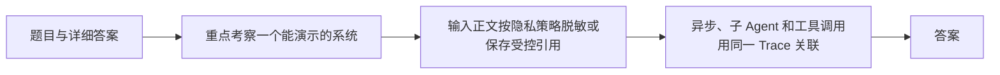

# 面试题（10） - 生产工程、安全与可观测（第 81～90 题）

> 读完后，你应能：
> - 能验证“重点考察一个能演示的系统，如何变成可发布、可回滚、可审计的生产服务”，并保存输入、输出与失败样本。
> - 能验证“答案： 记录 trace/request/thread ID、配置版本、模型与 Prompt、检索 Query、各路候选与耗时、工具调用、结构化输出、校验、Token、费用和错误”，并保存输入、输出与失败样本。
> - 能验证“输入正文按隐私策略脱敏或保存受控引用，绝不能记录 API Key”，并保存输入、输出与失败样本。


> 重点考察一个能演示的系统，如何变成可发布、可回滚、可审计的生产服务。

<!-- article-progressive-block:start -->
# 一、先建立全局：生产工程、安全与可观测（第 81～90 题） 是什么？

理解“生产工程、安全与可观测（第 81～90 题）”，先要把标题中的对象放进同一条处理链：它接收什么输入，经过哪些状态变化，最终用什么证据判断结果。下表不另造概念，只把作者正文已经解释的章节按依赖顺序连起来。

“生产工程、安全与可观测（第 81～90 题）”的第一个核心判断是：答案： 记录 trace/request/thread ID、配置版本、模型与 Prompt、检索 Query、各路候选与耗时、工具调用、结构化输出、校验、Token、费用和错误。。先弄清这个判断中的对象和输入输出，后面的实现、故障和验收才有共同语境。

| 顺序 | 章节 | 读完本节应抓住的结论 |
| --- | --- | --- |
| 1 | 题目与详细答案 | 答案： 记录 trace/request/thread ID、配置版本、模型与 Prompt、检索 Query、各路候选与耗时、工具调用、结构化输出、校验、Token、费用和错误。 |
| 2 | 重点考察一个能演示的系统 | 重点考察一个能演示的系统，如何变成可发布、可回滚、可审计的生产服务。 |
| 3 | 输入正文按隐私策略脱敏或保存受控引用 | 输入正文按隐私策略脱敏或保存受控引用，绝不能记录 API Key。 |
| 4 | 异步、子 Agent 和工具调用用同一 Trace 关联 | 异步、子 Agent 和工具调用用同一 Trace 关联，才能定位延迟与质量问题。 |
| 5 | 答案 | 答案： 先拆 P50/P95：排队、检索、Rerank、首 Token 和生成。 |
| 6 | 独立检索可并行 | 独立检索可并行； |

## 1.1 核心对象之间怎样衔接



这张图只表达本文的讲解顺序，不替代正文机制。判断“生产工程、安全与可观测（第 81～90 题）”是否真正掌握，需要能从最后一个结果沿图回到前面每个章节的输入、状态变化和证据。

## 1.2 再看失败：问题最早会出现在哪一步？

在“生产工程、安全与可观测（第 81～90 题）”的对象和顺序已经明确后，再看可观察的失败：Prompt 代替鉴权、越权执行或日志无法追责。定位时不从最后一条错误猜原因，而是沿上图找第一个偏离正文结论的节点。
<!-- article-progressive-block:end -->

# 二、题目与详细答案

## 2.1 第81题：大模型应用 Trace 应记录什么？

**答案：** 记录 trace/request/thread ID、配置版本、模型与 Prompt、检索 Query、各路候选与耗时、工具调用、结构化输出、校验、Token、费用和错误。
输入正文按隐私策略脱敏或保存受控引用，绝不能记录 API Key。
异步、子 Agent 和工具调用用同一 Trace 关联，才能定位延迟与质量问题。

## 2.2 第82题：如何降低大模型应用延迟？

**答案：** 先拆 P50/P95：排队、检索、Rerank、首 Token 和生成。
独立检索可并行；
减少无关上下文和候选；
使用流式输出改善体感；
对确定且权限/版本一致的结果缓存；
简单路由用小模型或规则；
设置分层超时与降级。
不要只换更快模型，瓶颈可能在串行工具或连接池。

## 2.3 第83题：如何控制 Token 和成本？

**答案：** 按请求记录输入/输出 Token、模型、步骤与租户；
设置上下文、输出、Agent 步数和总费用预算。
用检索和摘要减少历史，工具描述按需加载，简单任务路由小模型，缓存稳定结果。
成本优化必须同时看成功率，截断关键证据导致返工可能更贵。
超预算时要明确降级或请求确认。

## 2.4 第84题：如何设计模型降级和容灾？

**答案：** 按能力定义主备模型与兼容输出 Schema，不只替换名称。
超时/限流时可切备模型，但有副作用请求不能因重试重复执行。
RAG 单路检索故障可降级另一条，证据不足则拒答。
熔断、限流、重试和全局截止时间配合，Trace 记录实际供应商与降级原因。

## 2.5 第85题：Prompt Injection 和 Jailbreak 有什么区别？

**答案：** Jailbreak 通常来自用户，试图绕过模型规则；
Prompt Injection 也可藏在网页、邮件或知识库资料中，
让 Agent 把数据误当指令。
防护核心不是“再写一句不要听”，
而是信任边界：不可信内容隔离、最小工具权限、独立授权、输出校验、敏感数据不进入上下文，
并用攻击集持续测试。

## 2.6 第86题：如何防止 RAG 数据越权？

**答案：** 入口鉴权后把租户/ACL 下推至每路检索，索引字段和分区支持过滤；
缓存键包含权限摘要；
Context 只由授权候选构建。
测试正文、标题、高亮、分数、计数和引用 URL 的侧信道。
删除或撤权后要验证 ES、向量库、缓存和副本传播。
模型不能代替授权逻辑。

## 2.7 第87题：大模型输出如何做结构化校验？

**答案：** 用 JSON Schema/类型模型限制字段、枚举和格式，
解析失败可在预算内修复一次；
随后做业务校验，如 ID 归属、金额范围、引用存在、日期和状态转换。
结构合法不等于业务安全。
有副作用动作仍需权限、审批和幂等。
原始输出和校验错误进入 Trace，但敏感字段要脱敏。

## 2.8 第88题：如何管理 Prompt 版本？

**答案：** Prompt 作为代码或配置进入版本控制，
包含模板 ID、版本、模型兼容和变量 Schema；
发布走离线回归、影子流量和 A/B。
Trace 保存实际版本，允许回放和回滚。
修改系统 Prompt 可能改变工具路由和拒答分布，不能只看几个手工例子。
机密规则不应完整暴露到前端。

## 2.9 第89题：大模型应用缓存最容易出什么问题？

**答案：** 缓存键漏模型、Prompt、知识库、租户或权限版本，导致旧答案和越权复用；
语义缓存还可能把表面相似但约束不同的问题合并。
缓存有 TTL、主动失效、命中审计和敏感数据策略。
工具副作用结果不能按自然语言问题随意缓存。
缓存命中后仍要执行当前权限与引用有效性检查。

## 2.10 第90题：上线大模型应用需要哪些发布门槛？

**答案：** 固定评测集达到质量、拒答和安全阈值；
P95、错误率、成本满足预算；
权限、注入、删除传播和故障降级测试通过；
索引/模型/Prompt 可版本化回滚；
告警、Trace 和人工接管已就绪。
先影子、再小流量、逐步扩展。
远端模型和数据政策还要通过合规审查。

<!-- article-progressive-block:start -->
# 三、动手验证：先跑通 生产工程、安全与可观测（第 81～90 题），再改变一个变量

前面的章节已经建立问题、概念和机制。现在把“生产工程、安全与可观测（第 81～90 题）”放进同一套基线中运行；本节不再引入新术语，只验证前文结论能否被复现。

## 3.1 基线与候选只允许一个变量不同

验证“生产工程、安全与可观测（第 81～90 题）”时，先固定正常样本、越权身份、恶意参数、注入样本、写操作。候选方案只能改变本次要验证的变量；如果同时更换数据、依赖和配置，即使结果改善，也不能知道是哪一项产生作用。

执行“生产工程、安全与可观测（第 81～90 题）”时，动作是：从入口、模型输出和执行层发起对抗测试。原始结果不能只保留截图或汇总分数，必须同步保存：鉴权、参数校验、确认记录、执行日志、审计事件，使下一次复查可以在同一输入上重放。

| 实验要素 | 本文要求 |
| --- | --- |
| 固定条件 | 正常样本、越权身份、恶意参数、注入样本、写操作 |
| 唯一变量 | 本次候选方案与基线之间的一项明确差异 |
| 原始证据 | 鉴权、参数校验、确认记录、执行日志、审计事件 |
| 通过阈值 | 合法请求最小授权；非法请求在副作用前被拒绝 |
| 立即停止 | Prompt 代替鉴权、越权执行或日志无法追责 |

## 3.2 执行前先排除不可比较条件

“生产工程、安全与可观测（第 81～90 题）”开始前先确认下面四项；任一项不成立，都应先修复实验条件，而不是解释结果。

- 基线能够在“生产工程、安全与可观测（第 81～90 题）”的当前环境重复运行。
- 候选只改变一个与“生产工程、安全与可观测（第 81～90 题）”结论直接相关的条件。
- “生产工程、安全与可观测（第 81～90 题）”的基线和候选使用同一批输入、同一版本依赖与同一通过阈值。
- “生产工程、安全与可观测（第 81～90 题）”的原始输出和失败现场不会被重试、格式化或汇总覆盖。

## 3.3 执行后先核对证据完整性

结果出来后先检查证据，再讨论“生产工程、安全与可观测（第 81～90 题）”是否通过。缺少中间状态时，最终输出只能说明现象，不能证明机制。

| 检查项 | 当前文章的判定 |
| --- | --- |
| 输入可追溯 | 正常样本、越权身份、恶意参数、注入样本、写操作 |
| 过程可回放 | 从入口、模型输出和执行层发起对抗测试 |
| 结果可审计 | 鉴权、参数校验、确认记录、执行日志、审计事件 |

“生产工程、安全与可观测（第 81～90 题）”的一次合格基线对照按以下顺序执行：

1. 保存“生产工程、安全与可观测（第 81～90 题）”基线版本及输入摘要，确认基线本身可以重复运行。
2. 写下“生产工程、安全与可观测（第 81～90 题）”候选方案唯一变化的变量，以及它预期影响的指标。
3. 在同一环境执行“生产工程、安全与可观测（第 81～90 题）”：从入口、模型输出和执行层发起对抗测试。
4. 为“生产工程、安全与可观测（第 81～90 题）”保存：鉴权、参数校验、确认记录、执行日志、审计事件。
5. 使用“生产工程、安全与可观测（第 81～90 题）”预登记条件判断：合法请求最小授权；非法请求在副作用前被拒绝。
6. 如果“生产工程、安全与可观测（第 81～90 题）”未通过，不修改第二个变量，先恢复基线并保留失败现场。

# 四、用一张矩阵验证 生产工程、安全与可观测（第 81～90 题） 的关键结论

矩阵按正文顺序列出“生产工程、安全与可观测（第 81～90 题）”的结论。一次实验只选择一行，只改变这一行对应的条件；不要把多行合并成一个无法归因的大实验。

| 正文章节 | 已解释的结论 | 本轮唯一变量 | 必须保存的证据 |
| --- | --- | --- | --- |
| 题目与详细答案 | 答案： 记录 trace/request/thread ID、配置版本、模型与 Prompt、检索 Query、各路候选与耗时、工具调用、结构化输出、校验、Token、费用和错误。 | 只改变与“题目与详细答案”相关的条件 | 鉴权、参数校验、确认记录、执行日志、审计事件 |
| 重点考察一个能演示的系统 | 重点考察一个能演示的系统，如何变成可发布、可回滚、可审计的生产服务。 | 只改变与“重点考察一个能演示的系统”相关的条件 | 鉴权、参数校验、确认记录、执行日志、审计事件 |
| 输入正文按隐私策略脱敏或保存受控引用 | 输入正文按隐私策略脱敏或保存受控引用，绝不能记录 API Key。 | 只改变与“输入正文按隐私策略脱敏或保存受控引用”相关的条件 | 鉴权、参数校验、确认记录、执行日志、审计事件 |
| 异步、子 Agent 和工具调用用同一 Trace 关联 | 异步、子 Agent 和工具调用用同一 Trace 关联，才能定位延迟与质量问题。 | 只改变与“异步、子 Agent 和工具调用用同一 Trace 关联”相关的条件 | 鉴权、参数校验、确认记录、执行日志、审计事件 |
| 答案 | 答案： 先拆 P50/P95：排队、检索、Rerank、首 Token 和生成。 | 只改变与“答案”相关的条件 | 鉴权、参数校验、确认记录、执行日志、审计事件 |
| 独立检索可并行 | 独立检索可并行； | 只改变与“独立检索可并行”相关的条件 | 鉴权、参数校验、确认记录、执行日志、审计事件 |

## 4.1 记录本次实际实验

下面的记录用于“生产工程、安全与可观测（第 81～90 题）”当前这一次实验，不是第二套知识目录。先从矩阵选择一个章节，再填写实际值；没有填写的字段表示尚未验证。

```yaml
topic: "生产工程、安全与可观测（第 81～90 题）"
selected_chapter: required
claim_from_article: required
baseline_version: required
changed_condition: exactly_one
execution: "从入口、模型输出和执行层发起对抗测试"
evidence: "鉴权、参数校验、确认记录、执行日志、审计事件"
pass_when: "合法请求最小授权；非法请求在副作用前被拒绝"
stop_when: "Prompt 代替鉴权、越权执行或日志无法追责"
observed_result: required
first_deviation: null_or_evidence
recovery_replay: required_after_failure
```

## 4.2 边界实验必须证明能够停止和恢复

成功路径只能证明“生产工程、安全与可观测（第 81～90 题）”在当前样本上工作，不能证明它可以进入生产。边界实验需要主动制造：Prompt 代替鉴权、越权执行或日志无法追责，并观察系统是否在产生不可逆副作用前停止。

| 场景 | 只改变什么 | 应保存什么 | 通过标准 |
| --- | --- | --- | --- |
| 正常路径 | 使用已知有效输入 | 鉴权、参数校验、确认记录、执行日志、审计事件 | 合法请求最小授权；非法请求在副作用前被拒绝 |
| 边界路径 | 把一个输入推进到约束临界值 | 临界值前后的输出与指标 | 不静默降级，不把部分结果冒充成功 |
| 明确失败 | 注入：Prompt 代替鉴权、越权执行或日志无法追责 | 原始错误、首个异常阶段和最终状态 | 失败被正确分类且没有扩大副作用 |
| 恢复重放 | 执行：停用写能力，轮换凭据，把攻击样本加入回归集 | 原失败样本的复测证据 | 原样本恢复，正常样本没有回归 |

恢复动作不是简单重启。对于“生产工程、安全与可观测（第 81～90 题）”，第一步是：停用写能力，轮换凭据，把攻击样本加入回归集。完成后使用原始失败样本复测；只验证一个新样本成功，不能证明触发条件已经消失。

“生产工程、安全与可观测（第 81～90 题）”边界实验结束后，应把正常、临界、失败和恢复四类记录放在同一个运行批次中。这样才能区分“候选方案真的修复问题”和“环境变化让问题暂时没有出现”。

# 五、生产工程、安全与可观测（第 81～90 题） 的结果解释

解释“生产工程、安全与可观测（第 81～90 题）”实验时先看首个偏差，而不是最后一条错误。最后的异常通常只是上游状态错误的结果；从末端反推容易误把症状当根因。

| 观察结果 | 可以支持的判断 | 下一步 |
| --- | --- | --- |
| 主链路没有达到预期 | Prompt 代替鉴权、越权执行或日志无法追责 | 先执行：停用写能力，轮换凭据，把攻击样本加入回归集 |
| 异常链路无法恢复 | Prompt 代替鉴权、越权执行或日志无法追责 | 先执行：停用写能力，轮换凭据，把攻击样本加入回归集 |
| 新样本成功但原样本仍失败 | 修复没有覆盖原始触发条件 | 固定原失败输入，恢复基线后重新比较 |
| 指标改善但证据无法回链 | 数据、版本或中间状态没有固定 | 暂停发布，补齐可追溯记录后重跑 |

“生产工程、安全与可观测（第 81～90 题）”只有同时满足“合法请求最小授权；非法请求在副作用前被拒绝”，并且没有出现“Prompt 代替鉴权、越权执行或日志无法追责”，才可以认为主链路通过。这里的“通过”只对当前固定版本、样本和环境有效，不能外推到尚未测试的容量、权限或数据分布。

如果“生产工程、安全与可观测（第 81～90 题）”候选方案与基线差异很小，先检查证据分辨率是否足够；如果差异很大，先排除数据泄漏、环境漂移和版本不一致。两种情况都不能只看一个汇总均值，需要回到逐样本输出和中间状态。

“生产工程、安全与可观测（第 81～90 题）”故障定位完成后，记录“现象、首个偏差、根因、改动、原样本复测”五项。缺少原样本复测时，只能标记为待观察，不能标记为已解决。

# 六、生产工程、安全与可观测（第 81～90 题） 的发布判断

发布判断需要把“生产工程、安全与可观测（第 81～90 题）”的质量、失败边界和恢复能力放在同一份记录中。以下任一条件缺失，都应停止扩量，而不是用“基本正常”替代证据。

- [ ] “生产工程、安全与可观测（第 81～90 题）”的基线与候选只存在一个计划内变量。
- [ ] “生产工程、安全与可观测（第 81～90 题）”的输入、代码、依赖、配置和数据版本可以追溯。
- [ ] “生产工程、安全与可观测（第 81～90 题）”的正常、临界、失败和恢复样本使用同一套断言。
- [ ] “生产工程、安全与可观测（第 81～90 题）”的原始输出、中间状态和失败现场已经保留。
- [ ] “生产工程、安全与可观测（第 81～90 题）”的日志、Trace、截图和测试数据已经脱敏。
- [ ] “生产工程、安全与可观测（第 81～90 题）”的停止条件、负责人和回滚入口已经演练。
- [ ] “生产工程、安全与可观测（第 81～90 题）”尚未覆盖的输入、权限、容量和外部依赖已经登记。

最终记录至少包含基线版本、唯一变量、原始证据、首个偏差、恢复复测和发布责任人。没有参与本次修改的人如果不能据此重放“生产工程、安全与可观测（第 81～90 题）”的判断，就不能发布。
<!-- article-progressive-block:end -->

# 七、总结

- **题目与详细答案**：答案： 记录 trace/request/thread ID、配置版本、模型与 Prompt、检索 Query、各路候选与耗时、工具调用、结构化输出、校验、Token、费用和错误。
- **第81题：大模型应用 Trace 应记录什么？**：答案： 记录 trace/request/thread ID、配置版本、模型与 Prompt、检索 Query、各路候选与耗时、工具调用、结构化输出、校验、Token、费用和错误。
- **第82题：如何降低大模型应用延迟？**：答案： 先拆 P50/P95：排队、检索、Rerank、首 Token 和生成。
- **第83题：如何控制 Token 和成本？**：答案： 按请求记录输入/输出 Token、模型、步骤与租户；
- **第84题：如何设计模型降级和容灾？**：答案： 按能力定义主备模型与兼容输出 Schema，不只替换名称。
- **第85题：Prompt Injection 和 Jailbreak 有什么区别？**：Prompt Injection 也可藏在网页、邮件或知识库资料中，让 Agent 把数据误当指令。

## 参考资料

- [LangSmith Observability](https://docs.langchain.com/langsmith/observability)
- [OWASP Top 10 for LLM Applications](https://genai.owasp.org/llm-top-10/)

## 参考资料

- [OpenAI Cookbook](https://cookbook.openai.com/)
- [LangChain 文档](https://docs.langchain.com/)
