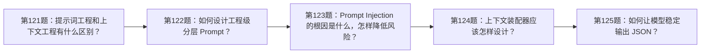
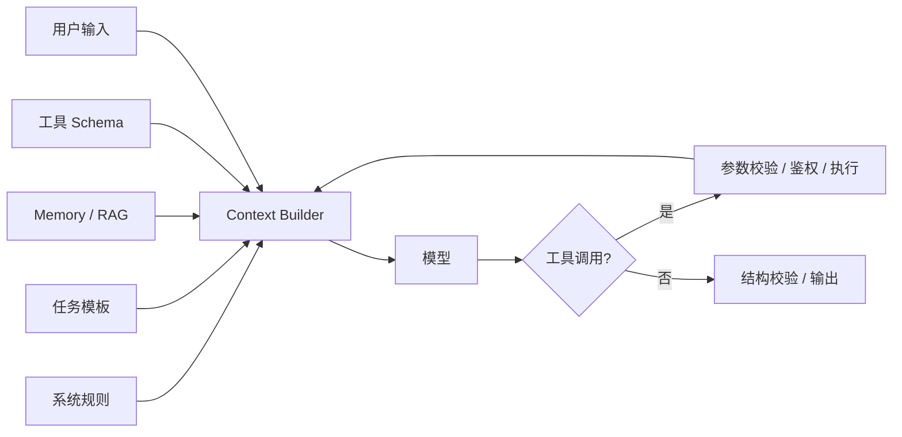

# 面试题（14） - Context、Prompt 与 Harness（第 121～130 题）

> 读完后，你应能：
> - 能验证“Prompt 只是输入的一部分，生产级效果取决于上下文装配、工具执行、状态管理和结果校验组成的 Harness”，并保存输入、输出与失败样本。
> - 能验证“答案： Prompt Engineering 关注指令怎样表达，包括角色、目标、约束、示例和输出格式”，并保存输入、输出与失败样本。
> - 能验证“Context Engineering 关注每次推理到底装入哪些信息，包括系统规则、用户状态、历史、检索证据、工具 Schema、Token 预算和优先级”，并保存输入、输出与失败样本。


> Prompt 只是输入的一部分，生产级效果取决于上下文装配、工具执行、状态管理和结果校验组成的 Harness。

<!-- article-progressive-block:start -->
# 一、先建立全局：Context、Prompt 与 Harness（第 121～130 题） 是什么？

理解“Context、Prompt 与 Harness（第 121～130 题）”，先要把标题中的对象放进同一条处理链：它接收什么输入，经过哪些状态变化，最终用什么证据判断结果。下表不另造概念，只把作者正文已经解释的章节按依赖顺序连起来。

“Context、Prompt 与 Harness（第 121～130 题）”的第一个核心判断是：答案： Prompt Engineering 关注指令怎样表达，。先弄清这个判断中的对象和输入输出，后面的实现、故障和验收才有共同语境。

| 顺序 | 章节 | 读完本节应抓住的结论 |
| --- | --- | --- |
| 1 | 第121题：提示词工程和上下文工程有什么区别？ | 答案： Prompt Engineering 关注指令怎样表达， |
| 2 | 第122题：如何设计工程级分层 Prompt？ | 答案： 建议分为平台安全规则、产品角色与边界、任务模板、动态业务上下文、用户输入、输出契约六层。 |
| 3 | 第123题：Prompt Injection 的根因是什么，怎样降低风险？ | 答案： 根因是模型会同时解释“指令”和“不可信数据”， |
| 4 | 第124题：上下文装配器应该怎样设计？ | 答案： 输入是用户与租户、会话状态、候选证据和可用工具， |
| 5 | 第125题：如何让模型稳定输出 JSON？ | 答案： 优先使用模型支持的 Structured Outputs 或 JSON Schema， |
| 6 | 第126题：Function Calling 的工作原理是什么？ | 模型返回工具调用意图与结构化参数，真正执行工具的是宿主程序； |

## 1.1 核心对象之间怎样衔接



这张图只表达本文的讲解顺序，不替代正文机制。判断“Context、Prompt 与 Harness（第 121～130 题）”是否真正掌握，需要能从最后一个结果沿图回到前面每个章节的输入、状态变化和证据。

## 1.2 再看失败：问题最早会出现在哪一步？

在“Context、Prompt 与 Harness（第 121～130 题）”的对象和顺序已经明确后，再看可观察的失败：数据泄漏、只报均分、裁判未校准或样本不可追溯。定位时不从最后一条错误猜原因，而是沿上图找第一个偏离正文结论的节点。
<!-- article-progressive-block:end -->

# 二、第121题：提示词工程和上下文工程有什么区别？

**答案：** Prompt Engineering 关注指令怎样表达，
包括角色、目标、约束、示例和输出格式；
Context Engineering 关注每次推理到底装入哪些信息，
包括系统规则、用户状态、历史、检索证据、工具 Schema、Token 预算和优先级。
前者优化“怎么说”，后者治理“给什么”。
生产问题通常先检查上下文是否正确、最新且获授权，再优化措辞。

# 三、第122题：如何设计工程级分层 Prompt？

**答案：** 建议分为平台安全规则、产品角色与边界、任务模板、动态业务上下文、用户输入、输出契约六层。
静态层版本化并做哈希，动态层使用结构化标签隔离，禁止字符串随意拼接。
冲突时按明确优先级处理；
发布前用正常、边界、注入和回归样本评测。
Prompt 中不要放真实密钥，也不要依赖模型完成权限判断。

# 四、第123题：Prompt Injection 的根因是什么，怎样降低风险？

**答案：** 根因是模型会同时解释“指令”和“不可信数据”，
而两者最终都进入 Token 序列。
防护要靠系统边界：把网页、文档和工具返回标成不可信数据；
工具使用最小权限、参数校验和高风险审批；
检索先做 ACL；
输出再经过 Schema 与策略校验。
仅增加一句“忽略恶意指令”不是安全边界。

# 五、第124题：上下文装配器应该怎样设计？

**答案：** 输入是用户与租户、会话状态、候选证据和可用工具，
输出是带来源清单和 Token 统计的确定性消息序列。
装配顺序通常是强约束、当前目标、必要状态、去重证据、近期历史。
每段记录来源、版本、优先级和 Token；
超预算按策略裁剪并写 Trace。
这样才能回放某次错误回答，而不是只保存最终 Prompt 文本。

# 六、第125题：如何让模型稳定输出 JSON？

**答案：** 优先使用模型支持的 Structured Outputs 或 JSON Schema，
而不是只在 Prompt 中展示示例。
服务端仍要用 Pydantic/JSON Schema 校验类型、枚举、长度和业务约束；
失败时只把校验错误反馈给模型做有限次数修复。
解析失败不能静默填默认值，否则会把模型错误伪装成合法业务数据。

# 七、第126题：Function Calling 的工作原理是什么？

**答案：** 应用把工具名称、描述和参数 Schema 发给模型；
模型返回工具调用意图与结构化参数，真正执行工具的是宿主程序；
宿主校验、鉴权、执行后把结果回传，模型再生成答复。
模型没有自动获得系统权限。
可靠实现必须处理未知工具、参数越界、超时、幂等、重试、副作用审批和结果截断。

# 八、第127题：什么是 Harness Engineering？

**答案：** Harness 是包围模型的运行时系统，
负责上下文、工具、状态、循环、权限、预算、错误恢复、观测与评测。
相同模型放在不同 Harness 中，任务成功率可能差异很大。
核心原则是把不可接受的行为变成代码约束，
把可恢复状态持久化，
把每一步变成可观察事件，
而不是继续堆叠 Prompt。

# 九、第128题：Agent Skill 和 MCP 的本质区别是什么？

**答案：** Skill 通常是可复用的任务知识与工作流，
告诉 Agent 在什么场景按什么步骤做；
MCP 是客户端与外部能力之间的协议，标准化工具、资源和 Prompt 的发现与调用。
Skill 可以调用 MCP 工具，也可以只使用本地文件或命令；
MCP Server 提供能力，不负责决定完整业务流程。
两者分别解决“怎么做”和“怎样连接”。

# 十、第129题：Skill 很多时，怎样保证路由命中率？

**答案：** 不应把全部 Skill 正文塞进上下文。
先用短描述、标签、权限和输入类型做候选召回，
再对 Top K 做语义或规则重排，
最后按需加载完整说明。
描述要包含触发条件和反例，名称不能重叠；
建立包含应命中、不应命中和多 Skill 组合的路由集，
监控 Top-1、Recall@K、误触发率和 Token 成本。

# 十一、第130题：AI 生成的 Skill 上线前怎样验收并持续维护？

**答案：** 先做静态检查：权限、危险命令、依赖、密钥和路径边界；
再在隔离环境跑成功、失败、重试、并发和注入用例；
最后由领域负责人审查输出和副作用。
上线后版本化 Skill、保留输入输出 Trace，监控命中率、成功率、人工接管率与成本。
模型或工具接口变化时跑回归集，不能让生成内容直接获得生产权限。

# 十二、可运行示例：带校验的工具调用闭环

```text
# requirements.txt
openai>=1.99.0
pydantic>=2.11.0
```

```python
import json
import os
from typing import Any

from openai import OpenAI
from pydantic import BaseModel, Field


class WeatherArguments(BaseModel):
    """校验天气工具参数，city 为用户要查询的城市。"""

    city: str = Field(min_length=1, max_length=50)  # 城市名称，限制长度避免异常参数。


def get_weather(arguments: WeatherArguments) -> dict[str, str]:
    """返回演示天气数据；arguments 是已通过 Schema 校验的工具参数。"""

    return {"city": arguments.city, "condition": "sunny"}


client = OpenAI()  # 使用 OPENAI_API_KEY 创建官方 SDK 客户端。
model = os.environ["OPENAI_MODEL"]  # 从环境读取已授权模型，避免在代码中固化易变化名称。
tools: list[dict[str, Any]] = [  # 声明模型可选择的最小权限工具集合。
    {
        "type": "function",
        "name": "get_weather",
        "description": "查询指定城市的天气",
        "parameters": WeatherArguments.model_json_schema(),
        "strict": True,
    }
]
response = client.responses.create(  # 第一次调用只允许模型提出工具请求。
    model=model,
    input="深圳今天天气如何？",
    tools=tools,
)

for output_item in response.output:  # 遍历输出，显式处理每个工具调用事件。
    if output_item.type != "function_call":
        continue
    tool_arguments = WeatherArguments.model_validate_json(output_item.arguments)  # 校验模型参数。
    tool_result = get_weather(tool_arguments)  # 宿主程序执行工具，模型不直接获得权限。
    final_response = client.responses.create(  # 把可信工具结果回传给同一响应链。
        model=model,
        previous_response_id=response.id,
        input=[
            {
                "type": "function_call_output",
                "call_id": output_item.call_id,
                "output": json.dumps(tool_result, ensure_ascii=False),
            }
        ],
    )
    print(final_response.output_text)
```

<!-- article-progressive-block:start -->
# 十三、动手验证：先跑通 Context、Prompt 与 Harness（第 121～130 题），再改变一个变量

前面的章节已经建立问题、概念和机制。现在把“Context、Prompt 与 Harness（第 121～130 题）”放进同一套基线中运行；本节不再引入新术语，只验证前文结论能否被复现。

## 13.1 基线与候选只允许一个变量不同

验证“Context、Prompt 与 Harness（第 121～130 题）”时，先固定版本化数据集、切分规则、基线、Rubric、随机参数。候选方案只能改变本次要验证的变量；如果同时更换数据、依赖和配置，即使结果改善，也不能知道是哪一项产生作用。

执行“Context、Prompt 与 Harness（第 121～130 题）”时，动作是：同输入比较基线与候选的能力、安全、延迟和成本。原始结果不能只保留截图或汇总分数，必须同步保存：逐样本输出、评分理由、置信区间、失败标签、版本，使下一次复查可以在同一输入上重放。

| 实验要素 | 本文要求 |
| --- | --- |
| 固定条件 | 版本化数据集、切分规则、基线、Rubric、随机参数 |
| 唯一变量 | 本次候选方案与基线之间的一项明确差异 |
| 原始证据 | 逐样本输出、评分理由、置信区间、失败标签、版本 |
| 通过阈值 | 目标指标改善，通用能力与安全集不越过回退阈值 |
| 立即停止 | 数据泄漏、只报均分、裁判未校准或样本不可追溯 |

## 13.2 执行前先排除不可比较条件

“Context、Prompt 与 Harness（第 121～130 题）”开始前先确认下面四项；任一项不成立，都应先修复实验条件，而不是解释结果。

- 基线能够在“Context、Prompt 与 Harness（第 121～130 题）”的当前环境重复运行。
- 候选只改变一个与“Context、Prompt 与 Harness（第 121～130 题）”结论直接相关的条件。
- “Context、Prompt 与 Harness（第 121～130 题）”的基线和候选使用同一批输入、同一版本依赖与同一通过阈值。
- “Context、Prompt 与 Harness（第 121～130 题）”的原始输出和失败现场不会被重试、格式化或汇总覆盖。

## 13.3 执行后先核对证据完整性

结果出来后先检查证据，再讨论“Context、Prompt 与 Harness（第 121～130 题）”是否通过。缺少中间状态时，最终输出只能说明现象，不能证明机制。

| 检查项 | 当前文章的判定 |
| --- | --- |
| 输入可追溯 | 版本化数据集、切分规则、基线、Rubric、随机参数 |
| 过程可回放 | 同输入比较基线与候选的能力、安全、延迟和成本 |
| 结果可审计 | 逐样本输出、评分理由、置信区间、失败标签、版本 |

“Context、Prompt 与 Harness（第 121～130 题）”的一次合格基线对照按以下顺序执行：

1. 保存“Context、Prompt 与 Harness（第 121～130 题）”基线版本及输入摘要，确认基线本身可以重复运行。
2. 写下“Context、Prompt 与 Harness（第 121～130 题）”候选方案唯一变化的变量，以及它预期影响的指标。
3. 在同一环境执行“Context、Prompt 与 Harness（第 121～130 题）”：同输入比较基线与候选的能力、安全、延迟和成本。
4. 为“Context、Prompt 与 Harness（第 121～130 题）”保存：逐样本输出、评分理由、置信区间、失败标签、版本。
5. 使用“Context、Prompt 与 Harness（第 121～130 题）”预登记条件判断：目标指标改善，通用能力与安全集不越过回退阈值。
6. 如果“Context、Prompt 与 Harness（第 121～130 题）”未通过，不修改第二个变量，先恢复基线并保留失败现场。

# 十四、用一张矩阵验证 Context、Prompt 与 Harness（第 121～130 题） 的关键结论

矩阵按正文顺序列出“Context、Prompt 与 Harness（第 121～130 题）”的结论。一次实验只选择一行，只改变这一行对应的条件；不要把多行合并成一个无法归因的大实验。

| 正文章节 | 已解释的结论 | 本轮唯一变量 | 必须保存的证据 |
| --- | --- | --- | --- |
| 第121题：提示词工程和上下文工程有什么区别？ | 答案： Prompt Engineering 关注指令怎样表达， | 只改变与“第121题：提示词工程和上下文工程有什么区别？”相关的条件 | 逐样本输出、评分理由、置信区间、失败标签、版本 |
| 第122题：如何设计工程级分层 Prompt？ | 答案： 建议分为平台安全规则、产品角色与边界、任务模板、动态业务上下文、用户输入、输出契约六层。 | 只改变与“第122题：如何设计工程级分层 Prompt？”相关的条件 | 逐样本输出、评分理由、置信区间、失败标签、版本 |
| 第123题：Prompt Injection 的根因是什么，怎样降低风险？ | 答案： 根因是模型会同时解释“指令”和“不可信数据”， | 只改变与“第123题：Prompt Injection 的根因是什么，怎样降低风险？”相关的条件 | 逐样本输出、评分理由、置信区间、失败标签、版本 |
| 第124题：上下文装配器应该怎样设计？ | 答案： 输入是用户与租户、会话状态、候选证据和可用工具， | 只改变与“第124题：上下文装配器应该怎样设计？”相关的条件 | 逐样本输出、评分理由、置信区间、失败标签、版本 |
| 第125题：如何让模型稳定输出 JSON？ | 答案： 优先使用模型支持的 Structured Outputs 或 JSON Schema， | 只改变与“第125题：如何让模型稳定输出 JSON？”相关的条件 | 逐样本输出、评分理由、置信区间、失败标签、版本 |
| 第126题：Function Calling 的工作原理是什么？ | 模型返回工具调用意图与结构化参数，真正执行工具的是宿主程序； | 只改变与“第126题：Function Calling 的工作原理是什么？”相关的条件 | 逐样本输出、评分理由、置信区间、失败标签、版本 |

## 14.1 记录本次实际实验

下面的记录用于“Context、Prompt 与 Harness（第 121～130 题）”当前这一次实验，不是第二套知识目录。先从矩阵选择一个章节，再填写实际值；没有填写的字段表示尚未验证。

```yaml
topic: "Context、Prompt 与 Harness（第 121～130 题）"
selected_chapter: required
claim_from_article: required
baseline_version: required
changed_condition: exactly_one
execution: "同输入比较基线与候选的能力、安全、延迟和成本"
evidence: "逐样本输出、评分理由、置信区间、失败标签、版本"
pass_when: "目标指标改善，通用能力与安全集不越过回退阈值"
stop_when: "数据泄漏、只报均分、裁判未校准或样本不可追溯"
observed_result: required
first_deviation: null_or_evidence
recovery_replay: required_after_failure
```

## 14.2 边界实验必须证明能够停止和恢复

成功路径只能证明“Context、Prompt 与 Harness（第 121～130 题）”在当前样本上工作，不能证明它可以进入生产。边界实验需要主动制造：数据泄漏、只报均分、裁判未校准或样本不可追溯，并观察系统是否在产生不可逆副作用前停止。

| 场景 | 只改变什么 | 应保存什么 | 通过标准 |
| --- | --- | --- | --- |
| 正常路径 | 使用已知有效输入 | 逐样本输出、评分理由、置信区间、失败标签、版本 | 目标指标改善，通用能力与安全集不越过回退阈值 |
| 边界路径 | 把一个输入推进到约束临界值 | 临界值前后的输出与指标 | 不静默降级，不把部分结果冒充成功 |
| 明确失败 | 注入：数据泄漏、只报均分、裁判未校准或样本不可追溯 | 原始错误、首个异常阶段和最终状态 | 失败被正确分类且没有扩大副作用 |
| 恢复重放 | 执行：保留基线，隔离失败样本，定位数据、提示、模型或裁判 | 原失败样本的复测证据 | 原样本恢复，正常样本没有回归 |

恢复动作不是简单重启。对于“Context、Prompt 与 Harness（第 121～130 题）”，第一步是：保留基线，隔离失败样本，定位数据、提示、模型或裁判。完成后使用原始失败样本复测；只验证一个新样本成功，不能证明触发条件已经消失。

“Context、Prompt 与 Harness（第 121～130 题）”边界实验结束后，应把正常、临界、失败和恢复四类记录放在同一个运行批次中。这样才能区分“候选方案真的修复问题”和“环境变化让问题暂时没有出现”。

# 十五、Context、Prompt 与 Harness（第 121～130 题） 的结果解释

解释“Context、Prompt 与 Harness（第 121～130 题）”实验时先看首个偏差，而不是最后一条错误。最后的异常通常只是上游状态错误的结果；从末端反推容易误把症状当根因。

| 观察结果 | 可以支持的判断 | 下一步 |
| --- | --- | --- |
| 主链路没有达到预期 | 数据泄漏、只报均分、裁判未校准或样本不可追溯 | 先执行：保留基线，隔离失败样本，定位数据、提示、模型或裁判 |
| 异常链路无法恢复 | 数据泄漏、只报均分、裁判未校准或样本不可追溯 | 先执行：保留基线，隔离失败样本，定位数据、提示、模型或裁判 |
| 新样本成功但原样本仍失败 | 修复没有覆盖原始触发条件 | 固定原失败输入，恢复基线后重新比较 |
| 指标改善但证据无法回链 | 数据、版本或中间状态没有固定 | 暂停发布，补齐可追溯记录后重跑 |

“Context、Prompt 与 Harness（第 121～130 题）”只有同时满足“目标指标改善，通用能力与安全集不越过回退阈值”，并且没有出现“数据泄漏、只报均分、裁判未校准或样本不可追溯”，才可以认为主链路通过。这里的“通过”只对当前固定版本、样本和环境有效，不能外推到尚未测试的容量、权限或数据分布。

如果“Context、Prompt 与 Harness（第 121～130 题）”候选方案与基线差异很小，先检查证据分辨率是否足够；如果差异很大，先排除数据泄漏、环境漂移和版本不一致。两种情况都不能只看一个汇总均值，需要回到逐样本输出和中间状态。

“Context、Prompt 与 Harness（第 121～130 题）”故障定位完成后，记录“现象、首个偏差、根因、改动、原样本复测”五项。缺少原样本复测时，只能标记为待观察，不能标记为已解决。

# 十六、Context、Prompt 与 Harness（第 121～130 题） 的发布判断

发布判断需要把“Context、Prompt 与 Harness（第 121～130 题）”的质量、失败边界和恢复能力放在同一份记录中。以下任一条件缺失，都应停止扩量，而不是用“基本正常”替代证据。

- [ ] “Context、Prompt 与 Harness（第 121～130 题）”的基线与候选只存在一个计划内变量。
- [ ] “Context、Prompt 与 Harness（第 121～130 题）”的输入、代码、依赖、配置和数据版本可以追溯。
- [ ] “Context、Prompt 与 Harness（第 121～130 题）”的正常、临界、失败和恢复样本使用同一套断言。
- [ ] “Context、Prompt 与 Harness（第 121～130 题）”的原始输出、中间状态和失败现场已经保留。
- [ ] “Context、Prompt 与 Harness（第 121～130 题）”的日志、Trace、截图和测试数据已经脱敏。
- [ ] “Context、Prompt 与 Harness（第 121～130 题）”的停止条件、负责人和回滚入口已经演练。
- [ ] “Context、Prompt 与 Harness（第 121～130 题）”尚未覆盖的输入、权限、容量和外部依赖已经登记。

最终记录至少包含基线版本、唯一变量、原始证据、首个偏差、恢复复测和发布责任人。没有参与本次修改的人如果不能据此重放“Context、Prompt 与 Harness（第 121～130 题）”的判断，就不能发布。
<!-- article-progressive-block:end -->

# 十七、总结

- **第121题：提示词工程和上下文工程有什么区别？**：答案： Prompt Engineering 关注指令怎样表达，包括角色、目标、约束、示例和输出格式；
- **第122题：如何设计工程级分层 Prompt？**：答案： 建议分为平台安全规则、产品角色与边界、任务模板、动态业务上下文、用户输入、输出契约六层。
- **第123题：Prompt Injection 的根因是什么，怎样降低风险？**：答案： 根因是模型会同时解释“指令”和“不可信数据”，而两者最终都进入 Token 序列。
- **第124题：上下文装配器应该怎样设计？**：答案： 输入是用户与租户、会话状态、候选证据和可用工具，输出是带来源清单和 Token 统计的确定性消息序列。
- **第125题：如何让模型稳定输出 JSON？**：答案： 优先使用模型支持的 Structured Outputs 或 JSON Schema，而不是只在 Prompt 中展示示例。
- **第126题：Function Calling 的工作原理是什么？**：模型返回工具调用意图与结构化参数，真正执行工具的是宿主程序；

## 参考资料

- [OpenAI：Function Calling](https://developers.openai.com/api/docs/guides/function-calling)
- [Model Context Protocol：Specification](https://modelcontextprotocol.io/specification/latest)
- [OWASP：LLM Prompt Injection Prevention](https://cheatsheetseries.owasp.org/cheatsheets/LLM_Prompt_Injection_Prevention_Cheat_Sheet.html)


