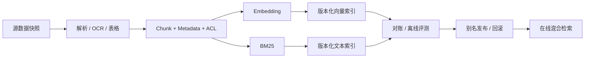

# 面试题（15） - RAG 进阶与数据工程（第 131～140 题）

> 读完后，你应能：
> - 能验证“本篇聚焦“库里有文档，但答案仍不好”的深层问题：解析、检索、图关系、评测和发布闭环”，并保存输入、输出与失败样本。
> - 能验证“答案： 先把端到端失败按解析缺失、召回缺失、排序错误、上下文污染、生成不忠实分类，而不是直接换模型”，并保存输入、输出与失败样本。
> - 能验证“解析问题修 OCR/表格”，并保存输入、输出与失败样本。


> 本篇聚焦“库里有文档，但答案仍不好”的深层问题：解析、检索、图关系、评测和发布闭环。

<!-- article-progressive-block:start -->
# 一、先建立全局：RAG 进阶与数据工程（第 131～140 题） 是什么？

理解“RAG 进阶与数据工程（第 131～140 题）”，先要把标题中的对象放进同一条处理链：它接收什么输入，经过哪些状态变化，最终用什么证据判断结果。下表不另造概念，只把作者正文已经解释的章节按依赖顺序连起来。

“RAG 进阶与数据工程（第 131～140 题）”的第一个核心判断是：答案： 先把端到端失败按解析缺失、召回缺失、排序错误、上下文污染、生成不忠实分类，。先弄清这个判断中的对象和输入输出，后面的实现、故障和验收才有共同语境。

| 顺序 | 章节 | 读完本节应抓住的结论 |
| --- | --- | --- |
| 1 | 第131题：RAG 准确率怎样从 60% 提升到 85%？ | 答案： 先把端到端失败按解析缺失、召回缺失、排序错误、上下文污染、生成不忠实分类， |
| 2 | 第132题：RAG 优化后怎样量化证明效果变好？ | 答案： 建立包含问题、标准证据、答案要点、权限和不可回答项的版本化评测集。 |
| 3 | 第133题：RAG 从 Demo 到上线最常见的 12 个痛点是什么？ | 回答时应选真实项目中的两三项讲清根因、指标和修复，背完整清单但没有数据不算工程经验。 |
| 4 | 第134题：企业级 RAG 最危险的四类坑是什么？ | 答案： 第一是权限过滤放在召回后，造成越权和候选挤占； |
| 5 | 第135题：GraphRAG 和普通 RAG 怎样选择？ | GraphRAG 抽取实体与关系，适合多跳关联、全局主题、影响链路和跨文档聚合。 |
| 6 | 第136题：“Claude Code 放弃 RAG”这个说法准确吗？ | 代码 Agent 可以通过文件搜索、符号工具和逐步读取在请求时主动找上下文， |

## 1.1 核心对象之间怎样衔接


这张图只表达本文的讲解顺序，不替代正文机制。判断“RAG 进阶与数据工程（第 131～140 题）”是否真正掌握，需要能从最后一个结果沿图回到前面每个章节的输入、状态变化和证据。

## 1.2 再看失败：问题最早会出现在哪一步？

在“RAG 进阶与数据工程（第 131～140 题）”的对象和顺序已经明确后，再看可观察的失败：漏召回、排序丢失、引用断链或越权命中。定位时不从最后一条错误猜原因，而是沿上图找第一个偏离正文结论的节点。
<!-- article-progressive-block:end -->

# 二、第131题：RAG 准确率怎样从 60% 提升到 85%？

**答案：** 先把端到端失败按解析缺失、召回缺失、排序错误、上下文污染、生成不忠实分类，
而不是直接换模型。
解析问题修 OCR/表格；
召回问题调 Chunk、Embedding、BM25 与 Query Rewrite；
排序问题加 Rerank；
生成问题做 Context Packing、引用和拒答。
每次只改变一层，在固定评测集上做消融。
60% 和 85% 必须对应明确指标及置信区间。

# 三、第132题：RAG 优化后怎样量化证明效果变好？

**答案：** 建立包含问题、标准证据、答案要点、权限和不可回答项的版本化评测集。
检索层看 Recall@K、MRR/nDCG；
生成层看忠实度、答案正确性、引用覆盖和拒答；
系统层看 P95、错误率与单问成本。
与旧版本同集对比并做坏案例分桶，
线上再观察任务成功率和人工反馈，
避免只用 LLM Judge 的单一分数。

# 四、第133题：RAG 从 Demo 到上线最常见的 12 个痛点是什么？

**答案：** 十二项可归为：复杂格式解析、Chunk 断义、Embedding 不匹配、专有词漏召回、Metadata/ACL 不完整、双写不一致、增量删除、索引版本切换、Rerank 延迟、上下文超预算、引用幻觉、缺少评测与 Trace。
回答时应选真实项目中的两三项讲清根因、指标和修复，背完整清单但没有数据不算工程经验。

# 五、第134题：企业级 RAG 最危险的四类坑是什么？

**答案：** 第一是权限过滤放在召回后，造成越权和候选挤占；
第二是没有稳定 ID 与版本，更新删除后残留旧块；
第三是离线只看主观回答，无法定位哪层退化；
第四是无发布与回滚机制，Embedding 或索引升级直接污染线上。
四类问题分别对应安全、数据一致性、可评测和可运维性，比单纯调相似度阈值更关键。

# 六、第135题：GraphRAG 和普通 RAG 怎样选择？

**答案：** 普通 RAG 擅长从局部文本找直接证据，建设快、成本低；
GraphRAG 抽取实体与关系，适合多跳关联、全局主题、影响链路和跨文档聚合。
若问题主要是“某条制度怎么规定”，先用普通混合检索；
若是“多家公司、人物和事件如何关联”，图检索更有价值。
图谱抽取、消歧、更新和查询成本高，必须用多跳评测集证明收益。

# 七、第136题：“Claude Code 放弃 RAG”这个说法准确吗？

**答案：** 这个前提过度简化。
代码 Agent 可以通过文件搜索、符号工具和逐步读取在请求时主动找上下文，
这是一种 Agentic Retrieval，
并不等于否定检索增强。
预建向量索引对超大仓库、跨仓知识和语义问法仍可能有价值；
即时工具检索则更新鲜、引用路径更透明。
产品实现会变化，
面试应比较数据新鲜度、索引成本、权限、可解释性和任务成功率，
不要声称某产品“彻底放弃”某技术。

# 八、第137题：Agent 的 RAG 遇到 PDF 应该怎样处理？

**答案：** 先判断 PDF 是文本、扫描件还是混合版式；
文本用布局感知解析，
扫描页走 OCR，
表格和图片单独抽取，
并保留页码、坐标、标题层级和资源引用。
分块不能只按字符切，应避免跨栏串行和表格拆散。
建立页级抽样验收：字符/表格召回率、乱码率、页码引用和 OCR 置信度；
低置信页面进入人工复核。

# 九、第138题：面试中怎样深入说明 Embedding 选型？

**答案：** 先说真实语料和查询类型，
再比较语言与领域覆盖、最大长度、维度、归一化要求、稠密/稀疏能力、吞吐、成本、部署和许可证。
在业务标注集上测 Recall@K 与下游 nDCG，而不是引用公开榜单。
还要说明批处理、缓存、模型版本、双索引迁移和查询/建库一致性；
这几项能区分 Demo 经验与生产经验。

# 十、第139题：Query Rewrite 怎样设计才不会改坏原问题？

**答案：** 只在指代不明、口语省略、多轮依赖或需要拆解时改写，保留原查询并记录改写结果。
实体、数字、否定词和时间范围设为不可丢失约束；
可同时召回原查询与改写查询，再用 RRF 融合。
评测要同时看改写命中收益和语义漂移率，若改写超时或置信度低则退回原查询。

# 十一、第140题：RAG 向量数据工程的完整链路是什么？

**答案：** 数据源快照进入解析和清洗，
生成带稳定 ID、父子关系、ACL、来源与版本的 Chunk；
批量 Embedding 后写入版本化索引，再做数量、哈希、维度和抽样查询对账；
通过离线评测后原子切换别名。
增量任务根据内容哈希执行新增、更新和删除，
失败进入重试/死信，
定期用源数据与索引做全量 reconciliation。

<!-- article-progressive-block:start -->
# 十二、动手验证：先跑通 RAG 进阶与数据工程（第 131～140 题），再改变一个变量

前面的章节已经建立问题、概念和机制。现在把“RAG 进阶与数据工程（第 131～140 题）”放进同一套基线中运行；本节不再引入新术语，只验证前文结论能否被复现。

## 12.1 基线与候选只允许一个变量不同

验证“RAG 进阶与数据工程（第 131～140 题）”时，先固定查询集、语料快照、权限身份、相关性标注。候选方案只能改变本次要验证的变量；如果同时更换数据、依赖和配置，即使结果改善，也不能知道是哪一项产生作用。

执行“RAG 进阶与数据工程（第 131～140 题）”时，动作是：离线回放检索，保存候选、过滤、排序和引用。原始结果不能只保留截图或汇总分数，必须同步保存：Recall@K、NDCG、引用命中率、无答案误答率、Trace，使下一次复查可以在同一输入上重放。

| 实验要素 | 本文要求 |
| --- | --- |
| 固定条件 | 查询集、语料快照、权限身份、相关性标注 |
| 唯一变量 | 本次候选方案与基线之间的一项明确差异 |
| 原始证据 | Recall@K、NDCG、引用命中率、无答案误答率、Trace |
| 通过阈值 | 证据可回链，指标达基线，权限过滤无泄漏 |
| 立即停止 | 漏召回、排序丢失、引用断链或越权命中 |

## 12.2 执行前先排除不可比较条件

“RAG 进阶与数据工程（第 131～140 题）”开始前先确认下面四项；任一项不成立，都应先修复实验条件，而不是解释结果。

- 基线能够在“RAG 进阶与数据工程（第 131～140 题）”的当前环境重复运行。
- 候选只改变一个与“RAG 进阶与数据工程（第 131～140 题）”结论直接相关的条件。
- “RAG 进阶与数据工程（第 131～140 题）”的基线和候选使用同一批输入、同一版本依赖与同一通过阈值。
- “RAG 进阶与数据工程（第 131～140 题）”的原始输出和失败现场不会被重试、格式化或汇总覆盖。

## 12.3 执行后先核对证据完整性

结果出来后先检查证据，再讨论“RAG 进阶与数据工程（第 131～140 题）”是否通过。缺少中间状态时，最终输出只能说明现象，不能证明机制。

| 检查项 | 当前文章的判定 |
| --- | --- |
| 输入可追溯 | 查询集、语料快照、权限身份、相关性标注 |
| 过程可回放 | 离线回放检索，保存候选、过滤、排序和引用 |
| 结果可审计 | Recall@K、NDCG、引用命中率、无答案误答率、Trace |

“RAG 进阶与数据工程（第 131～140 题）”的一次合格基线对照按以下顺序执行：

1. 保存“RAG 进阶与数据工程（第 131～140 题）”基线版本及输入摘要，确认基线本身可以重复运行。
2. 写下“RAG 进阶与数据工程（第 131～140 题）”候选方案唯一变化的变量，以及它预期影响的指标。
3. 在同一环境执行“RAG 进阶与数据工程（第 131～140 题）”：离线回放检索，保存候选、过滤、排序和引用。
4. 为“RAG 进阶与数据工程（第 131～140 题）”保存：Recall@K、NDCG、引用命中率、无答案误答率、Trace。
5. 使用“RAG 进阶与数据工程（第 131～140 题）”预登记条件判断：证据可回链，指标达基线，权限过滤无泄漏。
6. 如果“RAG 进阶与数据工程（第 131～140 题）”未通过，不修改第二个变量，先恢复基线并保留失败现场。

# 十三、用一张矩阵验证 RAG 进阶与数据工程（第 131～140 题） 的关键结论

矩阵按正文顺序列出“RAG 进阶与数据工程（第 131～140 题）”的结论。一次实验只选择一行，只改变这一行对应的条件；不要把多行合并成一个无法归因的大实验。

| 正文章节 | 已解释的结论 | 本轮唯一变量 | 必须保存的证据 |
| --- | --- | --- | --- |
| 第131题：RAG 准确率怎样从 60% 提升到 85%？ | 答案： 先把端到端失败按解析缺失、召回缺失、排序错误、上下文污染、生成不忠实分类， | 只改变与“第131题：RAG 准确率怎样从 60% 提升到 85%？”相关的条件 | Recall@K、NDCG、引用命中率、无答案误答率、Trace |
| 第132题：RAG 优化后怎样量化证明效果变好？ | 答案： 建立包含问题、标准证据、答案要点、权限和不可回答项的版本化评测集。 | 只改变与“第132题：RAG 优化后怎样量化证明效果变好？”相关的条件 | Recall@K、NDCG、引用命中率、无答案误答率、Trace |
| 第133题：RAG 从 Demo 到上线最常见的 12 个痛点是什么？ | 回答时应选真实项目中的两三项讲清根因、指标和修复，背完整清单但没有数据不算工程经验。 | 只改变与“第133题：RAG 从 Demo 到上线最常见的 12 个痛点是什么？”相关的条件 | Recall@K、NDCG、引用命中率、无答案误答率、Trace |
| 第134题：企业级 RAG 最危险的四类坑是什么？ | 答案： 第一是权限过滤放在召回后，造成越权和候选挤占； | 只改变与“第134题：企业级 RAG 最危险的四类坑是什么？”相关的条件 | Recall@K、NDCG、引用命中率、无答案误答率、Trace |
| 第135题：GraphRAG 和普通 RAG 怎样选择？ | GraphRAG 抽取实体与关系，适合多跳关联、全局主题、影响链路和跨文档聚合。 | 只改变与“第135题：GraphRAG 和普通 RAG 怎样选择？”相关的条件 | Recall@K、NDCG、引用命中率、无答案误答率、Trace |
| 第136题：“Claude Code 放弃 RAG”这个说法准确吗？ | 代码 Agent 可以通过文件搜索、符号工具和逐步读取在请求时主动找上下文， | 只改变与“第136题：“Claude Code 放弃 RAG”这个说法准确吗？”相关的条件 | Recall@K、NDCG、引用命中率、无答案误答率、Trace |

## 13.1 记录本次实际实验

下面的记录用于“RAG 进阶与数据工程（第 131～140 题）”当前这一次实验，不是第二套知识目录。先从矩阵选择一个章节，再填写实际值；没有填写的字段表示尚未验证。

```yaml
topic: "RAG 进阶与数据工程（第 131～140 题）"
selected_chapter: required
claim_from_article: required
baseline_version: required
changed_condition: exactly_one
execution: "离线回放检索，保存候选、过滤、排序和引用"
evidence: "Recall@K、NDCG、引用命中率、无答案误答率、Trace"
pass_when: "证据可回链，指标达基线，权限过滤无泄漏"
stop_when: "漏召回、排序丢失、引用断链或越权命中"
observed_result: required
first_deviation: null_or_evidence
recovery_replay: required_after_failure
```

## 13.2 边界实验必须证明能够停止和恢复

成功路径只能证明“RAG 进阶与数据工程（第 131～140 题）”在当前样本上工作，不能证明它可以进入生产。边界实验需要主动制造：漏召回、排序丢失、引用断链或越权命中，并观察系统是否在产生不可逆副作用前停止。

| 场景 | 只改变什么 | 应保存什么 | 通过标准 |
| --- | --- | --- | --- |
| 正常路径 | 使用已知有效输入 | Recall@K、NDCG、引用命中率、无答案误答率、Trace | 证据可回链，指标达基线，权限过滤无泄漏 |
| 边界路径 | 把一个输入推进到约束临界值 | 临界值前后的输出与指标 | 不静默降级，不把部分结果冒充成功 |
| 明确失败 | 注入：漏召回、排序丢失、引用断链或越权命中 | 原始错误、首个异常阶段和最终状态 | 失败被正确分类且没有扩大副作用 |
| 恢复重放 | 执行：定位解析、召回、过滤、排序或生成阶段，回滚对应版本 | 原失败样本的复测证据 | 原样本恢复，正常样本没有回归 |

恢复动作不是简单重启。对于“RAG 进阶与数据工程（第 131～140 题）”，第一步是：定位解析、召回、过滤、排序或生成阶段，回滚对应版本。完成后使用原始失败样本复测；只验证一个新样本成功，不能证明触发条件已经消失。

“RAG 进阶与数据工程（第 131～140 题）”边界实验结束后，应把正常、临界、失败和恢复四类记录放在同一个运行批次中。这样才能区分“候选方案真的修复问题”和“环境变化让问题暂时没有出现”。

# 十四、RAG 进阶与数据工程（第 131～140 题） 的结果解释

解释“RAG 进阶与数据工程（第 131～140 题）”实验时先看首个偏差，而不是最后一条错误。最后的异常通常只是上游状态错误的结果；从末端反推容易误把症状当根因。

| 观察结果 | 可以支持的判断 | 下一步 |
| --- | --- | --- |
| 主链路没有达到预期 | 漏召回、排序丢失、引用断链或越权命中 | 先执行：定位解析、召回、过滤、排序或生成阶段，回滚对应版本 |
| 异常链路无法恢复 | 漏召回、排序丢失、引用断链或越权命中 | 先执行：定位解析、召回、过滤、排序或生成阶段，回滚对应版本 |
| 新样本成功但原样本仍失败 | 修复没有覆盖原始触发条件 | 固定原失败输入，恢复基线后重新比较 |
| 指标改善但证据无法回链 | 数据、版本或中间状态没有固定 | 暂停发布，补齐可追溯记录后重跑 |

“RAG 进阶与数据工程（第 131～140 题）”只有同时满足“证据可回链，指标达基线，权限过滤无泄漏”，并且没有出现“漏召回、排序丢失、引用断链或越权命中”，才可以认为主链路通过。这里的“通过”只对当前固定版本、样本和环境有效，不能外推到尚未测试的容量、权限或数据分布。

如果“RAG 进阶与数据工程（第 131～140 题）”候选方案与基线差异很小，先检查证据分辨率是否足够；如果差异很大，先排除数据泄漏、环境漂移和版本不一致。两种情况都不能只看一个汇总均值，需要回到逐样本输出和中间状态。

“RAG 进阶与数据工程（第 131～140 题）”故障定位完成后，记录“现象、首个偏差、根因、改动、原样本复测”五项。缺少原样本复测时，只能标记为待观察，不能标记为已解决。

# 十五、RAG 进阶与数据工程（第 131～140 题） 的发布判断

发布判断需要把“RAG 进阶与数据工程（第 131～140 题）”的质量、失败边界和恢复能力放在同一份记录中。以下任一条件缺失，都应停止扩量，而不是用“基本正常”替代证据。

- [ ] “RAG 进阶与数据工程（第 131～140 题）”的基线与候选只存在一个计划内变量。
- [ ] “RAG 进阶与数据工程（第 131～140 题）”的输入、代码、依赖、配置和数据版本可以追溯。
- [ ] “RAG 进阶与数据工程（第 131～140 题）”的正常、临界、失败和恢复样本使用同一套断言。
- [ ] “RAG 进阶与数据工程（第 131～140 题）”的原始输出、中间状态和失败现场已经保留。
- [ ] “RAG 进阶与数据工程（第 131～140 题）”的日志、Trace、截图和测试数据已经脱敏。
- [ ] “RAG 进阶与数据工程（第 131～140 题）”的停止条件、负责人和回滚入口已经演练。
- [ ] “RAG 进阶与数据工程（第 131～140 题）”尚未覆盖的输入、权限、容量和外部依赖已经登记。

最终记录至少包含基线版本、唯一变量、原始证据、首个偏差、恢复复测和发布责任人。没有参与本次修改的人如果不能据此重放“RAG 进阶与数据工程（第 131～140 题）”的判断，就不能发布。
<!-- article-progressive-block:end -->

# 十六、总结

- **第131题：RAG 准确率怎样从 60% 提升到 85%？**：答案： 先把端到端失败按解析缺失、召回缺失、排序错误、上下文污染、生成不忠实分类，而不是直接换模型。
- **第132题：RAG 优化后怎样量化证明效果变好？**：答案： 建立包含问题、标准证据、答案要点、权限和不可回答项的版本化评测集。
- **第133题：RAG 从 Demo 到上线最常见的 12 个痛点是什么？**：回答时应选真实项目中的两三项讲清根因、指标和修复，背完整清单但没有数据不算工程经验。
- **第134题：企业级 RAG 最危险的四类坑是什么？**：答案： 第一是权限过滤放在召回后，造成越权和候选挤占；
- **第135题：GraphRAG 和普通 RAG 怎样选择？**：GraphRAG 抽取实体与关系，适合多跳关联、全局主题、影响链路和跨文档聚合。
- **第136题：“Claude Code 放弃 RAG”这个说法准确吗？**：代码 Agent 可以通过文件搜索、符号工具和逐步读取在请求时主动找上下文，这是一种 Agentic Retrieval，并不等于否定检索增强。

## 参考资料

- [Microsoft GraphRAG](https://microsoft.github.io/graphrag/)
- [Elasticsearch：Hybrid search](https://www.elastic.co/docs/solutions/search/hybrid-search)
- [LangSmith：Evaluation](https://docs.langchain.com/langsmith/evaluation)
- [Anthropic：Claude Code 官方仓库](https://github.com/anthropics/claude-code)


