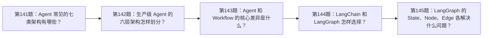
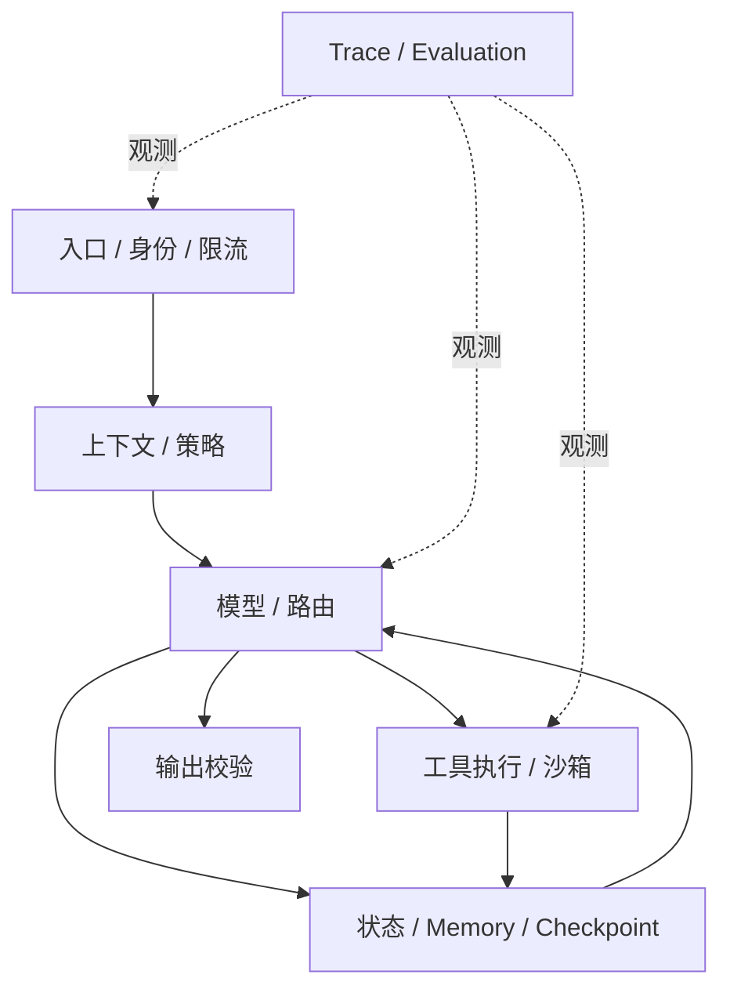

# 面试题（16） - Agent 架构与框架选型（第 141～150 题）

> 读完后，你应能：
> - 能验证“这一组题要求候选人从任务确定性、状态复杂度和风险出发选架构，而不是按框架热度作答”，并保存输入、输出与失败样本。
> - 能验证“答案： 可按控制流归纳为单次 Tool Calling、ReAct 循环、Plan-and-Execute、Router 分流、Supervisor-Worker、显式状态图、事件驱动多 Agent”，并保存输入、输出与失败样本。
> - 能验证“分类不是标准答案，重点是说明控制权在哪里、状态怎样保存、失败如何恢复”，并保存输入、输出与失败样本。


> 这一组题要求候选人从任务确定性、状态复杂度和风险出发选架构，而不是按框架热度作答。

<!-- article-progressive-block:start -->
# 一、先建立全局：Agent 架构与框架选型（第 141～150 题） 是什么？

理解“Agent 架构与框架选型（第 141～150 题）”，先要把标题中的对象放进同一条处理链：它接收什么输入，经过哪些状态变化，最终用什么证据判断结果。下表不另造概念，只把作者正文已经解释的章节按依赖顺序连起来。

“Agent 架构与框架选型（第 141～150 题）”的第一个核心判断是：分类不是标准答案，重点是说明控制权在哪里、状态怎样保存、失败如何恢复。。先弄清这个判断中的对象和输入输出，后面的实现、故障和验收才有共同语境。

| 顺序 | 章节 | 读完本节应抓住的结论 |
| --- | --- | --- |
| 1 | 第141题：Agent 常见的七类架构有哪些？ | 分类不是标准答案，重点是说明控制权在哪里、状态怎样保存、失败如何恢复。 |
| 2 | 第142题：生产级 Agent 的六层架构怎样划分？ | 工具层负责鉴权、幂等和隔离； |
| 3 | 第143题：Agent 和 Workflow 的核心差异是什么？ | Agent 让模型根据环境动态决定下一步，适应性高但不确定。 |
| 4 | 第144题：LangChain 和 LangGraph 怎样选择？ | 选型依据是控制流和恢复需求，不是项目规模。 |
| 5 | 第145题：LangGraph 的 State、Node、Edge 各解决什么问题？ | 答案： State 是跨步骤传递且可持久化的业务事实； |
| 6 | 第146题：Loop 与 Graph 的差异是什么？ | 答案： 单循环通常是“模型判断—工具执行—结果回灌”，适合步骤少、终止条件统一的任务； |

## 1.1 核心对象之间怎样衔接



这张图只表达本文的讲解顺序，不替代正文机制。判断“Agent 架构与框架选型（第 141～150 题）”是否真正掌握，需要能从最后一个结果沿图回到前面每个章节的输入、状态变化和证据。

## 1.2 再看失败：问题最早会出现在哪一步？

在“Agent 架构与框架选型（第 141～150 题）”的对象和顺序已经明确后，再看可观察的失败：文本直通执行、状态不可重放或重试重复写入。定位时不从最后一条错误猜原因，而是沿上图找第一个偏离正文结论的节点。
<!-- article-progressive-block:end -->

# 二、第141题：Agent 常见的七类架构有哪些？

**答案：** 可按控制流归纳为单次 Tool Calling、ReAct 循环、Plan-and-Execute、Router 分流、Supervisor-Worker、显式状态图、事件驱动多 Agent。
分类不是标准答案，重点是说明控制权在哪里、状态怎样保存、失败如何恢复。
确定流程优先工作流；
开放探索才用动态循环；
任务可独立且并行收益明确时再使用多 Agent。

# 三、第142题：生产级 Agent 的六层架构怎样划分？

**答案：** 可分为入口与身份层、上下文与策略层、模型与路由层、工具执行层、状态与记忆层、观测评测层。
入口做租户与限流；
策略层装配规则；
模型层控制预算；
工具层负责鉴权、幂等和隔离；
状态层支持恢复；
观测层记录 Trace 和指标。
分层价值是能单独定位、替换和降级，而不是为了画复杂架构图。

# 四、第143题：Agent 和 Workflow 的核心差异是什么？

**答案：** Workflow 的步骤、分支和终止条件主要由代码预先定义，可预测、易测试；
Agent 让模型根据环境动态决定下一步，适应性高但不确定。
涉及付款、审批、删改数据等高风险流程，应让代码掌控主流程，只把分类、抽取或建议交给模型。
很多生产系统是“确定性工作流包住少量 Agent 节点”的混合形态。

# 五、第144题：LangChain 和 LangGraph 怎样选择？

**答案：** LangChain 提供模型、Prompt、Retriever、Tool 与 Runnable 等通用组件，
适合线性链和快速集成；
LangGraph 以 State、Node、Edge 表达长生命周期、有循环、分支、持久化和人工介入的流程。
两者可组合，LangGraph 节点内部可以调用 LangChain 组件。
选型依据是控制流和恢复需求，不是项目规模。

# 六、第145题：LangGraph 的 State、Node、Edge 各解决什么问题？

**答案：** State 是跨步骤传递且可持久化的业务事实；
Node 是读取旧状态并返回增量更新的计算单元；
Edge 决定下一节点，条件边把路由显式化。
它们让循环、重试、并行合并和中断恢复可以测试。
State 应最小化并定义 Reducer，避免多个节点覆盖同一字段；
Node 要尽量幂等，外部副作用需记录执行 ID。

# 七、第146题：Loop 与 Graph 的差异是什么？

**答案：** 单循环通常是“模型判断—工具执行—结果回灌”，适合步骤少、终止条件统一的任务；
Graph 把多个业务阶段、条件、循环和人工节点显式建模，适合复杂编排。
Graph 不自动提升智能，只提高控制和可观测性。
若流程只有一个 ReAct 循环，硬拆大量节点会增加状态和测试成本。

# 八、第147题：代码 Agent 与传统聊天 Agent 的架构差异是什么？

**答案：** 代码 Agent 的环境可观察且可验证：它会搜索仓库、读取文件、编辑补丁、运行构建测试，
再依据结果迭代；
聊天 Agent 通常主要生成文本。
生产级代码 Agent 还需要工作区隔离、命令权限、差异审查、长任务状态和终端输出压缩。
模型能力重要，但工具反馈闭环与验收命令决定结果能否真正落地。

# 九、第148题：从零开发 Agent 的合理流程是什么？

**答案：** 先定义单一任务、成功标准和不可接受行为；
用固定输入输出的单次模型调用建立基线；
再逐个增加工具、状态和循环。
工具先做 Schema、鉴权、超时、幂等和模拟测试；
随后补 Trace、评测集、预算、人工介入与降级。
上线前回放正常、边界、注入、下游失败和并发用例，避免一开始就搭多 Agent。

# 十、第149题：如何回答“你用过哪些 Agent 框架”？

**答案：** 不要只报名称。
按层说明：模型/组件层用过什么，状态编排如何实现，观测评测接什么，为什么选择或弃用。
至少讲一个真实取舍，
例如线性 LCEL 足够时不引入图，
长任务因需要 Checkpoint 与 HIL 才用 LangGraph。
再给出版本、流量、成功率或排障案例，证明不是只跑过 Quickstart。

# 十一、第150题：怎样做 Agent 框架选型？

**答案：** 先写需求矩阵：是否需要循环、并行、持久化、流式、HIL、多语言、部署约束、生态和可观测性。
用同一小型任务做 Spike，测代码复杂度、恢复能力、P95、成本、调试体验和升级风险。
核心业务状态与工具协议应保持框架无关，避免把所有逻辑绑定到某个抽象。
能用普通代码清楚表达时，框架不是必选项。

<!-- article-progressive-block:start -->
# 十二、动手验证：先跑通 Agent 架构与框架选型（第 141～150 题），再改变一个变量

前面的章节已经建立问题、概念和机制。现在把“Agent 架构与框架选型（第 141～150 题）”放进同一套基线中运行；本节不再引入新术语，只验证前文结论能否被复现。

## 12.1 基线与候选只允许一个变量不同

验证“Agent 架构与框架选型（第 141～150 题）”时，先固定工具 Schema、身份、畸形参数、超时和重复请求。候选方案只能改变本次要验证的变量；如果同时更换数据、依赖和配置，即使结果改善，也不能知道是哪一项产生作用。

执行“Agent 架构与框架选型（第 141～150 题）”时，动作是：回放决策到执行链路，覆盖失败、重试、暂停和恢复。原始结果不能只保留截图或汇总分数，必须同步保存：模型提议、校验、授权、幂等键、状态迁移、Trace，使下一次复查可以在同一输入上重放。

| 实验要素 | 本文要求 |
| --- | --- |
| 固定条件 | 工具 Schema、身份、畸形参数、超时和重复请求 |
| 唯一变量 | 本次候选方案与基线之间的一项明确差异 |
| 原始证据 | 模型提议、校验、授权、幂等键、状态迁移、Trace |
| 通过阈值 | 模型只提议；执行受代码约束；失败不重复副作用 |
| 立即停止 | 文本直通执行、状态不可重放或重试重复写入 |

## 12.2 执行前先排除不可比较条件

“Agent 架构与框架选型（第 141～150 题）”开始前先确认下面四项；任一项不成立，都应先修复实验条件，而不是解释结果。

- 基线能够在“Agent 架构与框架选型（第 141～150 题）”的当前环境重复运行。
- 候选只改变一个与“Agent 架构与框架选型（第 141～150 题）”结论直接相关的条件。
- “Agent 架构与框架选型（第 141～150 题）”的基线和候选使用同一批输入、同一版本依赖与同一通过阈值。
- “Agent 架构与框架选型（第 141～150 题）”的原始输出和失败现场不会被重试、格式化或汇总覆盖。

## 12.3 执行后先核对证据完整性

结果出来后先检查证据，再讨论“Agent 架构与框架选型（第 141～150 题）”是否通过。缺少中间状态时，最终输出只能说明现象，不能证明机制。

| 检查项 | 当前文章的判定 |
| --- | --- |
| 输入可追溯 | 工具 Schema、身份、畸形参数、超时和重复请求 |
| 过程可回放 | 回放决策到执行链路，覆盖失败、重试、暂停和恢复 |
| 结果可审计 | 模型提议、校验、授权、幂等键、状态迁移、Trace |

“Agent 架构与框架选型（第 141～150 题）”的一次合格基线对照按以下顺序执行：

1. 保存“Agent 架构与框架选型（第 141～150 题）”基线版本及输入摘要，确认基线本身可以重复运行。
2. 写下“Agent 架构与框架选型（第 141～150 题）”候选方案唯一变化的变量，以及它预期影响的指标。
3. 在同一环境执行“Agent 架构与框架选型（第 141～150 题）”：回放决策到执行链路，覆盖失败、重试、暂停和恢复。
4. 为“Agent 架构与框架选型（第 141～150 题）”保存：模型提议、校验、授权、幂等键、状态迁移、Trace。
5. 使用“Agent 架构与框架选型（第 141～150 题）”预登记条件判断：模型只提议；执行受代码约束；失败不重复副作用。
6. 如果“Agent 架构与框架选型（第 141～150 题）”未通过，不修改第二个变量，先恢复基线并保留失败现场。

# 十三、用一张矩阵验证 Agent 架构与框架选型（第 141～150 题） 的关键结论

矩阵按正文顺序列出“Agent 架构与框架选型（第 141～150 题）”的结论。一次实验只选择一行，只改变这一行对应的条件；不要把多行合并成一个无法归因的大实验。

| 正文章节 | 已解释的结论 | 本轮唯一变量 | 必须保存的证据 |
| --- | --- | --- | --- |
| 第141题：Agent 常见的七类架构有哪些？ | 分类不是标准答案，重点是说明控制权在哪里、状态怎样保存、失败如何恢复。 | 只改变与“第141题：Agent 常见的七类架构有哪些？”相关的条件 | 模型提议、校验、授权、幂等键、状态迁移、Trace |
| 第142题：生产级 Agent 的六层架构怎样划分？ | 工具层负责鉴权、幂等和隔离； | 只改变与“第142题：生产级 Agent 的六层架构怎样划分？”相关的条件 | 模型提议、校验、授权、幂等键、状态迁移、Trace |
| 第143题：Agent 和 Workflow 的核心差异是什么？ | Agent 让模型根据环境动态决定下一步，适应性高但不确定。 | 只改变与“第143题：Agent 和 Workflow 的核心差异是什么？”相关的条件 | 模型提议、校验、授权、幂等键、状态迁移、Trace |
| 第144题：LangChain 和 LangGraph 怎样选择？ | 选型依据是控制流和恢复需求，不是项目规模。 | 只改变与“第144题：LangChain 和 LangGraph 怎样选择？”相关的条件 | 模型提议、校验、授权、幂等键、状态迁移、Trace |
| 第145题：LangGraph 的 State、Node、Edge 各解决什么问题？ | 答案： State 是跨步骤传递且可持久化的业务事实； | 只改变与“第145题：LangGraph 的 State、Node、Edge 各解决什么问题？”相关的条件 | 模型提议、校验、授权、幂等键、状态迁移、Trace |
| 第146题：Loop 与 Graph 的差异是什么？ | 答案： 单循环通常是“模型判断—工具执行—结果回灌”，适合步骤少、终止条件统一的任务； | 只改变与“第146题：Loop 与 Graph 的差异是什么？”相关的条件 | 模型提议、校验、授权、幂等键、状态迁移、Trace |

## 13.1 记录本次实际实验

下面的记录用于“Agent 架构与框架选型（第 141～150 题）”当前这一次实验，不是第二套知识目录。先从矩阵选择一个章节，再填写实际值；没有填写的字段表示尚未验证。

```yaml
topic: "Agent 架构与框架选型（第 141～150 题）"
selected_chapter: required
claim_from_article: required
baseline_version: required
changed_condition: exactly_one
execution: "回放决策到执行链路，覆盖失败、重试、暂停和恢复"
evidence: "模型提议、校验、授权、幂等键、状态迁移、Trace"
pass_when: "模型只提议；执行受代码约束；失败不重复副作用"
stop_when: "文本直通执行、状态不可重放或重试重复写入"
observed_result: required
first_deviation: null_or_evidence
recovery_replay: required_after_failure
```

## 13.2 边界实验必须证明能够停止和恢复

成功路径只能证明“Agent 架构与框架选型（第 141～150 题）”在当前样本上工作，不能证明它可以进入生产。边界实验需要主动制造：文本直通执行、状态不可重放或重试重复写入，并观察系统是否在产生不可逆副作用前停止。

| 场景 | 只改变什么 | 应保存什么 | 通过标准 |
| --- | --- | --- | --- |
| 正常路径 | 使用已知有效输入 | 模型提议、校验、授权、幂等键、状态迁移、Trace | 模型只提议；执行受代码约束；失败不重复副作用 |
| 边界路径 | 把一个输入推进到约束临界值 | 临界值前后的输出与指标 | 不静默降级，不把部分结果冒充成功 |
| 明确失败 | 注入：文本直通执行、状态不可重放或重试重复写入 | 原始错误、首个异常阶段和最终状态 | 失败被正确分类且没有扩大副作用 |
| 恢复重放 | 执行：关闭副作用入口，恢复检查点，补充失败契约测试 | 原失败样本的复测证据 | 原样本恢复，正常样本没有回归 |

恢复动作不是简单重启。对于“Agent 架构与框架选型（第 141～150 题）”，第一步是：关闭副作用入口，恢复检查点，补充失败契约测试。完成后使用原始失败样本复测；只验证一个新样本成功，不能证明触发条件已经消失。

“Agent 架构与框架选型（第 141～150 题）”边界实验结束后，应把正常、临界、失败和恢复四类记录放在同一个运行批次中。这样才能区分“候选方案真的修复问题”和“环境变化让问题暂时没有出现”。

# 十四、Agent 架构与框架选型（第 141～150 题） 的结果解释

解释“Agent 架构与框架选型（第 141～150 题）”实验时先看首个偏差，而不是最后一条错误。最后的异常通常只是上游状态错误的结果；从末端反推容易误把症状当根因。

| 观察结果 | 可以支持的判断 | 下一步 |
| --- | --- | --- |
| 主链路没有达到预期 | 文本直通执行、状态不可重放或重试重复写入 | 先执行：关闭副作用入口，恢复检查点，补充失败契约测试 |
| 异常链路无法恢复 | 文本直通执行、状态不可重放或重试重复写入 | 先执行：关闭副作用入口，恢复检查点，补充失败契约测试 |
| 新样本成功但原样本仍失败 | 修复没有覆盖原始触发条件 | 固定原失败输入，恢复基线后重新比较 |
| 指标改善但证据无法回链 | 数据、版本或中间状态没有固定 | 暂停发布，补齐可追溯记录后重跑 |

“Agent 架构与框架选型（第 141～150 题）”只有同时满足“模型只提议；执行受代码约束；失败不重复副作用”，并且没有出现“文本直通执行、状态不可重放或重试重复写入”，才可以认为主链路通过。这里的“通过”只对当前固定版本、样本和环境有效，不能外推到尚未测试的容量、权限或数据分布。

如果“Agent 架构与框架选型（第 141～150 题）”候选方案与基线差异很小，先检查证据分辨率是否足够；如果差异很大，先排除数据泄漏、环境漂移和版本不一致。两种情况都不能只看一个汇总均值，需要回到逐样本输出和中间状态。

“Agent 架构与框架选型（第 141～150 题）”故障定位完成后，记录“现象、首个偏差、根因、改动、原样本复测”五项。缺少原样本复测时，只能标记为待观察，不能标记为已解决。

# 十五、Agent 架构与框架选型（第 141～150 题） 的发布判断

发布判断需要把“Agent 架构与框架选型（第 141～150 题）”的质量、失败边界和恢复能力放在同一份记录中。以下任一条件缺失，都应停止扩量，而不是用“基本正常”替代证据。

- [ ] “Agent 架构与框架选型（第 141～150 题）”的基线与候选只存在一个计划内变量。
- [ ] “Agent 架构与框架选型（第 141～150 题）”的输入、代码、依赖、配置和数据版本可以追溯。
- [ ] “Agent 架构与框架选型（第 141～150 题）”的正常、临界、失败和恢复样本使用同一套断言。
- [ ] “Agent 架构与框架选型（第 141～150 题）”的原始输出、中间状态和失败现场已经保留。
- [ ] “Agent 架构与框架选型（第 141～150 题）”的日志、Trace、截图和测试数据已经脱敏。
- [ ] “Agent 架构与框架选型（第 141～150 题）”的停止条件、负责人和回滚入口已经演练。
- [ ] “Agent 架构与框架选型（第 141～150 题）”尚未覆盖的输入、权限、容量和外部依赖已经登记。

最终记录至少包含基线版本、唯一变量、原始证据、首个偏差、恢复复测和发布责任人。没有参与本次修改的人如果不能据此重放“Agent 架构与框架选型（第 141～150 题）”的判断，就不能发布。
<!-- article-progressive-block:end -->

# 十六、总结

- **第141题：Agent 常见的七类架构有哪些？**：分类不是标准答案，重点是说明控制权在哪里、状态怎样保存、失败如何恢复。
- **第142题：生产级 Agent 的六层架构怎样划分？**：工具层负责鉴权、幂等和隔离；
- **第143题：Agent 和 Workflow 的核心差异是什么？**：Agent 让模型根据环境动态决定下一步，适应性高但不确定。
- **第144题：LangChain 和 LangGraph 怎样选择？**：答案： LangChain 提供模型、Prompt、Retriever、Tool 与 Runnable 等通用组件，适合线性链和快速集成；
- **第145题：LangGraph 的 State、Node、Edge 各解决什么问题？**：答案： State 是跨步骤传递且可持久化的业务事实；
- **第146题：Loop 与 Graph 的差异是什么？**：答案： 单循环通常是“模型判断—工具执行—结果回灌”，适合步骤少、终止条件统一的任务；

## 参考资料

- [LangChain：Overview](https://docs.langchain.com/oss/python/langchain/overview)
- [LangGraph：Overview](https://docs.langchain.com/oss/python/langgraph/overview)
- [LangGraph：Persistence](https://docs.langchain.com/oss/python/langgraph/persistence)


