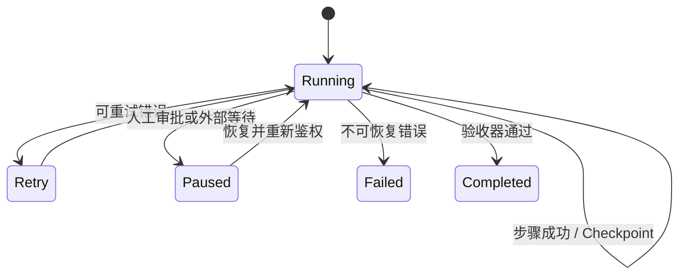

# 面试题（17） - Agent 可靠性、评测与意图识别（第 151～160 题）

> 读完后，你应能：
> - 能验证“可靠 Agent 的关键不是“模型更聪明”，而是边界可控、状态可恢复、结果可评测”，并保存输入、输出与失败样本。
> - 能验证“答案： 把用户目标转成可检查的完成条件和阶段计划”，并保存输入、输出与失败样本。
> - 能验证“每轮限制工具集合、最大步骤、Token、时间和成本”，并保存输入、输出与失败样本。


> 可靠 Agent 的关键不是“模型更聪明”，而是边界可控、状态可恢复、结果可评测。

<!-- article-progressive-block:start -->
# 一、先建立全局：Agent 可靠性、评测与意图识别（第 151～160 题） 是什么？

理解“Agent 可靠性、评测与意图识别（第 151～160 题）”，先要把标题中的对象放进同一条处理链：它接收什么输入，经过哪些状态变化，最终用什么证据判断结果。下表不另造概念，只把作者正文已经解释的章节按依赖顺序连起来。

“Agent 可靠性、评测与意图识别（第 151～160 题）”的第一个核心判断是：状态记录已完成项、失败原因与剩余工作。。先弄清这个判断中的对象和输入输出，后面的实现、故障和验收才有共同语境。

| 顺序 | 章节 | 读完本节应抓住的结论 |
| --- | --- | --- |
| 1 | 第151题：Agent 跑长任务时怎样防止跑偏、绕路和死循环？ | 状态记录已完成项、失败原因与剩余工作。 |
| 2 | 第152题：多步任务执行到一半失败怎样处理？ | 答案： 每步定义输入、输出、幂等键和副作用，完成后持久化事件或 Checkpoint。 |
| 3 | 第153题：Agent 如何支持暂停、恢复和续跑？ | 暂停发生在明确边界，恢复前重新校验权限、外部资源和工具幂等状态。 |
| 4 | 第154题：怎样理解 Checkpoint 机制？ | 答案： Checkpoint 是某个执行时刻可恢复状态的不可变快照，不只是聊天记录。 |
| 5 | 第155题：怎样保证工具调用可靠？ | 读操作可有限重试，写操作必须带幂等键并先查后做。 |
| 6 | 第156题：如何量化一个 Agent 的性能？ | 答案： 核心是任务成功率和约束违规率， |

## 1.1 核心对象之间怎样衔接


这张图只表达本文的讲解顺序，不替代正文机制。判断“Agent 可靠性、评测与意图识别（第 151～160 题）”是否真正掌握，需要能从最后一个结果沿图回到前面每个章节的输入、状态变化和证据。

## 1.2 再看失败：问题最早会出现在哪一步？

在“Agent 可靠性、评测与意图识别（第 151～160 题）”的对象和顺序已经明确后，再看可观察的失败：文本直通执行、状态不可重放或重试重复写入。定位时不从最后一条错误猜原因，而是沿上图找第一个偏离正文结论的节点。
<!-- article-progressive-block:end -->

# 二、第151题：Agent 跑长任务时怎样防止跑偏、绕路和死循环？

**答案：** 把用户目标转成可检查的完成条件和阶段计划；
每轮限制工具集合、最大步骤、Token、时间和成本；
状态记录已完成项、失败原因与剩余工作。
检测连续相同动作、无状态进展和重复错误，触发重规划、换工具或人工介入。
结束前执行独立验收命令，不能让模型仅凭自述判定完成。

# 三、第152题：多步任务执行到一半失败怎样处理？

**答案：** 每步定义输入、输出、幂等键和副作用，完成后持久化事件或 Checkpoint。
无副作用步骤可指数退避重试；
写操作先查询现状，避免重复执行；
跨系统事务用 Saga 补偿或人工处理，不能假设回滚一定成功。
恢复时从最后一个已确认状态继续，并把错误分类为可重试、需降级和需人工。

# 四、第153题：Agent 如何支持暂停、恢复和续跑？

**答案：** 将执行状态从进程内存移到持久化存储，
至少保存 Thread/Run ID、图节点、业务状态、消息、工具调用 ID、版本和等待原因。
暂停发生在明确边界，恢复前重新校验权限、外部资源和工具幂等状态。
模型、Prompt 或图版本变化时要迁移或固定旧版本，
避免旧 Checkpoint 在新逻辑下误执行。

# 五、第154题：怎样理解 Checkpoint 机制？

**答案：** Checkpoint 是某个执行时刻可恢复状态的不可变快照，不只是聊天记录。
它使故障恢复、人工审批、时间旅行调试和分支重跑成为可能。
快照应关联版本、父检查点和写入序号，并采用并发控制防止两个 Worker 覆盖。
敏感字段需加密和按租户隔离，保留周期也要符合删除要求。

# 六、第155题：怎样保证工具调用可靠？

**答案：** 调用前做工具白名单、Schema、权限、额度和业务前置条件校验；
调用中设置超时、取消、熔断和 Trace；
调用后校验返回类型、业务状态和副作用。
读操作可有限重试，写操作必须带幂等键并先查后做。
高风险工具采用预览、人工批准和最小权限凭证，工具输出按不可信输入处理。

# 七、第156题：如何量化一个 Agent 的性能？

**答案：** 核心是任务成功率和约束违规率，
再拆成步骤完成率、工具选择/参数正确率、平均步骤数、人工接管率、P50/P95、Token 与成本。
对开放任务使用基于验收器的结果评分，不要只让模型评价语言质量。
指标必须按任务类型、难度和版本分桶，否则总体均值会掩盖关键回归。

# 八、第157题：怎样从 0 到 1 建立 Agent 自动化评测体系？

**答案：** 从线上高频、失败和高风险案例构建小而可信的 Golden Set，
保存输入、环境夹具、期望结果和禁止行为；
为确定项写代码 Evaluator，为语义项制定 Rubric 并抽样人工校准。
CI 跑快速回归，候选版本跑全量和对照，线上做 Trace 抽样与反馈回流。
评测集要版本化并防止 Prompt 针对测试集过拟合。

# 九、第158题：智能体怎样做意图识别？

**答案：** 先定义互斥或可组合的意图 Taxonomy、槽位和兜底类别。
明显规则用关键词/正则或业务状态直接判断，
模糊语义用分类模型或 LLM Structured Output，
低置信度进入澄清。
多轮场景同时看当前输入与有效会话状态，但不能让旧意图覆盖用户最新指令。
输出需包含意图、置信度、槽位和证据。

# 十、第159题：怎样提升意图识别准确率？

**答案：** 先看混淆矩阵定位边界重叠、长尾或标注问题；
合并无法稳定区分的类别，补充困难负例和多表达样本。
对高频确定意图使用规则，对相似意图加入领域实体和上下文，再校准置信度与澄清阈值。
上线监控未知率、澄清率、误路由业务损失和类别漂移，而不只看离线 Accuracy。

# 十一、第160题：意图识别的“三层漏斗”怎样设计？

**答案：** 第一层用权限、渠道、命令和高精度规则快速截获确定请求；
第二层用轻量分类器召回候选意图；
第三层让能力更强的模型结合上下文判别、抽取槽位，仍不确定则澄清或转人工。
各层都输出理由和置信度，阈值按误路由成本设置。
漏斗价值是同时控制延迟、成本与精度，不是固定必须三种模型。

# 十二、可运行示例：可恢复的 LangGraph 状态机

```text
# requirements.txt
langgraph>=1.0,<2.0
```

```python
from typing import Literal, TypedDict

from langgraph.checkpoint.memory import InMemorySaver
from langgraph.graph import END, START, StateGraph


class TaskState(TypedDict):
    """保存任务步骤和运行状态，作为节点之间的持久化契约。"""

    step: int  # 当前已完成的步骤数。
    status: str  # 当前任务状态，用于决定是否结束。


def execute_step(state: TaskState) -> TaskState:
    """执行一个可重复步骤；state 是恢复后读取的最新任务状态。"""

    next_step = state["step"] + 1  # 计算下一步骤，避免在节点内修改原状态。
    next_status = "done" if next_step >= 3 else "running"  # 三步完成，便于演示终止条件。
    return {"step": next_step, "status": next_status}


def route_next(state: TaskState) -> Literal["execute_step", "__end__"]:
    """根据任务状态选择继续或结束；state 是节点提交后的状态。"""

    return END if state["status"] == "done" else "execute_step"


workflow = StateGraph(TaskState)  # 创建显式状态图，约束所有节点共享的数据结构。
workflow.add_node("execute_step", execute_step)
workflow.add_edge(START, "execute_step")
workflow.add_conditional_edges("execute_step", route_next)
checkpointer = InMemorySaver()  # 演示进程内检查点；生产应替换为持久化实现。
graph = workflow.compile(checkpointer=checkpointer)  # 编译带检查点能力的可执行图。
config = {"configurable": {"thread_id": "interview-demo"}}  # 稳定线程 ID 用于恢复同一任务。
result = graph.invoke({"step": 0, "status": "running"}, config=config)  # 执行并自动保存状态。
print(result)
```

<!-- article-progressive-block:start -->
# 十三、动手验证：先跑通 Agent 可靠性、评测与意图识别（第 151～160 题），再改变一个变量

前面的章节已经建立问题、概念和机制。现在把“Agent 可靠性、评测与意图识别（第 151～160 题）”放进同一套基线中运行；本节不再引入新术语，只验证前文结论能否被复现。

## 13.1 基线与候选只允许一个变量不同

验证“Agent 可靠性、评测与意图识别（第 151～160 题）”时，先固定工具 Schema、身份、畸形参数、超时和重复请求。候选方案只能改变本次要验证的变量；如果同时更换数据、依赖和配置，即使结果改善，也不能知道是哪一项产生作用。

执行“Agent 可靠性、评测与意图识别（第 151～160 题）”时，动作是：回放决策到执行链路，覆盖失败、重试、暂停和恢复。原始结果不能只保留截图或汇总分数，必须同步保存：模型提议、校验、授权、幂等键、状态迁移、Trace，使下一次复查可以在同一输入上重放。

| 实验要素 | 本文要求 |
| --- | --- |
| 固定条件 | 工具 Schema、身份、畸形参数、超时和重复请求 |
| 唯一变量 | 本次候选方案与基线之间的一项明确差异 |
| 原始证据 | 模型提议、校验、授权、幂等键、状态迁移、Trace |
| 通过阈值 | 模型只提议；执行受代码约束；失败不重复副作用 |
| 立即停止 | 文本直通执行、状态不可重放或重试重复写入 |

## 13.2 执行前先排除不可比较条件

“Agent 可靠性、评测与意图识别（第 151～160 题）”开始前先确认下面四项；任一项不成立，都应先修复实验条件，而不是解释结果。

- 基线能够在“Agent 可靠性、评测与意图识别（第 151～160 题）”的当前环境重复运行。
- 候选只改变一个与“Agent 可靠性、评测与意图识别（第 151～160 题）”结论直接相关的条件。
- “Agent 可靠性、评测与意图识别（第 151～160 题）”的基线和候选使用同一批输入、同一版本依赖与同一通过阈值。
- “Agent 可靠性、评测与意图识别（第 151～160 题）”的原始输出和失败现场不会被重试、格式化或汇总覆盖。

## 13.3 执行后先核对证据完整性

结果出来后先检查证据，再讨论“Agent 可靠性、评测与意图识别（第 151～160 题）”是否通过。缺少中间状态时，最终输出只能说明现象，不能证明机制。

| 检查项 | 当前文章的判定 |
| --- | --- |
| 输入可追溯 | 工具 Schema、身份、畸形参数、超时和重复请求 |
| 过程可回放 | 回放决策到执行链路，覆盖失败、重试、暂停和恢复 |
| 结果可审计 | 模型提议、校验、授权、幂等键、状态迁移、Trace |

“Agent 可靠性、评测与意图识别（第 151～160 题）”的一次合格基线对照按以下顺序执行：

1. 保存“Agent 可靠性、评测与意图识别（第 151～160 题）”基线版本及输入摘要，确认基线本身可以重复运行。
2. 写下“Agent 可靠性、评测与意图识别（第 151～160 题）”候选方案唯一变化的变量，以及它预期影响的指标。
3. 在同一环境执行“Agent 可靠性、评测与意图识别（第 151～160 题）”：回放决策到执行链路，覆盖失败、重试、暂停和恢复。
4. 为“Agent 可靠性、评测与意图识别（第 151～160 题）”保存：模型提议、校验、授权、幂等键、状态迁移、Trace。
5. 使用“Agent 可靠性、评测与意图识别（第 151～160 题）”预登记条件判断：模型只提议；执行受代码约束；失败不重复副作用。
6. 如果“Agent 可靠性、评测与意图识别（第 151～160 题）”未通过，不修改第二个变量，先恢复基线并保留失败现场。

# 十四、用一张矩阵验证 Agent 可靠性、评测与意图识别（第 151～160 题） 的关键结论

矩阵按正文顺序列出“Agent 可靠性、评测与意图识别（第 151～160 题）”的结论。一次实验只选择一行，只改变这一行对应的条件；不要把多行合并成一个无法归因的大实验。

| 正文章节 | 已解释的结论 | 本轮唯一变量 | 必须保存的证据 |
| --- | --- | --- | --- |
| 第151题：Agent 跑长任务时怎样防止跑偏、绕路和死循环？ | 状态记录已完成项、失败原因与剩余工作。 | 只改变与“第151题：Agent 跑长任务时怎样防止跑偏、绕路和死循环？”相关的条件 | 模型提议、校验、授权、幂等键、状态迁移、Trace |
| 第152题：多步任务执行到一半失败怎样处理？ | 答案： 每步定义输入、输出、幂等键和副作用，完成后持久化事件或 Checkpoint。 | 只改变与“第152题：多步任务执行到一半失败怎样处理？”相关的条件 | 模型提议、校验、授权、幂等键、状态迁移、Trace |
| 第153题：Agent 如何支持暂停、恢复和续跑？ | 暂停发生在明确边界，恢复前重新校验权限、外部资源和工具幂等状态。 | 只改变与“第153题：Agent 如何支持暂停、恢复和续跑？”相关的条件 | 模型提议、校验、授权、幂等键、状态迁移、Trace |
| 第154题：怎样理解 Checkpoint 机制？ | 答案： Checkpoint 是某个执行时刻可恢复状态的不可变快照，不只是聊天记录。 | 只改变与“第154题：怎样理解 Checkpoint 机制？”相关的条件 | 模型提议、校验、授权、幂等键、状态迁移、Trace |
| 第155题：怎样保证工具调用可靠？ | 读操作可有限重试，写操作必须带幂等键并先查后做。 | 只改变与“第155题：怎样保证工具调用可靠？”相关的条件 | 模型提议、校验、授权、幂等键、状态迁移、Trace |
| 第156题：如何量化一个 Agent 的性能？ | 答案： 核心是任务成功率和约束违规率， | 只改变与“第156题：如何量化一个 Agent 的性能？”相关的条件 | 模型提议、校验、授权、幂等键、状态迁移、Trace |

## 14.1 记录本次实际实验

下面的记录用于“Agent 可靠性、评测与意图识别（第 151～160 题）”当前这一次实验，不是第二套知识目录。先从矩阵选择一个章节，再填写实际值；没有填写的字段表示尚未验证。

```yaml
topic: "Agent 可靠性、评测与意图识别（第 151～160 题）"
selected_chapter: required
claim_from_article: required
baseline_version: required
changed_condition: exactly_one
execution: "回放决策到执行链路，覆盖失败、重试、暂停和恢复"
evidence: "模型提议、校验、授权、幂等键、状态迁移、Trace"
pass_when: "模型只提议；执行受代码约束；失败不重复副作用"
stop_when: "文本直通执行、状态不可重放或重试重复写入"
observed_result: required
first_deviation: null_or_evidence
recovery_replay: required_after_failure
```

## 14.2 边界实验必须证明能够停止和恢复

成功路径只能证明“Agent 可靠性、评测与意图识别（第 151～160 题）”在当前样本上工作，不能证明它可以进入生产。边界实验需要主动制造：文本直通执行、状态不可重放或重试重复写入，并观察系统是否在产生不可逆副作用前停止。

| 场景 | 只改变什么 | 应保存什么 | 通过标准 |
| --- | --- | --- | --- |
| 正常路径 | 使用已知有效输入 | 模型提议、校验、授权、幂等键、状态迁移、Trace | 模型只提议；执行受代码约束；失败不重复副作用 |
| 边界路径 | 把一个输入推进到约束临界值 | 临界值前后的输出与指标 | 不静默降级，不把部分结果冒充成功 |
| 明确失败 | 注入：文本直通执行、状态不可重放或重试重复写入 | 原始错误、首个异常阶段和最终状态 | 失败被正确分类且没有扩大副作用 |
| 恢复重放 | 执行：关闭副作用入口，恢复检查点，补充失败契约测试 | 原失败样本的复测证据 | 原样本恢复，正常样本没有回归 |

恢复动作不是简单重启。对于“Agent 可靠性、评测与意图识别（第 151～160 题）”，第一步是：关闭副作用入口，恢复检查点，补充失败契约测试。完成后使用原始失败样本复测；只验证一个新样本成功，不能证明触发条件已经消失。

“Agent 可靠性、评测与意图识别（第 151～160 题）”边界实验结束后，应把正常、临界、失败和恢复四类记录放在同一个运行批次中。这样才能区分“候选方案真的修复问题”和“环境变化让问题暂时没有出现”。

# 十五、Agent 可靠性、评测与意图识别（第 151～160 题） 的结果解释

解释“Agent 可靠性、评测与意图识别（第 151～160 题）”实验时先看首个偏差，而不是最后一条错误。最后的异常通常只是上游状态错误的结果；从末端反推容易误把症状当根因。

| 观察结果 | 可以支持的判断 | 下一步 |
| --- | --- | --- |
| 主链路没有达到预期 | 文本直通执行、状态不可重放或重试重复写入 | 先执行：关闭副作用入口，恢复检查点，补充失败契约测试 |
| 异常链路无法恢复 | 文本直通执行、状态不可重放或重试重复写入 | 先执行：关闭副作用入口，恢复检查点，补充失败契约测试 |
| 新样本成功但原样本仍失败 | 修复没有覆盖原始触发条件 | 固定原失败输入，恢复基线后重新比较 |
| 指标改善但证据无法回链 | 数据、版本或中间状态没有固定 | 暂停发布，补齐可追溯记录后重跑 |

“Agent 可靠性、评测与意图识别（第 151～160 题）”只有同时满足“模型只提议；执行受代码约束；失败不重复副作用”，并且没有出现“文本直通执行、状态不可重放或重试重复写入”，才可以认为主链路通过。这里的“通过”只对当前固定版本、样本和环境有效，不能外推到尚未测试的容量、权限或数据分布。

如果“Agent 可靠性、评测与意图识别（第 151～160 题）”候选方案与基线差异很小，先检查证据分辨率是否足够；如果差异很大，先排除数据泄漏、环境漂移和版本不一致。两种情况都不能只看一个汇总均值，需要回到逐样本输出和中间状态。

“Agent 可靠性、评测与意图识别（第 151～160 题）”故障定位完成后，记录“现象、首个偏差、根因、改动、原样本复测”五项。缺少原样本复测时，只能标记为待观察，不能标记为已解决。

# 十六、Agent 可靠性、评测与意图识别（第 151～160 题） 的发布判断

发布判断需要把“Agent 可靠性、评测与意图识别（第 151～160 题）”的质量、失败边界和恢复能力放在同一份记录中。以下任一条件缺失，都应停止扩量，而不是用“基本正常”替代证据。

- [ ] “Agent 可靠性、评测与意图识别（第 151～160 题）”的基线与候选只存在一个计划内变量。
- [ ] “Agent 可靠性、评测与意图识别（第 151～160 题）”的输入、代码、依赖、配置和数据版本可以追溯。
- [ ] “Agent 可靠性、评测与意图识别（第 151～160 题）”的正常、临界、失败和恢复样本使用同一套断言。
- [ ] “Agent 可靠性、评测与意图识别（第 151～160 题）”的原始输出、中间状态和失败现场已经保留。
- [ ] “Agent 可靠性、评测与意图识别（第 151～160 题）”的日志、Trace、截图和测试数据已经脱敏。
- [ ] “Agent 可靠性、评测与意图识别（第 151～160 题）”的停止条件、负责人和回滚入口已经演练。
- [ ] “Agent 可靠性、评测与意图识别（第 151～160 题）”尚未覆盖的输入、权限、容量和外部依赖已经登记。

最终记录至少包含基线版本、唯一变量、原始证据、首个偏差、恢复复测和发布责任人。没有参与本次修改的人如果不能据此重放“Agent 可靠性、评测与意图识别（第 151～160 题）”的判断，就不能发布。
<!-- article-progressive-block:end -->

# 十七、总结

- **第151题：Agent 跑长任务时怎样防止跑偏、绕路和死循环？**：状态记录已完成项、失败原因与剩余工作。
- **第152题：多步任务执行到一半失败怎样处理？**：答案： 每步定义输入、输出、幂等键和副作用，完成后持久化事件或 Checkpoint。
- **第153题：Agent 如何支持暂停、恢复和续跑？**：暂停发生在明确边界，恢复前重新校验权限、外部资源和工具幂等状态。
- **第154题：怎样理解 Checkpoint 机制？**：答案： Checkpoint 是某个执行时刻可恢复状态的不可变快照，不只是聊天记录。
- **第155题：怎样保证工具调用可靠？**：读操作可有限重试，写操作必须带幂等键并先查后做。
- **第156题：如何量化一个 Agent 的性能？**：答案： 核心是任务成功率和约束违规率，再拆成步骤完成率、工具选择/参数正确率、平均步骤数、人工接管率、P50/P95、Token 与成本。

## 参考资料

- [LangGraph：Persistence](https://docs.langchain.com/oss/python/langgraph/persistence)
- [LangSmith：Evaluation](https://docs.langchain.com/langsmith/evaluation)


