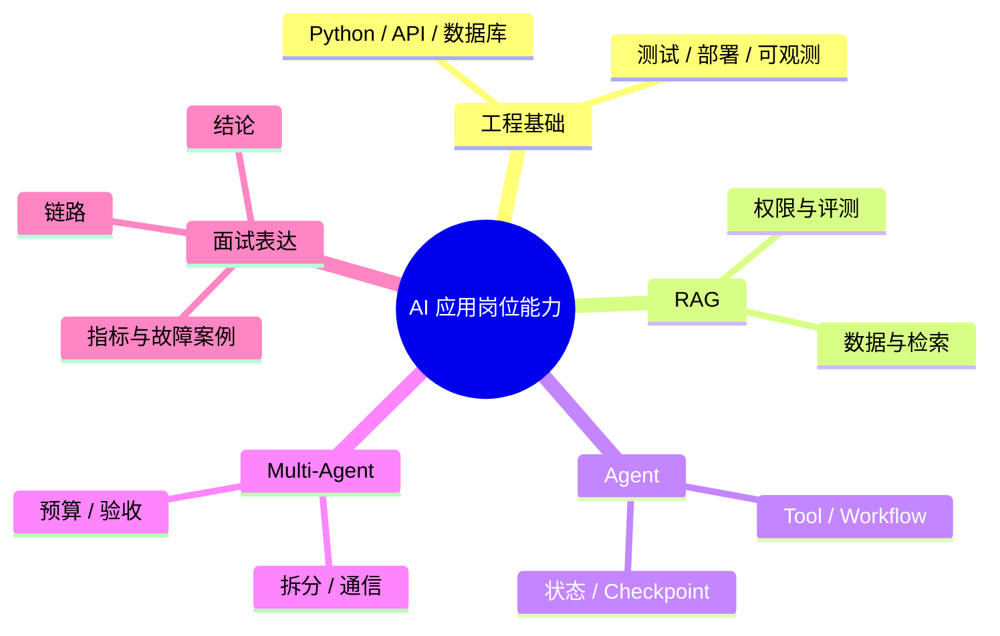

# 面试题（18） - Multi-Agent 与岗位准备（第 161～170 题）

> 读完后，你应能：
> - 能验证“最后一组把协作架构和面试表达放在一起：既要能设计系统，也要能用证据说明自己真正做过什么”，并保存输入、输出与失败样本。
> - 能验证“答案： Multi-Agent 是把目标拆给拥有不同上下文、工具或权限的执行单元，通过协议汇总结果”，并保存输入、输出与失败样本。
> - 能验证“价值来自并行、专业化和上下文隔离，不来自“多开几个模型””，并保存输入、输出与失败样本。


> 最后一组把协作架构和面试表达放在一起：既要能设计系统，也要能用证据说明自己真正做过什么。

<!-- article-progressive-block:start -->
# 一、先建立全局：Multi-Agent 与岗位准备（第 161～170 题） 是什么？

理解“Multi-Agent 与岗位准备（第 161～170 题）”，先要把标题中的对象放进同一条处理链：它接收什么输入，经过哪些状态变化，最终用什么证据判断结果。下表不另造概念，只把作者正文已经解释的章节按依赖顺序连起来。

“Multi-Agent 与岗位准备（第 161～170 题）”的第一个核心判断是：答案： Multi-Agent 是把目标拆给拥有不同上下文、工具或权限的执行单元，。先弄清这个判断中的对象和输入输出，后面的实现、故障和验收才有共同语境。

| 顺序 | 章节 | 读完本节应抓住的结论 |
| --- | --- | --- |
| 1 | 第161题：怎样理解多智能体协作？ | 答案： Multi-Agent 是把目标拆给拥有不同上下文、工具或权限的执行单元， |
| 2 | 第162题：Multi-Agent 动态派生怎样设计？ | 派生请求包含目标、输入快照、允许工具、预算、截止时间和验收器。 |
| 3 | 第163题：多个 Agent 在真实业务中怎样通信？ | 答案： 同进程可通过带版本的共享 State 与事件队列通信， |
| 4 | 第164题：什么场景适合 Multi-Agent？ | 答案： 适合可清晰拆分、子任务上下文相对独立、能并行或需要权限隔离， |
| 5 | 第165题：如何客观比较 Codex 和 Claude Code？ | 再看任务成功率、有效补丁率、测试通过率、人工纠正次数、运行时间、成本、上下文管理、工具/MCP、隔离与团队流程。 |
| 6 | 第166题：被问“用过哪些 Agent 框架”时，怎样证明深度？ | 答案： 用“场景—选型—实现—指标—事故”回答：任务为何需要框架， |

## 1.1 核心对象之间怎样衔接


这张图只表达本文的讲解顺序，不替代正文机制。判断“Multi-Agent 与岗位准备（第 161～170 题）”是否真正掌握，需要能从最后一个结果沿图回到前面每个章节的输入、状态变化和证据。

## 1.2 再看失败：问题最早会出现在哪一步？

在“Multi-Agent 与岗位准备（第 161～170 题）”的对象和顺序已经明确后，再看可观察的失败：文本直通执行、状态不可重放或重试重复写入。定位时不从最后一条错误猜原因，而是沿上图找第一个偏离正文结论的节点。
<!-- article-progressive-block:end -->

# 二、第161题：怎样理解多智能体协作？

**答案：** Multi-Agent 是把目标拆给拥有不同上下文、工具或权限的执行单元，
通过协议汇总结果。
价值来自并行、专业化和上下文隔离，不来自“多开几个模型”。
必须明确任务所有者、共享状态、消息格式、冲突裁决、预算和终止条件。
若任务高度串行或状态强耦合，单 Agent 加确定性工具通常更稳。

# 三、第162题：Multi-Agent 动态派生怎样设计？

**答案：** Supervisor 根据任务图和能力目录创建临时子任务，
派生请求包含目标、输入快照、允许工具、预算、截止时间和验收器。
子 Agent 只能返回结构化结果与证据，不能任意修改全局状态；
Supervisor 根据完成度继续派生或停止。
设置最大深度、总并发和总成本，避免递归扩散。

# 四、第163题：多个 Agent 在真实业务中怎样通信？

**答案：** 同进程可通过带版本的共享 State 与事件队列通信，
跨服务通常使用消息总线或任务表。
消息至少包含 Task ID、发送者、接收者、类型、幂等键、Payload Schema、因果/父事件和时间。
大文件存对象存储，只在消息里传引用。
需要 At-least-once 时消费者必须幂等，并对超时、重复、乱序和死信做处理。

# 五、第164题：什么场景适合 Multi-Agent？

**答案：** 适合可清晰拆分、子任务上下文相对独立、能并行或需要权限隔离，
并且结果可自动验收的任务，
如研究资料并行收集、代码实现与独立审查。
不要用于简单问答、严格串行步骤、共享状态频繁冲突或没有验收标准的任务。
选型应以单 Agent 基线为对照，证明成功率或耗时收益覆盖额外 Token 和协调成本。

# 六、第165题：如何客观比较 Codex 和 Claude Code？

**答案：** 先按同一仓库、任务、权限和验收脚本做受控对比，
再看任务成功率、有效补丁率、测试通过率、人工纠正次数、运行时间、成本、上下文管理、工具/MCP、隔离与团队流程。
不要用一次主观体验下结论，也不要把模型能力和产品 Harness 混为一谈。
产品能力变化快，面试中说明比较日期和版本，并引用双方官方文档。

# 七、第166题：被问“用过哪些 Agent 框架”时，怎样证明深度？

**答案：** 用“场景—选型—实现—指标—事故”回答：任务为何需要框架，
状态和工具如何建模，
如何持久化与观测，
上线指标怎样，
遇到什么失败并如何修复。
例如能讲清 Reducer 冲突、Checkpoint 迁移或工具幂等，
比列出 LangChain、LangGraph、AutoGen 等名字更可信。

# 八、第167题：非名校背景如何证明自己适合 AI 应用开发？

**答案：** 用可复现项目替代泛泛证书：仓库包含架构说明、最小可运行代码、评测集、Trace、故障案例和成本数据；
能现场解释离线建库、在线检索、权限、降级与测试。
再持续贡献文档、Issue 或开源修复。
学历是筛选因素之一，但工程证据、基础知识和问题复盘更能降低面试官的不确定性。

# 九、第168题：两个月准备 AI 应用开发岗位，怎样安排？

**答案：** 前两周补 Python、HTTP、异步、SQL/Redis/ES 和 LLM API；
第 3～4 周做可评测 RAG；
第 5～6 周做带 Tool、状态、Checkpoint 和安全边界的 Agent；
第 7 周补部署、Trace、评测与压测；
第 8 周整理简历、故障复盘并模拟系统设计。
目标不是覆盖所有框架，而是完成一个能运行、能测、能解释取舍的纵深项目。

# 十、第169题：AI 应用开发的长期学习路线怎样规划？

**答案：** 依次掌握工程基础、模型调用与 Prompt、Embedding/RAG、Tool/Workflow、状态化 Agent、评测可观测、安全与生产部署。
每层都用一个小项目验证，并记录输入输出、指标和失败案例。
模型训练原理学到能解释能力边界即可，除非岗位明确需要算法训练；
应用岗更看重数据链路、系统设计和交付质量。

# 十一、第170题：怎样高效准备“大厂 Agent/RAG 题集”？

**答案：** 不按公司和年份重复背题，
先把题归入模型、RAG、Agent、评测、生产五条主线，
再为每题准备 30 秒结论、3 分钟链路和一个项目证据。
对带错误前提的问题先纠正假设，对系统设计题主动覆盖权限、数据一致性、指标、降级与成本。
最后用录音或白板演练，检查能否被连续追问三层。

<!-- article-progressive-block:start -->
# 十二、动手验证：先跑通 Multi-Agent 与岗位准备（第 161～170 题），再改变一个变量

前面的章节已经建立问题、概念和机制。现在把“Multi-Agent 与岗位准备（第 161～170 题）”放进同一套基线中运行；本节不再引入新术语，只验证前文结论能否被复现。

## 12.1 基线与候选只允许一个变量不同

验证“Multi-Agent 与岗位准备（第 161～170 题）”时，先固定工具 Schema、身份、畸形参数、超时和重复请求。候选方案只能改变本次要验证的变量；如果同时更换数据、依赖和配置，即使结果改善，也不能知道是哪一项产生作用。

执行“Multi-Agent 与岗位准备（第 161～170 题）”时，动作是：回放决策到执行链路，覆盖失败、重试、暂停和恢复。原始结果不能只保留截图或汇总分数，必须同步保存：模型提议、校验、授权、幂等键、状态迁移、Trace，使下一次复查可以在同一输入上重放。

| 实验要素 | 本文要求 |
| --- | --- |
| 固定条件 | 工具 Schema、身份、畸形参数、超时和重复请求 |
| 唯一变量 | 本次候选方案与基线之间的一项明确差异 |
| 原始证据 | 模型提议、校验、授权、幂等键、状态迁移、Trace |
| 通过阈值 | 模型只提议；执行受代码约束；失败不重复副作用 |
| 立即停止 | 文本直通执行、状态不可重放或重试重复写入 |

## 12.2 执行前先排除不可比较条件

“Multi-Agent 与岗位准备（第 161～170 题）”开始前先确认下面四项；任一项不成立，都应先修复实验条件，而不是解释结果。

- 基线能够在“Multi-Agent 与岗位准备（第 161～170 题）”的当前环境重复运行。
- 候选只改变一个与“Multi-Agent 与岗位准备（第 161～170 题）”结论直接相关的条件。
- “Multi-Agent 与岗位准备（第 161～170 题）”的基线和候选使用同一批输入、同一版本依赖与同一通过阈值。
- “Multi-Agent 与岗位准备（第 161～170 题）”的原始输出和失败现场不会被重试、格式化或汇总覆盖。

## 12.3 执行后先核对证据完整性

结果出来后先检查证据，再讨论“Multi-Agent 与岗位准备（第 161～170 题）”是否通过。缺少中间状态时，最终输出只能说明现象，不能证明机制。

| 检查项 | 当前文章的判定 |
| --- | --- |
| 输入可追溯 | 工具 Schema、身份、畸形参数、超时和重复请求 |
| 过程可回放 | 回放决策到执行链路，覆盖失败、重试、暂停和恢复 |
| 结果可审计 | 模型提议、校验、授权、幂等键、状态迁移、Trace |

“Multi-Agent 与岗位准备（第 161～170 题）”的一次合格基线对照按以下顺序执行：

1. 保存“Multi-Agent 与岗位准备（第 161～170 题）”基线版本及输入摘要，确认基线本身可以重复运行。
2. 写下“Multi-Agent 与岗位准备（第 161～170 题）”候选方案唯一变化的变量，以及它预期影响的指标。
3. 在同一环境执行“Multi-Agent 与岗位准备（第 161～170 题）”：回放决策到执行链路，覆盖失败、重试、暂停和恢复。
4. 为“Multi-Agent 与岗位准备（第 161～170 题）”保存：模型提议、校验、授权、幂等键、状态迁移、Trace。
5. 使用“Multi-Agent 与岗位准备（第 161～170 题）”预登记条件判断：模型只提议；执行受代码约束；失败不重复副作用。
6. 如果“Multi-Agent 与岗位准备（第 161～170 题）”未通过，不修改第二个变量，先恢复基线并保留失败现场。

# 十三、用一张矩阵验证 Multi-Agent 与岗位准备（第 161～170 题） 的关键结论

矩阵按正文顺序列出“Multi-Agent 与岗位准备（第 161～170 题）”的结论。一次实验只选择一行，只改变这一行对应的条件；不要把多行合并成一个无法归因的大实验。

| 正文章节 | 已解释的结论 | 本轮唯一变量 | 必须保存的证据 |
| --- | --- | --- | --- |
| 第161题：怎样理解多智能体协作？ | 答案： Multi-Agent 是把目标拆给拥有不同上下文、工具或权限的执行单元， | 只改变与“第161题：怎样理解多智能体协作？”相关的条件 | 模型提议、校验、授权、幂等键、状态迁移、Trace |
| 第162题：Multi-Agent 动态派生怎样设计？ | 派生请求包含目标、输入快照、允许工具、预算、截止时间和验收器。 | 只改变与“第162题：Multi-Agent 动态派生怎样设计？”相关的条件 | 模型提议、校验、授权、幂等键、状态迁移、Trace |
| 第163题：多个 Agent 在真实业务中怎样通信？ | 答案： 同进程可通过带版本的共享 State 与事件队列通信， | 只改变与“第163题：多个 Agent 在真实业务中怎样通信？”相关的条件 | 模型提议、校验、授权、幂等键、状态迁移、Trace |
| 第164题：什么场景适合 Multi-Agent？ | 答案： 适合可清晰拆分、子任务上下文相对独立、能并行或需要权限隔离， | 只改变与“第164题：什么场景适合 Multi-Agent？”相关的条件 | 模型提议、校验、授权、幂等键、状态迁移、Trace |
| 第165题：如何客观比较 Codex 和 Claude Code？ | 再看任务成功率、有效补丁率、测试通过率、人工纠正次数、运行时间、成本、上下文管理、工具/MCP、隔离与团队流程。 | 只改变与“第165题：如何客观比较 Codex 和 Claude Code？”相关的条件 | 模型提议、校验、授权、幂等键、状态迁移、Trace |
| 第166题：被问“用过哪些 Agent 框架”时，怎样证明深度？ | 答案： 用“场景—选型—实现—指标—事故”回答：任务为何需要框架， | 只改变与“第166题：被问“用过哪些 Agent 框架”时，怎样证明深度？”相关的条件 | 模型提议、校验、授权、幂等键、状态迁移、Trace |

## 13.1 记录本次实际实验

下面的记录用于“Multi-Agent 与岗位准备（第 161～170 题）”当前这一次实验，不是第二套知识目录。先从矩阵选择一个章节，再填写实际值；没有填写的字段表示尚未验证。

```yaml
topic: "Multi-Agent 与岗位准备（第 161～170 题）"
selected_chapter: required
claim_from_article: required
baseline_version: required
changed_condition: exactly_one
execution: "回放决策到执行链路，覆盖失败、重试、暂停和恢复"
evidence: "模型提议、校验、授权、幂等键、状态迁移、Trace"
pass_when: "模型只提议；执行受代码约束；失败不重复副作用"
stop_when: "文本直通执行、状态不可重放或重试重复写入"
observed_result: required
first_deviation: null_or_evidence
recovery_replay: required_after_failure
```

## 13.2 边界实验必须证明能够停止和恢复

成功路径只能证明“Multi-Agent 与岗位准备（第 161～170 题）”在当前样本上工作，不能证明它可以进入生产。边界实验需要主动制造：文本直通执行、状态不可重放或重试重复写入，并观察系统是否在产生不可逆副作用前停止。

| 场景 | 只改变什么 | 应保存什么 | 通过标准 |
| --- | --- | --- | --- |
| 正常路径 | 使用已知有效输入 | 模型提议、校验、授权、幂等键、状态迁移、Trace | 模型只提议；执行受代码约束；失败不重复副作用 |
| 边界路径 | 把一个输入推进到约束临界值 | 临界值前后的输出与指标 | 不静默降级，不把部分结果冒充成功 |
| 明确失败 | 注入：文本直通执行、状态不可重放或重试重复写入 | 原始错误、首个异常阶段和最终状态 | 失败被正确分类且没有扩大副作用 |
| 恢复重放 | 执行：关闭副作用入口，恢复检查点，补充失败契约测试 | 原失败样本的复测证据 | 原样本恢复，正常样本没有回归 |

恢复动作不是简单重启。对于“Multi-Agent 与岗位准备（第 161～170 题）”，第一步是：关闭副作用入口，恢复检查点，补充失败契约测试。完成后使用原始失败样本复测；只验证一个新样本成功，不能证明触发条件已经消失。

“Multi-Agent 与岗位准备（第 161～170 题）”边界实验结束后，应把正常、临界、失败和恢复四类记录放在同一个运行批次中。这样才能区分“候选方案真的修复问题”和“环境变化让问题暂时没有出现”。

# 十四、Multi-Agent 与岗位准备（第 161～170 题） 的结果解释

解释“Multi-Agent 与岗位准备（第 161～170 题）”实验时先看首个偏差，而不是最后一条错误。最后的异常通常只是上游状态错误的结果；从末端反推容易误把症状当根因。

| 观察结果 | 可以支持的判断 | 下一步 |
| --- | --- | --- |
| 主链路没有达到预期 | 文本直通执行、状态不可重放或重试重复写入 | 先执行：关闭副作用入口，恢复检查点，补充失败契约测试 |
| 异常链路无法恢复 | 文本直通执行、状态不可重放或重试重复写入 | 先执行：关闭副作用入口，恢复检查点，补充失败契约测试 |
| 新样本成功但原样本仍失败 | 修复没有覆盖原始触发条件 | 固定原失败输入，恢复基线后重新比较 |
| 指标改善但证据无法回链 | 数据、版本或中间状态没有固定 | 暂停发布，补齐可追溯记录后重跑 |

“Multi-Agent 与岗位准备（第 161～170 题）”只有同时满足“模型只提议；执行受代码约束；失败不重复副作用”，并且没有出现“文本直通执行、状态不可重放或重试重复写入”，才可以认为主链路通过。这里的“通过”只对当前固定版本、样本和环境有效，不能外推到尚未测试的容量、权限或数据分布。

如果“Multi-Agent 与岗位准备（第 161～170 题）”候选方案与基线差异很小，先检查证据分辨率是否足够；如果差异很大，先排除数据泄漏、环境漂移和版本不一致。两种情况都不能只看一个汇总均值，需要回到逐样本输出和中间状态。

“Multi-Agent 与岗位准备（第 161～170 题）”故障定位完成后，记录“现象、首个偏差、根因、改动、原样本复测”五项。缺少原样本复测时，只能标记为待观察，不能标记为已解决。

# 十五、Multi-Agent 与岗位准备（第 161～170 题） 的发布判断

发布判断需要把“Multi-Agent 与岗位准备（第 161～170 题）”的质量、失败边界和恢复能力放在同一份记录中。以下任一条件缺失，都应停止扩量，而不是用“基本正常”替代证据。

- [ ] “Multi-Agent 与岗位准备（第 161～170 题）”的基线与候选只存在一个计划内变量。
- [ ] “Multi-Agent 与岗位准备（第 161～170 题）”的输入、代码、依赖、配置和数据版本可以追溯。
- [ ] “Multi-Agent 与岗位准备（第 161～170 题）”的正常、临界、失败和恢复样本使用同一套断言。
- [ ] “Multi-Agent 与岗位准备（第 161～170 题）”的原始输出、中间状态和失败现场已经保留。
- [ ] “Multi-Agent 与岗位准备（第 161～170 题）”的日志、Trace、截图和测试数据已经脱敏。
- [ ] “Multi-Agent 与岗位准备（第 161～170 题）”的停止条件、负责人和回滚入口已经演练。
- [ ] “Multi-Agent 与岗位准备（第 161～170 题）”尚未覆盖的输入、权限、容量和外部依赖已经登记。

最终记录至少包含基线版本、唯一变量、原始证据、首个偏差、恢复复测和发布责任人。没有参与本次修改的人如果不能据此重放“Multi-Agent 与岗位准备（第 161～170 题）”的判断，就不能发布。
<!-- article-progressive-block:end -->

# 十六、总结

- **第161题：怎样理解多智能体协作？**：答案： Multi-Agent 是把目标拆给拥有不同上下文、工具或权限的执行单元，通过协议汇总结果。
- **第162题：Multi-Agent 动态派生怎样设计？**：答案： Supervisor 根据任务图和能力目录创建临时子任务，派生请求包含目标、输入快照、允许工具、预算、截止时间和验收器。
- **第163题：多个 Agent 在真实业务中怎样通信？**：答案： 同进程可通过带版本的共享 State 与事件队列通信，跨服务通常使用消息总线或任务表。
- **第164题：什么场景适合 Multi-Agent？**：答案： 适合可清晰拆分、子任务上下文相对独立、能并行或需要权限隔离，并且结果可自动验收的任务，如研究资料并行收集、代码实现与独立审查。
- **第165题：如何客观比较 Codex 和 Claude Code？**：答案： 先按同一仓库、任务、权限和验收脚本做受控对比，再看任务成功率、有效补丁率、测试通过率、人工纠正次数、运行时间、成本、上下文管理、工具/MCP、隔离与团队流程。
- **第166题：被问“用过哪些 Agent 框架”时，怎样证明深度？**：答案： 用“场景—选型—实现—指标—事故”回答：任务为何需要框架，状态和工具如何建模，如何持久化与观测，上线指标怎样，遇到什么失败并如何修复。

## 参考资料

- [OpenAI Developers：Codex use cases](https://developers.openai.com/codex/use-cases)
- [Anthropic：Claude Code 官方仓库](https://github.com/anthropics/claude-code)
- [Microsoft：AutoGen 官方仓库](https://github.com/microsoft/autogen)


